<center>
    
</center>

## <center>Departamento de Ciência da Computação</center>

## <center>PPCA - Programa de Pós-Graduação em Computação Aplicada</center>

# <center>DISTRIBUIÇÃO E CORRESPONDÊNCIA TERRITORIAL DOS INVESTIMENTOS ASSOCIADOS AO CRÉDITO RURAL SUSTENTÁVEL NO BRASIL</center>

## <center>Uma análise longitudinal das Unidades da Federação, 2013–2024</center>
=====================================================
=====================================================
 - #### <font color="blue">Adalberto Araujo Aragão</font>
 - #### <font color="blue">Projeto de Mineração de Dados - CRISP-DM</font>
 - #### <font color="blue">Professor: Marcelo Ladeira</font>
=====================================================
=====================================================

# 2. Data Understanding

A etapa de *Data Understanding* tem como finalidade compreender a estrutura,
a qualidade, a variabilidade e as relações internas do conjunto de dados antes
da definição das especificações estatísticas. Em um painel territorial, essa
etapa é particularmente importante porque relações observadas no conjunto das
observações podem resultar de diferenças persistentes entre unidades, de
mudanças ocorridas ao longo do tempo ou da combinação desses dois componentes.

A base utilizada neste estudo foi construída a partir da integração e
harmonização de informações provenientes de diferentes fontes, tendo como
unidade de observação a combinação entre Unidade da Federação e ano. O painel
abrange as 27 UFs brasileiras entre 2013 e 2024.

A compreensão dos dados é organizada progressivamente. Inicialmente são
verificadas a estrutura do painel, a integridade dos registros e a natureza das
variáveis. Em seguida, são examinados os zeros e os padrões de disponibilidade
das informações, com atenção especial às variáveis relacionadas às operações de
crédito. Posteriormente são analisadas as distribuições, a heterogeneidade
territorial e temporal, a estrutura das associações, a dinâmica ao longo do
período e a concentração dos investimentos.

A etapa é concluída com uma comparação exploratória entre as participações
territoriais dos investimentos e as participações das UFs em diferentes
dimensões observadas. Essa comparação possui finalidade diagnóstica e não
estabelece, nesta fase, uma regra normativa de distribuição dos recursos.

Os resultados obtidos em *Data Understanding* serão utilizados para fundamentar
as decisões posteriores de preparação dos dados e modelagem, evitando que
transformações, seleção de covariáveis ou especificações estatísticas sejam
definidas sem considerar a estrutura empírica do painel.

## 2.1. Carregamento e inspeção inicial da base


```python
# Imports
import pandas as pd
import numpy as np
import matplotlib.pyplot as plt
import warnings

warnings.filterwarnings("ignore")

# Configurações de exibição
pd.set_option("display.max_columns", None)
pd.set_option("display.float_format", lambda x: f"{x:,.4f}")

# Reprodutibilidade
SEED = 42

# ------------------------------------------------------------
# Carregamento
# ------------------------------------------------------------

arquivo = "data_UF.csv"

df = pd.read_csv(arquivo)

print(f"Dimensões da base: {df.shape[0]:,} linhas × {df.shape[1]} colunas")
print(f"\nNúmero de UFs: {df['UF'].nunique()}")
print(f"Período: {df['Ano'].min()}–{df['Ano'].max()}")
print(f"Número de anos: {df['Ano'].nunique()}")

display(df.head())
```

    Dimensões da base: 324 linhas × 13 colunas
    
    Número de UFs: 27
    Período: 2013–2024
    Número de anos: 12
    


<div>
<style scoped>
    .dataframe tbody tr th:only-of-type {
        vertical-align: middle;
    }

    .dataframe tbody tr th {
        vertical-align: top;
    }

    .dataframe thead th {
        text-align: right;
    }
</style>
<table border="1" class="dataframe">
  <thead>
    <tr style="text-align: right;">
      <th></th>
      <th>UF</th>
      <th>Estado</th>
      <th>Ano</th>
      <th>PIB</th>
      <th>PIB_per_capita</th>
      <th>Populacao</th>
      <th>Rendimento</th>
      <th>Uso_Terra</th>
      <th>Emissoes</th>
      <th>QtdInvestimento</th>
      <th>VlInvestimento</th>
      <th>AreaInvestimento</th>
      <th>SemOperacaoCredito</th>
    </tr>
  </thead>
  <tbody>
    <tr>
      <th>0</th>
      <td>AC</td>
      <td>ACRE</td>
      <td>2013</td>
      <td>23236732</td>
      <td>29,488.2400</td>
      <td>788</td>
      <td>949</td>
      <td>1721189</td>
      <td>26503536</td>
      <td>172.0000</td>
      <td>26,913,562.0000</td>
      <td>0.0000</td>
      <td>False</td>
    </tr>
    <tr>
      <th>1</th>
      <td>AC</td>
      <td>ACRE</td>
      <td>2014</td>
      <td>25273129</td>
      <td>31,630.9500</td>
      <td>799</td>
      <td>965</td>
      <td>1755802</td>
      <td>28735408</td>
      <td>183.0000</td>
      <td>45,409,118.0000</td>
      <td>0.0000</td>
      <td>False</td>
    </tr>
    <tr>
      <th>2</th>
      <td>AC</td>
      <td>ACRE</td>
      <td>2015</td>
      <td>23781907</td>
      <td>29,396.6700</td>
      <td>809</td>
      <td>1011</td>
      <td>1799895</td>
      <td>31866845</td>
      <td>119.0000</td>
      <td>24,135,465.0000</td>
      <td>1,608.0000</td>
      <td>False</td>
    </tr>
    <tr>
      <th>3</th>
      <td>AC</td>
      <td>ACRE</td>
      <td>2016</td>
      <td>22211437</td>
      <td>27,153.3500</td>
      <td>818</td>
      <td>926</td>
      <td>1830699</td>
      <td>28527812</td>
      <td>40.0000</td>
      <td>10,423,372.0000</td>
      <td>1,830.0000</td>
      <td>False</td>
    </tr>
    <tr>
      <th>4</th>
      <td>AC</td>
      <td>ACRE</td>
      <td>2017</td>
      <td>22232824</td>
      <td>26,916.2500</td>
      <td>826</td>
      <td>913</td>
      <td>1864772</td>
      <td>31319401</td>
      <td>41.0000</td>
      <td>10,699,673.0000</td>
      <td>2,128.0000</td>
      <td>False</td>
    </tr>
  </tbody>
</table>
</div>


## 2.2. Estrutura das variáveis


```python
estrutura = pd.DataFrame({
    "variavel": df.columns,
    "dtype": df.dtypes.astype(str).values,
    "n_observacoes": df.notna().sum().values,
    "n_ausentes": df.isna().sum().values,
    "pct_ausentes": (df.isna().mean().values * 100),
    "n_unicos": df.nunique(dropna=True).values
})

display(estrutura)
```


<div>
<style scoped>
    .dataframe tbody tr th:only-of-type {
        vertical-align: middle;
    }

    .dataframe tbody tr th {
        vertical-align: top;
    }

    .dataframe thead th {
        text-align: right;
    }
</style>
<table border="1" class="dataframe">
  <thead>
    <tr style="text-align: right;">
      <th></th>
      <th>variavel</th>
      <th>dtype</th>
      <th>n_observacoes</th>
      <th>n_ausentes</th>
      <th>pct_ausentes</th>
      <th>n_unicos</th>
    </tr>
  </thead>
  <tbody>
    <tr>
      <th>0</th>
      <td>UF</td>
      <td>object</td>
      <td>324</td>
      <td>0</td>
      <td>0.0000</td>
      <td>27</td>
    </tr>
    <tr>
      <th>1</th>
      <td>Estado</td>
      <td>object</td>
      <td>324</td>
      <td>0</td>
      <td>0.0000</td>
      <td>27</td>
    </tr>
    <tr>
      <th>2</th>
      <td>Ano</td>
      <td>int64</td>
      <td>324</td>
      <td>0</td>
      <td>0.0000</td>
      <td>12</td>
    </tr>
    <tr>
      <th>3</th>
      <td>PIB</td>
      <td>int64</td>
      <td>324</td>
      <td>0</td>
      <td>0.0000</td>
      <td>324</td>
    </tr>
    <tr>
      <th>4</th>
      <td>PIB_per_capita</td>
      <td>float64</td>
      <td>324</td>
      <td>0</td>
      <td>0.0000</td>
      <td>324</td>
    </tr>
    <tr>
      <th>5</th>
      <td>Populacao</td>
      <td>int64</td>
      <td>324</td>
      <td>0</td>
      <td>0.0000</td>
      <td>323</td>
    </tr>
    <tr>
      <th>6</th>
      <td>Rendimento</td>
      <td>int64</td>
      <td>324</td>
      <td>0</td>
      <td>0.0000</td>
      <td>321</td>
    </tr>
    <tr>
      <th>7</th>
      <td>Uso_Terra</td>
      <td>int64</td>
      <td>324</td>
      <td>0</td>
      <td>0.0000</td>
      <td>324</td>
    </tr>
    <tr>
      <th>8</th>
      <td>Emissoes</td>
      <td>int64</td>
      <td>324</td>
      <td>0</td>
      <td>0.0000</td>
      <td>324</td>
    </tr>
    <tr>
      <th>9</th>
      <td>QtdInvestimento</td>
      <td>float64</td>
      <td>324</td>
      <td>0</td>
      <td>0.0000</td>
      <td>194</td>
    </tr>
    <tr>
      <th>10</th>
      <td>VlInvestimento</td>
      <td>float64</td>
      <td>324</td>
      <td>0</td>
      <td>0.0000</td>
      <td>265</td>
    </tr>
    <tr>
      <th>11</th>
      <td>AreaInvestimento</td>
      <td>float64</td>
      <td>324</td>
      <td>0</td>
      <td>0.0000</td>
      <td>210</td>
    </tr>
    <tr>
      <th>12</th>
      <td>SemOperacaoCredito</td>
      <td>bool</td>
      <td>324</td>
      <td>0</td>
      <td>0.0000</td>
      <td>2</td>
    </tr>
  </tbody>
</table>
</div>


## 2.3. Validação da estrutura UF × Ano


```python
n_ufs = df["UF"].nunique()
n_anos = df["Ano"].nunique()
n_esperado = n_ufs * n_anos
n_observado = len(df)

print(f"UFs: {n_ufs}")
print(f"Anos: {n_anos}")
print(f"Observações esperadas: {n_esperado}")
print(f"Observações existentes: {n_observado}")

# Duplicidades da chave do painel
duplicados = df.duplicated(subset=["UF", "Ano"], keep=False)

print(f"\nDuplicidades UF-Ano: {duplicados.sum()}")

if duplicados.any():
    display(
        df.loc[duplicados]
          .sort_values(["UF", "Ano"])
    )

# Número de anos disponíveis para cada UF
cobertura_uf = (
    df.groupby("UF")["Ano"]
      .agg(["min", "max", "nunique"])
      .rename(columns={
          "min": "ano_inicial",
          "max": "ano_final",
          "nunique": "n_anos"
      })
)

display(cobertura_uf)
```

    UFs: 27
    Anos: 12
    Observações esperadas: 324
    Observações existentes: 324
    
    Duplicidades UF-Ano: 0
    


<div>
<style scoped>
    .dataframe tbody tr th:only-of-type {
        vertical-align: middle;
    }

    .dataframe tbody tr th {
        vertical-align: top;
    }

    .dataframe thead th {
        text-align: right;
    }
</style>
<table border="1" class="dataframe">
  <thead>
    <tr style="text-align: right;">
      <th></th>
      <th>ano_inicial</th>
      <th>ano_final</th>
      <th>n_anos</th>
    </tr>
    <tr>
      <th>UF</th>
      <th></th>
      <th></th>
      <th></th>
    </tr>
  </thead>
  <tbody>
    <tr>
      <th>AC</th>
      <td>2013</td>
      <td>2024</td>
      <td>12</td>
    </tr>
    <tr>
      <th>AL</th>
      <td>2013</td>
      <td>2024</td>
      <td>12</td>
    </tr>
    <tr>
      <th>AM</th>
      <td>2013</td>
      <td>2024</td>
      <td>12</td>
    </tr>
    <tr>
      <th>AP</th>
      <td>2013</td>
      <td>2024</td>
      <td>12</td>
    </tr>
    <tr>
      <th>BA</th>
      <td>2013</td>
      <td>2024</td>
      <td>12</td>
    </tr>
    <tr>
      <th>CE</th>
      <td>2013</td>
      <td>2024</td>
      <td>12</td>
    </tr>
    <tr>
      <th>DF</th>
      <td>2013</td>
      <td>2024</td>
      <td>12</td>
    </tr>
    <tr>
      <th>ES</th>
      <td>2013</td>
      <td>2024</td>
      <td>12</td>
    </tr>
    <tr>
      <th>GO</th>
      <td>2013</td>
      <td>2024</td>
      <td>12</td>
    </tr>
    <tr>
      <th>MA</th>
      <td>2013</td>
      <td>2024</td>
      <td>12</td>
    </tr>
    <tr>
      <th>MG</th>
      <td>2013</td>
      <td>2024</td>
      <td>12</td>
    </tr>
    <tr>
      <th>MS</th>
      <td>2013</td>
      <td>2024</td>
      <td>12</td>
    </tr>
    <tr>
      <th>MT</th>
      <td>2013</td>
      <td>2024</td>
      <td>12</td>
    </tr>
    <tr>
      <th>PA</th>
      <td>2013</td>
      <td>2024</td>
      <td>12</td>
    </tr>
    <tr>
      <th>PB</th>
      <td>2013</td>
      <td>2024</td>
      <td>12</td>
    </tr>
    <tr>
      <th>PE</th>
      <td>2013</td>
      <td>2024</td>
      <td>12</td>
    </tr>
    <tr>
      <th>PI</th>
      <td>2013</td>
      <td>2024</td>
      <td>12</td>
    </tr>
    <tr>
      <th>PR</th>
      <td>2013</td>
      <td>2024</td>
      <td>12</td>
    </tr>
    <tr>
      <th>RJ</th>
      <td>2013</td>
      <td>2024</td>
      <td>12</td>
    </tr>
    <tr>
      <th>RN</th>
      <td>2013</td>
      <td>2024</td>
      <td>12</td>
    </tr>
    <tr>
      <th>RO</th>
      <td>2013</td>
      <td>2024</td>
      <td>12</td>
    </tr>
    <tr>
      <th>RR</th>
      <td>2013</td>
      <td>2024</td>
      <td>12</td>
    </tr>
    <tr>
      <th>RS</th>
      <td>2013</td>
      <td>2024</td>
      <td>12</td>
    </tr>
    <tr>
      <th>SC</th>
      <td>2013</td>
      <td>2024</td>
      <td>12</td>
    </tr>
    <tr>
      <th>SE</th>
      <td>2013</td>
      <td>2024</td>
      <td>12</td>
    </tr>
    <tr>
      <th>SP</th>
      <td>2013</td>
      <td>2024</td>
      <td>12</td>
    </tr>
    <tr>
      <th>TO</th>
      <td>2013</td>
      <td>2024</td>
      <td>12</td>
    </tr>
  </tbody>
</table>
</div>


### Diagnóstico da estrutura do painel

A base apresenta 324 observações correspondentes às 27 Unidades da Federação
brasileiras observadas anualmente durante o período de 2013 a 2024, totalizando
12 períodos temporais. A combinação entre as dimensões territorial e temporal
resulta em $27 \times 12 = 324$ observações, exatamente o número de registros
existentes na base.

Não foram identificadas duplicidades para a chave composta `UF-Ano`, nem valores
ausentes nas 14 variáveis analisadas. Esses resultados confirmam que o conjunto
de dados possui estrutura de painel balanceado, com cobertura temporal completa
para todas as Unidades da Federação no período considerado.

A estrutura constitui uma característica metodologicamente favorável para as
etapas subsequentes, especialmente para análises longitudinais e modelos de
dados em painel, uma vez que todas as unidades territoriais estão representadas
nos mesmos períodos.

## 2.4. Qualidade, consistência e zeros estruturais


```python
# Variáveis quantitativas, excluindo Ano
vars_numericas = (
    df.select_dtypes(include=np.number)
      .columns
      .drop("Ano")
      .tolist()
)

diagnostico = pd.DataFrame({
    "minimo": df[vars_numericas].min(),
    "maximo": df[vars_numericas].max(),
    "n_zeros": (df[vars_numericas] == 0).sum(),
    "pct_zeros": (df[vars_numericas] == 0).mean() * 100,
    "n_negativos": (df[vars_numericas] < 0).sum()
})

display(diagnostico)
```


<div>
<style scoped>
    .dataframe tbody tr th:only-of-type {
        vertical-align: middle;
    }

    .dataframe tbody tr th {
        vertical-align: top;
    }

    .dataframe thead th {
        text-align: right;
    }
</style>
<table border="1" class="dataframe">
  <thead>
    <tr style="text-align: right;">
      <th></th>
      <th>minimo</th>
      <th>maximo</th>
      <th>n_zeros</th>
      <th>pct_zeros</th>
      <th>n_negativos</th>
    </tr>
  </thead>
  <tbody>
    <tr>
      <th>PIB</th>
      <td>17,785,048.0000</td>
      <td>3,585,351,215.0000</td>
      <td>0</td>
      <td>0.0000</td>
      <td>0</td>
    </tr>
    <tr>
      <th>PIB_per_capita</th>
      <td>19,638.8100</td>
      <td>134,946.8600</td>
      <td>0</td>
      <td>0.0000</td>
      <td>0</td>
    </tr>
    <tr>
      <th>Populacao</th>
      <td>449.0000</td>
      <td>45,968.0000</td>
      <td>0</td>
      <td>0.0000</td>
      <td>0</td>
    </tr>
    <tr>
      <th>Rendimento</th>
      <td>703.0000</td>
      <td>125,104.0000</td>
      <td>0</td>
      <td>0.0000</td>
      <td>0</td>
    </tr>
    <tr>
      <th>Uso_Terra</th>
      <td>45,954.0000</td>
      <td>33,628,538.0000</td>
      <td>0</td>
      <td>0.0000</td>
      <td>0</td>
    </tr>
    <tr>
      <th>Emissoes</th>
      <td>550,084.0000</td>
      <td>478,338,442.0000</td>
      <td>0</td>
      <td>0.0000</td>
      <td>0</td>
    </tr>
    <tr>
      <th>QtdInvestimento</th>
      <td>0.0000</td>
      <td>2,399.0000</td>
      <td>60</td>
      <td>18.5185</td>
      <td>0</td>
    </tr>
    <tr>
      <th>VlInvestimento</th>
      <td>0.0000</td>
      <td>1,382,899,884.0000</td>
      <td>60</td>
      <td>18.5185</td>
      <td>0</td>
    </tr>
    <tr>
      <th>AreaInvestimento</th>
      <td>0.0000</td>
      <td>978,046.0000</td>
      <td>113</td>
      <td>34.8765</td>
      <td>0</td>
    </tr>
  </tbody>
</table>
</div>


### 2.4.1. Consistência dos registros sem operação de crédito


```python
sem_qtd = df["QtdInvestimento"].eq(0)
sem_valor = df["VlInvestimento"].eq(0)
sem_area = df["AreaInvestimento"].eq(0)

# Zero simultâneo nas três dimensões
zero_credito = sem_qtd & sem_valor & sem_area

resumo_credito = pd.Series({
    "QtdInvestimento = 0": sem_qtd.sum(),
    "VlInvestimento = 0": sem_valor.sum(),
    "AreaInvestimento = 0": sem_area.sum(),
    "Zero simultâneo nas três": zero_credito.sum(),
    "SemOperacaoCredito = True": df["SemOperacaoCredito"].sum()
})

display(resumo_credito.to_frame("n_observacoes"))

# Verifica se a variável booleana coincide exatamente
# com o zero simultâneo das três variáveis
consistencia_flag = df["SemOperacaoCredito"].eq(zero_credito)

print(
    f"\nRegistros em que a flag coincide com os três zeros: "
    f"{consistencia_flag.sum()} de {len(df)}"
)

print(
    f"Inconsistências encontradas: "
    f"{(~consistencia_flag).sum()}"
)

if (~consistencia_flag).any():
    display(
        df.loc[
            ~consistencia_flag,
            [
                "UF", "Estado", "Ano",
                "QtdInvestimento",
                "VlInvestimento",
                "AreaInvestimento",
                "SemOperacaoCredito"
            ]
        ]
    )
```


<div>
<style scoped>
    .dataframe tbody tr th:only-of-type {
        vertical-align: middle;
    }

    .dataframe tbody tr th {
        vertical-align: top;
    }

    .dataframe thead th {
        text-align: right;
    }
</style>
<table border="1" class="dataframe">
  <thead>
    <tr style="text-align: right;">
      <th></th>
      <th>n_observacoes</th>
    </tr>
  </thead>
  <tbody>
    <tr>
      <th>QtdInvestimento = 0</th>
      <td>60</td>
    </tr>
    <tr>
      <th>VlInvestimento = 0</th>
      <td>60</td>
    </tr>
    <tr>
      <th>AreaInvestimento = 0</th>
      <td>113</td>
    </tr>
    <tr>
      <th>Zero simultâneo nas três</th>
      <td>60</td>
    </tr>
    <tr>
      <th>SemOperacaoCredito = True</th>
      <td>60</td>
    </tr>
  </tbody>
</table>
</div>


    
    Registros em que a flag coincide com os três zeros: 324 de 324
    Inconsistências encontradas: 0
    

### 2.4.2. Distribuição espaço-temporal da ausência de crédito


```python
# Por UF
sem_credito_uf = (
    df.groupby(["UF", "Estado"], as_index=False)
      .agg(
          n_anos=("Ano", "size"),
          anos_sem_credito=("SemOperacaoCredito", "sum")
      )
)

sem_credito_uf["pct_anos_sem_credito"] = (
    100 * sem_credito_uf["anos_sem_credito"] / sem_credito_uf["n_anos"]
)

sem_credito_uf = sem_credito_uf.sort_values(
    "anos_sem_credito",
    ascending=False
)

display(sem_credito_uf)


# Por ano
sem_credito_ano = (
    df.groupby("Ano", as_index=False)
      .agg(
          n_ufs=("UF", "size"),
          ufs_sem_credito=("SemOperacaoCredito", "sum")
      )
)

sem_credito_ano["pct_ufs_sem_credito"] = (
    100 * sem_credito_ano["ufs_sem_credito"] / sem_credito_ano["n_ufs"]
)

display(sem_credito_ano)
```


<div>
<style scoped>
    .dataframe tbody tr th:only-of-type {
        vertical-align: middle;
    }

    .dataframe tbody tr th {
        vertical-align: top;
    }

    .dataframe thead th {
        text-align: right;
    }
</style>
<table border="1" class="dataframe">
  <thead>
    <tr style="text-align: right;">
      <th></th>
      <th>UF</th>
      <th>Estado</th>
      <th>n_anos</th>
      <th>anos_sem_credito</th>
      <th>pct_anos_sem_credito</th>
    </tr>
  </thead>
  <tbody>
    <tr>
      <th>14</th>
      <td>PB</td>
      <td>PARAÍBA</td>
      <td>12</td>
      <td>9</td>
      <td>75.0000</td>
    </tr>
    <tr>
      <th>5</th>
      <td>CE</td>
      <td>CEARÁ</td>
      <td>12</td>
      <td>8</td>
      <td>66.6667</td>
    </tr>
    <tr>
      <th>2</th>
      <td>AM</td>
      <td>AMAZONAS</td>
      <td>12</td>
      <td>8</td>
      <td>66.6667</td>
    </tr>
    <tr>
      <th>6</th>
      <td>DF</td>
      <td>DISTRITO FEDERAL</td>
      <td>12</td>
      <td>8</td>
      <td>66.6667</td>
    </tr>
    <tr>
      <th>3</th>
      <td>AP</td>
      <td>AMAPÁ</td>
      <td>12</td>
      <td>8</td>
      <td>66.6667</td>
    </tr>
    <tr>
      <th>19</th>
      <td>RN</td>
      <td>RIO GRANDE DO NORTE</td>
      <td>12</td>
      <td>8</td>
      <td>66.6667</td>
    </tr>
    <tr>
      <th>24</th>
      <td>SE</td>
      <td>SERGIPE</td>
      <td>12</td>
      <td>7</td>
      <td>58.3333</td>
    </tr>
    <tr>
      <th>1</th>
      <td>AL</td>
      <td>ALAGOAS</td>
      <td>12</td>
      <td>4</td>
      <td>33.3333</td>
    </tr>
    <tr>
      <th>7</th>
      <td>ES</td>
      <td>ESPÍRITO SANTO</td>
      <td>12</td>
      <td>0</td>
      <td>0.0000</td>
    </tr>
    <tr>
      <th>0</th>
      <td>AC</td>
      <td>ACRE</td>
      <td>12</td>
      <td>0</td>
      <td>0.0000</td>
    </tr>
    <tr>
      <th>4</th>
      <td>BA</td>
      <td>BAHIA</td>
      <td>12</td>
      <td>0</td>
      <td>0.0000</td>
    </tr>
    <tr>
      <th>10</th>
      <td>MG</td>
      <td>MINAS GERAIS</td>
      <td>12</td>
      <td>0</td>
      <td>0.0000</td>
    </tr>
    <tr>
      <th>9</th>
      <td>MA</td>
      <td>MARANHÃO</td>
      <td>12</td>
      <td>0</td>
      <td>0.0000</td>
    </tr>
    <tr>
      <th>8</th>
      <td>GO</td>
      <td>GOIÁS</td>
      <td>12</td>
      <td>0</td>
      <td>0.0000</td>
    </tr>
    <tr>
      <th>11</th>
      <td>MS</td>
      <td>MATO GROSSO DO SUL</td>
      <td>12</td>
      <td>0</td>
      <td>0.0000</td>
    </tr>
    <tr>
      <th>15</th>
      <td>PE</td>
      <td>PERNAMBUCO</td>
      <td>12</td>
      <td>0</td>
      <td>0.0000</td>
    </tr>
    <tr>
      <th>16</th>
      <td>PI</td>
      <td>PIAUÍ</td>
      <td>12</td>
      <td>0</td>
      <td>0.0000</td>
    </tr>
    <tr>
      <th>12</th>
      <td>MT</td>
      <td>MATO GROSSO</td>
      <td>12</td>
      <td>0</td>
      <td>0.0000</td>
    </tr>
    <tr>
      <th>13</th>
      <td>PA</td>
      <td>PARÁ</td>
      <td>12</td>
      <td>0</td>
      <td>0.0000</td>
    </tr>
    <tr>
      <th>18</th>
      <td>RJ</td>
      <td>RIO DE JANEIRO</td>
      <td>12</td>
      <td>0</td>
      <td>0.0000</td>
    </tr>
    <tr>
      <th>17</th>
      <td>PR</td>
      <td>PARANÁ</td>
      <td>12</td>
      <td>0</td>
      <td>0.0000</td>
    </tr>
    <tr>
      <th>21</th>
      <td>RR</td>
      <td>RORAIMA</td>
      <td>12</td>
      <td>0</td>
      <td>0.0000</td>
    </tr>
    <tr>
      <th>20</th>
      <td>RO</td>
      <td>RONDÔNIA</td>
      <td>12</td>
      <td>0</td>
      <td>0.0000</td>
    </tr>
    <tr>
      <th>22</th>
      <td>RS</td>
      <td>RIO GRANDE DO SUL</td>
      <td>12</td>
      <td>0</td>
      <td>0.0000</td>
    </tr>
    <tr>
      <th>23</th>
      <td>SC</td>
      <td>SANTA CATARINA</td>
      <td>12</td>
      <td>0</td>
      <td>0.0000</td>
    </tr>
    <tr>
      <th>25</th>
      <td>SP</td>
      <td>SÃO PAULO</td>
      <td>12</td>
      <td>0</td>
      <td>0.0000</td>
    </tr>
    <tr>
      <th>26</th>
      <td>TO</td>
      <td>TOCANTINS</td>
      <td>12</td>
      <td>0</td>
      <td>0.0000</td>
    </tr>
  </tbody>
</table>
</div>


<div>
<style scoped>
    .dataframe tbody tr th:only-of-type {
        vertical-align: middle;
    }

    .dataframe tbody tr th {
        vertical-align: top;
    }

    .dataframe thead th {
        text-align: right;
    }
</style>
<table border="1" class="dataframe">
  <thead>
    <tr style="text-align: right;">
      <th></th>
      <th>Ano</th>
      <th>n_ufs</th>
      <th>ufs_sem_credito</th>
      <th>pct_ufs_sem_credito</th>
    </tr>
  </thead>
  <tbody>
    <tr>
      <th>0</th>
      <td>2013</td>
      <td>27</td>
      <td>4</td>
      <td>14.8148</td>
    </tr>
    <tr>
      <th>1</th>
      <td>2014</td>
      <td>27</td>
      <td>2</td>
      <td>7.4074</td>
    </tr>
    <tr>
      <th>2</th>
      <td>2015</td>
      <td>27</td>
      <td>4</td>
      <td>14.8148</td>
    </tr>
    <tr>
      <th>3</th>
      <td>2016</td>
      <td>27</td>
      <td>8</td>
      <td>29.6296</td>
    </tr>
    <tr>
      <th>4</th>
      <td>2017</td>
      <td>27</td>
      <td>4</td>
      <td>14.8148</td>
    </tr>
    <tr>
      <th>5</th>
      <td>2018</td>
      <td>27</td>
      <td>4</td>
      <td>14.8148</td>
    </tr>
    <tr>
      <th>6</th>
      <td>2019</td>
      <td>27</td>
      <td>5</td>
      <td>18.5185</td>
    </tr>
    <tr>
      <th>7</th>
      <td>2020</td>
      <td>27</td>
      <td>8</td>
      <td>29.6296</td>
    </tr>
    <tr>
      <th>8</th>
      <td>2021</td>
      <td>27</td>
      <td>7</td>
      <td>25.9259</td>
    </tr>
    <tr>
      <th>9</th>
      <td>2022</td>
      <td>27</td>
      <td>6</td>
      <td>22.2222</td>
    </tr>
    <tr>
      <th>10</th>
      <td>2023</td>
      <td>27</td>
      <td>4</td>
      <td>14.8148</td>
    </tr>
    <tr>
      <th>11</th>
      <td>2024</td>
      <td>27</td>
      <td>4</td>
      <td>14.8148</td>
    </tr>
  </tbody>
</table>
</div>


### Diagnóstico de consistência e ausência de operações de crédito

A auditoria das variáveis quantitativas não identificou valores negativos. Os zeros
observados concentram-se nas variáveis relacionadas aos investimentos, indicando
que sua ocorrência possui natureza distinta da ausência de dados.

As variáveis `QtdInvestimento` e `VlInvestimento` apresentam 60 observações iguais
a zero, correspondentes a 18,52% dos 324 registros do painel. A variável
`SemOperacaoCredito` mostrou-se integralmente consistente com esses registros:
em todas as 324 observações, seu valor coincide com a ocorrência simultânea de
`QtdInvestimento = 0`, `VlInvestimento = 0` e `AreaInvestimento = 0`. Não foram
identificadas inconsistências nessa classificação.

A ausência de operações apresenta heterogeneidade territorial e temporal. Algumas
Unidades da Federação registram ausência de operações em parcela expressiva dos
12 anos analisados, enquanto outras possuem operações durante todo o período.
Temporalmente, a proporção de UFs sem operação também varia entre os anos,
evidenciando que a ocorrência dos zeros não é uniforme ao longo do painel.

Os resultados indicam que a ausência de operação de crédito deve ser preservada
como informação substantiva, e não tratada como dado ausente. Essa característica
sugere, para etapas posteriores, a possibilidade de distinguir empiricamente
dois processos: (i) a ocorrência ou não de operação de crédito em determinada
UF e ano; e (ii) a intensidade do investimento, condicionada à existência da
operação.

### 2.4.3. Operações de crédito com AreaInvestimento = 0


```python
area_zero_com_credito = (
    df["AreaInvestimento"].eq(0)
    & ~df["SemOperacaoCredito"]
)

casos_area_zero = (
    df.loc[
        area_zero_com_credito,
        [
            "UF", "Estado", "Ano",
            "QtdInvestimento",
            "VlInvestimento",
            "AreaInvestimento",
            "SemOperacaoCredito"
        ]
    ]
    .sort_values(["UF", "Ano"])
)

print(
    "Operações com AreaInvestimento = 0, "
    f"mas com existência de crédito: {len(casos_area_zero)}"
)

display(casos_area_zero)
```

    Operações com AreaInvestimento = 0, mas com existência de crédito: 53
    


<div>
<style scoped>
    .dataframe tbody tr th:only-of-type {
        vertical-align: middle;
    }

    .dataframe tbody tr th {
        vertical-align: top;
    }

    .dataframe thead th {
        text-align: right;
    }
</style>
<table border="1" class="dataframe">
  <thead>
    <tr style="text-align: right;">
      <th></th>
      <th>UF</th>
      <th>Estado</th>
      <th>Ano</th>
      <th>QtdInvestimento</th>
      <th>VlInvestimento</th>
      <th>AreaInvestimento</th>
      <th>SemOperacaoCredito</th>
    </tr>
  </thead>
  <tbody>
    <tr>
      <th>0</th>
      <td>AC</td>
      <td>ACRE</td>
      <td>2013</td>
      <td>172.0000</td>
      <td>26,913,562.0000</td>
      <td>0.0000</td>
      <td>False</td>
    </tr>
    <tr>
      <th>1</th>
      <td>AC</td>
      <td>ACRE</td>
      <td>2014</td>
      <td>183.0000</td>
      <td>45,409,118.0000</td>
      <td>0.0000</td>
      <td>False</td>
    </tr>
    <tr>
      <th>13</th>
      <td>AL</td>
      <td>ALAGOAS</td>
      <td>2014</td>
      <td>3.0000</td>
      <td>1,705,645.0000</td>
      <td>0.0000</td>
      <td>False</td>
    </tr>
    <tr>
      <th>14</th>
      <td>AL</td>
      <td>ALAGOAS</td>
      <td>2015</td>
      <td>4.0000</td>
      <td>1,179,342.0000</td>
      <td>0.0000</td>
      <td>False</td>
    </tr>
    <tr>
      <th>25</th>
      <td>AM</td>
      <td>AMAZONAS</td>
      <td>2014</td>
      <td>4.0000</td>
      <td>2,193,998.0000</td>
      <td>0.0000</td>
      <td>False</td>
    </tr>
    <tr>
      <th>26</th>
      <td>AM</td>
      <td>AMAZONAS</td>
      <td>2015</td>
      <td>3.0000</td>
      <td>870,958.0000</td>
      <td>0.0000</td>
      <td>False</td>
    </tr>
    <tr>
      <th>36</th>
      <td>AP</td>
      <td>AMAPÁ</td>
      <td>2013</td>
      <td>11.0000</td>
      <td>3,449,153.0000</td>
      <td>0.0000</td>
      <td>False</td>
    </tr>
    <tr>
      <th>37</th>
      <td>AP</td>
      <td>AMAPÁ</td>
      <td>2014</td>
      <td>3.0000</td>
      <td>1,085,986.0000</td>
      <td>0.0000</td>
      <td>False</td>
    </tr>
    <tr>
      <th>38</th>
      <td>AP</td>
      <td>AMAPÁ</td>
      <td>2015</td>
      <td>9.0000</td>
      <td>3,257,250.0000</td>
      <td>0.0000</td>
      <td>False</td>
    </tr>
    <tr>
      <th>48</th>
      <td>BA</td>
      <td>BAHIA</td>
      <td>2013</td>
      <td>528.0000</td>
      <td>259,037,591.0000</td>
      <td>0.0000</td>
      <td>False</td>
    </tr>
    <tr>
      <th>49</th>
      <td>BA</td>
      <td>BAHIA</td>
      <td>2014</td>
      <td>601.0000</td>
      <td>417,103,105.0000</td>
      <td>0.0000</td>
      <td>False</td>
    </tr>
    <tr>
      <th>60</th>
      <td>CE</td>
      <td>CEARÁ</td>
      <td>2013</td>
      <td>1.0000</td>
      <td>347,608.0000</td>
      <td>0.0000</td>
      <td>False</td>
    </tr>
    <tr>
      <th>72</th>
      <td>DF</td>
      <td>DISTRITO FEDERAL</td>
      <td>2013</td>
      <td>2.0000</td>
      <td>190,442.0000</td>
      <td>0.0000</td>
      <td>False</td>
    </tr>
    <tr>
      <th>73</th>
      <td>DF</td>
      <td>DISTRITO FEDERAL</td>
      <td>2014</td>
      <td>5.0000</td>
      <td>1,635,739.0000</td>
      <td>0.0000</td>
      <td>False</td>
    </tr>
    <tr>
      <th>74</th>
      <td>DF</td>
      <td>DISTRITO FEDERAL</td>
      <td>2015</td>
      <td>1.0000</td>
      <td>1,934,810.0000</td>
      <td>0.0000</td>
      <td>False</td>
    </tr>
    <tr>
      <th>77</th>
      <td>DF</td>
      <td>DISTRITO FEDERAL</td>
      <td>2018</td>
      <td>1.0000</td>
      <td>216,317.0000</td>
      <td>0.0000</td>
      <td>False</td>
    </tr>
    <tr>
      <th>84</th>
      <td>ES</td>
      <td>ESPÍRITO SANTO</td>
      <td>2013</td>
      <td>189.0000</td>
      <td>47,484,407.0000</td>
      <td>0.0000</td>
      <td>False</td>
    </tr>
    <tr>
      <th>85</th>
      <td>ES</td>
      <td>ESPÍRITO SANTO</td>
      <td>2014</td>
      <td>231.0000</td>
      <td>75,564,549.0000</td>
      <td>0.0000</td>
      <td>False</td>
    </tr>
    <tr>
      <th>96</th>
      <td>GO</td>
      <td>GOIÁS</td>
      <td>2013</td>
      <td>1,329.0000</td>
      <td>582,109,918.0000</td>
      <td>0.0000</td>
      <td>False</td>
    </tr>
    <tr>
      <th>97</th>
      <td>GO</td>
      <td>GOIÁS</td>
      <td>2014</td>
      <td>1,725.0000</td>
      <td>915,099,488.0000</td>
      <td>0.0000</td>
      <td>False</td>
    </tr>
    <tr>
      <th>108</th>
      <td>MA</td>
      <td>MARANHÃO</td>
      <td>2013</td>
      <td>232.0000</td>
      <td>49,234,216.0000</td>
      <td>0.0000</td>
      <td>False</td>
    </tr>
    <tr>
      <th>109</th>
      <td>MA</td>
      <td>MARANHÃO</td>
      <td>2014</td>
      <td>422.0000</td>
      <td>121,166,464.0000</td>
      <td>0.0000</td>
      <td>False</td>
    </tr>
    <tr>
      <th>120</th>
      <td>MG</td>
      <td>MINAS GERAIS</td>
      <td>2013</td>
      <td>2,399.0000</td>
      <td>865,490,597.0000</td>
      <td>0.0000</td>
      <td>False</td>
    </tr>
    <tr>
      <th>121</th>
      <td>MG</td>
      <td>MINAS GERAIS</td>
      <td>2014</td>
      <td>2,392.0000</td>
      <td>1,079,960,586.0000</td>
      <td>0.0000</td>
      <td>False</td>
    </tr>
    <tr>
      <th>132</th>
      <td>MS</td>
      <td>MATO GROSSO DO SUL</td>
      <td>2013</td>
      <td>759.0000</td>
      <td>639,148,208.0000</td>
      <td>0.0000</td>
      <td>False</td>
    </tr>
    <tr>
      <th>133</th>
      <td>MS</td>
      <td>MATO GROSSO DO SUL</td>
      <td>2014</td>
      <td>914.0000</td>
      <td>628,822,127.0000</td>
      <td>0.0000</td>
      <td>False</td>
    </tr>
    <tr>
      <th>144</th>
      <td>MT</td>
      <td>MATO GROSSO</td>
      <td>2013</td>
      <td>669.0000</td>
      <td>456,365,974.0000</td>
      <td>0.0000</td>
      <td>False</td>
    </tr>
    <tr>
      <th>145</th>
      <td>MT</td>
      <td>MATO GROSSO</td>
      <td>2014</td>
      <td>704.0000</td>
      <td>600,196,894.0000</td>
      <td>0.0000</td>
      <td>False</td>
    </tr>
    <tr>
      <th>156</th>
      <td>PA</td>
      <td>PARÁ</td>
      <td>2013</td>
      <td>316.0000</td>
      <td>116,968,218.0000</td>
      <td>0.0000</td>
      <td>False</td>
    </tr>
    <tr>
      <th>157</th>
      <td>PA</td>
      <td>PARÁ</td>
      <td>2014</td>
      <td>317.0000</td>
      <td>151,943,216.0000</td>
      <td>0.0000</td>
      <td>False</td>
    </tr>
    <tr>
      <th>180</th>
      <td>PE</td>
      <td>PERNAMBUCO</td>
      <td>2013</td>
      <td>10.0000</td>
      <td>3,449,517.0000</td>
      <td>0.0000</td>
      <td>False</td>
    </tr>
    <tr>
      <th>181</th>
      <td>PE</td>
      <td>PERNAMBUCO</td>
      <td>2014</td>
      <td>29.0000</td>
      <td>3,386,076.0000</td>
      <td>0.0000</td>
      <td>False</td>
    </tr>
    <tr>
      <th>192</th>
      <td>PI</td>
      <td>PIAUÍ</td>
      <td>2013</td>
      <td>41.0000</td>
      <td>33,737,581.0000</td>
      <td>0.0000</td>
      <td>False</td>
    </tr>
    <tr>
      <th>193</th>
      <td>PI</td>
      <td>PIAUÍ</td>
      <td>2014</td>
      <td>74.0000</td>
      <td>51,129,739.0000</td>
      <td>0.0000</td>
      <td>False</td>
    </tr>
    <tr>
      <th>204</th>
      <td>PR</td>
      <td>PARANÁ</td>
      <td>2013</td>
      <td>861.0000</td>
      <td>203,165,524.0000</td>
      <td>0.0000</td>
      <td>False</td>
    </tr>
    <tr>
      <th>205</th>
      <td>PR</td>
      <td>PARANÁ</td>
      <td>2014</td>
      <td>858.0000</td>
      <td>289,027,116.0000</td>
      <td>0.0000</td>
      <td>False</td>
    </tr>
    <tr>
      <th>216</th>
      <td>RJ</td>
      <td>RIO DE JANEIRO</td>
      <td>2013</td>
      <td>102.0000</td>
      <td>20,753,743.0000</td>
      <td>0.0000</td>
      <td>False</td>
    </tr>
    <tr>
      <th>217</th>
      <td>RJ</td>
      <td>RIO DE JANEIRO</td>
      <td>2014</td>
      <td>98.0000</td>
      <td>15,355,543.0000</td>
      <td>0.0000</td>
      <td>False</td>
    </tr>
    <tr>
      <th>229</th>
      <td>RN</td>
      <td>RIO GRANDE DO NORTE</td>
      <td>2014</td>
      <td>1.0000</td>
      <td>1,705,856.0000</td>
      <td>0.0000</td>
      <td>False</td>
    </tr>
    <tr>
      <th>240</th>
      <td>RO</td>
      <td>RONDÔNIA</td>
      <td>2013</td>
      <td>219.0000</td>
      <td>63,784,112.0000</td>
      <td>0.0000</td>
      <td>False</td>
    </tr>
    <tr>
      <th>241</th>
      <td>RO</td>
      <td>RONDÔNIA</td>
      <td>2014</td>
      <td>181.0000</td>
      <td>49,231,837.0000</td>
      <td>0.0000</td>
      <td>False</td>
    </tr>
    <tr>
      <th>252</th>
      <td>RR</td>
      <td>RORAIMA</td>
      <td>2013</td>
      <td>33.0000</td>
      <td>12,054,869.0000</td>
      <td>0.0000</td>
      <td>False</td>
    </tr>
    <tr>
      <th>253</th>
      <td>RR</td>
      <td>RORAIMA</td>
      <td>2014</td>
      <td>8.0000</td>
      <td>5,184,152.0000</td>
      <td>0.0000</td>
      <td>False</td>
    </tr>
    <tr>
      <th>264</th>
      <td>RS</td>
      <td>RIO GRANDE DO SUL</td>
      <td>2013</td>
      <td>870.0000</td>
      <td>221,189,123.0000</td>
      <td>0.0000</td>
      <td>False</td>
    </tr>
    <tr>
      <th>265</th>
      <td>RS</td>
      <td>RIO GRANDE DO SUL</td>
      <td>2014</td>
      <td>955.0000</td>
      <td>297,897,124.0000</td>
      <td>0.0000</td>
      <td>False</td>
    </tr>
    <tr>
      <th>276</th>
      <td>SC</td>
      <td>SANTA CATARINA</td>
      <td>2013</td>
      <td>471.0000</td>
      <td>63,383,224.0000</td>
      <td>0.0000</td>
      <td>False</td>
    </tr>
    <tr>
      <th>277</th>
      <td>SC</td>
      <td>SANTA CATARINA</td>
      <td>2014</td>
      <td>248.0000</td>
      <td>52,766,970.0000</td>
      <td>0.0000</td>
      <td>False</td>
    </tr>
    <tr>
      <th>288</th>
      <td>SE</td>
      <td>SERGIPE</td>
      <td>2013</td>
      <td>11.0000</td>
      <td>562,028.0000</td>
      <td>0.0000</td>
      <td>False</td>
    </tr>
    <tr>
      <th>289</th>
      <td>SE</td>
      <td>SERGIPE</td>
      <td>2014</td>
      <td>4.0000</td>
      <td>163,638.0000</td>
      <td>0.0000</td>
      <td>False</td>
    </tr>
    <tr>
      <th>300</th>
      <td>SP</td>
      <td>SÃO PAULO</td>
      <td>2013</td>
      <td>1,453.0000</td>
      <td>632,408,488.0000</td>
      <td>0.0000</td>
      <td>False</td>
    </tr>
    <tr>
      <th>301</th>
      <td>SP</td>
      <td>SÃO PAULO</td>
      <td>2014</td>
      <td>1,850.0000</td>
      <td>805,021,363.0000</td>
      <td>0.0000</td>
      <td>False</td>
    </tr>
    <tr>
      <th>312</th>
      <td>TO</td>
      <td>TOCANTINS</td>
      <td>2013</td>
      <td>693.0000</td>
      <td>205,578,752.0000</td>
      <td>0.0000</td>
      <td>False</td>
    </tr>
    <tr>
      <th>313</th>
      <td>TO</td>
      <td>TOCANTINS</td>
      <td>2014</td>
      <td>986.0000</td>
      <td>354,119,920.0000</td>
      <td>0.0000</td>
      <td>False</td>
    </tr>
  </tbody>
</table>
</div>


### Distribuição dos casos de área zero com operação


```python
area_zero_uf = (
    casos_area_zero
    .groupby(["UF", "Estado"], as_index=False)
    .size()
    .rename(columns={"size": "n_casos"})
    .sort_values("n_casos", ascending=False)
)

area_zero_ano = (
    casos_area_zero
    .groupby("Ano", as_index=False)
    .size()
    .rename(columns={"size": "n_casos"})
)

print("Distribuição por UF:")
display(area_zero_uf)

print("\nDistribuição por ano:")
display(area_zero_ano)
```

    Distribuição por UF:
    


<div>
<style scoped>
    .dataframe tbody tr th:only-of-type {
        vertical-align: middle;
    }

    .dataframe tbody tr th {
        vertical-align: top;
    }

    .dataframe thead th {
        text-align: right;
    }
</style>
<table border="1" class="dataframe">
  <thead>
    <tr style="text-align: right;">
      <th></th>
      <th>UF</th>
      <th>Estado</th>
      <th>n_casos</th>
    </tr>
  </thead>
  <tbody>
    <tr>
      <th>6</th>
      <td>DF</td>
      <td>DISTRITO FEDERAL</td>
      <td>4</td>
    </tr>
    <tr>
      <th>3</th>
      <td>AP</td>
      <td>AMAPÁ</td>
      <td>3</td>
    </tr>
    <tr>
      <th>1</th>
      <td>AL</td>
      <td>ALAGOAS</td>
      <td>2</td>
    </tr>
    <tr>
      <th>0</th>
      <td>AC</td>
      <td>ACRE</td>
      <td>2</td>
    </tr>
    <tr>
      <th>4</th>
      <td>BA</td>
      <td>BAHIA</td>
      <td>2</td>
    </tr>
    <tr>
      <th>2</th>
      <td>AM</td>
      <td>AMAZONAS</td>
      <td>2</td>
    </tr>
    <tr>
      <th>8</th>
      <td>GO</td>
      <td>GOIÁS</td>
      <td>2</td>
    </tr>
    <tr>
      <th>7</th>
      <td>ES</td>
      <td>ESPÍRITO SANTO</td>
      <td>2</td>
    </tr>
    <tr>
      <th>9</th>
      <td>MA</td>
      <td>MARANHÃO</td>
      <td>2</td>
    </tr>
    <tr>
      <th>10</th>
      <td>MG</td>
      <td>MINAS GERAIS</td>
      <td>2</td>
    </tr>
    <tr>
      <th>19</th>
      <td>RO</td>
      <td>RONDÔNIA</td>
      <td>2</td>
    </tr>
    <tr>
      <th>11</th>
      <td>MS</td>
      <td>MATO GROSSO DO SUL</td>
      <td>2</td>
    </tr>
    <tr>
      <th>12</th>
      <td>MT</td>
      <td>MATO GROSSO</td>
      <td>2</td>
    </tr>
    <tr>
      <th>13</th>
      <td>PA</td>
      <td>PARÁ</td>
      <td>2</td>
    </tr>
    <tr>
      <th>14</th>
      <td>PE</td>
      <td>PERNAMBUCO</td>
      <td>2</td>
    </tr>
    <tr>
      <th>15</th>
      <td>PI</td>
      <td>PIAUÍ</td>
      <td>2</td>
    </tr>
    <tr>
      <th>16</th>
      <td>PR</td>
      <td>PARANÁ</td>
      <td>2</td>
    </tr>
    <tr>
      <th>17</th>
      <td>RJ</td>
      <td>RIO DE JANEIRO</td>
      <td>2</td>
    </tr>
    <tr>
      <th>24</th>
      <td>SP</td>
      <td>SÃO PAULO</td>
      <td>2</td>
    </tr>
    <tr>
      <th>20</th>
      <td>RR</td>
      <td>RORAIMA</td>
      <td>2</td>
    </tr>
    <tr>
      <th>21</th>
      <td>RS</td>
      <td>RIO GRANDE DO SUL</td>
      <td>2</td>
    </tr>
    <tr>
      <th>22</th>
      <td>SC</td>
      <td>SANTA CATARINA</td>
      <td>2</td>
    </tr>
    <tr>
      <th>25</th>
      <td>TO</td>
      <td>TOCANTINS</td>
      <td>2</td>
    </tr>
    <tr>
      <th>23</th>
      <td>SE</td>
      <td>SERGIPE</td>
      <td>2</td>
    </tr>
    <tr>
      <th>5</th>
      <td>CE</td>
      <td>CEARÁ</td>
      <td>1</td>
    </tr>
    <tr>
      <th>18</th>
      <td>RN</td>
      <td>RIO GRANDE DO NORTE</td>
      <td>1</td>
    </tr>
  </tbody>
</table>
</div>


    
    Distribuição por ano:
    


<div>
<style scoped>
    .dataframe tbody tr th:only-of-type {
        vertical-align: middle;
    }

    .dataframe tbody tr th {
        vertical-align: top;
    }

    .dataframe thead th {
        text-align: right;
    }
</style>
<table border="1" class="dataframe">
  <thead>
    <tr style="text-align: right;">
      <th></th>
      <th>Ano</th>
      <th>n_casos</th>
    </tr>
  </thead>
  <tbody>
    <tr>
      <th>0</th>
      <td>2013</td>
      <td>23</td>
    </tr>
    <tr>
      <th>1</th>
      <td>2014</td>
      <td>25</td>
    </tr>
    <tr>
      <th>2</th>
      <td>2015</td>
      <td>4</td>
    </tr>
    <tr>
      <th>3</th>
      <td>2018</td>
      <td>1</td>
    </tr>
  </tbody>
</table>
</div>


### Características financeiras das operações com área zero


```python
comparacao_area = (
    df.loc[~df["SemOperacaoCredito"]]
      .assign(
          Grupo=lambda x: np.where(
              x["AreaInvestimento"].eq(0),
              "Operação com área zero",
              "Operação com área positiva"
          )
      )
      .groupby("Grupo")
      .agg(
          n=("VlInvestimento", "size"),
          qtd_mediana=("QtdInvestimento", "median"),
          valor_mediano=("VlInvestimento", "median"),
          valor_medio=("VlInvestimento", "mean"),
          valor_total=("VlInvestimento", "sum")
      )
)

display(comparacao_area)
```


<div>
<style scoped>
    .dataframe tbody tr th:only-of-type {
        vertical-align: middle;
    }

    .dataframe tbody tr th {
        vertical-align: top;
    }

    .dataframe thead th {
        text-align: right;
    }
</style>
<table border="1" class="dataframe">
  <thead>
    <tr style="text-align: right;">
      <th></th>
      <th>n</th>
      <th>qtd_mediana</th>
      <th>valor_mediano</th>
      <th>valor_medio</th>
      <th>valor_total</th>
    </tr>
    <tr>
      <th>Grupo</th>
      <th></th>
      <th></th>
      <th></th>
      <th></th>
      <th></th>
    </tr>
  </thead>
  <tbody>
    <tr>
      <th>Operação com área positiva</th>
      <td>211</td>
      <td>130.0000</td>
      <td>89,120,503.0000</td>
      <td>164,692,922.5782</td>
      <td>34,750,206,664.0000</td>
    </tr>
    <tr>
      <th>Operação com área zero</th>
      <td>53</td>
      <td>189.0000</td>
      <td>49,234,216.0000</td>
      <td>197,757,392.0943</td>
      <td>10,481,141,781.0000</td>
    </tr>
  </tbody>
</table>
</div>


### Tratamento analítico da informação de área


```python
df["AreaInvestimento_analitica"] = df["AreaInvestimento"].copy()

# Quando existe operação de crédito, área = 0 é interpretada
# como informação de área não disponível
mask_area_nao_informada = (
    ~df["SemOperacaoCredito"]
    & df["AreaInvestimento"].eq(0)
)

df.loc[
    mask_area_nao_informada,
    "AreaInvestimento_analitica"
] = np.nan

print(
    "Áreas não informadas entre registros com operação:",
    df["AreaInvestimento_analitica"].isna().sum()
)
```

    Áreas não informadas entre registros com operação: 53
    


```python
# Flag explícita identificando "área não informada"
df["AreaNaoInformada"] = mask_area_nao_informada
```

### Tratamento da informação de área financiada

A variável `AreaInvestimento`, proveniente dos registros do SICOR/BCB, apresentou
113 observações iguais a zero. Destas, 60 correspondem a registros em que não
houve operação de crédito, enquanto 53 apresentam quantidade e valor de operações
positivos.

Os 53 casos não foram interpretados substantivamente como operações que financiaram
zero hectares. Essa decisão fundamenta-se na consistência interna dos dados e no
padrão temporal observado. Dos 53 registros, 48 (90,6%) concentram-se em 2013 e
2014, os dois primeiros anos da série analisada, enquanto apenas cinco casos
ocorrem posteriormente.

Adicionalmente, esses registros representam operações economicamente relevantes,
o que reforça a distinção entre ausência de operação e ausência da informação
referente à área. Para fins analíticos, portanto, os valores iguais a zero de
`AreaInvestimento` associados a operações existentes foram classificados como
informação de área não disponível (`NaN`). Os zeros correspondentes à efetiva
ausência de operação foram preservados.

A variável original foi mantida inalterada para assegurar rastreabilidade e
reprodutibilidade, sendo criada uma variável derivada específica para as análises
subsequentes.

## 2.5. Estatística descritiva e análise das distribuições

### 2.5.1. Estatísticas descritivas gerais


```python
from scipy.stats import skew, kurtosis

vars_descritivas = [
    "PIB",
    "PIB_per_capita",
    "Populacao",
    "Rendimento",
    "Uso_Terra",
    "Emissoes",
    "QtdInvestimento",
    "VlInvestimento",
    "AreaInvestimento_analitica"
]

def estatisticas_descritivas(data, variaveis):
    resultados = []

    for var in variaveis:
        x = data[var].dropna()

        media = x.mean()
        desvio = x.std()

        resultados.append({
            "variavel": var,
            "n": x.count(),
            "media": media,
            "mediana": x.median(),
            "desvio_padrao": desvio,
            "CV_pct": (desvio / media * 100) if media != 0 else np.nan,
            "minimo": x.min(),
            "Q1": x.quantile(0.25),
            "Q3": x.quantile(0.75),
            "maximo": x.max(),
            "assimetria": skew(x, bias=False),
            "curtose_excesso": kurtosis(x, fisher=True, bias=False)
        })

    return pd.DataFrame(resultados).set_index("variavel")


descritivas_gerais = estatisticas_descritivas(
    df,
    vars_descritivas
)

display(descritivas_gerais)
```


<div>
<style scoped>
    .dataframe tbody tr th:only-of-type {
        vertical-align: middle;
    }

    .dataframe tbody tr th {
        vertical-align: top;
    }

    .dataframe thead th {
        text-align: right;
    }
</style>
<table border="1" class="dataframe">
  <thead>
    <tr style="text-align: right;">
      <th></th>
      <th>n</th>
      <th>media</th>
      <th>mediana</th>
      <th>desvio_padrao</th>
      <th>CV_pct</th>
      <th>minimo</th>
      <th>Q1</th>
      <th>Q3</th>
      <th>maximo</th>
      <th>assimetria</th>
      <th>curtose_excesso</th>
    </tr>
    <tr>
      <th>variavel</th>
      <th></th>
      <th></th>
      <th></th>
      <th></th>
      <th></th>
      <th></th>
      <th></th>
      <th></th>
      <th></th>
      <th></th>
      <th></th>
    </tr>
  </thead>
  <tbody>
    <tr>
      <th>PIB</th>
      <td>324</td>
      <td>395,724,855.7932</td>
      <td>194,229,157.0000</td>
      <td>650,909,302.6085</td>
      <td>164.4853</td>
      <td>17,785,048.0000</td>
      <td>77,329,262.0000</td>
      <td>415,592,393.0000</td>
      <td>3,585,351,215.0000</td>
      <td>3.6449</td>
      <td>13.9415</td>
    </tr>
    <tr>
      <th>PIB_per_capita</th>
      <td>324</td>
      <td>44,892.4009</td>
      <td>38,547.7450</td>
      <td>22,915.2076</td>
      <td>51.0447</td>
      <td>19,638.8100</td>
      <td>28,587.0525</td>
      <td>58,241.2500</td>
      <td>134,946.8600</td>
      <td>1.8700</td>
      <td>4.4503</td>
    </tr>
    <tr>
      <th>Populacao</th>
      <td>324</td>
      <td>7,630.4784</td>
      <td>3,961.5000</td>
      <td>8,938.1967</td>
      <td>117.1381</td>
      <td>449.0000</td>
      <td>2,754.0000</td>
      <td>9,208.7500</td>
      <td>45,968.0000</td>
      <td>2.8035</td>
      <td>8.8896</td>
    </tr>
    <tr>
      <th>Rendimento</th>
      <td>324</td>
      <td>14,253.8519</td>
      <td>6,497.5000</td>
      <td>22,078.3841</td>
      <td>154.8942</td>
      <td>703.0000</td>
      <td>3,413.7500</td>
      <td>15,496.7500</td>
      <td>125,104.0000</td>
      <td>3.5009</td>
      <td>13.0808</td>
    </tr>
    <tr>
      <th>Uso_Terra</th>
      <td>324</td>
      <td>9,105,162.0556</td>
      <td>3,637,764.5000</td>
      <td>9,296,632.5192</td>
      <td>102.1029</td>
      <td>45,954.0000</td>
      <td>2,115,664.0000</td>
      <td>16,966,813.0000</td>
      <td>33,628,538.0000</td>
      <td>1.0616</td>
      <td>-0.0424</td>
    </tr>
    <tr>
      <th>Emissoes</th>
      <td>324</td>
      <td>57,907,933.2562</td>
      <td>37,508,873.5000</td>
      <td>77,499,888.2564</td>
      <td>133.8329</td>
      <td>550,084.0000</td>
      <td>7,218,336.5000</td>
      <td>67,069,392.7500</td>
      <td>478,338,442.0000</td>
      <td>2.7034</td>
      <td>8.5113</td>
    </tr>
    <tr>
      <th>QtdInvestimento</th>
      <td>324</td>
      <td>208.1265</td>
      <td>56.0000</td>
      <td>345.7780</td>
      <td>166.1384</td>
      <td>0.0000</td>
      <td>4.0000</td>
      <td>263.7500</td>
      <td>2,399.0000</td>
      <td>3.1996</td>
      <td>13.2821</td>
    </tr>
    <tr>
      <th>VlInvestimento</th>
      <td>324</td>
      <td>139,602,927.2994</td>
      <td>41,974,145.5000</td>
      <td>218,792,751.2397</td>
      <td>156.7250</td>
      <td>0.0000</td>
      <td>1,505,875.5000</td>
      <td>200,499,487.2500</td>
      <td>1,382,899,884.0000</td>
      <td>2.4792</td>
      <td>7.1938</td>
    </tr>
    <tr>
      <th>AreaInvestimento_analitica</th>
      <td>271</td>
      <td>31,162.9188</td>
      <td>5,767.0000</td>
      <td>74,950.7074</td>
      <td>240.5125</td>
      <td>0.0000</td>
      <td>112.5000</td>
      <td>38,332.5000</td>
      <td>978,046.0000</td>
      <td>8.3849</td>
      <td>96.7246</td>
    </tr>
  </tbody>
</table>
</div>


```python
print(descritivas_gerais)
```

                                  n            media          mediana  \
    variavel                                                            
    PIB                         324 395,724,855.7932 194,229,157.0000   
    PIB_per_capita              324      44,892.4009      38,547.7450   
    Populacao                   324       7,630.4784       3,961.5000   
    Rendimento                  324      14,253.8519       6,497.5000   
    Uso_Terra                   324   9,105,162.0556   3,637,764.5000   
    Emissoes                    324  57,907,933.2562  37,508,873.5000   
    QtdInvestimento             324         208.1265          56.0000   
    VlInvestimento              324 139,602,927.2994  41,974,145.5000   
    AreaInvestimento_analitica  271      31,162.9188       5,767.0000   
    
                                  desvio_padrao   CV_pct          minimo  \
    variavel                                                               
    PIB                        650,909,302.6085 164.4853 17,785,048.0000   
    PIB_per_capita                  22,915.2076  51.0447     19,638.8100   
    Populacao                        8,938.1967 117.1381        449.0000   
    Rendimento                      22,078.3841 154.8942        703.0000   
    Uso_Terra                    9,296,632.5192 102.1029     45,954.0000   
    Emissoes                    77,499,888.2564 133.8329    550,084.0000   
    QtdInvestimento                    345.7780 166.1384          0.0000   
    VlInvestimento             218,792,751.2397 156.7250          0.0000   
    AreaInvestimento_analitica      74,950.7074 240.5125          0.0000   
    
                                            Q1               Q3  \
    variavel                                                      
    PIB                        77,329,262.0000 415,592,393.0000   
    PIB_per_capita                 28,587.0525      58,241.2500   
    Populacao                       2,754.0000       9,208.7500   
    Rendimento                      3,413.7500      15,496.7500   
    Uso_Terra                   2,115,664.0000  16,966,813.0000   
    Emissoes                    7,218,336.5000  67,069,392.7500   
    QtdInvestimento                     4.0000         263.7500   
    VlInvestimento              1,505,875.5000 200,499,487.2500   
    AreaInvestimento_analitica        112.5000      38,332.5000   
    
                                           maximo  assimetria  curtose_excesso  
    variavel                                                                    
    PIB                        3,585,351,215.0000      3.6449          13.9415  
    PIB_per_capita                   134,946.8600      1.8700           4.4503  
    Populacao                         45,968.0000      2.8035           8.8896  
    Rendimento                       125,104.0000      3.5009          13.0808  
    Uso_Terra                     33,628,538.0000      1.0616          -0.0424  
    Emissoes                     478,338,442.0000      2.7034           8.5113  
    QtdInvestimento                    2,399.0000      3.1996          13.2821  
    VlInvestimento             1,382,899,884.0000      2.4792           7.1938  
    AreaInvestimento_analitica       978,046.0000      8.3849          96.7246  
    

### 2.5.2. Diagnóstico de assimetria e dispersão


```python
diagnostico_distribuicao = descritivas_gerais[
    ["media", "mediana", "CV_pct", "assimetria", "curtose_excesso"]
].copy()

diagnostico_distribuicao["razao_media_mediana"] = (
    diagnostico_distribuicao["media"]
    / diagnostico_distribuicao["mediana"]
)

diagnostico_distribuicao["assimetria_abs"] = (
    diagnostico_distribuicao["assimetria"].abs()
)

diagnostico_distribuicao = diagnostico_distribuicao.sort_values(
    "assimetria_abs",
    ascending=False
)

display(diagnostico_distribuicao)
```


<div>
<style scoped>
    .dataframe tbody tr th:only-of-type {
        vertical-align: middle;
    }

    .dataframe tbody tr th {
        vertical-align: top;
    }

    .dataframe thead th {
        text-align: right;
    }
</style>
<table border="1" class="dataframe">
  <thead>
    <tr style="text-align: right;">
      <th></th>
      <th>media</th>
      <th>mediana</th>
      <th>CV_pct</th>
      <th>assimetria</th>
      <th>curtose_excesso</th>
      <th>razao_media_mediana</th>
      <th>assimetria_abs</th>
    </tr>
    <tr>
      <th>variavel</th>
      <th></th>
      <th></th>
      <th></th>
      <th></th>
      <th></th>
      <th></th>
      <th></th>
    </tr>
  </thead>
  <tbody>
    <tr>
      <th>AreaInvestimento_analitica</th>
      <td>31,162.9188</td>
      <td>5,767.0000</td>
      <td>240.5125</td>
      <td>8.3849</td>
      <td>96.7246</td>
      <td>5.4037</td>
      <td>8.3849</td>
    </tr>
    <tr>
      <th>PIB</th>
      <td>395,724,855.7932</td>
      <td>194,229,157.0000</td>
      <td>164.4853</td>
      <td>3.6449</td>
      <td>13.9415</td>
      <td>2.0374</td>
      <td>3.6449</td>
    </tr>
    <tr>
      <th>Rendimento</th>
      <td>14,253.8519</td>
      <td>6,497.5000</td>
      <td>154.8942</td>
      <td>3.5009</td>
      <td>13.0808</td>
      <td>2.1937</td>
      <td>3.5009</td>
    </tr>
    <tr>
      <th>QtdInvestimento</th>
      <td>208.1265</td>
      <td>56.0000</td>
      <td>166.1384</td>
      <td>3.1996</td>
      <td>13.2821</td>
      <td>3.7165</td>
      <td>3.1996</td>
    </tr>
    <tr>
      <th>Populacao</th>
      <td>7,630.4784</td>
      <td>3,961.5000</td>
      <td>117.1381</td>
      <td>2.8035</td>
      <td>8.8896</td>
      <td>1.9262</td>
      <td>2.8035</td>
    </tr>
    <tr>
      <th>Emissoes</th>
      <td>57,907,933.2562</td>
      <td>37,508,873.5000</td>
      <td>133.8329</td>
      <td>2.7034</td>
      <td>8.5113</td>
      <td>1.5438</td>
      <td>2.7034</td>
    </tr>
    <tr>
      <th>VlInvestimento</th>
      <td>139,602,927.2994</td>
      <td>41,974,145.5000</td>
      <td>156.7250</td>
      <td>2.4792</td>
      <td>7.1938</td>
      <td>3.3259</td>
      <td>2.4792</td>
    </tr>
    <tr>
      <th>PIB_per_capita</th>
      <td>44,892.4009</td>
      <td>38,547.7450</td>
      <td>51.0447</td>
      <td>1.8700</td>
      <td>4.4503</td>
      <td>1.1646</td>
      <td>1.8700</td>
    </tr>
    <tr>
      <th>Uso_Terra</th>
      <td>9,105,162.0556</td>
      <td>3,637,764.5000</td>
      <td>102.1029</td>
      <td>1.0616</td>
      <td>-0.0424</td>
      <td>2.5030</td>
      <td>1.0616</td>
    </tr>
  </tbody>
</table>
</div>


```python
print(diagnostico_distribuicao)
```

                                          media          mediana   CV_pct  \
    variavel                                                                
    AreaInvestimento_analitica      31,162.9188       5,767.0000 240.5125   
    PIB                        395,724,855.7932 194,229,157.0000 164.4853   
    Rendimento                      14,253.8519       6,497.5000 154.8942   
    QtdInvestimento                    208.1265          56.0000 166.1384   
    Populacao                        7,630.4784       3,961.5000 117.1381   
    Emissoes                    57,907,933.2562  37,508,873.5000 133.8329   
    VlInvestimento             139,602,927.2994  41,974,145.5000 156.7250   
    PIB_per_capita                  44,892.4009      38,547.7450  51.0447   
    Uso_Terra                    9,105,162.0556   3,637,764.5000 102.1029   
    
                                assimetria  curtose_excesso  razao_media_mediana  \
    variavel                                                                       
    AreaInvestimento_analitica      8.3849          96.7246               5.4037   
    PIB                             3.6449          13.9415               2.0374   
    Rendimento                      3.5009          13.0808               2.1937   
    QtdInvestimento                 3.1996          13.2821               3.7165   
    Populacao                       2.8035           8.8896               1.9262   
    Emissoes                        2.7034           8.5113               1.5438   
    VlInvestimento                  2.4792           7.1938               3.3259   
    PIB_per_capita                  1.8700           4.4503               1.1646   
    Uso_Terra                       1.0616          -0.0424               2.5030   
    
                                assimetria_abs  
    variavel                                    
    AreaInvestimento_analitica          8.3849  
    PIB                                 3.6449  
    Rendimento                          3.5009  
    QtdInvestimento                     3.1996  
    Populacao                           2.8035  
    Emissoes                            2.7034  
    VlInvestimento                      2.4792  
    PIB_per_capita                      1.8700  
    Uso_Terra                           1.0616  
    

### 2.5.3. Inspeção visual das distribuições

### Histogramas das variáveis


```python
for var in vars_descritivas:

    x = df[var].dropna()

    fig, ax = plt.subplots(figsize=(8, 4.5))

    ax.hist(x, bins="auto", edgecolor="black", alpha=0.75)

    ax.axvline(
        x.mean(),
        linestyle="--",
        linewidth=1.5,
        label="Média"
    )

    ax.axvline(
        x.median(),
        linestyle=":",
        linewidth=1.8,
        label="Mediana"
    )

    ax.set_title(f"Distribuição de {var}")
    ax.set_xlabel(var)
    ax.set_ylabel("Frequência")
    ax.legend()

    plt.tight_layout()
    plt.show()
```


    
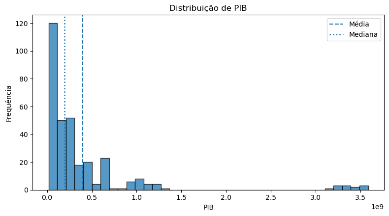
    


    
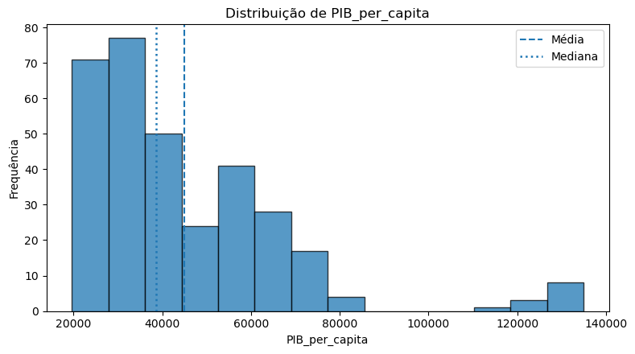
    


    
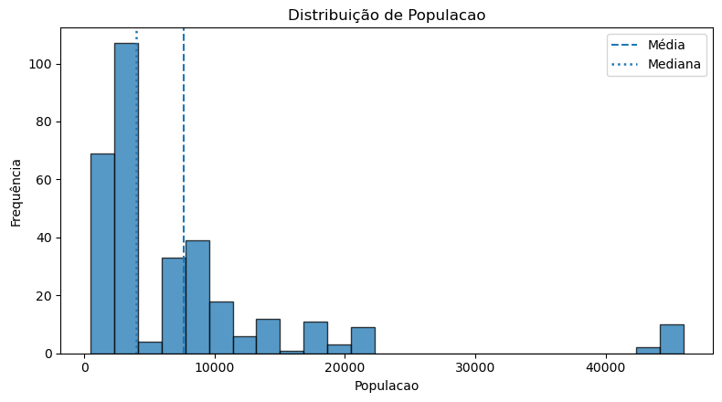
    


    
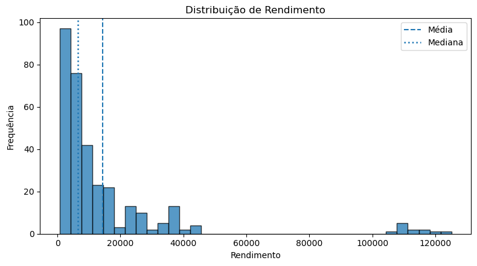
    


    
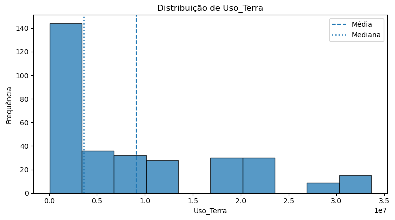
    


    
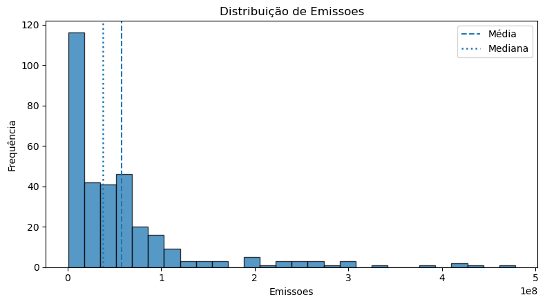
    


    
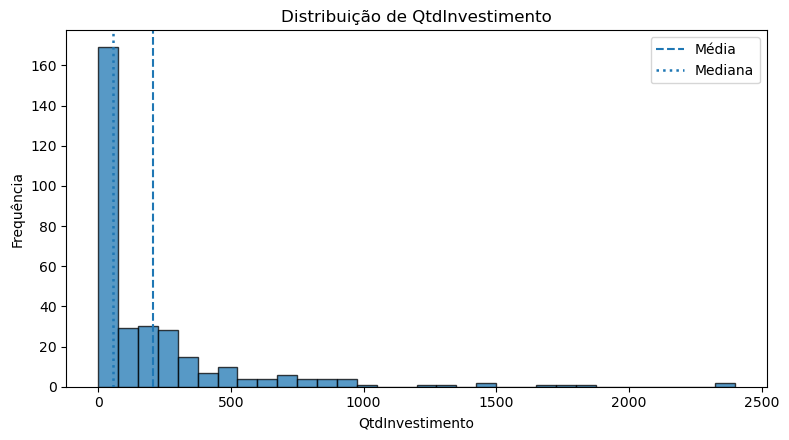
    


    
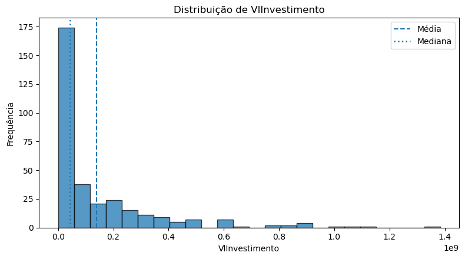
    


    
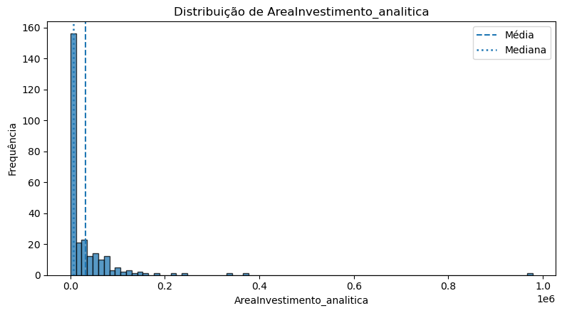
    


### Boxplots — diagnóstico inicial de valores extremos


```python
for var in vars_descritivas:

    x = df[var].dropna()

    fig, ax = plt.subplots(figsize=(8, 2.8))

    ax.boxplot(
        x,
        vert=False,
        showmeans=True
    )

    ax.set_title(f"Boxplot de {var}")
    ax.set_xlabel(var)

    plt.tight_layout()
    plt.show()
```


    
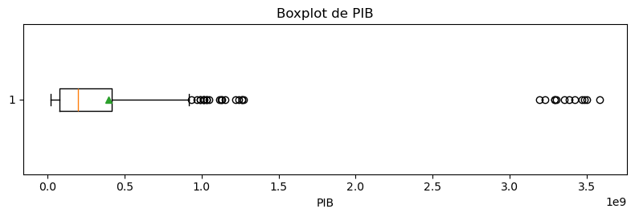
    


    
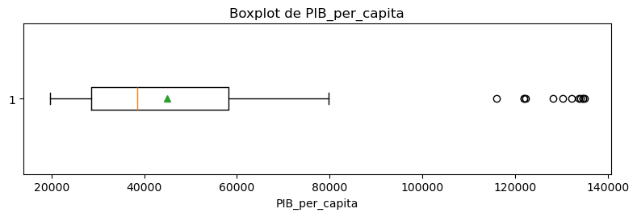
    


    
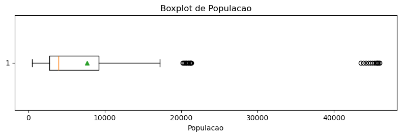
    


    
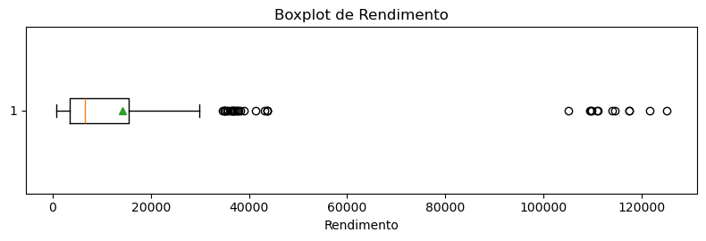
    


    
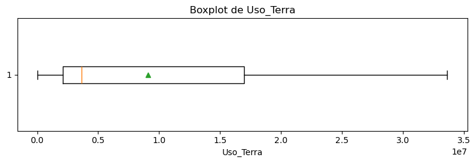
    


    
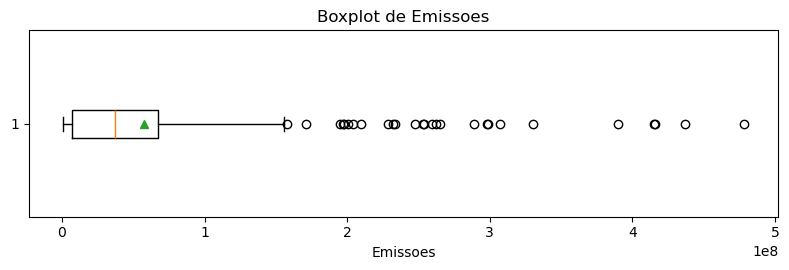
    


    
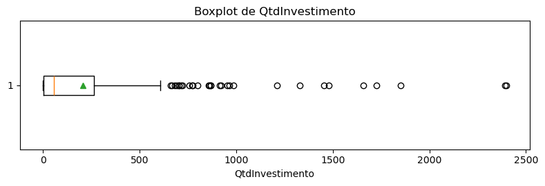
    


    
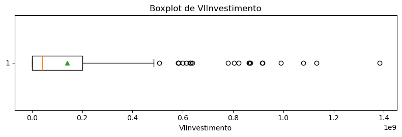
    


    
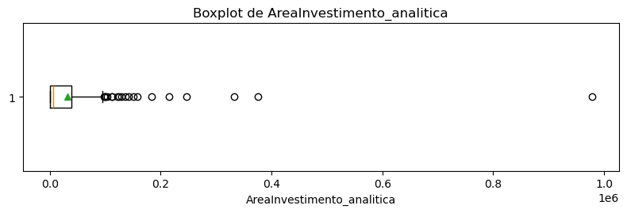
    


### 2.5.4 Estatísticas condicionais das operações de crédito


```python
df_credito = df.loc[
    ~df["SemOperacaoCredito"]
].copy()

print(f"Painel completo: {len(df)} observações")
print(f"Com operação de crédito: {len(df_credito)} observações")
print(f"Sem operação de crédito: {df['SemOperacaoCredito'].sum()} observações")
```

    Painel completo: 324 observações
    Com operação de crédito: 264 observações
    Sem operação de crédito: 60 observações
    


```python
vars_credito = [
    "QtdInvestimento",
    "VlInvestimento",
    "AreaInvestimento_analitica"
]

descritivas_credito = estatisticas_descritivas(
    df_credito,
    vars_credito
)

display(descritivas_credito)
```


<div>
<style scoped>
    .dataframe tbody tr th:only-of-type {
        vertical-align: middle;
    }

    .dataframe tbody tr th {
        vertical-align: top;
    }

    .dataframe thead th {
        text-align: right;
    }
</style>
<table border="1" class="dataframe">
  <thead>
    <tr style="text-align: right;">
      <th></th>
      <th>n</th>
      <th>media</th>
      <th>mediana</th>
      <th>desvio_padrao</th>
      <th>CV_pct</th>
      <th>minimo</th>
      <th>Q1</th>
      <th>Q3</th>
      <th>maximo</th>
      <th>assimetria</th>
      <th>curtose_excesso</th>
    </tr>
    <tr>
      <th>variavel</th>
      <th></th>
      <th></th>
      <th></th>
      <th></th>
      <th></th>
      <th></th>
      <th></th>
      <th></th>
      <th></th>
      <th></th>
      <th></th>
    </tr>
  </thead>
  <tbody>
    <tr>
      <th>QtdInvestimento</th>
      <td>264</td>
      <td>255.4280</td>
      <td>134.5000</td>
      <td>367.0299</td>
      <td>143.6921</td>
      <td>1.0000</td>
      <td>28.7500</td>
      <td>316.2500</td>
      <td>2,399.0000</td>
      <td>2.9405</td>
      <td>11.1464</td>
    </tr>
    <tr>
      <th>VlInvestimento</th>
      <td>264</td>
      <td>171,330,865.3220</td>
      <td>84,673,150.0000</td>
      <td>230,942,844.6587</td>
      <td>134.7935</td>
      <td>163,638.0000</td>
      <td>11,034,679.5000</td>
      <td>237,667,501.2500</td>
      <td>1,382,899,884.0000</td>
      <td>2.2255</td>
      <td>5.7325</td>
    </tr>
    <tr>
      <th>AreaInvestimento_analitica</th>
      <td>211</td>
      <td>40,024.4123</td>
      <td>19,554.0000</td>
      <td>82,862.9866</td>
      <td>207.0311</td>
      <td>24.0000</td>
      <td>2,059.0000</td>
      <td>53,032.5000</td>
      <td>978,046.0000</td>
      <td>7.6850</td>
      <td>79.9289</td>
    </tr>
  </tbody>
</table>
</div>


```python
print(descritivas_credito)
```

                                  n            media         mediana  \
    variavel                                                           
    QtdInvestimento             264         255.4280        134.5000   
    VlInvestimento              264 171,330,865.3220 84,673,150.0000   
    AreaInvestimento_analitica  211      40,024.4123     19,554.0000   
    
                                  desvio_padrao   CV_pct       minimo  \
    variavel                                                            
    QtdInvestimento                    367.0299 143.6921       1.0000   
    VlInvestimento             230,942,844.6587 134.7935 163,638.0000   
    AreaInvestimento_analitica      82,862.9866 207.0311      24.0000   
    
                                            Q1               Q3  \
    variavel                                                      
    QtdInvestimento                    28.7500         316.2500   
    VlInvestimento             11,034,679.5000 237,667,501.2500   
    AreaInvestimento_analitica      2,059.0000      53,032.5000   
    
                                           maximo  assimetria  curtose_excesso  
    variavel                                                                    
    QtdInvestimento                    2,399.0000      2.9405          11.1464  
    VlInvestimento             1,382,899,884.0000      2.2255           5.7325  
    AreaInvestimento_analitica       978,046.0000      7.6850          79.9289  
    

### Comparação: painel completo × operações existentes


```python
comparacao_credito = pd.DataFrame()

for var in ["QtdInvestimento", "VlInvestimento"]:

    comparacao_credito.loc[var, "media_incondicional"] = df[var].mean()
    comparacao_credito.loc[var, "mediana_incondicional"] = df[var].median()

    comparacao_credito.loc[var, "media_condicional"] = df_credito[var].mean()
    comparacao_credito.loc[var, "mediana_condicional"] = df_credito[var].median()

    comparacao_credito.loc[var, "assimetria_incondicional"] = skew(
        df[var].dropna(),
        bias=False
    )

    comparacao_credito.loc[var, "assimetria_condicional"] = skew(
        df_credito[var].dropna(),
        bias=False
    )

display(comparacao_credito)
```


<div>
<style scoped>
    .dataframe tbody tr th:only-of-type {
        vertical-align: middle;
    }

    .dataframe tbody tr th {
        vertical-align: top;
    }

    .dataframe thead th {
        text-align: right;
    }
</style>
<table border="1" class="dataframe">
  <thead>
    <tr style="text-align: right;">
      <th></th>
      <th>media_incondicional</th>
      <th>mediana_incondicional</th>
      <th>media_condicional</th>
      <th>mediana_condicional</th>
      <th>assimetria_incondicional</th>
      <th>assimetria_condicional</th>
    </tr>
  </thead>
  <tbody>
    <tr>
      <th>QtdInvestimento</th>
      <td>208.1265</td>
      <td>56.0000</td>
      <td>255.4280</td>
      <td>134.5000</td>
      <td>3.1996</td>
      <td>2.9405</td>
    </tr>
    <tr>
      <th>VlInvestimento</th>
      <td>139,602,927.2994</td>
      <td>41,974,145.5000</td>
      <td>171,330,865.3220</td>
      <td>84,673,150.0000</td>
      <td>2.4792</td>
      <td>2.2255</td>
    </tr>
  </tbody>
</table>
</div>


```python
print(comparacao_credito)
```

                     media_incondicional  mediana_incondicional  \
    QtdInvestimento             208.1265                56.0000   
    VlInvestimento      139,602,927.2994        41,974,145.5000   
    
                     media_condicional  mediana_condicional  \
    QtdInvestimento           255.4280             134.5000   
    VlInvestimento    171,330,865.3220      84,673,150.0000   
    
                     assimetria_incondicional  assimetria_condicional  
    QtdInvestimento                    3.1996                  2.9405  
    VlInvestimento                     2.4792                  2.2255  
    

### Distribuições condicionais das operações existentes


```python
for var in ["QtdInvestimento", "VlInvestimento"]:

    x = df_credito[var].dropna()

    fig, ax = plt.subplots(figsize=(8, 4.5))

    ax.hist(x, bins="auto", edgecolor="black", alpha=0.75)

    ax.axvline(
        x.mean(),
        linestyle="--",
        linewidth=1.5,
        label="Média"
    )

    ax.axvline(
        x.median(),
        linestyle=":",
        linewidth=1.8,
        label="Mediana"
    )

    ax.set_title(f"{var} — somente observações com operação")
    ax.set_xlabel(var)
    ax.set_ylabel("Frequência")
    ax.legend()

    plt.tight_layout()
    plt.show()
```


    
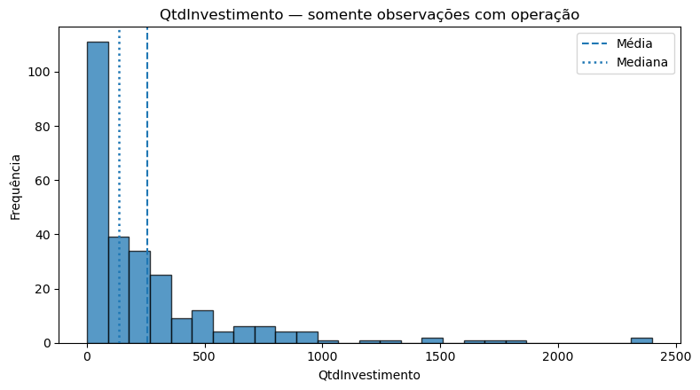
    


    
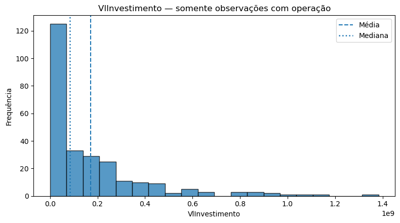
    


### Síntese da análise descritiva das distribuições

A análise descritiva evidencia elevada heterogeneidade entre as observações do
painel. A maior parte das variáveis apresenta assimetria positiva, caracterizada
pela concentração de observações em valores relativamente menores e pela presença
de cauda à direita formada por observações de maior magnitude. Esse padrão é
particularmente pronunciado nas variáveis econômicas, ambientais e relacionadas
às operações de crédito.

As diferenças entre médias e medianas reforçam essa característica. Para as
variáveis de investimento, a análise incondicional deve ser distinguida da análise
condicionada à existência de operações. Das 324 observações UF-ano, 264 apresentam
operação de crédito e 60 correspondem à ausência de operação.

Condicionando-se a análise às 264 observações com crédito, a mediana da quantidade
de operações aumenta de 56 para 134,5, enquanto a mediana do valor investido passa
de aproximadamente R$\$$ 41,97 milhões para R$\$$ 84,67 milhões. Entretanto, a assimetria
permanece elevada mesmo entre as operações existentes: 2,94 para a quantidade de
operações e 2,23 para o valor investido. Assim, a forma assimétrica dessas
distribuições não decorre exclusivamente da presença de observações sem crédito,
mas também da elevada heterogeneidade na intensidade das operações realizadas
entre UFs e anos.

A variável `AreaInvestimento_analitica` apresenta a maior heterogeneidade do
conjunto. Considerando as 211 observações simultaneamente caracterizadas pela
existência de crédito e disponibilidade da informação de área, sua média é de
aproximadamente 40 mil, enquanto a mediana é de aproximadamente 19,6 mil. A
distribuição apresenta forte assimetria positiva e cauda direita pronunciada,
incluindo observações de magnitude substancialmente superior ao restante da
distribuição.

Os valores extremos identificados graficamente não foram considerados, nesta
etapa, erros ou observações passíveis de exclusão. Em razão da natureza territorial
do painel, tais valores podem refletir diferenças estruturais legítimas entre as
Unidades da Federação e entre os períodos analisados. Sua influência será avaliada
nas etapas posteriores por meio de diagnósticos de sensibilidade e das
especificações estatísticas adotadas.

Os resultados também indicam que média e desvio-padrão, isoladamente, são
insuficientes para caracterizar adequadamente diversas variáveis do conjunto.
Por essa razão, as análises subsequentes considerarão conjuntamente medidas
robustas de posição, como mediana e quartis, e a forma das distribuições.

Finalmente, a elevada assimetria observada em diversas variáveis será considerada
na etapa de preparação e modelagem dos dados. Eventuais transformações, como a
transformação logarítmica, não serão aplicadas automaticamente, mas avaliadas de
acordo com a natureza de cada variável, o objetivo analítico e a especificação
dos modelos.

## 2.6. Heterogeneidade territorial e temporal

### 2.6.1. Decomposição *overall*, *between* e *within*


```python
vars_painel = [
    "PIB",
    "PIB_per_capita",
    "Populacao",
    "Rendimento",
    "Uso_Terra",
    "Emissoes",
    "QtdInvestimento",
    "VlInvestimento",
    "AreaInvestimento_analitica"
]

resultados_variacao = []

for var in vars_painel:

    dados = df[["UF", "Ano", var]].dropna().copy()

    # Média geral
    media_geral = dados[var].mean()

    # Média de cada UF
    media_uf = dados.groupby("UF")[var].transform("mean")

    # Desvio-padrão overall
    sd_overall = dados[var].std(ddof=1)

    # Between:
    # dispersão das médias das UFs
    medias_por_uf = (
        dados.groupby("UF")[var]
             .mean()
    )
    sd_between = medias_por_uf.std(ddof=1)

    # Within:
    # remove a média específica da UF e recoloca a média geral
    x_within = dados[var] - media_uf + media_geral
    sd_within = x_within.std(ddof=1)

    resultados_variacao.append({
        "variavel": var,
        "n": len(dados),
        "media": media_geral,
        "sd_overall": sd_overall,
        "sd_between": sd_between,
        "sd_within": sd_within
    })

variacao_painel = (
    pd.DataFrame(resultados_variacao)
      .set_index("variavel")
)

display(variacao_painel)
```


<div>
<style scoped>
    .dataframe tbody tr th:only-of-type {
        vertical-align: middle;
    }

    .dataframe tbody tr th {
        vertical-align: top;
    }

    .dataframe thead th {
        text-align: right;
    }
</style>
<table border="1" class="dataframe">
  <thead>
    <tr style="text-align: right;">
      <th></th>
      <th>n</th>
      <th>media</th>
      <th>sd_overall</th>
      <th>sd_between</th>
      <th>sd_within</th>
    </tr>
    <tr>
      <th>variavel</th>
      <th></th>
      <th></th>
      <th></th>
      <th></th>
      <th></th>
    </tr>
  </thead>
  <tbody>
    <tr>
      <th>PIB</th>
      <td>324</td>
      <td>395,724,855.7932</td>
      <td>650,909,302.6085</td>
      <td>661,393,751.3295</td>
      <td>33,743,459.9058</td>
    </tr>
    <tr>
      <th>PIB_per_capita</th>
      <td>324</td>
      <td>44,892.4009</td>
      <td>22,915.2076</td>
      <td>23,078.3715</td>
      <td>3,260.9772</td>
    </tr>
    <tr>
      <th>Populacao</th>
      <td>324</td>
      <td>7,630.4784</td>
      <td>8,938.1967</td>
      <td>9,091.5065</td>
      <td>225.3080</td>
    </tr>
    <tr>
      <th>Rendimento</th>
      <td>324</td>
      <td>14,253.8519</td>
      <td>22,078.3841</td>
      <td>22,406.8135</td>
      <td>1,577.3253</td>
    </tr>
    <tr>
      <th>Uso_Terra</th>
      <td>324</td>
      <td>9,105,162.0556</td>
      <td>9,296,632.5192</td>
      <td>9,446,842.3625</td>
      <td>473,048.7293</td>
    </tr>
    <tr>
      <th>Emissoes</th>
      <td>324</td>
      <td>57,907,933.2562</td>
      <td>77,499,888.2564</td>
      <td>75,887,508.0200</td>
      <td>21,058,081.7774</td>
    </tr>
    <tr>
      <th>QtdInvestimento</th>
      <td>324</td>
      <td>208.1265</td>
      <td>345.7780</td>
      <td>267.9863</td>
      <td>224.0347</td>
    </tr>
    <tr>
      <th>VlInvestimento</th>
      <td>324</td>
      <td>139,602,927.2994</td>
      <td>218,792,751.2397</td>
      <td>183,446,606.5702</td>
      <td>123,950,297.5668</td>
    </tr>
    <tr>
      <th>AreaInvestimento_analitica</th>
      <td>271</td>
      <td>31,162.9188</td>
      <td>74,950.7074</td>
      <td>46,759.5781</td>
      <td>59,233.4089</td>
    </tr>
  </tbody>
</table>
</div>


```python
print(variacao_painel)
```

                                  n            media       sd_overall  \
    variavel                                                            
    PIB                         324 395,724,855.7932 650,909,302.6085   
    PIB_per_capita              324      44,892.4009      22,915.2076   
    Populacao                   324       7,630.4784       8,938.1967   
    Rendimento                  324      14,253.8519      22,078.3841   
    Uso_Terra                   324   9,105,162.0556   9,296,632.5192   
    Emissoes                    324  57,907,933.2562  77,499,888.2564   
    QtdInvestimento             324         208.1265         345.7780   
    VlInvestimento              324 139,602,927.2994 218,792,751.2397   
    AreaInvestimento_analitica  271      31,162.9188      74,950.7074   
    
                                     sd_between        sd_within  
    variavel                                                      
    PIB                        661,393,751.3295  33,743,459.9058  
    PIB_per_capita                  23,078.3715       3,260.9772  
    Populacao                        9,091.5065         225.3080  
    Rendimento                      22,406.8135       1,577.3253  
    Uso_Terra                    9,446,842.3625     473,048.7293  
    Emissoes                    75,887,508.0200  21,058,081.7774  
    QtdInvestimento                    267.9863         224.0347  
    VlInvestimento             183,446,606.5702 123,950,297.5668  
    AreaInvestimento_analitica      46,759.5781      59,233.4089  
    

### Importância relativa da heterogeneidade *between/within*


```python
variacao_painel["between_overall"] = (
    variacao_painel["sd_between"]
    / variacao_painel["sd_overall"]
)

variacao_painel["within_overall"] = (
    variacao_painel["sd_within"]
    / variacao_painel["sd_overall"]
)

variacao_painel["razao_between_within"] = (
    variacao_painel["sd_between"]
    / variacao_painel["sd_within"]
)

display(
    variacao_painel.sort_values(
        "razao_between_within",
        ascending=False
    )
)
```


<div>
<style scoped>
    .dataframe tbody tr th:only-of-type {
        vertical-align: middle;
    }

    .dataframe tbody tr th {
        vertical-align: top;
    }

    .dataframe thead th {
        text-align: right;
    }
</style>
<table border="1" class="dataframe">
  <thead>
    <tr style="text-align: right;">
      <th></th>
      <th>n</th>
      <th>media</th>
      <th>sd_overall</th>
      <th>sd_between</th>
      <th>sd_within</th>
      <th>between_overall</th>
      <th>within_overall</th>
      <th>razao_between_within</th>
    </tr>
    <tr>
      <th>variavel</th>
      <th></th>
      <th></th>
      <th></th>
      <th></th>
      <th></th>
      <th></th>
      <th></th>
      <th></th>
    </tr>
  </thead>
  <tbody>
    <tr>
      <th>Populacao</th>
      <td>324</td>
      <td>7,630.4784</td>
      <td>8,938.1967</td>
      <td>9,091.5065</td>
      <td>225.3080</td>
      <td>1.0172</td>
      <td>0.0252</td>
      <td>40.3515</td>
    </tr>
    <tr>
      <th>Uso_Terra</th>
      <td>324</td>
      <td>9,105,162.0556</td>
      <td>9,296,632.5192</td>
      <td>9,446,842.3625</td>
      <td>473,048.7293</td>
      <td>1.0162</td>
      <td>0.0509</td>
      <td>19.9701</td>
    </tr>
    <tr>
      <th>PIB</th>
      <td>324</td>
      <td>395,724,855.7932</td>
      <td>650,909,302.6085</td>
      <td>661,393,751.3295</td>
      <td>33,743,459.9058</td>
      <td>1.0161</td>
      <td>0.0518</td>
      <td>19.6007</td>
    </tr>
    <tr>
      <th>Rendimento</th>
      <td>324</td>
      <td>14,253.8519</td>
      <td>22,078.3841</td>
      <td>22,406.8135</td>
      <td>1,577.3253</td>
      <td>1.0149</td>
      <td>0.0714</td>
      <td>14.2056</td>
    </tr>
    <tr>
      <th>PIB_per_capita</th>
      <td>324</td>
      <td>44,892.4009</td>
      <td>22,915.2076</td>
      <td>23,078.3715</td>
      <td>3,260.9772</td>
      <td>1.0071</td>
      <td>0.1423</td>
      <td>7.0771</td>
    </tr>
    <tr>
      <th>Emissoes</th>
      <td>324</td>
      <td>57,907,933.2562</td>
      <td>77,499,888.2564</td>
      <td>75,887,508.0200</td>
      <td>21,058,081.7774</td>
      <td>0.9792</td>
      <td>0.2717</td>
      <td>3.6037</td>
    </tr>
    <tr>
      <th>VlInvestimento</th>
      <td>324</td>
      <td>139,602,927.2994</td>
      <td>218,792,751.2397</td>
      <td>183,446,606.5702</td>
      <td>123,950,297.5668</td>
      <td>0.8384</td>
      <td>0.5665</td>
      <td>1.4800</td>
    </tr>
    <tr>
      <th>QtdInvestimento</th>
      <td>324</td>
      <td>208.1265</td>
      <td>345.7780</td>
      <td>267.9863</td>
      <td>224.0347</td>
      <td>0.7750</td>
      <td>0.6479</td>
      <td>1.1962</td>
    </tr>
    <tr>
      <th>AreaInvestimento_analitica</th>
      <td>271</td>
      <td>31,162.9188</td>
      <td>74,950.7074</td>
      <td>46,759.5781</td>
      <td>59,233.4089</td>
      <td>0.6239</td>
      <td>0.7903</td>
      <td>0.7894</td>
    </tr>
  </tbody>
</table>
</div>


```python
print(
    variacao_painel.sort_values(
        "razao_between_within",
        ascending=False
    )
)
```

                                  n            media       sd_overall  \
    variavel                                                            
    Populacao                   324       7,630.4784       8,938.1967   
    Uso_Terra                   324   9,105,162.0556   9,296,632.5192   
    PIB                         324 395,724,855.7932 650,909,302.6085   
    Rendimento                  324      14,253.8519      22,078.3841   
    PIB_per_capita              324      44,892.4009      22,915.2076   
    Emissoes                    324  57,907,933.2562  77,499,888.2564   
    VlInvestimento              324 139,602,927.2994 218,792,751.2397   
    QtdInvestimento             324         208.1265         345.7780   
    AreaInvestimento_analitica  271      31,162.9188      74,950.7074   
    
                                     sd_between        sd_within  between_overall  \
    variavel                                                                        
    Populacao                        9,091.5065         225.3080           1.0172   
    Uso_Terra                    9,446,842.3625     473,048.7293           1.0162   
    PIB                        661,393,751.3295  33,743,459.9058           1.0161   
    Rendimento                      22,406.8135       1,577.3253           1.0149   
    PIB_per_capita                  23,078.3715       3,260.9772           1.0071   
    Emissoes                    75,887,508.0200  21,058,081.7774           0.9792   
    VlInvestimento             183,446,606.5702 123,950,297.5668           0.8384   
    QtdInvestimento                    267.9863         224.0347           0.7750   
    AreaInvestimento_analitica      46,759.5781      59,233.4089           0.6239   
    
                                within_overall  razao_between_within  
    variavel                                                          
    Populacao                           0.0252               40.3515  
    Uso_Terra                           0.0509               19.9701  
    PIB                                 0.0518               19.6007  
    Rendimento                          0.0714               14.2056  
    PIB_per_capita                      0.1423                7.0771  
    Emissoes                            0.2717                3.6037  
    VlInvestimento                      0.5665                1.4800  
    QtdInvestimento                     0.6479                1.1962  
    AreaInvestimento_analitica          0.7903                0.7894  
    

### 2.6.2. Intraclass Correlation Coefficient — ICC


```python
import statsmodels.formula.api as smf
warnings.filterwarnings("ignore")

resultados_icc = []

for var in vars_painel:

    dados = df[["UF", var]].dropna().copy()

    try:
        modelo = smf.mixedlm(
            f"{var} ~ 1",
            data=dados,
            groups=dados["UF"]
        )

        ajuste = modelo.fit(
            reml=True,
            method="lbfgs",
            disp=False
        )

        var_uf = float(ajuste.cov_re.iloc[0, 0])
        var_residuo = ajuste.scale

        icc = var_uf / (var_uf + var_residuo)

        resultados_icc.append({
            "variavel": var,
            "variancia_UF": var_uf,
            "variancia_residual": var_residuo,
            "ICC": icc
        })

    except Exception as e:
        resultados_icc.append({
            "variavel": var,
            "variancia_UF": np.nan,
            "variancia_residual": np.nan,
            "ICC": np.nan
        })

icc_df = (
    pd.DataFrame(resultados_icc)
      .set_index("variavel")
      .sort_values("ICC", ascending=False)
)

display(icc_df)
```


<div>
<style scoped>
    .dataframe tbody tr th:only-of-type {
        vertical-align: middle;
    }

    .dataframe tbody tr th {
        vertical-align: top;
    }

    .dataframe thead th {
        text-align: right;
    }
</style>
<table border="1" class="dataframe">
  <thead>
    <tr style="text-align: right;">
      <th></th>
      <th>variancia_UF</th>
      <th>variancia_residual</th>
      <th>ICC</th>
    </tr>
    <tr>
      <th>variavel</th>
      <th></th>
      <th></th>
      <th></th>
    </tr>
  </thead>
  <tbody>
    <tr>
      <th>Populacao</th>
      <td>82,422,815.4319</td>
      <td>55,221.0378</td>
      <td>0.9993</td>
    </tr>
    <tr>
      <th>Uso_Terra</th>
      <td>89,173,395,511,507.3750</td>
      <td>243,376,581,054.7444</td>
      <td>0.9973</td>
    </tr>
    <tr>
      <th>PIB</th>
      <td>437,130,623,991,488,192.0000</td>
      <td>1,238,349,893,626,683.7500</td>
      <td>0.9972</td>
    </tr>
    <tr>
      <th>Rendimento</th>
      <td>501,274,723.2902</td>
      <td>2,706,022.6605</td>
      <td>0.9946</td>
    </tr>
    <tr>
      <th>PIB_per_capita</th>
      <td>531,630,588.3452</td>
      <td>11,564,924.4901</td>
      <td>0.9787</td>
    </tr>
    <tr>
      <th>Emissoes</th>
      <td>5,718,009,657,449,275.0000</td>
      <td>482,267,961,217,940.0000</td>
      <td>0.9222</td>
    </tr>
    <tr>
      <th>VlInvestimento</th>
      <td>32,260,230,182,018,324.0000</td>
      <td>16,708,646,302,064,960.0000</td>
      <td>0.6588</td>
    </tr>
    <tr>
      <th>QtdInvestimento</th>
      <td>67,268.8651</td>
      <td>54,585.3347</td>
      <td>0.5520</td>
    </tr>
    <tr>
      <th>AreaInvestimento_analitica</th>
      <td>0.0000</td>
      <td>3,508,596,733.8920</td>
      <td>0.0000</td>
    </tr>
  </tbody>
</table>
</div>


```python
print(icc_df)
```

                                               variancia_UF  \
    variavel                                                  
    Populacao                               82,422,815.4319   
    Uso_Terra                       89,173,395,511,507.3750   
    PIB                        437,130,623,991,488,192.0000   
    Rendimento                             501,274,723.2902   
    PIB_per_capita                         531,630,588.3452   
    Emissoes                     5,718,009,657,449,275.0000   
    VlInvestimento              32,260,230,182,018,324.0000   
    QtdInvestimento                             67,268.8651   
    AreaInvestimento_analitica                       0.0000   
    
                                        variancia_residual    ICC  
    variavel                                                       
    Populacao                                  55,221.0378 0.9993  
    Uso_Terra                         243,376,581,054.7444 0.9973  
    PIB                         1,238,349,893,626,683.7500 0.9972  
    Rendimento                              2,706,022.6605 0.9946  
    PIB_per_capita                         11,564,924.4901 0.9787  
    Emissoes                      482,267,961,217,940.0000 0.9222  
    VlInvestimento             16,708,646,302,064,960.0000 0.6588  
    QtdInvestimento                            54,585.3347 0.5520  
    AreaInvestimento_analitica          3,508,596,733.8920 0.0000  
    

### Heterogeneidade territorial e temporal

A decomposição da variabilidade revelou diferenças importantes entre as dimensões
analisadas. Variáveis como população, uso da terra, PIB, rendimento e PIB per
capita apresentam predominância acentuada da variação entre Unidades da Federação
(`between`) relativamente à variação observada dentro de cada UF ao longo do
tempo (`within`).

Os modelos nulos de efeitos aleatórios corroboram esse resultado. Os coeficientes
de correlação intraclasse (ICC) foram de 0,9993 para população, 0,9973 para uso
da terra, 0,9972 para PIB, 0,9946 para rendimento e 0,9787 para PIB per capita.
Esses valores indicam que parcela predominante da variância estimada dessas
variáveis está associada às diferenças persistentes entre as UFs durante o
período analisado.

As emissões também apresentam forte componente territorial, com ICC de 0,9222.
Embora exista variação temporal dentro das UFs, a maior parcela da variabilidade
estimada nessa variável está associada às diferenças persistentes entre as
unidades territoriais.

O comportamento das variáveis de crédito é distinto. O valor e a quantidade de
operações apresentam ICCs de 0,6588 e 0,5520, respectivamente. A razão entre os
desvios-padrão `between` e `within` também diminui para 1,48 no valor investido
e 1,20 na quantidade de operações. Consequentemente, a atividade creditícia
combina heterogeneidade territorial persistente com variação temporal substancial
dentro das UFs.

Esse resultado é metodologicamente relevante para as análises subsequentes.
Associações calculadas sobre o conjunto das observações podem refletir tanto
diferenças estruturais entre UFs quanto mudanças ocorridas dentro das mesmas UFs
ao longo do tempo. Por essa razão, as relações entre crédito, características
socioeconômicas e indicadores ambientais serão examinadas distinguindo-se as
dimensões `between` e `within`, evitando interpretar correlações agregadas como
evidência de relações longitudinais.

Para `AreaInvestimento_analitica`, a decomposição descritiva indicou variabilidade
`within` superior à `between`. Entretanto, a estimação do modelo nulo de efeitos
aleatórios não produziu uma estimativa válida do ICC. Considerando a elevada
assimetria dessa variável, a presença de observações extremas e a indisponibilidade
da informação de área em 53 registros com operações existentes, esse resultado
será tratado com cautela e submetido posteriormente a análises específicas de
sensibilidade.

## 2.7. Estrutura das associações

### 2.7.1. Variáveis utilizadas


```python
vars_associacao = [
    "PIB",
    "PIB_per_capita",
    "Populacao",
    "Rendimento",
    "Uso_Terra",
    "Emissoes",
    "QtdInvestimento",
    "VlInvestimento",
    "AreaInvestimento_analitica"
]

dados_assoc = df[
    ["UF", "Ano"] + vars_associacao
].copy()
```

### 2.7.2. Correlações *pooled*


```python
corr_pooled = (
    dados_assoc[vars_associacao]
    .corr(method="pearson")
)

display(corr_pooled.round(3))
```


<div>
<style scoped>
    .dataframe tbody tr th:only-of-type {
        vertical-align: middle;
    }

    .dataframe tbody tr th {
        vertical-align: top;
    }

    .dataframe thead th {
        text-align: right;
    }
</style>
<table border="1" class="dataframe">
  <thead>
    <tr style="text-align: right;">
      <th></th>
      <th>PIB</th>
      <th>PIB_per_capita</th>
      <th>Populacao</th>
      <th>Rendimento</th>
      <th>Uso_Terra</th>
      <th>Emissoes</th>
      <th>QtdInvestimento</th>
      <th>VlInvestimento</th>
      <th>AreaInvestimento_analitica</th>
    </tr>
  </thead>
  <tbody>
    <tr>
      <th>PIB</th>
      <td>1.0000</td>
      <td>0.4160</td>
      <td>0.9590</td>
      <td>0.9950</td>
      <td>0.2930</td>
      <td>-0.0110</td>
      <td>0.3850</td>
      <td>0.3270</td>
      <td>0.0680</td>
    </tr>
    <tr>
      <th>PIB_per_capita</th>
      <td>0.4160</td>
      <td>1.0000</td>
      <td>0.2600</td>
      <td>0.3770</td>
      <td>0.1180</td>
      <td>-0.0490</td>
      <td>0.1490</td>
      <td>0.2000</td>
      <td>0.1370</td>
    </tr>
    <tr>
      <th>Populacao</th>
      <td>0.9590</td>
      <td>0.2600</td>
      <td>1.0000</td>
      <td>0.9730</td>
      <td>0.3920</td>
      <td>0.0440</td>
      <td>0.4260</td>
      <td>0.3640</td>
      <td>0.0890</td>
    </tr>
    <tr>
      <th>Rendimento</th>
      <td>0.9950</td>
      <td>0.3770</td>
      <td>0.9730</td>
      <td>1.0000</td>
      <td>0.3150</td>
      <td>-0.0140</td>
      <td>0.3990</td>
      <td>0.3440</td>
      <td>0.0770</td>
    </tr>
    <tr>
      <th>Uso_Terra</th>
      <td>0.2930</td>
      <td>0.1180</td>
      <td>0.3920</td>
      <td>0.3150</td>
      <td>1.0000</td>
      <td>0.6260</td>
      <td>0.6140</td>
      <td>0.7780</td>
      <td>0.5170</td>
    </tr>
    <tr>
      <th>Emissoes</th>
      <td>-0.0110</td>
      <td>-0.0490</td>
      <td>0.0440</td>
      <td>-0.0140</td>
      <td>0.6260</td>
      <td>1.0000</td>
      <td>0.2270</td>
      <td>0.3860</td>
      <td>0.2670</td>
    </tr>
    <tr>
      <th>QtdInvestimento</th>
      <td>0.3850</td>
      <td>0.1490</td>
      <td>0.4260</td>
      <td>0.3990</td>
      <td>0.6140</td>
      <td>0.2270</td>
      <td>1.0000</td>
      <td>0.7760</td>
      <td>0.4080</td>
    </tr>
    <tr>
      <th>VlInvestimento</th>
      <td>0.3270</td>
      <td>0.2000</td>
      <td>0.3640</td>
      <td>0.3440</td>
      <td>0.7780</td>
      <td>0.3860</td>
      <td>0.7760</td>
      <td>1.0000</td>
      <td>0.6240</td>
    </tr>
    <tr>
      <th>AreaInvestimento_analitica</th>
      <td>0.0680</td>
      <td>0.1370</td>
      <td>0.0890</td>
      <td>0.0770</td>
      <td>0.5170</td>
      <td>0.2670</td>
      <td>0.4080</td>
      <td>0.6240</td>
      <td>1.0000</td>
    </tr>
  </tbody>
</table>
</div>


```python
print(corr_pooled.round(3))
```

                                   PIB  PIB_per_capita  Populacao  Rendimento  \
    PIB                         1.0000          0.4160     0.9590      0.9950   
    PIB_per_capita              0.4160          1.0000     0.2600      0.3770   
    Populacao                   0.9590          0.2600     1.0000      0.9730   
    Rendimento                  0.9950          0.3770     0.9730      1.0000   
    Uso_Terra                   0.2930          0.1180     0.3920      0.3150   
    Emissoes                   -0.0110         -0.0490     0.0440     -0.0140   
    QtdInvestimento             0.3850          0.1490     0.4260      0.3990   
    VlInvestimento              0.3270          0.2000     0.3640      0.3440   
    AreaInvestimento_analitica  0.0680          0.1370     0.0890      0.0770   
    
                                Uso_Terra  Emissoes  QtdInvestimento  \
    PIB                            0.2930   -0.0110           0.3850   
    PIB_per_capita                 0.1180   -0.0490           0.1490   
    Populacao                      0.3920    0.0440           0.4260   
    Rendimento                     0.3150   -0.0140           0.3990   
    Uso_Terra                      1.0000    0.6260           0.6140   
    Emissoes                       0.6260    1.0000           0.2270   
    QtdInvestimento                0.6140    0.2270           1.0000   
    VlInvestimento                 0.7780    0.3860           0.7760   
    AreaInvestimento_analitica     0.5170    0.2670           0.4080   
    
                                VlInvestimento  AreaInvestimento_analitica  
    PIB                                 0.3270                      0.0680  
    PIB_per_capita                      0.2000                      0.1370  
    Populacao                           0.3640                      0.0890  
    Rendimento                          0.3440                      0.0770  
    Uso_Terra                           0.7780                      0.5170  
    Emissoes                            0.3860                      0.2670  
    QtdInvestimento                     0.7760                      0.4080  
    VlInvestimento                      1.0000                      0.6240  
    AreaInvestimento_analitica          0.6240                      1.0000  
    

### 2.7.3. Correlações *between-UF*


```python
dados_between = (
    dados_assoc
    .groupby("UF")[vars_associacao]
    .mean()
)

corr_between = dados_between.corr(method="pearson")

display(corr_between.round(3))
```


<div>
<style scoped>
    .dataframe tbody tr th:only-of-type {
        vertical-align: middle;
    }

    .dataframe tbody tr th {
        vertical-align: top;
    }

    .dataframe thead th {
        text-align: right;
    }
</style>
<table border="1" class="dataframe">
  <thead>
    <tr style="text-align: right;">
      <th></th>
      <th>PIB</th>
      <th>PIB_per_capita</th>
      <th>Populacao</th>
      <th>Rendimento</th>
      <th>Uso_Terra</th>
      <th>Emissoes</th>
      <th>QtdInvestimento</th>
      <th>VlInvestimento</th>
      <th>AreaInvestimento_analitica</th>
    </tr>
  </thead>
  <tbody>
    <tr>
      <th>PIB</th>
      <td>1.0000</td>
      <td>0.4160</td>
      <td>0.9600</td>
      <td>0.9970</td>
      <td>0.2930</td>
      <td>-0.0130</td>
      <td>0.5020</td>
      <td>0.3840</td>
      <td>0.0980</td>
    </tr>
    <tr>
      <th>PIB_per_capita</th>
      <td>0.4160</td>
      <td>1.0000</td>
      <td>0.2630</td>
      <td>0.3790</td>
      <td>0.1170</td>
      <td>-0.0570</td>
      <td>0.1860</td>
      <td>0.2070</td>
      <td>0.1380</td>
    </tr>
    <tr>
      <th>Populacao</th>
      <td>0.9600</td>
      <td>0.2630</td>
      <td>1.0000</td>
      <td>0.9750</td>
      <td>0.3920</td>
      <td>0.0450</td>
      <td>0.5720</td>
      <td>0.4430</td>
      <td>0.1440</td>
    </tr>
    <tr>
      <th>Rendimento</th>
      <td>0.9970</td>
      <td>0.3790</td>
      <td>0.9750</td>
      <td>1.0000</td>
      <td>0.3160</td>
      <td>-0.0140</td>
      <td>0.5340</td>
      <td>0.4080</td>
      <td>0.1160</td>
    </tr>
    <tr>
      <th>Uso_Terra</th>
      <td>0.2930</td>
      <td>0.1170</td>
      <td>0.3920</td>
      <td>0.3160</td>
      <td>1.0000</td>
      <td>0.6460</td>
      <td>0.8150</td>
      <td>0.9340</td>
      <td>0.8320</td>
    </tr>
    <tr>
      <th>Emissoes</th>
      <td>-0.0130</td>
      <td>-0.0570</td>
      <td>0.0450</td>
      <td>-0.0140</td>
      <td>0.6460</td>
      <td>1.0000</td>
      <td>0.3000</td>
      <td>0.4580</td>
      <td>0.4480</td>
    </tr>
    <tr>
      <th>QtdInvestimento</th>
      <td>0.5020</td>
      <td>0.1860</td>
      <td>0.5720</td>
      <td>0.5340</td>
      <td>0.8150</td>
      <td>0.3000</td>
      <td>1.0000</td>
      <td>0.9190</td>
      <td>0.7140</td>
    </tr>
    <tr>
      <th>VlInvestimento</th>
      <td>0.3840</td>
      <td>0.2070</td>
      <td>0.4430</td>
      <td>0.4080</td>
      <td>0.9340</td>
      <td>0.4580</td>
      <td>0.9190</td>
      <td>1.0000</td>
      <td>0.8880</td>
    </tr>
    <tr>
      <th>AreaInvestimento_analitica</th>
      <td>0.0980</td>
      <td>0.1380</td>
      <td>0.1440</td>
      <td>0.1160</td>
      <td>0.8320</td>
      <td>0.4480</td>
      <td>0.7140</td>
      <td>0.8880</td>
      <td>1.0000</td>
    </tr>
  </tbody>
</table>
</div>


```python
print(corr_between.round(3))
```

                                   PIB  PIB_per_capita  Populacao  Rendimento  \
    PIB                         1.0000          0.4160     0.9600      0.9970   
    PIB_per_capita              0.4160          1.0000     0.2630      0.3790   
    Populacao                   0.9600          0.2630     1.0000      0.9750   
    Rendimento                  0.9970          0.3790     0.9750      1.0000   
    Uso_Terra                   0.2930          0.1170     0.3920      0.3160   
    Emissoes                   -0.0130         -0.0570     0.0450     -0.0140   
    QtdInvestimento             0.5020          0.1860     0.5720      0.5340   
    VlInvestimento              0.3840          0.2070     0.4430      0.4080   
    AreaInvestimento_analitica  0.0980          0.1380     0.1440      0.1160   
    
                                Uso_Terra  Emissoes  QtdInvestimento  \
    PIB                            0.2930   -0.0130           0.5020   
    PIB_per_capita                 0.1170   -0.0570           0.1860   
    Populacao                      0.3920    0.0450           0.5720   
    Rendimento                     0.3160   -0.0140           0.5340   
    Uso_Terra                      1.0000    0.6460           0.8150   
    Emissoes                       0.6460    1.0000           0.3000   
    QtdInvestimento                0.8150    0.3000           1.0000   
    VlInvestimento                 0.9340    0.4580           0.9190   
    AreaInvestimento_analitica     0.8320    0.4480           0.7140   
    
                                VlInvestimento  AreaInvestimento_analitica  
    PIB                                 0.3840                      0.0980  
    PIB_per_capita                      0.2070                      0.1380  
    Populacao                           0.4430                      0.1440  
    Rendimento                          0.4080                      0.1160  
    Uso_Terra                           0.9340                      0.8320  
    Emissoes                            0.4580                      0.4480  
    QtdInvestimento                     0.9190                      0.7140  
    VlInvestimento                      1.0000                      0.8880  
    AreaInvestimento_analitica          0.8880                      1.0000  
    

### 2.7.4. Correlação *within-UF*


```python
dados_within = dados_assoc[
    ["UF", "Ano"]
].copy()

for var in vars_associacao:

    media_uf = (
        dados_assoc
        .groupby("UF")[var]
        .transform("mean")
    )

    dados_within[var] = (
        dados_assoc[var] - media_uf
    )

corr_within = (
    dados_within[vars_associacao]
    .corr(method="pearson")
)

display(corr_within.round(3))
```


<div>
<style scoped>
    .dataframe tbody tr th:only-of-type {
        vertical-align: middle;
    }

    .dataframe tbody tr th {
        vertical-align: top;
    }

    .dataframe thead th {
        text-align: right;
    }
</style>
<table border="1" class="dataframe">
  <thead>
    <tr style="text-align: right;">
      <th></th>
      <th>PIB</th>
      <th>PIB_per_capita</th>
      <th>Populacao</th>
      <th>Rendimento</th>
      <th>Uso_Terra</th>
      <th>Emissoes</th>
      <th>QtdInvestimento</th>
      <th>VlInvestimento</th>
      <th>AreaInvestimento_analitica</th>
    </tr>
  </thead>
  <tbody>
    <tr>
      <th>PIB</th>
      <td>1.0000</td>
      <td>0.6360</td>
      <td>0.1750</td>
      <td>0.4830</td>
      <td>0.2500</td>
      <td>0.1080</td>
      <td>0.0850</td>
      <td>0.3480</td>
      <td>0.1080</td>
    </tr>
    <tr>
      <th>PIB_per_capita</th>
      <td>0.6360</td>
      <td>1.0000</td>
      <td>0.0160</td>
      <td>0.2070</td>
      <td>0.3630</td>
      <td>0.1260</td>
      <td>0.0920</td>
      <td>0.3850</td>
      <td>0.2020</td>
    </tr>
    <tr>
      <th>Populacao</th>
      <td>0.1750</td>
      <td>0.0160</td>
      <td>1.0000</td>
      <td>0.4300</td>
      <td>0.3460</td>
      <td>0.1070</td>
      <td>-0.6110</td>
      <td>-0.0570</td>
      <td>0.0760</td>
    </tr>
    <tr>
      <th>Rendimento</th>
      <td>0.4830</td>
      <td>0.2070</td>
      <td>0.4300</td>
      <td>1.0000</td>
      <td>0.2470</td>
      <td>-0.0230</td>
      <td>-0.1510</td>
      <td>0.2110</td>
      <td>0.0870</td>
    </tr>
    <tr>
      <th>Uso_Terra</th>
      <td>0.2500</td>
      <td>0.3630</td>
      <td>0.3460</td>
      <td>0.2470</td>
      <td>1.0000</td>
      <td>0.4090</td>
      <td>-0.1800</td>
      <td>0.3110</td>
      <td>0.2040</td>
    </tr>
    <tr>
      <th>Emissoes</th>
      <td>0.1080</td>
      <td>0.1260</td>
      <td>0.1070</td>
      <td>-0.0230</td>
      <td>0.4090</td>
      <td>1.0000</td>
      <td>0.0410</td>
      <td>0.1480</td>
      <td>0.0740</td>
    </tr>
    <tr>
      <th>QtdInvestimento</th>
      <td>0.0850</td>
      <td>0.0920</td>
      <td>-0.6110</td>
      <td>-0.1510</td>
      <td>-0.1800</td>
      <td>0.0410</td>
      <td>1.0000</td>
      <td>0.5440</td>
      <td>0.0840</td>
    </tr>
    <tr>
      <th>VlInvestimento</th>
      <td>0.3480</td>
      <td>0.3850</td>
      <td>-0.0570</td>
      <td>0.2110</td>
      <td>0.3110</td>
      <td>0.1480</td>
      <td>0.5440</td>
      <td>1.0000</td>
      <td>0.3730</td>
    </tr>
    <tr>
      <th>AreaInvestimento_analitica</th>
      <td>0.1080</td>
      <td>0.2020</td>
      <td>0.0760</td>
      <td>0.0870</td>
      <td>0.2040</td>
      <td>0.0740</td>
      <td>0.0840</td>
      <td>0.3730</td>
      <td>1.0000</td>
    </tr>
  </tbody>
</table>
</div>


```python
print(corr_within.round(3))
```

                                  PIB  PIB_per_capita  Populacao  Rendimento  \
    PIB                        1.0000          0.6360     0.1750      0.4830   
    PIB_per_capita             0.6360          1.0000     0.0160      0.2070   
    Populacao                  0.1750          0.0160     1.0000      0.4300   
    Rendimento                 0.4830          0.2070     0.4300      1.0000   
    Uso_Terra                  0.2500          0.3630     0.3460      0.2470   
    Emissoes                   0.1080          0.1260     0.1070     -0.0230   
    QtdInvestimento            0.0850          0.0920    -0.6110     -0.1510   
    VlInvestimento             0.3480          0.3850    -0.0570      0.2110   
    AreaInvestimento_analitica 0.1080          0.2020     0.0760      0.0870   
    
                                Uso_Terra  Emissoes  QtdInvestimento  \
    PIB                            0.2500    0.1080           0.0850   
    PIB_per_capita                 0.3630    0.1260           0.0920   
    Populacao                      0.3460    0.1070          -0.6110   
    Rendimento                     0.2470   -0.0230          -0.1510   
    Uso_Terra                      1.0000    0.4090          -0.1800   
    Emissoes                       0.4090    1.0000           0.0410   
    QtdInvestimento               -0.1800    0.0410           1.0000   
    VlInvestimento                 0.3110    0.1480           0.5440   
    AreaInvestimento_analitica     0.2040    0.0740           0.0840   
    
                                VlInvestimento  AreaInvestimento_analitica  
    PIB                                 0.3480                      0.1080  
    PIB_per_capita                      0.3850                      0.2020  
    Populacao                          -0.0570                      0.0760  
    Rendimento                          0.2110                      0.0870  
    Uso_Terra                           0.3110                      0.2040  
    Emissoes                            0.1480                      0.0740  
    QtdInvestimento                     0.5440                      0.0840  
    VlInvestimento                      1.0000                      0.3730  
    AreaInvestimento_analitica          0.3730                      1.0000  
    

### 2.7.5. Comparação *pooled × between × within*


```python
pares_interesse = [
    ("PIB", "Emissoes"),
    ("PIB_per_capita", "Emissoes"),
    ("Uso_Terra", "Emissoes"),

    ("VlInvestimento", "PIB"),
    ("VlInvestimento", "PIB_per_capita"),
    ("VlInvestimento", "Uso_Terra"),
    ("VlInvestimento", "Emissoes"),

    ("QtdInvestimento", "PIB"),
    ("QtdInvestimento", "Uso_Terra"),
    ("QtdInvestimento", "Emissoes"),

    ("QtdInvestimento", "VlInvestimento")
]

comparacao_correlacoes = []

for x, y in pares_interesse:

    comparacao_correlacoes.append({
        "X": x,
        "Y": y,
        "r_pooled": corr_pooled.loc[x, y],
        "r_between": corr_between.loc[x, y],
        "r_within": corr_within.loc[x, y]
    })

comparacao_correlacoes = pd.DataFrame(
    comparacao_correlacoes
)

display(
    comparacao_correlacoes.round(3)
)
```


<div>
<style scoped>
    .dataframe tbody tr th:only-of-type {
        vertical-align: middle;
    }

    .dataframe tbody tr th {
        vertical-align: top;
    }

    .dataframe thead th {
        text-align: right;
    }
</style>
<table border="1" class="dataframe">
  <thead>
    <tr style="text-align: right;">
      <th></th>
      <th>X</th>
      <th>Y</th>
      <th>r_pooled</th>
      <th>r_between</th>
      <th>r_within</th>
    </tr>
  </thead>
  <tbody>
    <tr>
      <th>0</th>
      <td>PIB</td>
      <td>Emissoes</td>
      <td>-0.0110</td>
      <td>-0.0130</td>
      <td>0.1080</td>
    </tr>
    <tr>
      <th>1</th>
      <td>PIB_per_capita</td>
      <td>Emissoes</td>
      <td>-0.0490</td>
      <td>-0.0570</td>
      <td>0.1260</td>
    </tr>
    <tr>
      <th>2</th>
      <td>Uso_Terra</td>
      <td>Emissoes</td>
      <td>0.6260</td>
      <td>0.6460</td>
      <td>0.4090</td>
    </tr>
    <tr>
      <th>3</th>
      <td>VlInvestimento</td>
      <td>PIB</td>
      <td>0.3270</td>
      <td>0.3840</td>
      <td>0.3480</td>
    </tr>
    <tr>
      <th>4</th>
      <td>VlInvestimento</td>
      <td>PIB_per_capita</td>
      <td>0.2000</td>
      <td>0.2070</td>
      <td>0.3850</td>
    </tr>
    <tr>
      <th>5</th>
      <td>VlInvestimento</td>
      <td>Uso_Terra</td>
      <td>0.7780</td>
      <td>0.9340</td>
      <td>0.3110</td>
    </tr>
    <tr>
      <th>6</th>
      <td>VlInvestimento</td>
      <td>Emissoes</td>
      <td>0.3860</td>
      <td>0.4580</td>
      <td>0.1480</td>
    </tr>
    <tr>
      <th>7</th>
      <td>QtdInvestimento</td>
      <td>PIB</td>
      <td>0.3850</td>
      <td>0.5020</td>
      <td>0.0850</td>
    </tr>
    <tr>
      <th>8</th>
      <td>QtdInvestimento</td>
      <td>Uso_Terra</td>
      <td>0.6140</td>
      <td>0.8150</td>
      <td>-0.1800</td>
    </tr>
    <tr>
      <th>9</th>
      <td>QtdInvestimento</td>
      <td>Emissoes</td>
      <td>0.2270</td>
      <td>0.3000</td>
      <td>0.0410</td>
    </tr>
    <tr>
      <th>10</th>
      <td>QtdInvestimento</td>
      <td>VlInvestimento</td>
      <td>0.7760</td>
      <td>0.9190</td>
      <td>0.5440</td>
    </tr>
  </tbody>
</table>
</div>


```python
print(
    comparacao_correlacoes.round(3)
)
```

                      X               Y  r_pooled  r_between  r_within
    0               PIB        Emissoes   -0.0110    -0.0130    0.1080
    1    PIB_per_capita        Emissoes   -0.0490    -0.0570    0.1260
    2         Uso_Terra        Emissoes    0.6260     0.6460    0.4090
    3    VlInvestimento             PIB    0.3270     0.3840    0.3480
    4    VlInvestimento  PIB_per_capita    0.2000     0.2070    0.3850
    5    VlInvestimento       Uso_Terra    0.7780     0.9340    0.3110
    6    VlInvestimento        Emissoes    0.3860     0.4580    0.1480
    7   QtdInvestimento             PIB    0.3850     0.5020    0.0850
    8   QtdInvestimento       Uso_Terra    0.6140     0.8150   -0.1800
    9   QtdInvestimento        Emissoes    0.2270     0.3000    0.0410
    10  QtdInvestimento  VlInvestimento    0.7760     0.9190    0.5440
    

### 2.7.6. Procura por divergências estruturais


```python
comparacao_correlacoes["delta_between_within"] = (
    comparacao_correlacoes["r_between"]
    - comparacao_correlacoes["r_within"]
)

comparacao_correlacoes["mudanca_sinal"] = (
    np.sign(comparacao_correlacoes["r_between"])
    !=
    np.sign(comparacao_correlacoes["r_within"])
)

display(
    comparacao_correlacoes
    .sort_values(
        "delta_between_within",
        key=lambda x: x.abs(),
        ascending=False
    )
    .round(3)
)
```


<div>
<style scoped>
    .dataframe tbody tr th:only-of-type {
        vertical-align: middle;
    }

    .dataframe tbody tr th {
        vertical-align: top;
    }

    .dataframe thead th {
        text-align: right;
    }
</style>
<table border="1" class="dataframe">
  <thead>
    <tr style="text-align: right;">
      <th></th>
      <th>X</th>
      <th>Y</th>
      <th>r_pooled</th>
      <th>r_between</th>
      <th>r_within</th>
      <th>delta_between_within</th>
      <th>mudanca_sinal</th>
    </tr>
  </thead>
  <tbody>
    <tr>
      <th>8</th>
      <td>QtdInvestimento</td>
      <td>Uso_Terra</td>
      <td>0.6140</td>
      <td>0.8150</td>
      <td>-0.1800</td>
      <td>0.9950</td>
      <td>True</td>
    </tr>
    <tr>
      <th>5</th>
      <td>VlInvestimento</td>
      <td>Uso_Terra</td>
      <td>0.7780</td>
      <td>0.9340</td>
      <td>0.3110</td>
      <td>0.6230</td>
      <td>False</td>
    </tr>
    <tr>
      <th>7</th>
      <td>QtdInvestimento</td>
      <td>PIB</td>
      <td>0.3850</td>
      <td>0.5020</td>
      <td>0.0850</td>
      <td>0.4180</td>
      <td>False</td>
    </tr>
    <tr>
      <th>10</th>
      <td>QtdInvestimento</td>
      <td>VlInvestimento</td>
      <td>0.7760</td>
      <td>0.9190</td>
      <td>0.5440</td>
      <td>0.3750</td>
      <td>False</td>
    </tr>
    <tr>
      <th>6</th>
      <td>VlInvestimento</td>
      <td>Emissoes</td>
      <td>0.3860</td>
      <td>0.4580</td>
      <td>0.1480</td>
      <td>0.3100</td>
      <td>False</td>
    </tr>
    <tr>
      <th>9</th>
      <td>QtdInvestimento</td>
      <td>Emissoes</td>
      <td>0.2270</td>
      <td>0.3000</td>
      <td>0.0410</td>
      <td>0.2590</td>
      <td>False</td>
    </tr>
    <tr>
      <th>2</th>
      <td>Uso_Terra</td>
      <td>Emissoes</td>
      <td>0.6260</td>
      <td>0.6460</td>
      <td>0.4090</td>
      <td>0.2370</td>
      <td>False</td>
    </tr>
    <tr>
      <th>1</th>
      <td>PIB_per_capita</td>
      <td>Emissoes</td>
      <td>-0.0490</td>
      <td>-0.0570</td>
      <td>0.1260</td>
      <td>-0.1830</td>
      <td>True</td>
    </tr>
    <tr>
      <th>4</th>
      <td>VlInvestimento</td>
      <td>PIB_per_capita</td>
      <td>0.2000</td>
      <td>0.2070</td>
      <td>0.3850</td>
      <td>-0.1780</td>
      <td>False</td>
    </tr>
    <tr>
      <th>0</th>
      <td>PIB</td>
      <td>Emissoes</td>
      <td>-0.0110</td>
      <td>-0.0130</td>
      <td>0.1080</td>
      <td>-0.1200</td>
      <td>True</td>
    </tr>
    <tr>
      <th>3</th>
      <td>VlInvestimento</td>
      <td>PIB</td>
      <td>0.3270</td>
      <td>0.3840</td>
      <td>0.3480</td>
      <td>0.0370</td>
      <td>False</td>
    </tr>
  </tbody>
</table>
</div>


```python
print(
    comparacao_correlacoes
    .sort_values(
        "delta_between_within",
        key=lambda x: x.abs(),
        ascending=False
    )
    .round(3)
)
```

                      X               Y  r_pooled  r_between  r_within  \
    8   QtdInvestimento       Uso_Terra    0.6140     0.8150   -0.1800   
    5    VlInvestimento       Uso_Terra    0.7780     0.9340    0.3110   
    7   QtdInvestimento             PIB    0.3850     0.5020    0.0850   
    10  QtdInvestimento  VlInvestimento    0.7760     0.9190    0.5440   
    6    VlInvestimento        Emissoes    0.3860     0.4580    0.1480   
    9   QtdInvestimento        Emissoes    0.2270     0.3000    0.0410   
    2         Uso_Terra        Emissoes    0.6260     0.6460    0.4090   
    1    PIB_per_capita        Emissoes   -0.0490    -0.0570    0.1260   
    4    VlInvestimento  PIB_per_capita    0.2000     0.2070    0.3850   
    0               PIB        Emissoes   -0.0110    -0.0130    0.1080   
    3    VlInvestimento             PIB    0.3270     0.3840    0.3480   
    
        delta_between_within  mudanca_sinal  
    8                 0.9950           True  
    5                 0.6230          False  
    7                 0.4180          False  
    10                0.3750          False  
    6                 0.3100          False  
    9                 0.2590          False  
    2                 0.2370          False  
    1                -0.1830           True  
    4                -0.1780          False  
    0                -0.1200           True  
    3                 0.0370          False  
    

### 2.7.7. Função para heatmap de correlações


```python
def plot_corr_heatmap(corr, titulo):

    fig, ax = plt.subplots(figsize=(10, 8))

    im = ax.imshow(
        corr.values,
        vmin=-1,
        vmax=1,
        cmap="coolwarm"
    )

    ax.set_xticks(range(len(corr.columns)))
    ax.set_yticks(range(len(corr.index)))

    ax.set_xticklabels(
        corr.columns,
        rotation=45,
        ha="right"
    )

    ax.set_yticklabels(corr.index)

    # Valores dentro das células
    for i in range(len(corr.index)):
        for j in range(len(corr.columns)):
            ax.text(
                j,
                i,
                f"{corr.iloc[i, j]:.2f}",
                ha="center",
                va="center",
                fontsize=8
            )

    ax.set_title(titulo)

    fig.colorbar(
        im,
        ax=ax,
        label="Correlação de Pearson"
    )

    plt.tight_layout()
    plt.show()
```


```python
plot_corr_heatmap(
    corr_pooled,
    "Correlações pooled"
)

plot_corr_heatmap(
    corr_between,
    "Correlações between-UF"
)

plot_corr_heatmap(
    corr_within,
    "Correlações within-UF"
)
```


    
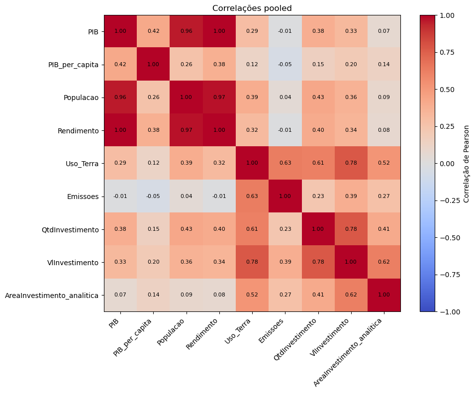
    


    
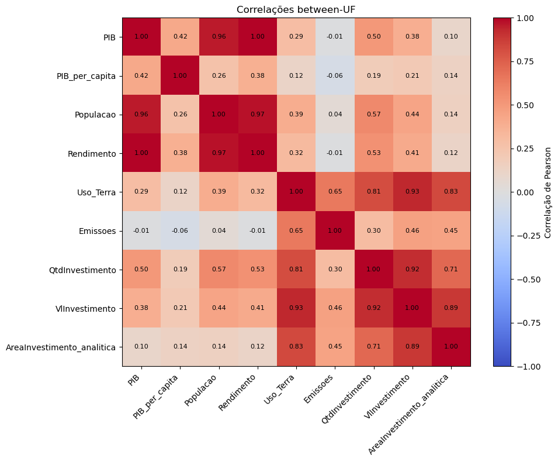
    


    
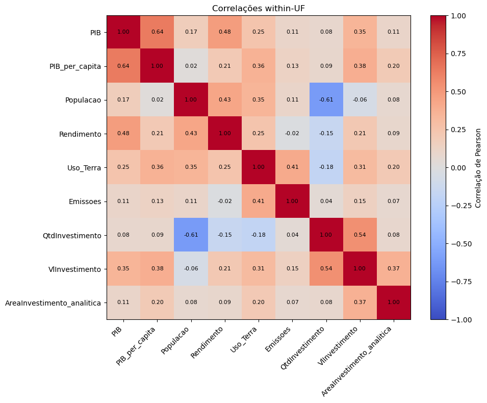
    


### 2.7.8. Robustez das associações — correlação de Spearman


```python
# Pooled
corr_pooled_s = (
    dados_assoc[vars_associacao]
    .corr(method="spearman")
)

# Between
corr_between_s = (
    dados_between[vars_associacao]
    .corr(method="spearman")
)

# Within
corr_within_s = (
    dados_within[vars_associacao]
    .corr(method="spearman")
)

comparacao_spearman = []

for x, y in pares_interesse:

    comparacao_spearman.append({
        "X": x,
        "Y": y,
        "rho_pooled": corr_pooled_s.loc[x, y],
        "rho_between": corr_between_s.loc[x, y],
        "rho_within": corr_within_s.loc[x, y]
    })

comparacao_spearman = pd.DataFrame(comparacao_spearman)

display(comparacao_spearman.round(3))
```


<div>
<style scoped>
    .dataframe tbody tr th:only-of-type {
        vertical-align: middle;
    }

    .dataframe tbody tr th {
        vertical-align: top;
    }

    .dataframe thead th {
        text-align: right;
    }
</style>
<table border="1" class="dataframe">
  <thead>
    <tr style="text-align: right;">
      <th></th>
      <th>X</th>
      <th>Y</th>
      <th>rho_pooled</th>
      <th>rho_between</th>
      <th>rho_within</th>
    </tr>
  </thead>
  <tbody>
    <tr>
      <th>0</th>
      <td>PIB</td>
      <td>Emissoes</td>
      <td>0.2020</td>
      <td>0.1870</td>
      <td>0.1880</td>
    </tr>
    <tr>
      <th>1</th>
      <td>PIB_per_capita</td>
      <td>Emissoes</td>
      <td>0.0890</td>
      <td>0.1010</td>
      <td>0.1750</td>
    </tr>
    <tr>
      <th>2</th>
      <td>Uso_Terra</td>
      <td>Emissoes</td>
      <td>0.7650</td>
      <td>0.7330</td>
      <td>0.3950</td>
    </tr>
    <tr>
      <th>3</th>
      <td>VlInvestimento</td>
      <td>PIB</td>
      <td>0.4140</td>
      <td>0.4290</td>
      <td>0.3890</td>
    </tr>
    <tr>
      <th>4</th>
      <td>VlInvestimento</td>
      <td>PIB_per_capita</td>
      <td>0.3520</td>
      <td>0.3470</td>
      <td>0.3960</td>
    </tr>
    <tr>
      <th>5</th>
      <td>VlInvestimento</td>
      <td>Uso_Terra</td>
      <td>0.8570</td>
      <td>0.8990</td>
      <td>0.3250</td>
    </tr>
    <tr>
      <th>6</th>
      <td>VlInvestimento</td>
      <td>Emissoes</td>
      <td>0.7250</td>
      <td>0.7300</td>
      <td>0.1430</td>
    </tr>
    <tr>
      <th>7</th>
      <td>QtdInvestimento</td>
      <td>PIB</td>
      <td>0.4260</td>
      <td>0.4140</td>
      <td>-0.0050</td>
    </tr>
    <tr>
      <th>8</th>
      <td>QtdInvestimento</td>
      <td>Uso_Terra</td>
      <td>0.8160</td>
      <td>0.8150</td>
      <td>-0.1800</td>
    </tr>
    <tr>
      <th>9</th>
      <td>QtdInvestimento</td>
      <td>Emissoes</td>
      <td>0.6930</td>
      <td>0.6890</td>
      <td>0.0440</td>
    </tr>
    <tr>
      <th>10</th>
      <td>QtdInvestimento</td>
      <td>VlInvestimento</td>
      <td>0.9570</td>
      <td>0.9460</td>
      <td>0.4770</td>
    </tr>
  </tbody>
</table>
</div>


```python
print(comparacao_spearman.round(3))
```

                      X               Y  rho_pooled  rho_between  rho_within
    0               PIB        Emissoes      0.2020       0.1870      0.1880
    1    PIB_per_capita        Emissoes      0.0890       0.1010      0.1750
    2         Uso_Terra        Emissoes      0.7650       0.7330      0.3950
    3    VlInvestimento             PIB      0.4140       0.4290      0.3890
    4    VlInvestimento  PIB_per_capita      0.3520       0.3470      0.3960
    5    VlInvestimento       Uso_Terra      0.8570       0.8990      0.3250
    6    VlInvestimento        Emissoes      0.7250       0.7300      0.1430
    7   QtdInvestimento             PIB      0.4260       0.4140     -0.0050
    8   QtdInvestimento       Uso_Terra      0.8160       0.8150     -0.1800
    9   QtdInvestimento        Emissoes      0.6930       0.6890      0.0440
    10  QtdInvestimento  VlInvestimento      0.9570       0.9460      0.4770
    

### Comparação Pearson × Spearman


```python
robustez_correlacoes = (
    comparacao_correlacoes
    .merge(
        comparacao_spearman,
        on=["X", "Y"],
        how="left"
    )
)

robustez_correlacoes["dif_within_P_S"] = (
    robustez_correlacoes["r_within"]
    - robustez_correlacoes["rho_within"]
)

robustez_correlacoes["mesmo_sinal_within"] = (
    np.sign(robustez_correlacoes["r_within"])
    ==
    np.sign(robustez_correlacoes["rho_within"])
)

display(
    robustez_correlacoes[
        [
            "X", "Y",
            "r_pooled", "rho_pooled",
            "r_between", "rho_between",
            "r_within", "rho_within",
            "dif_within_P_S",
            "mesmo_sinal_within"
        ]
    ].round(3)
)
```


<div>
<style scoped>
    .dataframe tbody tr th:only-of-type {
        vertical-align: middle;
    }

    .dataframe tbody tr th {
        vertical-align: top;
    }

    .dataframe thead th {
        text-align: right;
    }
</style>
<table border="1" class="dataframe">
  <thead>
    <tr style="text-align: right;">
      <th></th>
      <th>X</th>
      <th>Y</th>
      <th>r_pooled</th>
      <th>rho_pooled</th>
      <th>r_between</th>
      <th>rho_between</th>
      <th>r_within</th>
      <th>rho_within</th>
      <th>dif_within_P_S</th>
      <th>mesmo_sinal_within</th>
    </tr>
  </thead>
  <tbody>
    <tr>
      <th>0</th>
      <td>PIB</td>
      <td>Emissoes</td>
      <td>-0.0110</td>
      <td>0.2020</td>
      <td>-0.0130</td>
      <td>0.1870</td>
      <td>0.1080</td>
      <td>0.1880</td>
      <td>-0.0800</td>
      <td>True</td>
    </tr>
    <tr>
      <th>1</th>
      <td>PIB_per_capita</td>
      <td>Emissoes</td>
      <td>-0.0490</td>
      <td>0.0890</td>
      <td>-0.0570</td>
      <td>0.1010</td>
      <td>0.1260</td>
      <td>0.1750</td>
      <td>-0.0500</td>
      <td>True</td>
    </tr>
    <tr>
      <th>2</th>
      <td>Uso_Terra</td>
      <td>Emissoes</td>
      <td>0.6260</td>
      <td>0.7650</td>
      <td>0.6460</td>
      <td>0.7330</td>
      <td>0.4090</td>
      <td>0.3950</td>
      <td>0.0140</td>
      <td>True</td>
    </tr>
    <tr>
      <th>3</th>
      <td>VlInvestimento</td>
      <td>PIB</td>
      <td>0.3270</td>
      <td>0.4140</td>
      <td>0.3840</td>
      <td>0.4290</td>
      <td>0.3480</td>
      <td>0.3890</td>
      <td>-0.0410</td>
      <td>True</td>
    </tr>
    <tr>
      <th>4</th>
      <td>VlInvestimento</td>
      <td>PIB_per_capita</td>
      <td>0.2000</td>
      <td>0.3520</td>
      <td>0.2070</td>
      <td>0.3470</td>
      <td>0.3850</td>
      <td>0.3960</td>
      <td>-0.0110</td>
      <td>True</td>
    </tr>
    <tr>
      <th>5</th>
      <td>VlInvestimento</td>
      <td>Uso_Terra</td>
      <td>0.7780</td>
      <td>0.8570</td>
      <td>0.9340</td>
      <td>0.8990</td>
      <td>0.3110</td>
      <td>0.3250</td>
      <td>-0.0130</td>
      <td>True</td>
    </tr>
    <tr>
      <th>6</th>
      <td>VlInvestimento</td>
      <td>Emissoes</td>
      <td>0.3860</td>
      <td>0.7250</td>
      <td>0.4580</td>
      <td>0.7300</td>
      <td>0.1480</td>
      <td>0.1430</td>
      <td>0.0050</td>
      <td>True</td>
    </tr>
    <tr>
      <th>7</th>
      <td>QtdInvestimento</td>
      <td>PIB</td>
      <td>0.3850</td>
      <td>0.4260</td>
      <td>0.5020</td>
      <td>0.4140</td>
      <td>0.0850</td>
      <td>-0.0050</td>
      <td>0.0900</td>
      <td>False</td>
    </tr>
    <tr>
      <th>8</th>
      <td>QtdInvestimento</td>
      <td>Uso_Terra</td>
      <td>0.6140</td>
      <td>0.8160</td>
      <td>0.8150</td>
      <td>0.8150</td>
      <td>-0.1800</td>
      <td>-0.1800</td>
      <td>0.0000</td>
      <td>True</td>
    </tr>
    <tr>
      <th>9</th>
      <td>QtdInvestimento</td>
      <td>Emissoes</td>
      <td>0.2270</td>
      <td>0.6930</td>
      <td>0.3000</td>
      <td>0.6890</td>
      <td>0.0410</td>
      <td>0.0440</td>
      <td>-0.0030</td>
      <td>True</td>
    </tr>
    <tr>
      <th>10</th>
      <td>QtdInvestimento</td>
      <td>VlInvestimento</td>
      <td>0.7760</td>
      <td>0.9570</td>
      <td>0.9190</td>
      <td>0.9460</td>
      <td>0.5440</td>
      <td>0.4770</td>
      <td>0.0660</td>
      <td>True</td>
    </tr>
  </tbody>
</table>
</div>


```python
print(
    robustez_correlacoes[
        [
            "X", "Y",
            "r_pooled", "rho_pooled",
            "r_between", "rho_between",
            "r_within", "rho_within",
            "dif_within_P_S",
            "mesmo_sinal_within"
        ]
    ].round(3)
)
```

                      X               Y  r_pooled  rho_pooled  r_between  \
    0               PIB        Emissoes   -0.0110      0.2020    -0.0130   
    1    PIB_per_capita        Emissoes   -0.0490      0.0890    -0.0570   
    2         Uso_Terra        Emissoes    0.6260      0.7650     0.6460   
    3    VlInvestimento             PIB    0.3270      0.4140     0.3840   
    4    VlInvestimento  PIB_per_capita    0.2000      0.3520     0.2070   
    5    VlInvestimento       Uso_Terra    0.7780      0.8570     0.9340   
    6    VlInvestimento        Emissoes    0.3860      0.7250     0.4580   
    7   QtdInvestimento             PIB    0.3850      0.4260     0.5020   
    8   QtdInvestimento       Uso_Terra    0.6140      0.8160     0.8150   
    9   QtdInvestimento        Emissoes    0.2270      0.6930     0.3000   
    10  QtdInvestimento  VlInvestimento    0.7760      0.9570     0.9190   
    
        rho_between  r_within  rho_within  dif_within_P_S  mesmo_sinal_within  
    0        0.1870    0.1080      0.1880         -0.0800                True  
    1        0.1010    0.1260      0.1750         -0.0500                True  
    2        0.7330    0.4090      0.3950          0.0140                True  
    3        0.4290    0.3480      0.3890         -0.0410                True  
    4        0.3470    0.3850      0.3960         -0.0110                True  
    5        0.8990    0.3110      0.3250         -0.0130                True  
    6        0.7300    0.1480      0.1430          0.0050                True  
    7        0.4140    0.0850     -0.0050          0.0900               False  
    8        0.8150   -0.1800     -0.1800          0.0000                True  
    9        0.6890    0.0410      0.0440         -0.0030                True  
    10       0.9460    0.5440      0.4770          0.0660                True  
    

### Síntese da estrutura das associações

A análise das associações foi conduzida distinguindo três componentes:
correlações calculadas sobre o conjunto das observações (`pooled`), correlações
entre as médias das UFs (`between`) e correlações entre os desvios das observações
em relação às médias de suas respectivas UFs (`within`). Essa decomposição mostrou
que associações aparentemente elevadas no painel agregado podem representar
fenômenos substancialmente distintos nos níveis territorial e longitudinal.

A relação entre uso da terra e emissões permaneceu positiva nas três perspectivas.
As correlações de Pearson `pooled`, `between` e `within` foram, respectivamente,
0,626, 0,646 e 0,409. A análise de robustez por Spearman apresentou coeficientes
de 0,765, 0,733 e 0,395. A proximidade entre as estimativas `within` obtidas pelos
dois métodos indica que a associação longitudinal observada não depende
exclusivamente de valores extremos ou da escala original das variáveis.

A relação entre valor investido e uso da terra mostrou forte componente
territorial. A correlação de Pearson `between` atingiu 0,934, comparativamente
a 0,311 na dimensão `within`; por Spearman, os respectivos coeficientes foram
0,899 e 0,325. Assim, UFs caracterizadas por maior uso médio da terra também
apresentam maiores valores médios de investimento, embora a associação entre
mudanças dessas variáveis dentro das próprias UFs seja substancialmente menor.

Esse contraste é ainda mais pronunciado para a quantidade de operações e o uso
da terra. Enquanto a correlação `between` foi positiva e elevada (0,815 tanto
por Pearson quanto por Spearman), a correlação `within` foi negativa (-0,180 em
ambos os métodos). O resultado evidencia que uma associação transversal positiva
não deve ser automaticamente interpretada como relação longitudinal equivalente.

As relações entre crédito e emissões também diferem conforme o nível de análise.
Para o valor investido, a correlação de Pearson foi de 0,458 na dimensão
`between`, mas de apenas 0,148 na dimensão `within`. Para a quantidade de
operações, os respectivos coeficientes foram 0,300 e 0,041. As correlações
`within` de Spearman foram muito semelhantes, 0,143 e 0,044, respectivamente.
Dessa forma, a associação entre crédito e emissões observada no nível territorial
não se reproduz com intensidade comparável quando são consideradas as mudanças
ocorridas dentro das próprias UFs ao longo do tempo.

Em contraste, o valor investido apresentou associações longitudinais mais
consistentes com as variáveis econômicas e territoriais. Para PIB, a correlação
`within` foi de 0,348 por Pearson e 0,389 por Spearman; para PIB per capita,
0,385 e 0,396; e para uso da terra, 0,311 e 0,325. Esses resultados são
exploratórios e não permitem inferências causais, mas fornecem motivação empírica
para investigar, em modelos multivariados, se a distribuição do crédito está
mais estreitamente associada à escala econômico-produtiva e territorial do que
às emissões observadas.

A quantidade e o valor das operações também apresentam associação relevante entre
si. As correlações `between` foram de 0,919 por Pearson e 0,946 por Spearman,
enquanto as correlações `within` foram de 0,544 e 0,477. Portanto, quantidade e
volume financeiro estão relacionados tanto estruturalmente entre UFs quanto
longitudinalmente dentro delas, embora a associação seja mais intensa na dimensão
territorial.

A comparação entre Pearson e Spearman revelou ainda diferenças expressivas em
algumas associações agregadas. Para valor investido e emissões, por exemplo, a
correlação `pooled` passou de 0,386 por Pearson para 0,725 por Spearman, enquanto
as estimativas `within` permaneceram muito próximas (0,148 e 0,143). Padrão
semelhante ocorreu entre quantidade de operações e emissões. Isso indica que
assimetria, escala e relações monotônicas não necessariamente lineares exercem
maior influência sobre algumas associações agregadas do que sobre suas
contrapartes longitudinais.

Em conjunto, os resultados demonstram a necessidade de preservar a estrutura de
painel nas etapas subsequentes. Correlações agregadas isoladamente poderiam
confundir diferenças estruturais entre UFs com relações decorrentes de mudanças
ocorridas dentro das mesmas unidades territoriais ao longo do tempo. Os padrões
identificados constituem evidência descritiva e serão utilizados para orientar,
mas não determinar isoladamente, as especificações da etapa de modelagem.

## 2.8. Dinâmica temporal e mudanças estruturais

### 2.8.1. Painel anual


```python
vars_soma = [
    "PIB",
    "Populacao",
    "Uso_Terra",
    "Emissoes",
    "QtdInvestimento",
    "VlInvestimento"
]

vars_distribuicao = [
    "PIB_per_capita",
    "Rendimento"
]

# Totais anuais
anuais_soma = (
    df.groupby("Ano")[vars_soma]
      .sum()
)

# Medianas entre UFs
anuais_mediana = (
    df.groupby("Ano")[vars_distribuicao]
      .median()
      .add_suffix("_mediana")
)

# Médias entre UFs
anuais_media = (
    df.groupby("Ano")[vars_distribuicao]
      .mean()
      .add_suffix("_media")
)

painel_anual = (
    anuais_soma
    .join(anuais_mediana)
    .join(anuais_media)
)

display(painel_anual)
```


<div>
<style scoped>
    .dataframe tbody tr th:only-of-type {
        vertical-align: middle;
    }

    .dataframe tbody tr th {
        vertical-align: top;
    }

    .dataframe thead th {
        text-align: right;
    }
</style>
<table border="1" class="dataframe">
  <thead>
    <tr style="text-align: right;">
      <th></th>
      <th>PIB</th>
      <th>Populacao</th>
      <th>Uso_Terra</th>
      <th>Emissoes</th>
      <th>QtdInvestimento</th>
      <th>VlInvestimento</th>
      <th>PIB_per_capita_mediana</th>
      <th>Rendimento_mediana</th>
      <th>PIB_per_capita_media</th>
      <th>Rendimento_media</th>
    </tr>
    <tr>
      <th>Ano</th>
      <th></th>
      <th></th>
      <th></th>
      <th></th>
      <th></th>
      <th></th>
      <th></th>
      <th></th>
      <th></th>
      <th></th>
    </tr>
  </thead>
  <tbody>
    <tr>
      <th>2013</th>
      <td>10797468924</td>
      <td>198615</td>
      <td>235799142</td>
      <td>1422040565</td>
      <td>11,371.0000</td>
      <td>4,506,806,855.0000</td>
      <td>38,785.4500</td>
      <td>5,801.0000</td>
      <td>46,033.7489</td>
      <td>13,527.1481</td>
    </tr>
    <tr>
      <th>2014</th>
      <td>10851883062</td>
      <td>200189</td>
      <td>237139293</td>
      <td>1362264257</td>
      <td>12,796.0000</td>
      <td>5,966,876,249.0000</td>
      <td>38,942.3200</td>
      <td>5,946.0000</td>
      <td>46,276.0715</td>
      <td>14,009.7037</td>
    </tr>
    <tr>
      <th>2015</th>
      <td>10467101366</td>
      <td>201771</td>
      <td>238807947</td>
      <td>1485338024</td>
      <td>8,765.0000</td>
      <td>3,597,941,680.0000</td>
      <td>37,884.4900</td>
      <td>5,772.0000</td>
      <td>44,457.2081</td>
      <td>13,665.2963</td>
    </tr>
    <tr>
      <th>2016</th>
      <td>10124207816</td>
      <td>203226</td>
      <td>240281974</td>
      <td>1482015847</td>
      <td>2,706.0000</td>
      <td>1,346,730,531.0000</td>
      <td>36,745.9700</td>
      <td>5,852.0000</td>
      <td>42,921.1056</td>
      <td>13,584.0370</td>
    </tr>
    <tr>
      <th>2017</th>
      <td>10258137830</td>
      <td>204556</td>
      <td>241586419</td>
      <td>1345409743</td>
      <td>3,969.0000</td>
      <td>2,055,861,477.0000</td>
      <td>37,938.4100</td>
      <td>6,040.0000</td>
      <td>43,361.4637</td>
      <td>13,714.4444</td>
    </tr>
    <tr>
      <th>2018</th>
      <td>10441108826</td>
      <td>205861</td>
      <td>242827936</td>
      <td>1344944817</td>
      <td>5,127.0000</td>
      <td>2,891,672,746.0000</td>
      <td>38,550.7000</td>
      <td>6,564.0000</td>
      <td>43,946.5970</td>
      <td>14,317.4074</td>
    </tr>
    <tr>
      <th>2019</th>
      <td>10568571564</td>
      <td>207217</td>
      <td>245019690</td>
      <td>1728401558</td>
      <td>3,700.0000</td>
      <td>2,776,697,785.0000</td>
      <td>37,646.3600</td>
      <td>6,476.0000</td>
      <td>44,019.2900</td>
      <td>14,606.4074</td>
    </tr>
    <tr>
      <th>2020</th>
      <td>10222264970</td>
      <td>208470</td>
      <td>247275028</td>
      <td>1703830502</td>
      <td>4,592.0000</td>
      <td>2,990,251,478.0000</td>
      <td>38,525.9300</td>
      <td>6,459.0000</td>
      <td>43,156.5611</td>
      <td>14,050.4444</td>
    </tr>
    <tr>
      <th>2021</th>
      <td>10709110994</td>
      <td>209396</td>
      <td>250276777</td>
      <td>1849350662</td>
      <td>3,879.0000</td>
      <td>3,302,555,789.0000</td>
      <td>39,074.5200</td>
      <td>5,974.0000</td>
      <td>44,783.3926</td>
      <td>13,116.3704</td>
    </tr>
    <tr>
      <th>2022</th>
      <td>11032172112</td>
      <td>210147</td>
      <td>253696369</td>
      <td>1935588995</td>
      <td>3,074.0000</td>
      <td>4,769,024,719.0000</td>
      <td>39,330.4700</td>
      <td>6,812.0000</td>
      <td>45,546.5844</td>
      <td>14,073.2593</td>
    </tr>
    <tr>
      <th>2023</th>
      <td>11389798256</td>
      <td>210975</td>
      <td>257481150</td>
      <td>1774952663</td>
      <td>3,711.0000</td>
      <td>5,672,332,977.0000</td>
      <td>43,009.5600</td>
      <td>7,995.0000</td>
      <td>47,336.2915</td>
      <td>15,767.5556</td>
    </tr>
    <tr>
      <th>2024</th>
      <td>11353027557</td>
      <td>211852</td>
      <td>259880781</td>
      <td>1328032742</td>
      <td>3,743.0000</td>
      <td>5,354,596,159.0000</td>
      <td>40,774.9400</td>
      <td>8,854.0000</td>
      <td>46,870.4967</td>
      <td>16,614.1481</td>
    </tr>
  </tbody>
</table>
</div>


```python
print(painel_anual)
```

                  PIB  Populacao  Uso_Terra    Emissoes  QtdInvestimento  \
    Ano                                                                    
    2013  10797468924     198615  235799142  1422040565      11,371.0000   
    2014  10851883062     200189  237139293  1362264257      12,796.0000   
    2015  10467101366     201771  238807947  1485338024       8,765.0000   
    2016  10124207816     203226  240281974  1482015847       2,706.0000   
    2017  10258137830     204556  241586419  1345409743       3,969.0000   
    2018  10441108826     205861  242827936  1344944817       5,127.0000   
    2019  10568571564     207217  245019690  1728401558       3,700.0000   
    2020  10222264970     208470  247275028  1703830502       4,592.0000   
    2021  10709110994     209396  250276777  1849350662       3,879.0000   
    2022  11032172112     210147  253696369  1935588995       3,074.0000   
    2023  11389798256     210975  257481150  1774952663       3,711.0000   
    2024  11353027557     211852  259880781  1328032742       3,743.0000   
    
             VlInvestimento  PIB_per_capita_mediana  Rendimento_mediana  \
    Ano                                                                   
    2013 4,506,806,855.0000             38,785.4500          5,801.0000   
    2014 5,966,876,249.0000             38,942.3200          5,946.0000   
    2015 3,597,941,680.0000             37,884.4900          5,772.0000   
    2016 1,346,730,531.0000             36,745.9700          5,852.0000   
    2017 2,055,861,477.0000             37,938.4100          6,040.0000   
    2018 2,891,672,746.0000             38,550.7000          6,564.0000   
    2019 2,776,697,785.0000             37,646.3600          6,476.0000   
    2020 2,990,251,478.0000             38,525.9300          6,459.0000   
    2021 3,302,555,789.0000             39,074.5200          5,974.0000   
    2022 4,769,024,719.0000             39,330.4700          6,812.0000   
    2023 5,672,332,977.0000             43,009.5600          7,995.0000   
    2024 5,354,596,159.0000             40,774.9400          8,854.0000   
    
          PIB_per_capita_media  Rendimento_media  
    Ano                                           
    2013           46,033.7489       13,527.1481  
    2014           46,276.0715       14,009.7037  
    2015           44,457.2081       13,665.2963  
    2016           42,921.1056       13,584.0370  
    2017           43,361.4637       13,714.4444  
    2018           43,946.5970       14,317.4074  
    2019           44,019.2900       14,606.4074  
    2020           43,156.5611       14,050.4444  
    2021           44,783.3926       13,116.3704  
    2022           45,546.5844       14,073.2593  
    2023           47,336.2915       15,767.5556  
    2024           46,870.4967       16,614.1481  
    

### 2.8.2. Dinâmica anual do crédito


```python
credito_anual = (
    df.groupby("Ano")
      .agg(
          UFs_com_credito=(
              "SemOperacaoCredito",
              lambda x: (~x).sum()
          ),
          UFs_sem_credito=(
              "SemOperacaoCredito",
              "sum"
          ),
          Qtd_total=(
              "QtdInvestimento",
              "sum"
          ),
          Valor_total=(
              "VlInvestimento",
              "sum"
          ),
          Valor_mediano_UF=(
              "VlInvestimento",
              "median"
          )
      )
)

credito_anual["Perc_UFs_com_credito"] = (
    100 * credito_anual["UFs_com_credito"] / 27
)

credito_anual["Perc_UFs_sem_credito"] = (
    100 * credito_anual["UFs_sem_credito"] / 27
)

display(credito_anual.round(2))
```


<div>
<style scoped>
    .dataframe tbody tr th:only-of-type {
        vertical-align: middle;
    }

    .dataframe tbody tr th {
        vertical-align: top;
    }

    .dataframe thead th {
        text-align: right;
    }
</style>
<table border="1" class="dataframe">
  <thead>
    <tr style="text-align: right;">
      <th></th>
      <th>UFs_com_credito</th>
      <th>UFs_sem_credito</th>
      <th>Qtd_total</th>
      <th>Valor_total</th>
      <th>Valor_mediano_UF</th>
      <th>Perc_UFs_com_credito</th>
      <th>Perc_UFs_sem_credito</th>
    </tr>
    <tr>
      <th>Ano</th>
      <th></th>
      <th></th>
      <th></th>
      <th></th>
      <th></th>
      <th></th>
      <th></th>
    </tr>
  </thead>
  <tbody>
    <tr>
      <th>2013</th>
      <td>23</td>
      <td>4</td>
      <td>11,371.0000</td>
      <td>4,506,806,855.0000</td>
      <td>47,484,407.0000</td>
      <td>85.1900</td>
      <td>14.8100</td>
    </tr>
    <tr>
      <th>2014</th>
      <td>25</td>
      <td>2</td>
      <td>12,796.0000</td>
      <td>5,966,876,249.0000</td>
      <td>51,129,739.0000</td>
      <td>92.5900</td>
      <td>7.4100</td>
    </tr>
    <tr>
      <th>2015</th>
      <td>23</td>
      <td>4</td>
      <td>8,765.0000</td>
      <td>3,597,941,680.0000</td>
      <td>35,687,011.0000</td>
      <td>85.1900</td>
      <td>14.8100</td>
    </tr>
    <tr>
      <th>2016</th>
      <td>19</td>
      <td>8</td>
      <td>2,706.0000</td>
      <td>1,346,730,531.0000</td>
      <td>17,069,894.0000</td>
      <td>70.3700</td>
      <td>29.6300</td>
    </tr>
    <tr>
      <th>2017</th>
      <td>23</td>
      <td>4</td>
      <td>3,969.0000</td>
      <td>2,055,861,477.0000</td>
      <td>31,242,881.0000</td>
      <td>85.1900</td>
      <td>14.8100</td>
    </tr>
    <tr>
      <th>2018</th>
      <td>23</td>
      <td>4</td>
      <td>5,127.0000</td>
      <td>2,891,672,746.0000</td>
      <td>72,292,917.0000</td>
      <td>85.1900</td>
      <td>14.8100</td>
    </tr>
    <tr>
      <th>2019</th>
      <td>22</td>
      <td>5</td>
      <td>3,700.0000</td>
      <td>2,776,697,785.0000</td>
      <td>25,062,080.0000</td>
      <td>81.4800</td>
      <td>18.5200</td>
    </tr>
    <tr>
      <th>2020</th>
      <td>19</td>
      <td>8</td>
      <td>4,592.0000</td>
      <td>2,990,251,478.0000</td>
      <td>25,128,531.0000</td>
      <td>70.3700</td>
      <td>29.6300</td>
    </tr>
    <tr>
      <th>2021</th>
      <td>20</td>
      <td>7</td>
      <td>3,879.0000</td>
      <td>3,302,555,789.0000</td>
      <td>27,852,245.0000</td>
      <td>74.0700</td>
      <td>25.9300</td>
    </tr>
    <tr>
      <th>2022</th>
      <td>21</td>
      <td>6</td>
      <td>3,074.0000</td>
      <td>4,769,024,719.0000</td>
      <td>46,027,106.0000</td>
      <td>77.7800</td>
      <td>22.2200</td>
    </tr>
    <tr>
      <th>2023</th>
      <td>23</td>
      <td>4</td>
      <td>3,711.0000</td>
      <td>5,672,332,977.0000</td>
      <td>59,278,371.0000</td>
      <td>85.1900</td>
      <td>14.8100</td>
    </tr>
    <tr>
      <th>2024</th>
      <td>23</td>
      <td>4</td>
      <td>3,743.0000</td>
      <td>5,354,596,159.0000</td>
      <td>44,986,252.0000</td>
      <td>85.1900</td>
      <td>14.8100</td>
    </tr>
  </tbody>
</table>
</div>


```python
print(credito_anual.round(2))
```

          UFs_com_credito  UFs_sem_credito   Qtd_total        Valor_total  \
    Ano                                                                     
    2013               23                4 11,371.0000 4,506,806,855.0000   
    2014               25                2 12,796.0000 5,966,876,249.0000   
    2015               23                4  8,765.0000 3,597,941,680.0000   
    2016               19                8  2,706.0000 1,346,730,531.0000   
    2017               23                4  3,969.0000 2,055,861,477.0000   
    2018               23                4  5,127.0000 2,891,672,746.0000   
    2019               22                5  3,700.0000 2,776,697,785.0000   
    2020               19                8  4,592.0000 2,990,251,478.0000   
    2021               20                7  3,879.0000 3,302,555,789.0000   
    2022               21                6  3,074.0000 4,769,024,719.0000   
    2023               23                4  3,711.0000 5,672,332,977.0000   
    2024               23                4  3,743.0000 5,354,596,159.0000   
    
          Valor_mediano_UF  Perc_UFs_com_credito  Perc_UFs_sem_credito  
    Ano                                                                 
    2013   47,484,407.0000               85.1900               14.8100  
    2014   51,129,739.0000               92.5900                7.4100  
    2015   35,687,011.0000               85.1900               14.8100  
    2016   17,069,894.0000               70.3700               29.6300  
    2017   31,242,881.0000               85.1900               14.8100  
    2018   72,292,917.0000               85.1900               14.8100  
    2019   25,062,080.0000               81.4800               18.5200  
    2020   25,128,531.0000               70.3700               29.6300  
    2021   27,852,245.0000               74.0700               25.9300  
    2022   46,027,106.0000               77.7800               22.2200  
    2023   59,278,371.0000               85.1900               14.8100  
    2024   44,986,252.0000               85.1900               14.8100  
    

### Intensidade somente entre UFs com operação


```python
credito_positivo = df.loc[
    ~df["SemOperacaoCredito"]
].copy()

credito_condicional_anual = (
    credito_positivo
    .groupby("Ano")
    .agg(
        UFs_com_credito=("UF", "nunique"),
        Qtd_media=("QtdInvestimento", "mean"),
        Qtd_mediana=("QtdInvestimento", "median"),
        Valor_medio=("VlInvestimento", "mean"),
        Valor_mediano=("VlInvestimento", "median")
    )
)

display(credito_condicional_anual.round(2))
```


<div>
<style scoped>
    .dataframe tbody tr th:only-of-type {
        vertical-align: middle;
    }

    .dataframe tbody tr th {
        vertical-align: top;
    }

    .dataframe thead th {
        text-align: right;
    }
</style>
<table border="1" class="dataframe">
  <thead>
    <tr style="text-align: right;">
      <th></th>
      <th>UFs_com_credito</th>
      <th>Qtd_media</th>
      <th>Qtd_mediana</th>
      <th>Valor_medio</th>
      <th>Valor_mediano</th>
    </tr>
    <tr>
      <th>Ano</th>
      <th></th>
      <th></th>
      <th></th>
      <th></th>
      <th></th>
    </tr>
  </thead>
  <tbody>
    <tr>
      <th>2013</th>
      <td>23</td>
      <td>494.3900</td>
      <td>232.0000</td>
      <td>195,948,124.1300</td>
      <td>63,383,224.0000</td>
    </tr>
    <tr>
      <th>2014</th>
      <td>25</td>
      <td>511.8400</td>
      <td>231.0000</td>
      <td>238,675,049.9600</td>
      <td>52,766,970.0000</td>
    </tr>
    <tr>
      <th>2015</th>
      <td>23</td>
      <td>381.0900</td>
      <td>148.0000</td>
      <td>156,432,246.9600</td>
      <td>55,421,077.0000</td>
    </tr>
    <tr>
      <th>2016</th>
      <td>19</td>
      <td>142.4200</td>
      <td>123.0000</td>
      <td>70,880,554.2600</td>
      <td>62,409,369.0000</td>
    </tr>
    <tr>
      <th>2017</th>
      <td>23</td>
      <td>172.5700</td>
      <td>96.0000</td>
      <td>89,385,281.6100</td>
      <td>89,120,503.0000</td>
    </tr>
    <tr>
      <th>2018</th>
      <td>23</td>
      <td>222.9100</td>
      <td>108.0000</td>
      <td>125,724,902.0000</td>
      <td>73,946,736.0000</td>
    </tr>
    <tr>
      <th>2019</th>
      <td>22</td>
      <td>168.1800</td>
      <td>130.0000</td>
      <td>126,213,535.6800</td>
      <td>85,699,672.0000</td>
    </tr>
    <tr>
      <th>2020</th>
      <td>19</td>
      <td>241.6800</td>
      <td>261.0000</td>
      <td>157,381,656.7400</td>
      <td>152,266,912.0000</td>
    </tr>
    <tr>
      <th>2021</th>
      <td>20</td>
      <td>193.9500</td>
      <td>186.5000</td>
      <td>165,127,789.4500</td>
      <td>138,462,059.5000</td>
    </tr>
    <tr>
      <th>2022</th>
      <td>21</td>
      <td>146.3800</td>
      <td>131.0000</td>
      <td>227,096,415.1900</td>
      <td>129,547,222.0000</td>
    </tr>
    <tr>
      <th>2023</th>
      <td>23</td>
      <td>161.3500</td>
      <td>49.0000</td>
      <td>246,623,172.9100</td>
      <td>103,393,370.0000</td>
    </tr>
    <tr>
      <th>2024</th>
      <td>23</td>
      <td>162.7400</td>
      <td>76.0000</td>
      <td>232,808,528.6500</td>
      <td>85,281,443.0000</td>
    </tr>
  </tbody>
</table>
</div>


```python
print(credito_condicional_anual.round(2))
```

          UFs_com_credito  Qtd_media  Qtd_mediana      Valor_medio  \
    Ano                                                              
    2013               23   494.3900     232.0000 195,948,124.1300   
    2014               25   511.8400     231.0000 238,675,049.9600   
    2015               23   381.0900     148.0000 156,432,246.9600   
    2016               19   142.4200     123.0000  70,880,554.2600   
    2017               23   172.5700      96.0000  89,385,281.6100   
    2018               23   222.9100     108.0000 125,724,902.0000   
    2019               22   168.1800     130.0000 126,213,535.6800   
    2020               19   241.6800     261.0000 157,381,656.7400   
    2021               20   193.9500     186.5000 165,127,789.4500   
    2022               21   146.3800     131.0000 227,096,415.1900   
    2023               23   161.3500      49.0000 246,623,172.9100   
    2024               23   162.7400      76.0000 232,808,528.6500   
    
            Valor_mediano  
    Ano                    
    2013  63,383,224.0000  
    2014  52,766,970.0000  
    2015  55,421,077.0000  
    2016  62,409,369.0000  
    2017  89,120,503.0000  
    2018  73,946,736.0000  
    2019  85,699,672.0000  
    2020 152,266,912.0000  
    2021 138,462,059.5000  
    2022 129,547,222.0000  
    2023 103,393,370.0000  
    2024  85,281,443.0000  
    

### 2.8.3. Área financiada e cobertura informacional


```python
area_anual = (
    df.groupby("Ano")
      .agg(
          Area_total_informada=(
              "AreaInvestimento_analitica",
              lambda x: x.sum(min_count=1)
          ),
          UFs_area_nao_informada=(
              "AreaNaoInformada",
              "sum"
          ),
          UFs_com_area_informada=(
              "AreaInvestimento_analitica",
              lambda x: x.notna().sum()
          )
      )
)

area_anual["Perc_registros_area_informada"] = (
    100 *
    area_anual["UFs_com_area_informada"] /
    27
)

display(area_anual.round(2))
```


<div>
<style scoped>
    .dataframe tbody tr th:only-of-type {
        vertical-align: middle;
    }

    .dataframe tbody tr th {
        vertical-align: top;
    }

    .dataframe thead th {
        text-align: right;
    }
</style>
<table border="1" class="dataframe">
  <thead>
    <tr style="text-align: right;">
      <th></th>
      <th>Area_total_informada</th>
      <th>UFs_area_nao_informada</th>
      <th>UFs_com_area_informada</th>
      <th>Perc_registros_area_informada</th>
    </tr>
    <tr>
      <th>Ano</th>
      <th></th>
      <th></th>
      <th></th>
      <th></th>
    </tr>
  </thead>
  <tbody>
    <tr>
      <th>2013</th>
      <td>0.0000</td>
      <td>23</td>
      <td>4</td>
      <td>14.8100</td>
    </tr>
    <tr>
      <th>2014</th>
      <td>0.0000</td>
      <td>25</td>
      <td>2</td>
      <td>7.4100</td>
    </tr>
    <tr>
      <th>2015</th>
      <td>284,980.0000</td>
      <td>4</td>
      <td>23</td>
      <td>85.1900</td>
    </tr>
    <tr>
      <th>2016</th>
      <td>1,225,560.0000</td>
      <td>0</td>
      <td>27</td>
      <td>100.0000</td>
    </tr>
    <tr>
      <th>2017</th>
      <td>521,335.0000</td>
      <td>0</td>
      <td>27</td>
      <td>100.0000</td>
    </tr>
    <tr>
      <th>2018</th>
      <td>712,971.0000</td>
      <td>1</td>
      <td>26</td>
      <td>96.3000</td>
    </tr>
    <tr>
      <th>2019</th>
      <td>611,319.0000</td>
      <td>0</td>
      <td>27</td>
      <td>100.0000</td>
    </tr>
    <tr>
      <th>2020</th>
      <td>884,048.0000</td>
      <td>0</td>
      <td>27</td>
      <td>100.0000</td>
    </tr>
    <tr>
      <th>2021</th>
      <td>774,370.0000</td>
      <td>0</td>
      <td>27</td>
      <td>100.0000</td>
    </tr>
    <tr>
      <th>2022</th>
      <td>885,475.0000</td>
      <td>0</td>
      <td>27</td>
      <td>100.0000</td>
    </tr>
    <tr>
      <th>2023</th>
      <td>1,314,645.0000</td>
      <td>0</td>
      <td>27</td>
      <td>100.0000</td>
    </tr>
    <tr>
      <th>2024</th>
      <td>1,230,448.0000</td>
      <td>0</td>
      <td>27</td>
      <td>100.0000</td>
    </tr>
  </tbody>
</table>
</div>


```python
print(area_anual.round(2))
```

          Area_total_informada  UFs_area_nao_informada  UFs_com_area_informada  \
    Ano                                                                          
    2013                0.0000                      23                       4   
    2014                0.0000                      25                       2   
    2015          284,980.0000                       4                      23   
    2016        1,225,560.0000                       0                      27   
    2017          521,335.0000                       0                      27   
    2018          712,971.0000                       1                      26   
    2019          611,319.0000                       0                      27   
    2020          884,048.0000                       0                      27   
    2021          774,370.0000                       0                      27   
    2022          885,475.0000                       0                      27   
    2023        1,314,645.0000                       0                      27   
    2024        1,230,448.0000                       0                      27   
    
          Perc_registros_area_informada  
    Ano                                  
    2013                        14.8100  
    2014                         7.4100  
    2015                        85.1900  
    2016                       100.0000  
    2017                       100.0000  
    2018                        96.3000  
    2019                       100.0000  
    2020                       100.0000  
    2021                       100.0000  
    2022                       100.0000  
    2023                       100.0000  
    2024                       100.0000  
    

### 2.8.4. Taxas de crescimento anual


```python
# Valores monetários expressos a preços constantes de 2024
crescimento_anual = pd.DataFrame(
    index=painel_anual.index
)

crescimento_anual["PIB_real_pct"] = (
    painel_anual["PIB"].pct_change() * 100
)

crescimento_anual["VlInvestimento_real_pct"] = (
    painel_anual["VlInvestimento"].pct_change() * 100
)

crescimento_anual["QtdInvestimento_pct"] = (
    painel_anual["QtdInvestimento"].pct_change() * 100
)

crescimento_anual["Emissoes_pct"] = (
    painel_anual["Emissoes"].pct_change() * 100
)

crescimento_anual["Uso_Terra_pct"] = (
    painel_anual["Uso_Terra"].pct_change() * 100
)

display(crescimento_anual.round(2))
```


<div>
<style scoped>
    .dataframe tbody tr th:only-of-type {
        vertical-align: middle;
    }

    .dataframe tbody tr th {
        vertical-align: top;
    }

    .dataframe thead th {
        text-align: right;
    }
</style>
<table border="1" class="dataframe">
  <thead>
    <tr style="text-align: right;">
      <th></th>
      <th>PIB_real_pct</th>
      <th>VlInvestimento_real_pct</th>
      <th>QtdInvestimento_pct</th>
      <th>Emissoes_pct</th>
      <th>Uso_Terra_pct</th>
    </tr>
    <tr>
      <th>Ano</th>
      <th></th>
      <th></th>
      <th></th>
      <th></th>
      <th></th>
    </tr>
  </thead>
  <tbody>
    <tr>
      <th>2013</th>
      <td>NaN</td>
      <td>NaN</td>
      <td>NaN</td>
      <td>NaN</td>
      <td>NaN</td>
    </tr>
    <tr>
      <th>2014</th>
      <td>0.5000</td>
      <td>32.4000</td>
      <td>12.5300</td>
      <td>-4.2000</td>
      <td>0.5700</td>
    </tr>
    <tr>
      <th>2015</th>
      <td>-3.5500</td>
      <td>-39.7000</td>
      <td>-31.5000</td>
      <td>9.0300</td>
      <td>0.7000</td>
    </tr>
    <tr>
      <th>2016</th>
      <td>-3.2800</td>
      <td>-62.5700</td>
      <td>-69.1300</td>
      <td>-0.2200</td>
      <td>0.6200</td>
    </tr>
    <tr>
      <th>2017</th>
      <td>1.3200</td>
      <td>52.6600</td>
      <td>46.6700</td>
      <td>-9.2200</td>
      <td>0.5400</td>
    </tr>
    <tr>
      <th>2018</th>
      <td>1.7800</td>
      <td>40.6600</td>
      <td>29.1800</td>
      <td>-0.0300</td>
      <td>0.5100</td>
    </tr>
    <tr>
      <th>2019</th>
      <td>1.2200</td>
      <td>-3.9800</td>
      <td>-27.8300</td>
      <td>28.5100</td>
      <td>0.9000</td>
    </tr>
    <tr>
      <th>2020</th>
      <td>-3.2800</td>
      <td>7.6900</td>
      <td>24.1100</td>
      <td>-1.4200</td>
      <td>0.9200</td>
    </tr>
    <tr>
      <th>2021</th>
      <td>4.7600</td>
      <td>10.4400</td>
      <td>-15.5300</td>
      <td>8.5400</td>
      <td>1.2100</td>
    </tr>
    <tr>
      <th>2022</th>
      <td>3.0200</td>
      <td>44.4000</td>
      <td>-20.7500</td>
      <td>4.6600</td>
      <td>1.3700</td>
    </tr>
    <tr>
      <th>2023</th>
      <td>3.2400</td>
      <td>18.9400</td>
      <td>20.7200</td>
      <td>-8.3000</td>
      <td>1.4900</td>
    </tr>
    <tr>
      <th>2024</th>
      <td>-0.3200</td>
      <td>-5.6000</td>
      <td>0.8600</td>
      <td>-25.1800</td>
      <td>0.9300</td>
    </tr>
  </tbody>
</table>
</div>


```python
print(crescimento_anual.round(2))
```

          PIB_real_pct  VlInvestimento_real_pct  QtdInvestimento_pct  \
    Ano                                                                
    2013           NaN                      NaN                  NaN   
    2014        0.5000                  32.4000              12.5300   
    2015       -3.5500                 -39.7000             -31.5000   
    2016       -3.2800                 -62.5700             -69.1300   
    2017        1.3200                  52.6600              46.6700   
    2018        1.7800                  40.6600              29.1800   
    2019        1.2200                  -3.9800             -27.8300   
    2020       -3.2800                   7.6900              24.1100   
    2021        4.7600                  10.4400             -15.5300   
    2022        3.0200                  44.4000             -20.7500   
    2023        3.2400                  18.9400              20.7200   
    2024       -0.3200                  -5.6000               0.8600   
    
          Emissoes_pct  Uso_Terra_pct  
    Ano                                
    2013           NaN            NaN  
    2014       -4.2000         0.5700  
    2015        9.0300         0.7000  
    2016       -0.2200         0.6200  
    2017       -9.2200         0.5400  
    2018       -0.0300         0.5100  
    2019       28.5100         0.9000  
    2020       -1.4200         0.9200  
    2021        8.5400         1.2100  
    2022        4.6600         1.3700  
    2023       -8.3000         1.4900  
    2024      -25.1800         0.9300  
    

### 2.8.5. Índices temporais — 2013 = 100


```python
vars_indice = [
    "PIB",
    "Uso_Terra",
    "Emissoes",
    "QtdInvestimento",
    "VlInvestimento"
]

indices_2013 = (
    painel_anual[vars_indice]
    .div(
        painel_anual.loc[2013, vars_indice]
    )
    .mul(100)
)

display(indices_2013.round(2))
```


<div>
<style scoped>
    .dataframe tbody tr th:only-of-type {
        vertical-align: middle;
    }

    .dataframe tbody tr th {
        vertical-align: top;
    }

    .dataframe thead th {
        text-align: right;
    }
</style>
<table border="1" class="dataframe">
  <thead>
    <tr style="text-align: right;">
      <th></th>
      <th>PIB</th>
      <th>Uso_Terra</th>
      <th>Emissoes</th>
      <th>QtdInvestimento</th>
      <th>VlInvestimento</th>
    </tr>
    <tr>
      <th>Ano</th>
      <th></th>
      <th></th>
      <th></th>
      <th></th>
      <th></th>
    </tr>
  </thead>
  <tbody>
    <tr>
      <th>2013</th>
      <td>100.0000</td>
      <td>100.0000</td>
      <td>100.0000</td>
      <td>100.0000</td>
      <td>100.0000</td>
    </tr>
    <tr>
      <th>2014</th>
      <td>100.5000</td>
      <td>100.5700</td>
      <td>95.8000</td>
      <td>112.5300</td>
      <td>132.4000</td>
    </tr>
    <tr>
      <th>2015</th>
      <td>96.9400</td>
      <td>101.2800</td>
      <td>104.4500</td>
      <td>77.0800</td>
      <td>79.8300</td>
    </tr>
    <tr>
      <th>2016</th>
      <td>93.7600</td>
      <td>101.9000</td>
      <td>104.2200</td>
      <td>23.8000</td>
      <td>29.8800</td>
    </tr>
    <tr>
      <th>2017</th>
      <td>95.0100</td>
      <td>102.4500</td>
      <td>94.6100</td>
      <td>34.9000</td>
      <td>45.6200</td>
    </tr>
    <tr>
      <th>2018</th>
      <td>96.7000</td>
      <td>102.9800</td>
      <td>94.5800</td>
      <td>45.0900</td>
      <td>64.1600</td>
    </tr>
    <tr>
      <th>2019</th>
      <td>97.8800</td>
      <td>103.9100</td>
      <td>121.5400</td>
      <td>32.5400</td>
      <td>61.6100</td>
    </tr>
    <tr>
      <th>2020</th>
      <td>94.6700</td>
      <td>104.8700</td>
      <td>119.8200</td>
      <td>40.3800</td>
      <td>66.3500</td>
    </tr>
    <tr>
      <th>2021</th>
      <td>99.1800</td>
      <td>106.1400</td>
      <td>130.0500</td>
      <td>34.1100</td>
      <td>73.2800</td>
    </tr>
    <tr>
      <th>2022</th>
      <td>102.1700</td>
      <td>107.5900</td>
      <td>136.1100</td>
      <td>27.0300</td>
      <td>105.8200</td>
    </tr>
    <tr>
      <th>2023</th>
      <td>105.4900</td>
      <td>109.2000</td>
      <td>124.8200</td>
      <td>32.6400</td>
      <td>125.8600</td>
    </tr>
    <tr>
      <th>2024</th>
      <td>105.1500</td>
      <td>110.2100</td>
      <td>93.3900</td>
      <td>32.9200</td>
      <td>118.8100</td>
    </tr>
  </tbody>
</table>
</div>


```python
print(indices_2013.round(2))
```

              PIB  Uso_Terra  Emissoes  QtdInvestimento  VlInvestimento
    Ano                                                                
    2013 100.0000   100.0000  100.0000         100.0000        100.0000
    2014 100.5000   100.5700   95.8000         112.5300        132.4000
    2015  96.9400   101.2800  104.4500          77.0800         79.8300
    2016  93.7600   101.9000  104.2200          23.8000         29.8800
    2017  95.0100   102.4500   94.6100          34.9000         45.6200
    2018  96.7000   102.9800   94.5800          45.0900         64.1600
    2019  97.8800   103.9100  121.5400          32.5400         61.6100
    2020  94.6700   104.8700  119.8200          40.3800         66.3500
    2021  99.1800   106.1400  130.0500          34.1100         73.2800
    2022 102.1700   107.5900  136.1100          27.0300        105.8200
    2023 105.4900   109.2000  124.8200          32.6400        125.8600
    2024 105.1500   110.2100   93.3900          32.9200        118.8100
    

### 2.8.6. Visualizações

### Trajetória do crédito


```python
fig, ax = plt.subplots(figsize=(10, 5))

ax.plot(
    indices_2013.index,
    indices_2013["VlInvestimento"],
    marker="o",
    label="Valor investido"
)

ax.plot(
    indices_2013.index,
    indices_2013["QtdInvestimento"],
    marker="o",
    label="Quantidade de operações"
)

ax.axhline(
    100,
    linewidth=1,
    linestyle="--"
)

ax.set_title(
    "Evolução do crédito — índice 2013 = 100"
)

ax.set_xlabel("Ano")
ax.set_ylabel("Índice (2013 = 100)")
ax.legend()

plt.tight_layout()
plt.show()
```


    
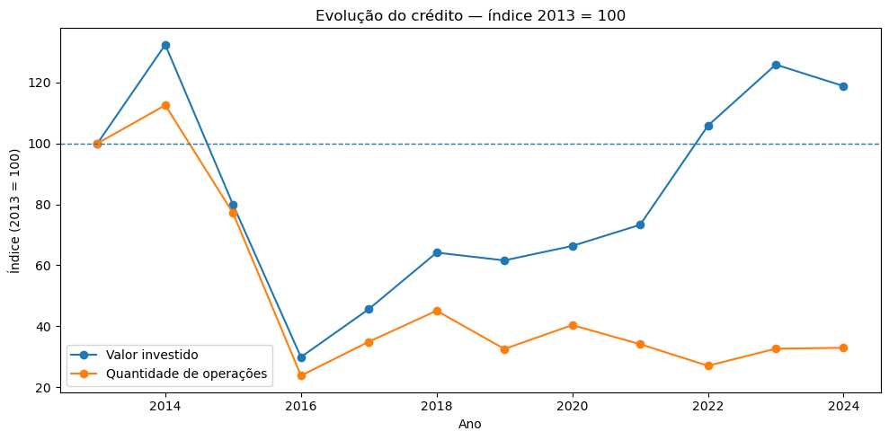
    


### Trajetória econômico-ambiental


```python
fig, ax = plt.subplots(figsize=(10, 5))

for var in [
    "PIB",
    "Uso_Terra",
    "Emissoes",
]:
    ax.plot(
        indices_2013.index,
        indices_2013[var],
        marker="o",
        label=var
    )

ax.axhline(
    100,
    linewidth=1,
    linestyle="--"
)

ax.set_title(
    "Trajetórias econômico-ambientais — índice 2013 = 100"
)

ax.set_xlabel("Ano")
ax.set_ylabel("Índice (2013 = 100)")
ax.legend()

plt.tight_layout()
plt.show()
```


    
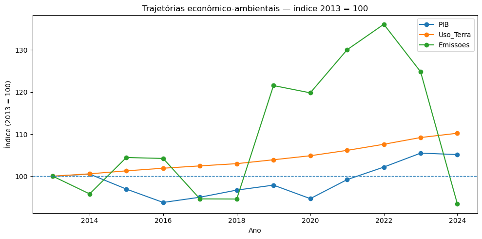
    


### 2.8.7. Intensidade financeira média por operação


```python
credito_anual["Valor_medio_por_operacao"] = (
    credito_anual["Valor_total"]
    / credito_anual["Qtd_total"]
)

credito_anual["Indice_valor_por_operacao_2013"] = (
    credito_anual["Valor_medio_por_operacao"]
    / credito_anual.loc[2013, "Valor_medio_por_operacao"]
    * 100
)

credito_anual["Crescimento_valor_por_operacao_pct"] = (
    credito_anual["Valor_medio_por_operacao"]
    .pct_change()
    * 100
)

display(
    credito_anual[
        [
            "Valor_medio_por_operacao",
            "Indice_valor_por_operacao_2013",
            "Crescimento_valor_por_operacao_pct"
        ]
    ].round(2)
)
```


<div>
<style scoped>
    .dataframe tbody tr th:only-of-type {
        vertical-align: middle;
    }

    .dataframe tbody tr th {
        vertical-align: top;
    }

    .dataframe thead th {
        text-align: right;
    }
</style>
<table border="1" class="dataframe">
  <thead>
    <tr style="text-align: right;">
      <th></th>
      <th>Valor_medio_por_operacao</th>
      <th>Indice_valor_por_operacao_2013</th>
      <th>Crescimento_valor_por_operacao_pct</th>
    </tr>
    <tr>
      <th>Ano</th>
      <th></th>
      <th></th>
      <th></th>
    </tr>
  </thead>
  <tbody>
    <tr>
      <th>2013</th>
      <td>396,342.1700</td>
      <td>100.0000</td>
      <td>NaN</td>
    </tr>
    <tr>
      <th>2014</th>
      <td>466,307.9300</td>
      <td>117.6500</td>
      <td>17.6500</td>
    </tr>
    <tr>
      <th>2015</th>
      <td>410,489.6400</td>
      <td>103.5700</td>
      <td>-11.9700</td>
    </tr>
    <tr>
      <th>2016</th>
      <td>497,683.1200</td>
      <td>125.5700</td>
      <td>21.2400</td>
    </tr>
    <tr>
      <th>2017</th>
      <td>517,979.7100</td>
      <td>130.6900</td>
      <td>4.0800</td>
    </tr>
    <tr>
      <th>2018</th>
      <td>564,008.7300</td>
      <td>142.3000</td>
      <td>8.8900</td>
    </tr>
    <tr>
      <th>2019</th>
      <td>750,458.8600</td>
      <td>189.3500</td>
      <td>33.0600</td>
    </tr>
    <tr>
      <th>2020</th>
      <td>651,187.1700</td>
      <td>164.3000</td>
      <td>-13.2300</td>
    </tr>
    <tr>
      <th>2021</th>
      <td>851,393.6000</td>
      <td>214.8100</td>
      <td>30.7400</td>
    </tr>
    <tr>
      <th>2022</th>
      <td>1,551,406.8700</td>
      <td>391.4300</td>
      <td>82.2200</td>
    </tr>
    <tr>
      <th>2023</th>
      <td>1,528,518.7200</td>
      <td>385.6600</td>
      <td>-1.4800</td>
    </tr>
    <tr>
      <th>2024</th>
      <td>1,430,562.6900</td>
      <td>360.9400</td>
      <td>-6.4100</td>
    </tr>
  </tbody>
</table>
</div>


```python
print(
    credito_anual[
        [
            "Valor_medio_por_operacao",
            "Indice_valor_por_operacao_2013",
            "Crescimento_valor_por_operacao_pct"
        ]
    ].round(2)
)
```

          Valor_medio_por_operacao  Indice_valor_por_operacao_2013  \
    Ano                                                              
    2013              396,342.1700                        100.0000   
    2014              466,307.9300                        117.6500   
    2015              410,489.6400                        103.5700   
    2016              497,683.1200                        125.5700   
    2017              517,979.7100                        130.6900   
    2018              564,008.7300                        142.3000   
    2019              750,458.8600                        189.3500   
    2020              651,187.1700                        164.3000   
    2021              851,393.6000                        214.8100   
    2022            1,551,406.8700                        391.4300   
    2023            1,528,518.7200                        385.6600   
    2024            1,430,562.6900                        360.9400   
    
          Crescimento_valor_por_operacao_pct  
    Ano                                       
    2013                                 NaN  
    2014                             17.6500  
    2015                            -11.9700  
    2016                             21.2400  
    2017                              4.0800  
    2018                              8.8900  
    2019                             33.0600  
    2020                            -13.2300  
    2021                             30.7400  
    2022                             82.2200  
    2023                             -1.4800  
    2024                             -6.4100  
    


```python
fig, ax = plt.subplots(figsize=(10, 5))

ax.plot(
    credito_anual.index,
    credito_anual["Indice_valor_por_operacao_2013"],
    marker="o"
)

ax.axhline(
    100,
    linewidth=1,
    linestyle="--"
)

ax.set_title(
    "Evolução do valor real médio por operação — índice 2013 = 100"
)

ax.set_xlabel("Ano")
ax.set_ylabel("Índice (2013 = 100)")

plt.tight_layout()
plt.show()
```


    
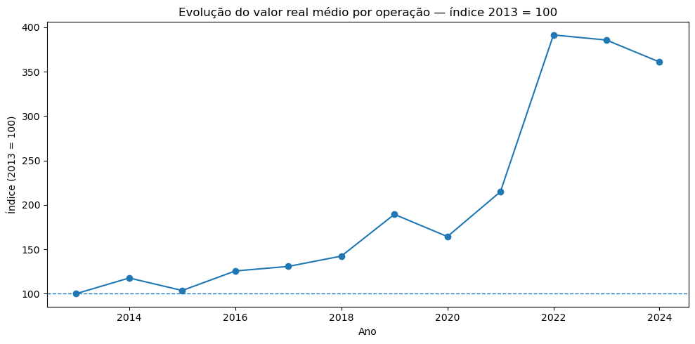
    


### Valor médio por operação em cada UF-ano


```python
df["Valor_por_operacao"] = np.where(
    df["QtdInvestimento"] > 0,
    df["VlInvestimento"] / df["QtdInvestimento"],
    np.nan
)

valor_operacao_uf = (
    df.groupby("Ano")
      .agg(
          Mediana_UF_valor_por_operacao=(
              "Valor_por_operacao",
              "median"
          ),
          Media_UF_valor_por_operacao=(
              "Valor_por_operacao",
              "mean"
          )
      )
)

display(valor_operacao_uf.round(2))
```


<div>
<style scoped>
    .dataframe tbody tr th:only-of-type {
        vertical-align: middle;
    }

    .dataframe tbody tr th {
        vertical-align: top;
    }

    .dataframe thead th {
        text-align: right;
    }
</style>
<table border="1" class="dataframe">
  <thead>
    <tr style="text-align: right;">
      <th></th>
      <th>Mediana_UF_valor_por_operacao</th>
      <th>Media_UF_valor_por_operacao</th>
    </tr>
    <tr>
      <th>Ano</th>
      <th></th>
      <th></th>
    </tr>
  </thead>
  <tbody>
    <tr>
      <th>2013</th>
      <td>313,559.3600</td>
      <td>347,639.4200</td>
    </tr>
    <tr>
      <th>2014</th>
      <td>361,995.3300</td>
      <td>466,058.5000</td>
    </tr>
    <tr>
      <th>2015</th>
      <td>361,916.6700</td>
      <td>508,004.0600</td>
    </tr>
    <tr>
      <th>2016</th>
      <td>493,766.3900</td>
      <td>473,043.0200</td>
    </tr>
    <tr>
      <th>2017</th>
      <td>460,634.0200</td>
      <td>496,505.9000</td>
    </tr>
    <tr>
      <th>2018</th>
      <td>500,328.3400</td>
      <td>556,436.9100</td>
    </tr>
    <tr>
      <th>2019</th>
      <td>634,295.7600</td>
      <td>663,595.3600</td>
    </tr>
    <tr>
      <th>2020</th>
      <td>583,398.1300</td>
      <td>662,343.7500</td>
    </tr>
    <tr>
      <th>2021</th>
      <td>705,429.0400</td>
      <td>768,312.7700</td>
    </tr>
    <tr>
      <th>2022</th>
      <td>1,265,260.2100</td>
      <td>1,546,083.4800</td>
    </tr>
    <tr>
      <th>2023</th>
      <td>1,291,073.9600</td>
      <td>1,423,598.3500</td>
    </tr>
    <tr>
      <th>2024</th>
      <td>1,071,101.2400</td>
      <td>1,108,213.0700</td>
    </tr>
  </tbody>
</table>
</div>


```python
print(valor_operacao_uf.round(2))
```

          Mediana_UF_valor_por_operacao  Media_UF_valor_por_operacao
    Ano                                                             
    2013                   313,559.3600                 347,639.4200
    2014                   361,995.3300                 466,058.5000
    2015                   361,916.6700                 508,004.0600
    2016                   493,766.3900                 473,043.0200
    2017                   460,634.0200                 496,505.9000
    2018                   500,328.3400                 556,436.9100
    2019                   634,295.7600                 663,595.3600
    2020                   583,398.1300                 662,343.7500
    2021                   705,429.0400                 768,312.7700
    2022                 1,265,260.2100               1,546,083.4800
    2023                 1,291,073.9600               1,423,598.3500
    2024                 1,071,101.2400               1,108,213.0700
    

### 2.8 Dinâmica temporal das dimensões econômica, ambiental e creditícia (2013–2024)

A análise temporal foi realizada considerando as características específicas das
variáveis monetárias. O PIB encontra-se expresso em valores reais de 2024, após
aplicação do deflator do PIB, enquanto o PIB per capita foi obtido pela razão
entre o PIB real e a população. A variável rendimento é originalmente
disponibilizada a preços médios de 2024, e o valor dos investimentos foi
deflacionado pelo IPCA para preços de 2024. Dessa forma, as variações
intertemporais das grandezas monetárias analisadas não representam meramente
alterações nominais de preços.

A trajetória do crédito revela mudanças substanciais ao longo do período. Após
expansão em 2014, ocorreu forte contração em 2015–2016. Em 2016, a quantidade de
operações diminuiu 69,13% em relação ao ano anterior, enquanto o valor real
investido recuou 62,57%. Simultaneamente, somente 19 das 27 UFs apresentaram
operações de crédito, correspondendo a uma cobertura territorial de 70,37%.

A partir de 2017 observa-se recuperação gradual do volume financeiro, porém sem
retorno equivalente da quantidade de operações. Essa divergência torna-se
especialmente evidente nos anos finais da série. Em 2024, o índice do valor real
investido, tomando 2013 = 100, atingiu 118,81, enquanto o índice da quantidade
de operações foi de apenas 32,92. Assim, o volume financeiro real agregado
superou o nível inicial da série, apesar de o número de operações permanecer
substancialmente inferior.

Esse processo foi acompanhado por expressivo crescimento do valor real médio por
operação. A razão entre o valor total investido e a quantidade total de operações
passou de aproximadamente R$\$$ 396,3 mil em 2013 para R$\$$ 1,431 milhão em 2024,
equivalente a aproximadamente 3,61 vezes o valor inicial. A mudança foi
particularmente intensa em 2022, quando o valor total investido cresceu 44,40%,
a quantidade de operações diminuiu 20,75% e o valor médio por operação aumentou
82,22% em relação ao ano anterior.

A análise no nível das UFs indica que essa transformação não decorre
exclusivamente das unidades territoriais de maior escala. Entre as UFs com
operações, a mediana do valor por operação aumentou de aproximadamente R$\$$ 313,6
mil em 2013 para R$\$$ 1,071 milhão em 2024, correspondendo a cerca de 3,42 vezes
o valor inicial. Os resultados sugerem, portanto, aumento disseminado da
intensidade financeira média das operações, embora sua distribuição territorial
ainda deva ser examinada diretamente.

As variáveis econômico-ambientais apresentam trajetórias distintas. O uso da
terra exibiu crescimento gradual e persistente ao longo de todo o período,
alcançando índice 110,21 em 2024 (2013 = 100), correspondente a aumento acumulado
de 10,21%. O PIB real apresentou variações relativamente menores, encerrando a
série com índice 105,15, aproximadamente 5,15% acima do nível observado em 2013.

As emissões apresentaram comportamento temporal menos regular. Após oscilações
relativamente moderadas até 2018, ocorreu aumento de 28,51% em 2019. O índice
das emissões alcançou 136,11 em 2022, seguido por reduções de 8,30% em 2023 e
25,18% em 2024. Ao final da série, o índice atingiu 93,39, situando o total
agregado de emissões aproximadamente 6,61% abaixo do nível observado em 2013.

A comparação das trajetórias mostra que crescimento do uso da terra, evolução do
PIB, emissões e dinâmica do crédito não seguem movimentos temporais equivalentes.
Em particular, a recuperação do volume real de crédito nos anos finais ocorre
simultaneamente a uma forte redução do número de operações e não apresenta
correspondência temporal simples com a trajetória agregada das emissões. Esse
resultado reforça as evidências da análise `within`, na qual as associações entre
crédito e emissões foram substancialmente menores que as associações territoriais
`between`.

Em conjunto, os resultados mostram que a dinâmica do crédito não pode ser
adequadamente caracterizada apenas pela evolução de seu volume financeiro.
Cobertura territorial, quantidade de operações e intensidade financeira
apresentam trajetórias distintas. Ao final do período, o número de UFs com
operações era igual ao observado em 2013 (23 UFs), mas havia substancialmente
menos operações, maior volume financeiro real e maior valor médio real por
operação. Esse padrão justifica examinar, na etapa seguinte, se a transformação
temporal do crédito foi acompanhada por alterações em sua concentração e
distribuição territorial.

## 2.9. Concentração e distribuição territorial do crédito

### 2.9.1. Participação anual das UFs


```python
credito_uf_ano = (
    df[
        [
            "UF",
            "Ano",
            "QtdInvestimento",
            "VlInvestimento",
            "SemOperacaoCredito"
        ]
    ]
    .copy()
)

credito_uf_ano["Participacao_valor"] = (
    credito_uf_ano["VlInvestimento"]
    / credito_uf_ano.groupby("Ano")["VlInvestimento"].transform("sum")
)

credito_uf_ano["Participacao_qtd"] = (
    credito_uf_ano["QtdInvestimento"]
    / credito_uf_ano.groupby("Ano")["QtdInvestimento"].transform("sum")
)

display(
    credito_uf_ano.sort_values(
        ["Ano", "Participacao_valor"],
        ascending=[True, False]
    ).head(30)
)
```


<div>
<style scoped>
    .dataframe tbody tr th:only-of-type {
        vertical-align: middle;
    }

    .dataframe tbody tr th {
        vertical-align: top;
    }

    .dataframe thead th {
        text-align: right;
    }
</style>
<table border="1" class="dataframe">
  <thead>
    <tr style="text-align: right;">
      <th></th>
      <th>UF</th>
      <th>Ano</th>
      <th>QtdInvestimento</th>
      <th>VlInvestimento</th>
      <th>SemOperacaoCredito</th>
      <th>Participacao_valor</th>
      <th>Participacao_qtd</th>
    </tr>
  </thead>
  <tbody>
    <tr>
      <th>120</th>
      <td>MG</td>
      <td>2013</td>
      <td>2,399.0000</td>
      <td>865,490,597.0000</td>
      <td>False</td>
      <td>0.1920</td>
      <td>0.2110</td>
    </tr>
    <tr>
      <th>132</th>
      <td>MS</td>
      <td>2013</td>
      <td>759.0000</td>
      <td>639,148,208.0000</td>
      <td>False</td>
      <td>0.1418</td>
      <td>0.0667</td>
    </tr>
    <tr>
      <th>300</th>
      <td>SP</td>
      <td>2013</td>
      <td>1,453.0000</td>
      <td>632,408,488.0000</td>
      <td>False</td>
      <td>0.1403</td>
      <td>0.1278</td>
    </tr>
    <tr>
      <th>96</th>
      <td>GO</td>
      <td>2013</td>
      <td>1,329.0000</td>
      <td>582,109,918.0000</td>
      <td>False</td>
      <td>0.1292</td>
      <td>0.1169</td>
    </tr>
    <tr>
      <th>144</th>
      <td>MT</td>
      <td>2013</td>
      <td>669.0000</td>
      <td>456,365,974.0000</td>
      <td>False</td>
      <td>0.1013</td>
      <td>0.0588</td>
    </tr>
    <tr>
      <th>48</th>
      <td>BA</td>
      <td>2013</td>
      <td>528.0000</td>
      <td>259,037,591.0000</td>
      <td>False</td>
      <td>0.0575</td>
      <td>0.0464</td>
    </tr>
    <tr>
      <th>264</th>
      <td>RS</td>
      <td>2013</td>
      <td>870.0000</td>
      <td>221,189,123.0000</td>
      <td>False</td>
      <td>0.0491</td>
      <td>0.0765</td>
    </tr>
    <tr>
      <th>312</th>
      <td>TO</td>
      <td>2013</td>
      <td>693.0000</td>
      <td>205,578,752.0000</td>
      <td>False</td>
      <td>0.0456</td>
      <td>0.0609</td>
    </tr>
    <tr>
      <th>204</th>
      <td>PR</td>
      <td>2013</td>
      <td>861.0000</td>
      <td>203,165,524.0000</td>
      <td>False</td>
      <td>0.0451</td>
      <td>0.0757</td>
    </tr>
    <tr>
      <th>156</th>
      <td>PA</td>
      <td>2013</td>
      <td>316.0000</td>
      <td>116,968,218.0000</td>
      <td>False</td>
      <td>0.0260</td>
      <td>0.0278</td>
    </tr>
    <tr>
      <th>240</th>
      <td>RO</td>
      <td>2013</td>
      <td>219.0000</td>
      <td>63,784,112.0000</td>
      <td>False</td>
      <td>0.0142</td>
      <td>0.0193</td>
    </tr>
    <tr>
      <th>276</th>
      <td>SC</td>
      <td>2013</td>
      <td>471.0000</td>
      <td>63,383,224.0000</td>
      <td>False</td>
      <td>0.0141</td>
      <td>0.0414</td>
    </tr>
    <tr>
      <th>108</th>
      <td>MA</td>
      <td>2013</td>
      <td>232.0000</td>
      <td>49,234,216.0000</td>
      <td>False</td>
      <td>0.0109</td>
      <td>0.0204</td>
    </tr>
    <tr>
      <th>84</th>
      <td>ES</td>
      <td>2013</td>
      <td>189.0000</td>
      <td>47,484,407.0000</td>
      <td>False</td>
      <td>0.0105</td>
      <td>0.0166</td>
    </tr>
    <tr>
      <th>192</th>
      <td>PI</td>
      <td>2013</td>
      <td>41.0000</td>
      <td>33,737,581.0000</td>
      <td>False</td>
      <td>0.0075</td>
      <td>0.0036</td>
    </tr>
    <tr>
      <th>0</th>
      <td>AC</td>
      <td>2013</td>
      <td>172.0000</td>
      <td>26,913,562.0000</td>
      <td>False</td>
      <td>0.0060</td>
      <td>0.0151</td>
    </tr>
    <tr>
      <th>216</th>
      <td>RJ</td>
      <td>2013</td>
      <td>102.0000</td>
      <td>20,753,743.0000</td>
      <td>False</td>
      <td>0.0046</td>
      <td>0.0090</td>
    </tr>
    <tr>
      <th>252</th>
      <td>RR</td>
      <td>2013</td>
      <td>33.0000</td>
      <td>12,054,869.0000</td>
      <td>False</td>
      <td>0.0027</td>
      <td>0.0029</td>
    </tr>
    <tr>
      <th>180</th>
      <td>PE</td>
      <td>2013</td>
      <td>10.0000</td>
      <td>3,449,517.0000</td>
      <td>False</td>
      <td>0.0008</td>
      <td>0.0009</td>
    </tr>
    <tr>
      <th>36</th>
      <td>AP</td>
      <td>2013</td>
      <td>11.0000</td>
      <td>3,449,153.0000</td>
      <td>False</td>
      <td>0.0008</td>
      <td>0.0010</td>
    </tr>
    <tr>
      <th>288</th>
      <td>SE</td>
      <td>2013</td>
      <td>11.0000</td>
      <td>562,028.0000</td>
      <td>False</td>
      <td>0.0001</td>
      <td>0.0010</td>
    </tr>
    <tr>
      <th>60</th>
      <td>CE</td>
      <td>2013</td>
      <td>1.0000</td>
      <td>347,608.0000</td>
      <td>False</td>
      <td>0.0001</td>
      <td>0.0001</td>
    </tr>
    <tr>
      <th>72</th>
      <td>DF</td>
      <td>2013</td>
      <td>2.0000</td>
      <td>190,442.0000</td>
      <td>False</td>
      <td>0.0000</td>
      <td>0.0002</td>
    </tr>
    <tr>
      <th>12</th>
      <td>AL</td>
      <td>2013</td>
      <td>0.0000</td>
      <td>0.0000</td>
      <td>True</td>
      <td>0.0000</td>
      <td>0.0000</td>
    </tr>
    <tr>
      <th>24</th>
      <td>AM</td>
      <td>2013</td>
      <td>0.0000</td>
      <td>0.0000</td>
      <td>True</td>
      <td>0.0000</td>
      <td>0.0000</td>
    </tr>
    <tr>
      <th>168</th>
      <td>PB</td>
      <td>2013</td>
      <td>0.0000</td>
      <td>0.0000</td>
      <td>True</td>
      <td>0.0000</td>
      <td>0.0000</td>
    </tr>
    <tr>
      <th>228</th>
      <td>RN</td>
      <td>2013</td>
      <td>0.0000</td>
      <td>0.0000</td>
      <td>True</td>
      <td>0.0000</td>
      <td>0.0000</td>
    </tr>
    <tr>
      <th>121</th>
      <td>MG</td>
      <td>2014</td>
      <td>2,392.0000</td>
      <td>1,079,960,586.0000</td>
      <td>False</td>
      <td>0.1810</td>
      <td>0.1869</td>
    </tr>
    <tr>
      <th>97</th>
      <td>GO</td>
      <td>2014</td>
      <td>1,725.0000</td>
      <td>915,099,488.0000</td>
      <td>False</td>
      <td>0.1534</td>
      <td>0.1348</td>
    </tr>
    <tr>
      <th>301</th>
      <td>SP</td>
      <td>2014</td>
      <td>1,850.0000</td>
      <td>805,021,363.0000</td>
      <td>False</td>
      <td>0.1349</td>
      <td>0.1446</td>
    </tr>
  </tbody>
</table>
</div>


```python
print(
    credito_uf_ano.sort_values(
        ["Ano", "Participacao_valor"],
        ascending=[True, False]
    ).head(30)
)
```

         UF   Ano  QtdInvestimento     VlInvestimento  SemOperacaoCredito  \
    120  MG  2013       2,399.0000   865,490,597.0000               False   
    132  MS  2013         759.0000   639,148,208.0000               False   
    300  SP  2013       1,453.0000   632,408,488.0000               False   
    96   GO  2013       1,329.0000   582,109,918.0000               False   
    144  MT  2013         669.0000   456,365,974.0000               False   
    48   BA  2013         528.0000   259,037,591.0000               False   
    264  RS  2013         870.0000   221,189,123.0000               False   
    312  TO  2013         693.0000   205,578,752.0000               False   
    204  PR  2013         861.0000   203,165,524.0000               False   
    156  PA  2013         316.0000   116,968,218.0000               False   
    240  RO  2013         219.0000    63,784,112.0000               False   
    276  SC  2013         471.0000    63,383,224.0000               False   
    108  MA  2013         232.0000    49,234,216.0000               False   
    84   ES  2013         189.0000    47,484,407.0000               False   
    192  PI  2013          41.0000    33,737,581.0000               False   
    0    AC  2013         172.0000    26,913,562.0000               False   
    216  RJ  2013         102.0000    20,753,743.0000               False   
    252  RR  2013          33.0000    12,054,869.0000               False   
    180  PE  2013          10.0000     3,449,517.0000               False   
    36   AP  2013          11.0000     3,449,153.0000               False   
    288  SE  2013          11.0000       562,028.0000               False   
    60   CE  2013           1.0000       347,608.0000               False   
    72   DF  2013           2.0000       190,442.0000               False   
    12   AL  2013           0.0000             0.0000                True   
    24   AM  2013           0.0000             0.0000                True   
    168  PB  2013           0.0000             0.0000                True   
    228  RN  2013           0.0000             0.0000                True   
    121  MG  2014       2,392.0000 1,079,960,586.0000               False   
    97   GO  2014       1,725.0000   915,099,488.0000               False   
    301  SP  2014       1,850.0000   805,021,363.0000               False   
    
         Participacao_valor  Participacao_qtd  
    120              0.1920            0.2110  
    132              0.1418            0.0667  
    300              0.1403            0.1278  
    96               0.1292            0.1169  
    144              0.1013            0.0588  
    48               0.0575            0.0464  
    264              0.0491            0.0765  
    312              0.0456            0.0609  
    204              0.0451            0.0757  
    156              0.0260            0.0278  
    240              0.0142            0.0193  
    276              0.0141            0.0414  
    108              0.0109            0.0204  
    84               0.0105            0.0166  
    192              0.0075            0.0036  
    0                0.0060            0.0151  
    216              0.0046            0.0090  
    252              0.0027            0.0029  
    180              0.0008            0.0009  
    36               0.0008            0.0010  
    288              0.0001            0.0010  
    60               0.0001            0.0001  
    72               0.0000            0.0002  
    12               0.0000            0.0000  
    24               0.0000            0.0000  
    168              0.0000            0.0000  
    228              0.0000            0.0000  
    121              0.1810            0.1869  
    97               0.1534            0.1348  
    301              0.1349            0.1446  
    

### 2.9.2. Ranking anual por valor investido


```python
ranking_anual = (
    credito_uf_ano
    .sort_values(
        ["Ano", "Participacao_valor"],
        ascending=[True, False]
    )
    .copy()
)

ranking_anual["Ranking_valor"] = (
    ranking_anual
    .groupby("Ano")["VlInvestimento"]
    .rank(
        method="min",
        ascending=False
    )
)

top5_anual = (
    ranking_anual[
        ranking_anual["Ranking_valor"] <= 5
    ]
    [
        [
            "Ano",
            "UF",
            "Ranking_valor",
            "VlInvestimento",
            "Participacao_valor"
        ]
    ]
)

display(top5_anual.round(4))
```


<div>
<style scoped>
    .dataframe tbody tr th:only-of-type {
        vertical-align: middle;
    }

    .dataframe tbody tr th {
        vertical-align: top;
    }

    .dataframe thead th {
        text-align: right;
    }
</style>
<table border="1" class="dataframe">
  <thead>
    <tr style="text-align: right;">
      <th></th>
      <th>Ano</th>
      <th>UF</th>
      <th>Ranking_valor</th>
      <th>VlInvestimento</th>
      <th>Participacao_valor</th>
    </tr>
  </thead>
  <tbody>
    <tr>
      <th>120</th>
      <td>2013</td>
      <td>MG</td>
      <td>1.0000</td>
      <td>865,490,597.0000</td>
      <td>0.1920</td>
    </tr>
    <tr>
      <th>132</th>
      <td>2013</td>
      <td>MS</td>
      <td>2.0000</td>
      <td>639,148,208.0000</td>
      <td>0.1418</td>
    </tr>
    <tr>
      <th>300</th>
      <td>2013</td>
      <td>SP</td>
      <td>3.0000</td>
      <td>632,408,488.0000</td>
      <td>0.1403</td>
    </tr>
    <tr>
      <th>96</th>
      <td>2013</td>
      <td>GO</td>
      <td>4.0000</td>
      <td>582,109,918.0000</td>
      <td>0.1292</td>
    </tr>
    <tr>
      <th>144</th>
      <td>2013</td>
      <td>MT</td>
      <td>5.0000</td>
      <td>456,365,974.0000</td>
      <td>0.1013</td>
    </tr>
    <tr>
      <th>121</th>
      <td>2014</td>
      <td>MG</td>
      <td>1.0000</td>
      <td>1,079,960,586.0000</td>
      <td>0.1810</td>
    </tr>
    <tr>
      <th>97</th>
      <td>2014</td>
      <td>GO</td>
      <td>2.0000</td>
      <td>915,099,488.0000</td>
      <td>0.1534</td>
    </tr>
    <tr>
      <th>301</th>
      <td>2014</td>
      <td>SP</td>
      <td>3.0000</td>
      <td>805,021,363.0000</td>
      <td>0.1349</td>
    </tr>
    <tr>
      <th>133</th>
      <td>2014</td>
      <td>MS</td>
      <td>4.0000</td>
      <td>628,822,127.0000</td>
      <td>0.1054</td>
    </tr>
    <tr>
      <th>145</th>
      <td>2014</td>
      <td>MT</td>
      <td>5.0000</td>
      <td>600,196,894.0000</td>
      <td>0.1006</td>
    </tr>
    <tr>
      <th>122</th>
      <td>2015</td>
      <td>MG</td>
      <td>1.0000</td>
      <td>613,260,338.0000</td>
      <td>0.1704</td>
    </tr>
    <tr>
      <th>98</th>
      <td>2015</td>
      <td>GO</td>
      <td>2.0000</td>
      <td>581,959,964.0000</td>
      <td>0.1617</td>
    </tr>
    <tr>
      <th>302</th>
      <td>2015</td>
      <td>SP</td>
      <td>3.0000</td>
      <td>479,046,584.0000</td>
      <td>0.1331</td>
    </tr>
    <tr>
      <th>146</th>
      <td>2015</td>
      <td>MT</td>
      <td>4.0000</td>
      <td>367,090,498.0000</td>
      <td>0.1020</td>
    </tr>
    <tr>
      <th>134</th>
      <td>2015</td>
      <td>MS</td>
      <td>5.0000</td>
      <td>295,096,204.0000</td>
      <td>0.0820</td>
    </tr>
    <tr>
      <th>99</th>
      <td>2016</td>
      <td>GO</td>
      <td>1.0000</td>
      <td>272,217,721.0000</td>
      <td>0.2021</td>
    </tr>
    <tr>
      <th>123</th>
      <td>2016</td>
      <td>MG</td>
      <td>2.0000</td>
      <td>157,262,237.0000</td>
      <td>0.1168</td>
    </tr>
    <tr>
      <th>315</th>
      <td>2016</td>
      <td>TO</td>
      <td>3.0000</td>
      <td>127,476,120.0000</td>
      <td>0.0947</td>
    </tr>
    <tr>
      <th>135</th>
      <td>2016</td>
      <td>MS</td>
      <td>4.0000</td>
      <td>114,613,939.0000</td>
      <td>0.0851</td>
    </tr>
    <tr>
      <th>147</th>
      <td>2016</td>
      <td>MT</td>
      <td>5.0000</td>
      <td>114,420,021.0000</td>
      <td>0.0850</td>
    </tr>
    <tr>
      <th>316</th>
      <td>2017</td>
      <td>TO</td>
      <td>1.0000</td>
      <td>258,686,407.0000</td>
      <td>0.1258</td>
    </tr>
    <tr>
      <th>124</th>
      <td>2017</td>
      <td>MG</td>
      <td>2.0000</td>
      <td>256,405,204.0000</td>
      <td>0.1247</td>
    </tr>
    <tr>
      <th>304</th>
      <td>2017</td>
      <td>SP</td>
      <td>3.0000</td>
      <td>255,847,943.0000</td>
      <td>0.1244</td>
    </tr>
    <tr>
      <th>100</th>
      <td>2017</td>
      <td>GO</td>
      <td>4.0000</td>
      <td>248,876,092.0000</td>
      <td>0.1211</td>
    </tr>
    <tr>
      <th>52</th>
      <td>2017</td>
      <td>BA</td>
      <td>5.0000</td>
      <td>149,240,105.0000</td>
      <td>0.0726</td>
    </tr>
    <tr>
      <th>125</th>
      <td>2018</td>
      <td>MG</td>
      <td>1.0000</td>
      <td>481,816,187.0000</td>
      <td>0.1666</td>
    </tr>
    <tr>
      <th>305</th>
      <td>2018</td>
      <td>SP</td>
      <td>2.0000</td>
      <td>342,154,323.0000</td>
      <td>0.1183</td>
    </tr>
    <tr>
      <th>317</th>
      <td>2018</td>
      <td>TO</td>
      <td>3.0000</td>
      <td>295,517,342.0000</td>
      <td>0.1022</td>
    </tr>
    <tr>
      <th>53</th>
      <td>2018</td>
      <td>BA</td>
      <td>4.0000</td>
      <td>258,173,965.0000</td>
      <td>0.0893</td>
    </tr>
    <tr>
      <th>161</th>
      <td>2018</td>
      <td>PA</td>
      <td>5.0000</td>
      <td>252,928,266.0000</td>
      <td>0.0875</td>
    </tr>
    <tr>
      <th>126</th>
      <td>2019</td>
      <td>MG</td>
      <td>1.0000</td>
      <td>409,898,003.0000</td>
      <td>0.1476</td>
    </tr>
    <tr>
      <th>150</th>
      <td>2019</td>
      <td>MT</td>
      <td>2.0000</td>
      <td>368,723,536.0000</td>
      <td>0.1328</td>
    </tr>
    <tr>
      <th>306</th>
      <td>2019</td>
      <td>SP</td>
      <td>3.0000</td>
      <td>315,939,955.0000</td>
      <td>0.1138</td>
    </tr>
    <tr>
      <th>162</th>
      <td>2019</td>
      <td>PA</td>
      <td>4.0000</td>
      <td>237,054,438.0000</td>
      <td>0.0854</td>
    </tr>
    <tr>
      <th>102</th>
      <td>2019</td>
      <td>GO</td>
      <td>5.0000</td>
      <td>227,532,225.0000</td>
      <td>0.0819</td>
    </tr>
    <tr>
      <th>151</th>
      <td>2020</td>
      <td>MT</td>
      <td>1.0000</td>
      <td>484,848,173.0000</td>
      <td>0.1621</td>
    </tr>
    <tr>
      <th>127</th>
      <td>2020</td>
      <td>MG</td>
      <td>2.0000</td>
      <td>454,292,212.0000</td>
      <td>0.1519</td>
    </tr>
    <tr>
      <th>103</th>
      <td>2020</td>
      <td>GO</td>
      <td>3.0000</td>
      <td>308,965,141.0000</td>
      <td>0.1033</td>
    </tr>
    <tr>
      <th>271</th>
      <td>2020</td>
      <td>RS</td>
      <td>4.0000</td>
      <td>261,056,565.0000</td>
      <td>0.0873</td>
    </tr>
    <tr>
      <th>139</th>
      <td>2020</td>
      <td>MS</td>
      <td>5.0000</td>
      <td>223,113,622.0000</td>
      <td>0.0746</td>
    </tr>
    <tr>
      <th>152</th>
      <td>2021</td>
      <td>MT</td>
      <td>1.0000</td>
      <td>480,122,801.0000</td>
      <td>0.1454</td>
    </tr>
    <tr>
      <th>128</th>
      <td>2021</td>
      <td>MG</td>
      <td>2.0000</td>
      <td>469,976,675.0000</td>
      <td>0.1423</td>
    </tr>
    <tr>
      <th>56</th>
      <td>2021</td>
      <td>BA</td>
      <td>3.0000</td>
      <td>388,190,274.0000</td>
      <td>0.1175</td>
    </tr>
    <tr>
      <th>104</th>
      <td>2021</td>
      <td>GO</td>
      <td>4.0000</td>
      <td>324,606,706.0000</td>
      <td>0.0983</td>
    </tr>
    <tr>
      <th>308</th>
      <td>2021</td>
      <td>SP</td>
      <td>5.0000</td>
      <td>245,729,545.0000</td>
      <td>0.0744</td>
    </tr>
    <tr>
      <th>153</th>
      <td>2022</td>
      <td>MT</td>
      <td>1.0000</td>
      <td>989,457,165.0000</td>
      <td>0.2075</td>
    </tr>
    <tr>
      <th>129</th>
      <td>2022</td>
      <td>MG</td>
      <td>2.0000</td>
      <td>823,325,931.0000</td>
      <td>0.1726</td>
    </tr>
    <tr>
      <th>273</th>
      <td>2022</td>
      <td>RS</td>
      <td>3.0000</td>
      <td>461,900,385.0000</td>
      <td>0.0969</td>
    </tr>
    <tr>
      <th>141</th>
      <td>2022</td>
      <td>MS</td>
      <td>4.0000</td>
      <td>429,849,680.0000</td>
      <td>0.0901</td>
    </tr>
    <tr>
      <th>309</th>
      <td>2022</td>
      <td>SP</td>
      <td>5.0000</td>
      <td>372,651,782.0000</td>
      <td>0.0781</td>
    </tr>
    <tr>
      <th>154</th>
      <td>2023</td>
      <td>MT</td>
      <td>1.0000</td>
      <td>1,382,899,884.0000</td>
      <td>0.2438</td>
    </tr>
    <tr>
      <th>130</th>
      <td>2023</td>
      <td>MG</td>
      <td>2.0000</td>
      <td>869,668,591.0000</td>
      <td>0.1533</td>
    </tr>
    <tr>
      <th>274</th>
      <td>2023</td>
      <td>RS</td>
      <td>3.0000</td>
      <td>780,215,576.0000</td>
      <td>0.1375</td>
    </tr>
    <tr>
      <th>106</th>
      <td>2023</td>
      <td>GO</td>
      <td>4.0000</td>
      <td>583,022,011.0000</td>
      <td>0.1028</td>
    </tr>
    <tr>
      <th>58</th>
      <td>2023</td>
      <td>BA</td>
      <td>5.0000</td>
      <td>347,157,661.0000</td>
      <td>0.0612</td>
    </tr>
    <tr>
      <th>155</th>
      <td>2024</td>
      <td>MT</td>
      <td>1.0000</td>
      <td>1,132,720,210.0000</td>
      <td>0.2115</td>
    </tr>
    <tr>
      <th>131</th>
      <td>2024</td>
      <td>MG</td>
      <td>2.0000</td>
      <td>917,112,891.0000</td>
      <td>0.1713</td>
    </tr>
    <tr>
      <th>275</th>
      <td>2024</td>
      <td>RS</td>
      <td>3.0000</td>
      <td>863,676,907.0000</td>
      <td>0.1613</td>
    </tr>
    <tr>
      <th>107</th>
      <td>2024</td>
      <td>GO</td>
      <td>4.0000</td>
      <td>505,970,876.0000</td>
      <td>0.0945</td>
    </tr>
    <tr>
      <th>311</th>
      <td>2024</td>
      <td>SP</td>
      <td>5.0000</td>
      <td>368,356,630.0000</td>
      <td>0.0688</td>
    </tr>
  </tbody>
</table>
</div>


```python
print(top5_anual.round(4))
```

          Ano  UF  Ranking_valor     VlInvestimento  Participacao_valor
    120  2013  MG         1.0000   865,490,597.0000              0.1920
    132  2013  MS         2.0000   639,148,208.0000              0.1418
    300  2013  SP         3.0000   632,408,488.0000              0.1403
    96   2013  GO         4.0000   582,109,918.0000              0.1292
    144  2013  MT         5.0000   456,365,974.0000              0.1013
    121  2014  MG         1.0000 1,079,960,586.0000              0.1810
    97   2014  GO         2.0000   915,099,488.0000              0.1534
    301  2014  SP         3.0000   805,021,363.0000              0.1349
    133  2014  MS         4.0000   628,822,127.0000              0.1054
    145  2014  MT         5.0000   600,196,894.0000              0.1006
    122  2015  MG         1.0000   613,260,338.0000              0.1704
    98   2015  GO         2.0000   581,959,964.0000              0.1617
    302  2015  SP         3.0000   479,046,584.0000              0.1331
    146  2015  MT         4.0000   367,090,498.0000              0.1020
    134  2015  MS         5.0000   295,096,204.0000              0.0820
    99   2016  GO         1.0000   272,217,721.0000              0.2021
    123  2016  MG         2.0000   157,262,237.0000              0.1168
    315  2016  TO         3.0000   127,476,120.0000              0.0947
    135  2016  MS         4.0000   114,613,939.0000              0.0851
    147  2016  MT         5.0000   114,420,021.0000              0.0850
    316  2017  TO         1.0000   258,686,407.0000              0.1258
    124  2017  MG         2.0000   256,405,204.0000              0.1247
    304  2017  SP         3.0000   255,847,943.0000              0.1244
    100  2017  GO         4.0000   248,876,092.0000              0.1211
    52   2017  BA         5.0000   149,240,105.0000              0.0726
    125  2018  MG         1.0000   481,816,187.0000              0.1666
    305  2018  SP         2.0000   342,154,323.0000              0.1183
    317  2018  TO         3.0000   295,517,342.0000              0.1022
    53   2018  BA         4.0000   258,173,965.0000              0.0893
    161  2018  PA         5.0000   252,928,266.0000              0.0875
    126  2019  MG         1.0000   409,898,003.0000              0.1476
    150  2019  MT         2.0000   368,723,536.0000              0.1328
    306  2019  SP         3.0000   315,939,955.0000              0.1138
    162  2019  PA         4.0000   237,054,438.0000              0.0854
    102  2019  GO         5.0000   227,532,225.0000              0.0819
    151  2020  MT         1.0000   484,848,173.0000              0.1621
    127  2020  MG         2.0000   454,292,212.0000              0.1519
    103  2020  GO         3.0000   308,965,141.0000              0.1033
    271  2020  RS         4.0000   261,056,565.0000              0.0873
    139  2020  MS         5.0000   223,113,622.0000              0.0746
    152  2021  MT         1.0000   480,122,801.0000              0.1454
    128  2021  MG         2.0000   469,976,675.0000              0.1423
    56   2021  BA         3.0000   388,190,274.0000              0.1175
    104  2021  GO         4.0000   324,606,706.0000              0.0983
    308  2021  SP         5.0000   245,729,545.0000              0.0744
    153  2022  MT         1.0000   989,457,165.0000              0.2075
    129  2022  MG         2.0000   823,325,931.0000              0.1726
    273  2022  RS         3.0000   461,900,385.0000              0.0969
    141  2022  MS         4.0000   429,849,680.0000              0.0901
    309  2022  SP         5.0000   372,651,782.0000              0.0781
    154  2023  MT         1.0000 1,382,899,884.0000              0.2438
    130  2023  MG         2.0000   869,668,591.0000              0.1533
    274  2023  RS         3.0000   780,215,576.0000              0.1375
    106  2023  GO         4.0000   583,022,011.0000              0.1028
    58   2023  BA         5.0000   347,157,661.0000              0.0612
    155  2024  MT         1.0000 1,132,720,210.0000              0.2115
    131  2024  MG         2.0000   917,112,891.0000              0.1713
    275  2024  RS         3.0000   863,676,907.0000              0.1613
    107  2024  GO         4.0000   505,970,876.0000              0.0945
    311  2024  SP         5.0000   368,356,630.0000              0.0688
    

### 2.9.3. Razões de concentração — CR4 e CR5


```python
def concentration_ratio(x, k):
    x = np.asarray(x, dtype=float)

    total = x.sum()

    if total == 0:
        return np.nan

    participacoes = np.sort(x / total)[::-1]

    return participacoes[:k].sum()


concentracao_cr = (
    df.groupby("Ano")
      .agg(
          CR4_valor=(
              "VlInvestimento",
              lambda x: concentration_ratio(x, 4)
          ),
          CR5_valor=(
              "VlInvestimento",
              lambda x: concentration_ratio(x, 5)
          ),
          CR4_qtd=(
              "QtdInvestimento",
              lambda x: concentration_ratio(x, 4)
          ),
          CR5_qtd=(
              "QtdInvestimento",
              lambda x: concentration_ratio(x, 5)
          )
      )
)

display(
    (concentracao_cr * 100).round(2)
)
```


<div>
<style scoped>
    .dataframe tbody tr th:only-of-type {
        vertical-align: middle;
    }

    .dataframe tbody tr th {
        vertical-align: top;
    }

    .dataframe thead th {
        text-align: right;
    }
</style>
<table border="1" class="dataframe">
  <thead>
    <tr style="text-align: right;">
      <th></th>
      <th>CR4_valor</th>
      <th>CR5_valor</th>
      <th>CR4_qtd</th>
      <th>CR5_qtd</th>
    </tr>
    <tr>
      <th>Ano</th>
      <th></th>
      <th></th>
      <th></th>
      <th></th>
    </tr>
  </thead>
  <tbody>
    <tr>
      <th>2013</th>
      <td>60.3300</td>
      <td>70.4600</td>
      <td>53.2100</td>
      <td>60.7900</td>
    </tr>
    <tr>
      <th>2014</th>
      <td>57.4700</td>
      <td>67.5200</td>
      <td>54.3400</td>
      <td>61.8000</td>
    </tr>
    <tr>
      <th>2015</th>
      <td>56.7400</td>
      <td>64.9400</td>
      <td>58.4700</td>
      <td>64.3700</td>
    </tr>
    <tr>
      <th>2016</th>
      <td>49.8700</td>
      <td>58.3600</td>
      <td>54.8000</td>
      <td>60.7900</td>
    </tr>
    <tr>
      <th>2017</th>
      <td>49.6100</td>
      <td>56.8600</td>
      <td>56.2400</td>
      <td>62.9400</td>
    </tr>
    <tr>
      <th>2018</th>
      <td>47.6400</td>
      <td>56.3900</td>
      <td>54.0500</td>
      <td>60.9100</td>
    </tr>
    <tr>
      <th>2019</th>
      <td>47.9600</td>
      <td>56.1500</td>
      <td>48.0300</td>
      <td>55.9700</td>
    </tr>
    <tr>
      <th>2020</th>
      <td>50.4700</td>
      <td>57.9300</td>
      <td>47.3000</td>
      <td>54.7500</td>
    </tr>
    <tr>
      <th>2021</th>
      <td>50.3500</td>
      <td>57.7900</td>
      <td>48.2100</td>
      <td>55.5000</td>
    </tr>
    <tr>
      <th>2022</th>
      <td>56.7100</td>
      <td>64.5200</td>
      <td>50.4200</td>
      <td>58.2600</td>
    </tr>
    <tr>
      <th>2023</th>
      <td>63.7400</td>
      <td>69.8600</td>
      <td>59.0900</td>
      <td>65.9400</td>
    </tr>
    <tr>
      <th>2024</th>
      <td>63.8600</td>
      <td>70.7400</td>
      <td>58.9600</td>
      <td>66.7600</td>
    </tr>
  </tbody>
</table>
</div>


```python
print(
    (concentracao_cr * 100).round(2)
)
```

          CR4_valor  CR5_valor  CR4_qtd  CR5_qtd
    Ano                                         
    2013    60.3300    70.4600  53.2100  60.7900
    2014    57.4700    67.5200  54.3400  61.8000
    2015    56.7400    64.9400  58.4700  64.3700
    2016    49.8700    58.3600  54.8000  60.7900
    2017    49.6100    56.8600  56.2400  62.9400
    2018    47.6400    56.3900  54.0500  60.9100
    2019    47.9600    56.1500  48.0300  55.9700
    2020    50.4700    57.9300  47.3000  54.7500
    2021    50.3500    57.7900  48.2100  55.5000
    2022    56.7100    64.5200  50.4200  58.2600
    2023    63.7400    69.8600  59.0900  65.9400
    2024    63.8600    70.7400  58.9600  66.7600
    

### 2.9.4. Índice Herfindahl-Hirschman — HHI


```python
def hhi(x):
    x = np.asarray(x, dtype=float)

    total = x.sum()

    if total == 0:
        return np.nan

    s = x / total

    return np.sum(s ** 2)


hhi_anual = (
    df.groupby("Ano")
      .agg(
          HHI_valor=(
              "VlInvestimento",
              hhi
          ),
          HHI_qtd=(
              "QtdInvestimento",
              hhi
          )
      )
)

display(hhi_anual.round(4))
```


<div>
<style scoped>
    .dataframe tbody tr th:only-of-type {
        vertical-align: middle;
    }

    .dataframe tbody tr th {
        vertical-align: top;
    }

    .dataframe thead th {
        text-align: right;
    }
</style>
<table border="1" class="dataframe">
  <thead>
    <tr style="text-align: right;">
      <th></th>
      <th>HHI_valor</th>
      <th>HHI_qtd</th>
    </tr>
    <tr>
      <th>Ano</th>
      <th></th>
      <th></th>
    </tr>
  </thead>
  <tbody>
    <tr>
      <th>2013</th>
      <td>0.1149</td>
      <td>0.1038</td>
    </tr>
    <tr>
      <th>2014</th>
      <td>0.1105</td>
      <td>0.1033</td>
    </tr>
    <tr>
      <th>2015</th>
      <td>0.1060</td>
      <td>0.1101</td>
    </tr>
    <tr>
      <th>2016</th>
      <td>0.0997</td>
      <td>0.0990</td>
    </tr>
    <tr>
      <th>2017</th>
      <td>0.0868</td>
      <td>0.1053</td>
    </tr>
    <tr>
      <th>2018</th>
      <td>0.0891</td>
      <td>0.1031</td>
    </tr>
    <tr>
      <th>2019</th>
      <td>0.0911</td>
      <td>0.0923</td>
    </tr>
    <tr>
      <th>2020</th>
      <td>0.0958</td>
      <td>0.0961</td>
    </tr>
    <tr>
      <th>2021</th>
      <td>0.0929</td>
      <td>0.0913</td>
    </tr>
    <tr>
      <th>2022</th>
      <td>0.1142</td>
      <td>0.1020</td>
    </tr>
    <tr>
      <th>2023</th>
      <td>0.1276</td>
      <td>0.1138</td>
    </tr>
    <tr>
      <th>2024</th>
      <td>0.1244</td>
      <td>0.1132</td>
    </tr>
  </tbody>
</table>
</div>


```python
print(hhi_anual.round(4))
```

          HHI_valor  HHI_qtd
    Ano                     
    2013     0.1149   0.1038
    2014     0.1105   0.1033
    2015     0.1060   0.1101
    2016     0.0997   0.0990
    2017     0.0868   0.1053
    2018     0.0891   0.1031
    2019     0.0911   0.0923
    2020     0.0958   0.0961
    2021     0.0929   0.0913
    2022     0.1142   0.1020
    2023     0.1276   0.1138
    2024     0.1244   0.1132
    

### 2.9.5. Coeficiente de Gini


```python
def gini(x):
    x = np.asarray(x, dtype=float)

    if np.any(x < 0):
        raise ValueError(
            "O coeficiente de Gini requer valores não negativos."
        )

    if x.sum() == 0:
        return np.nan

    x = np.sort(x)

    n = len(x)

    indice = np.arange(1, n + 1)

    return (
        np.sum((2 * indice - n - 1) * x)
        / (n * np.sum(x))
    )


gini_anual = (
    df.groupby("Ano")
      .agg(
          Gini_valor=(
              "VlInvestimento",
              gini
          ),
          Gini_qtd=(
              "QtdInvestimento",
              gini
          )
      )
)

display(gini_anual.round(4))
```


<div>
<style scoped>
    .dataframe tbody tr th:only-of-type {
        vertical-align: middle;
    }

    .dataframe tbody tr th {
        vertical-align: top;
    }

    .dataframe thead th {
        text-align: right;
    }
</style>
<table border="1" class="dataframe">
  <thead>
    <tr style="text-align: right;">
      <th></th>
      <th>Gini_valor</th>
      <th>Gini_qtd</th>
    </tr>
    <tr>
      <th>Ano</th>
      <th></th>
      <th></th>
    </tr>
  </thead>
  <tbody>
    <tr>
      <th>2013</th>
      <td>0.6947</td>
      <td>0.6510</td>
    </tr>
    <tr>
      <th>2014</th>
      <td>0.6890</td>
      <td>0.6583</td>
    </tr>
    <tr>
      <th>2015</th>
      <td>0.6743</td>
      <td>0.6729</td>
    </tr>
    <tr>
      <th>2016</th>
      <td>0.6455</td>
      <td>0.6423</td>
    </tr>
    <tr>
      <th>2017</th>
      <td>0.6079</td>
      <td>0.6505</td>
    </tr>
    <tr>
      <th>2018</th>
      <td>0.6167</td>
      <td>0.6458</td>
    </tr>
    <tr>
      <th>2019</th>
      <td>0.6322</td>
      <td>0.6261</td>
    </tr>
    <tr>
      <th>2020</th>
      <td>0.6448</td>
      <td>0.6251</td>
    </tr>
    <tr>
      <th>2021</th>
      <td>0.6379</td>
      <td>0.6135</td>
    </tr>
    <tr>
      <th>2022</th>
      <td>0.6855</td>
      <td>0.6316</td>
    </tr>
    <tr>
      <th>2023</th>
      <td>0.7083</td>
      <td>0.6757</td>
    </tr>
    <tr>
      <th>2024</th>
      <td>0.7081</td>
      <td>0.6735</td>
    </tr>
  </tbody>
</table>
</div>


```python
print(gini_anual.round(4))
```

          Gini_valor  Gini_qtd
    Ano                       
    2013      0.6947    0.6510
    2014      0.6890    0.6583
    2015      0.6743    0.6729
    2016      0.6455    0.6423
    2017      0.6079    0.6505
    2018      0.6167    0.6458
    2019      0.6322    0.6261
    2020      0.6448    0.6251
    2021      0.6379    0.6135
    2022      0.6855    0.6316
    2023      0.7083    0.6757
    2024      0.7081    0.6735
    

### 2.9.6. Tabela consolidada de concentração territorial


```python
concentracao_anual = (
    concentracao_cr
    .join(hhi_anual)
    .join(gini_anual)
)

concentracao_anual["UFs_com_credito"] = (
    df.groupby("Ano")["SemOperacaoCredito"]
      .apply(lambda x: (~x).sum())
)

concentracao_anual["Perc_UFs_com_credito"] = (
    100 *
    concentracao_anual["UFs_com_credito"]
    / 27
)

display(
    concentracao_anual.round(4)
)
```


<div>
<style scoped>
    .dataframe tbody tr th:only-of-type {
        vertical-align: middle;
    }

    .dataframe tbody tr th {
        vertical-align: top;
    }

    .dataframe thead th {
        text-align: right;
    }
</style>
<table border="1" class="dataframe">
  <thead>
    <tr style="text-align: right;">
      <th></th>
      <th>CR4_valor</th>
      <th>CR5_valor</th>
      <th>CR4_qtd</th>
      <th>CR5_qtd</th>
      <th>HHI_valor</th>
      <th>HHI_qtd</th>
      <th>Gini_valor</th>
      <th>Gini_qtd</th>
      <th>UFs_com_credito</th>
      <th>Perc_UFs_com_credito</th>
    </tr>
    <tr>
      <th>Ano</th>
      <th></th>
      <th></th>
      <th></th>
      <th></th>
      <th></th>
      <th></th>
      <th></th>
      <th></th>
      <th></th>
      <th></th>
    </tr>
  </thead>
  <tbody>
    <tr>
      <th>2013</th>
      <td>0.6033</td>
      <td>0.7046</td>
      <td>0.5321</td>
      <td>0.6079</td>
      <td>0.1149</td>
      <td>0.1038</td>
      <td>0.6947</td>
      <td>0.6510</td>
      <td>23</td>
      <td>85.1852</td>
    </tr>
    <tr>
      <th>2014</th>
      <td>0.5747</td>
      <td>0.6752</td>
      <td>0.5434</td>
      <td>0.6180</td>
      <td>0.1105</td>
      <td>0.1033</td>
      <td>0.6890</td>
      <td>0.6583</td>
      <td>25</td>
      <td>92.5926</td>
    </tr>
    <tr>
      <th>2015</th>
      <td>0.5674</td>
      <td>0.6494</td>
      <td>0.5847</td>
      <td>0.6437</td>
      <td>0.1060</td>
      <td>0.1101</td>
      <td>0.6743</td>
      <td>0.6729</td>
      <td>23</td>
      <td>85.1852</td>
    </tr>
    <tr>
      <th>2016</th>
      <td>0.4987</td>
      <td>0.5836</td>
      <td>0.5480</td>
      <td>0.6079</td>
      <td>0.0997</td>
      <td>0.0990</td>
      <td>0.6455</td>
      <td>0.6423</td>
      <td>19</td>
      <td>70.3704</td>
    </tr>
    <tr>
      <th>2017</th>
      <td>0.4961</td>
      <td>0.5686</td>
      <td>0.5624</td>
      <td>0.6294</td>
      <td>0.0868</td>
      <td>0.1053</td>
      <td>0.6079</td>
      <td>0.6505</td>
      <td>23</td>
      <td>85.1852</td>
    </tr>
    <tr>
      <th>2018</th>
      <td>0.4764</td>
      <td>0.5639</td>
      <td>0.5405</td>
      <td>0.6091</td>
      <td>0.0891</td>
      <td>0.1031</td>
      <td>0.6167</td>
      <td>0.6458</td>
      <td>23</td>
      <td>85.1852</td>
    </tr>
    <tr>
      <th>2019</th>
      <td>0.4796</td>
      <td>0.5615</td>
      <td>0.4803</td>
      <td>0.5597</td>
      <td>0.0911</td>
      <td>0.0923</td>
      <td>0.6322</td>
      <td>0.6261</td>
      <td>22</td>
      <td>81.4815</td>
    </tr>
    <tr>
      <th>2020</th>
      <td>0.5047</td>
      <td>0.5793</td>
      <td>0.4730</td>
      <td>0.5475</td>
      <td>0.0958</td>
      <td>0.0961</td>
      <td>0.6448</td>
      <td>0.6251</td>
      <td>19</td>
      <td>70.3704</td>
    </tr>
    <tr>
      <th>2021</th>
      <td>0.5035</td>
      <td>0.5779</td>
      <td>0.4821</td>
      <td>0.5550</td>
      <td>0.0929</td>
      <td>0.0913</td>
      <td>0.6379</td>
      <td>0.6135</td>
      <td>20</td>
      <td>74.0741</td>
    </tr>
    <tr>
      <th>2022</th>
      <td>0.5671</td>
      <td>0.6452</td>
      <td>0.5042</td>
      <td>0.5826</td>
      <td>0.1142</td>
      <td>0.1020</td>
      <td>0.6855</td>
      <td>0.6316</td>
      <td>21</td>
      <td>77.7778</td>
    </tr>
    <tr>
      <th>2023</th>
      <td>0.6374</td>
      <td>0.6986</td>
      <td>0.5909</td>
      <td>0.6594</td>
      <td>0.1276</td>
      <td>0.1138</td>
      <td>0.7083</td>
      <td>0.6757</td>
      <td>23</td>
      <td>85.1852</td>
    </tr>
    <tr>
      <th>2024</th>
      <td>0.6386</td>
      <td>0.7074</td>
      <td>0.5896</td>
      <td>0.6676</td>
      <td>0.1244</td>
      <td>0.1132</td>
      <td>0.7081</td>
      <td>0.6735</td>
      <td>23</td>
      <td>85.1852</td>
    </tr>
  </tbody>
</table>
</div>


```python
print(
    concentracao_anual.round(4)
)
```

          CR4_valor  CR5_valor  CR4_qtd  CR5_qtd  HHI_valor  HHI_qtd  Gini_valor  \
    Ano                                                                            
    2013     0.6033     0.7046   0.5321   0.6079     0.1149   0.1038      0.6947   
    2014     0.5747     0.6752   0.5434   0.6180     0.1105   0.1033      0.6890   
    2015     0.5674     0.6494   0.5847   0.6437     0.1060   0.1101      0.6743   
    2016     0.4987     0.5836   0.5480   0.6079     0.0997   0.0990      0.6455   
    2017     0.4961     0.5686   0.5624   0.6294     0.0868   0.1053      0.6079   
    2018     0.4764     0.5639   0.5405   0.6091     0.0891   0.1031      0.6167   
    2019     0.4796     0.5615   0.4803   0.5597     0.0911   0.0923      0.6322   
    2020     0.5047     0.5793   0.4730   0.5475     0.0958   0.0961      0.6448   
    2021     0.5035     0.5779   0.4821   0.5550     0.0929   0.0913      0.6379   
    2022     0.5671     0.6452   0.5042   0.5826     0.1142   0.1020      0.6855   
    2023     0.6374     0.6986   0.5909   0.6594     0.1276   0.1138      0.7083   
    2024     0.6386     0.7074   0.5896   0.6676     0.1244   0.1132      0.7081   
    
          Gini_qtd  UFs_com_credito  Perc_UFs_com_credito  
    Ano                                                    
    2013    0.6510               23               85.1852  
    2014    0.6583               25               92.5926  
    2015    0.6729               23               85.1852  
    2016    0.6423               19               70.3704  
    2017    0.6505               23               85.1852  
    2018    0.6458               23               85.1852  
    2019    0.6261               22               81.4815  
    2020    0.6251               19               70.3704  
    2021    0.6135               20               74.0741  
    2022    0.6316               21               77.7778  
    2023    0.6757               23               85.1852  
    2024    0.6735               23               85.1852  
    

### 2.9.7. Visualização temporal

### Concentração do valor


```python
fig, ax = plt.subplots(figsize=(10, 5))

ax.plot(
    concentracao_anual.index,
    concentracao_anual["Gini_valor"],
    marker="o",
    label="Gini"
)

ax.plot(
    concentracao_anual.index,
    concentracao_anual["HHI_valor"],
    marker="o",
    label="HHI"
)

ax.set_title(
    "Concentração territorial do valor real investido"
)

ax.set_xlabel("Ano")
ax.set_ylabel("Índice")
ax.legend()

plt.tight_layout()
plt.show()
```


    
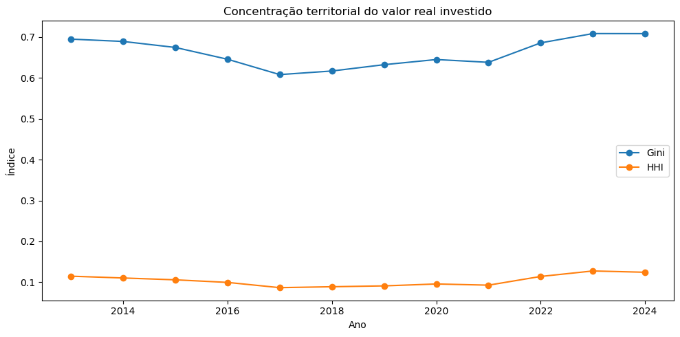
    


### CR4 e CR5


```python
fig, ax = plt.subplots(figsize=(10, 5))

ax.plot(
    concentracao_anual.index,
    concentracao_anual["CR4_valor"] * 100,
    marker="o",
    label="CR4"
)

ax.plot(
    concentracao_anual.index,
    concentracao_anual["CR5_valor"] * 100,
    marker="o",
    label="CR5"
)

ax.set_title(
    "Participação das maiores UFs no valor real investido"
)

ax.set_xlabel("Ano")
ax.set_ylabel("Participação (%)")
ax.legend()

plt.tight_layout()
plt.show()
```


    
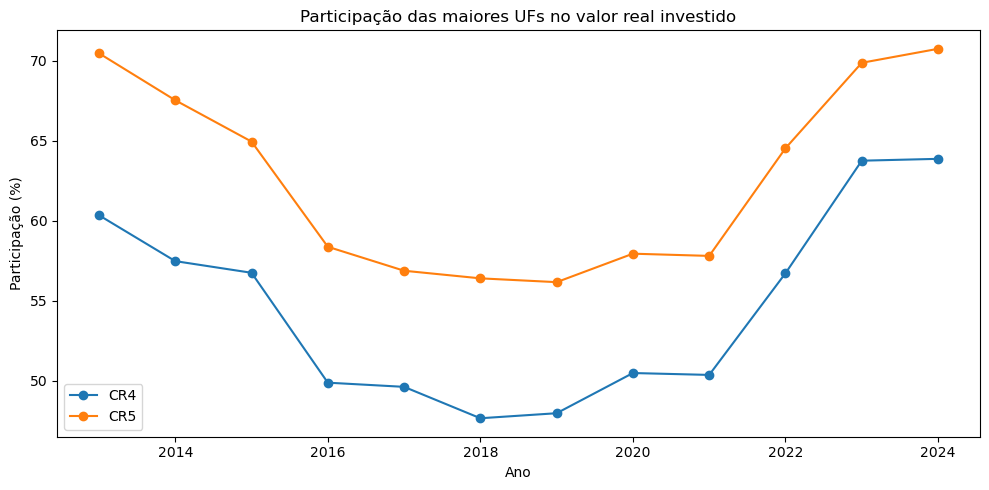
    


```python
comparacao_concentracao = concentracao_anual[
    [
        "Gini_valor",
        "Gini_qtd",
        "HHI_valor",
        "HHI_qtd",
        "CR4_valor",
        "CR4_qtd",
        "CR5_valor",
        "CR5_qtd",
        "UFs_com_credito",
        "Perc_UFs_com_credito"
    ]
].copy()

display(
    comparacao_concentracao.round(4)
)
```


<div>
<style scoped>
    .dataframe tbody tr th:only-of-type {
        vertical-align: middle;
    }

    .dataframe tbody tr th {
        vertical-align: top;
    }

    .dataframe thead th {
        text-align: right;
    }
</style>
<table border="1" class="dataframe">
  <thead>
    <tr style="text-align: right;">
      <th></th>
      <th>Gini_valor</th>
      <th>Gini_qtd</th>
      <th>HHI_valor</th>
      <th>HHI_qtd</th>
      <th>CR4_valor</th>
      <th>CR4_qtd</th>
      <th>CR5_valor</th>
      <th>CR5_qtd</th>
      <th>UFs_com_credito</th>
      <th>Perc_UFs_com_credito</th>
    </tr>
    <tr>
      <th>Ano</th>
      <th></th>
      <th></th>
      <th></th>
      <th></th>
      <th></th>
      <th></th>
      <th></th>
      <th></th>
      <th></th>
      <th></th>
    </tr>
  </thead>
  <tbody>
    <tr>
      <th>2013</th>
      <td>0.6947</td>
      <td>0.6510</td>
      <td>0.1149</td>
      <td>0.1038</td>
      <td>0.6033</td>
      <td>0.5321</td>
      <td>0.7046</td>
      <td>0.6079</td>
      <td>23</td>
      <td>85.1852</td>
    </tr>
    <tr>
      <th>2014</th>
      <td>0.6890</td>
      <td>0.6583</td>
      <td>0.1105</td>
      <td>0.1033</td>
      <td>0.5747</td>
      <td>0.5434</td>
      <td>0.6752</td>
      <td>0.6180</td>
      <td>25</td>
      <td>92.5926</td>
    </tr>
    <tr>
      <th>2015</th>
      <td>0.6743</td>
      <td>0.6729</td>
      <td>0.1060</td>
      <td>0.1101</td>
      <td>0.5674</td>
      <td>0.5847</td>
      <td>0.6494</td>
      <td>0.6437</td>
      <td>23</td>
      <td>85.1852</td>
    </tr>
    <tr>
      <th>2016</th>
      <td>0.6455</td>
      <td>0.6423</td>
      <td>0.0997</td>
      <td>0.0990</td>
      <td>0.4987</td>
      <td>0.5480</td>
      <td>0.5836</td>
      <td>0.6079</td>
      <td>19</td>
      <td>70.3704</td>
    </tr>
    <tr>
      <th>2017</th>
      <td>0.6079</td>
      <td>0.6505</td>
      <td>0.0868</td>
      <td>0.1053</td>
      <td>0.4961</td>
      <td>0.5624</td>
      <td>0.5686</td>
      <td>0.6294</td>
      <td>23</td>
      <td>85.1852</td>
    </tr>
    <tr>
      <th>2018</th>
      <td>0.6167</td>
      <td>0.6458</td>
      <td>0.0891</td>
      <td>0.1031</td>
      <td>0.4764</td>
      <td>0.5405</td>
      <td>0.5639</td>
      <td>0.6091</td>
      <td>23</td>
      <td>85.1852</td>
    </tr>
    <tr>
      <th>2019</th>
      <td>0.6322</td>
      <td>0.6261</td>
      <td>0.0911</td>
      <td>0.0923</td>
      <td>0.4796</td>
      <td>0.4803</td>
      <td>0.5615</td>
      <td>0.5597</td>
      <td>22</td>
      <td>81.4815</td>
    </tr>
    <tr>
      <th>2020</th>
      <td>0.6448</td>
      <td>0.6251</td>
      <td>0.0958</td>
      <td>0.0961</td>
      <td>0.5047</td>
      <td>0.4730</td>
      <td>0.5793</td>
      <td>0.5475</td>
      <td>19</td>
      <td>70.3704</td>
    </tr>
    <tr>
      <th>2021</th>
      <td>0.6379</td>
      <td>0.6135</td>
      <td>0.0929</td>
      <td>0.0913</td>
      <td>0.5035</td>
      <td>0.4821</td>
      <td>0.5779</td>
      <td>0.5550</td>
      <td>20</td>
      <td>74.0741</td>
    </tr>
    <tr>
      <th>2022</th>
      <td>0.6855</td>
      <td>0.6316</td>
      <td>0.1142</td>
      <td>0.1020</td>
      <td>0.5671</td>
      <td>0.5042</td>
      <td>0.6452</td>
      <td>0.5826</td>
      <td>21</td>
      <td>77.7778</td>
    </tr>
    <tr>
      <th>2023</th>
      <td>0.7083</td>
      <td>0.6757</td>
      <td>0.1276</td>
      <td>0.1138</td>
      <td>0.6374</td>
      <td>0.5909</td>
      <td>0.6986</td>
      <td>0.6594</td>
      <td>23</td>
      <td>85.1852</td>
    </tr>
    <tr>
      <th>2024</th>
      <td>0.7081</td>
      <td>0.6735</td>
      <td>0.1244</td>
      <td>0.1132</td>
      <td>0.6386</td>
      <td>0.5896</td>
      <td>0.7074</td>
      <td>0.6676</td>
      <td>23</td>
      <td>85.1852</td>
    </tr>
  </tbody>
</table>
</div>


```python
print(
    comparacao_concentracao.round(4)
)
```

          Gini_valor  Gini_qtd  HHI_valor  HHI_qtd  CR4_valor  CR4_qtd  CR5_valor  \
    Ano                                                                             
    2013      0.6947    0.6510     0.1149   0.1038     0.6033   0.5321     0.7046   
    2014      0.6890    0.6583     0.1105   0.1033     0.5747   0.5434     0.6752   
    2015      0.6743    0.6729     0.1060   0.1101     0.5674   0.5847     0.6494   
    2016      0.6455    0.6423     0.0997   0.0990     0.4987   0.5480     0.5836   
    2017      0.6079    0.6505     0.0868   0.1053     0.4961   0.5624     0.5686   
    2018      0.6167    0.6458     0.0891   0.1031     0.4764   0.5405     0.5639   
    2019      0.6322    0.6261     0.0911   0.0923     0.4796   0.4803     0.5615   
    2020      0.6448    0.6251     0.0958   0.0961     0.5047   0.4730     0.5793   
    2021      0.6379    0.6135     0.0929   0.0913     0.5035   0.4821     0.5779   
    2022      0.6855    0.6316     0.1142   0.1020     0.5671   0.5042     0.6452   
    2023      0.7083    0.6757     0.1276   0.1138     0.6374   0.5909     0.6986   
    2024      0.7081    0.6735     0.1244   0.1132     0.6386   0.5896     0.7074   
    
          CR5_qtd  UFs_com_credito  Perc_UFs_com_credito  
    Ano                                                   
    2013   0.6079               23               85.1852  
    2014   0.6180               25               92.5926  
    2015   0.6437               23               85.1852  
    2016   0.6079               19               70.3704  
    2017   0.6294               23               85.1852  
    2018   0.6091               23               85.1852  
    2019   0.5597               22               81.4815  
    2020   0.5475               19               70.3704  
    2021   0.5550               20               74.0741  
    2022   0.5826               21               77.7778  
    2023   0.6594               23               85.1852  
    2024   0.6676               23               85.1852  
    

### Figura para o artigo — evolução do crédito e intensidade financeira

A figura compara a evolução do valor real investido, da quantidade de operações
e do valor real médio por operação. As três séries são expressas como números-índice
com 2013 = 100, permitindo comparar suas trajetórias independentemente das
diferentes unidades de medida originais.


```python
figura2 = pd.DataFrame(
    {
        "Real investment value": indices_2013["VlInvestimento"],
        "Number of operations": indices_2013["QtdInvestimento"],
        "Real investment per operation":
            credito_anual["Indice_valor_por_operacao_2013"]
    }
)

# Garantir ordenação temporal
figura2 = figura2.sort_index()

display(figura2.round(2))


# ------------------------------------------------------------
# Gráfico
# ------------------------------------------------------------

fig, ax = plt.subplots(figsize=(8.5, 4.8))

for coluna in figura2.columns:
    ax.plot(
        figura2.index,
        figura2[coluna],
        marker="o",
        linewidth=3.0,
        markersize=8,
        label=coluna
    )

# Linha de referência: ano-base
ax.axhline(
    y=100,
    linewidth=2,
    linestyle="--"
)

ax.set_xlabel("Year", fontsize=14)
ax.set_ylabel("Index (2013 = 100)", fontsize=14)

ax.set_xticks(figura2.index)
ax.tick_params(axis="x", rotation=45, labelsize=12)
ax.tick_params(axis="y", labelsize=12)

ax.legend(
    frameon=False,
    fontsize=14
)

ax.grid(
    axis="y",
    alpha=0.25
)

plt.tight_layout()

# Exportação vetorial para o Overleaf
plt.savefig(
    "figure2_credit_dynamics.pdf",
    format="pdf",
    bbox_inches="tight"
)

plt.show()
```


<div>
<style scoped>
    .dataframe tbody tr th:only-of-type {
        vertical-align: middle;
    }

    .dataframe tbody tr th {
        vertical-align: top;
    }

    .dataframe thead th {
        text-align: right;
    }
</style>
<table border="1" class="dataframe">
  <thead>
    <tr style="text-align: right;">
      <th></th>
      <th>Real investment value</th>
      <th>Number of operations</th>
      <th>Real investment per operation</th>
    </tr>
    <tr>
      <th>Ano</th>
      <th></th>
      <th></th>
      <th></th>
    </tr>
  </thead>
  <tbody>
    <tr>
      <th>2013</th>
      <td>100.0000</td>
      <td>100.0000</td>
      <td>100.0000</td>
    </tr>
    <tr>
      <th>2014</th>
      <td>132.4000</td>
      <td>112.5300</td>
      <td>117.6500</td>
    </tr>
    <tr>
      <th>2015</th>
      <td>79.8300</td>
      <td>77.0800</td>
      <td>103.5700</td>
    </tr>
    <tr>
      <th>2016</th>
      <td>29.8800</td>
      <td>23.8000</td>
      <td>125.5700</td>
    </tr>
    <tr>
      <th>2017</th>
      <td>45.6200</td>
      <td>34.9000</td>
      <td>130.6900</td>
    </tr>
    <tr>
      <th>2018</th>
      <td>64.1600</td>
      <td>45.0900</td>
      <td>142.3000</td>
    </tr>
    <tr>
      <th>2019</th>
      <td>61.6100</td>
      <td>32.5400</td>
      <td>189.3500</td>
    </tr>
    <tr>
      <th>2020</th>
      <td>66.3500</td>
      <td>40.3800</td>
      <td>164.3000</td>
    </tr>
    <tr>
      <th>2021</th>
      <td>73.2800</td>
      <td>34.1100</td>
      <td>214.8100</td>
    </tr>
    <tr>
      <th>2022</th>
      <td>105.8200</td>
      <td>27.0300</td>
      <td>391.4300</td>
    </tr>
    <tr>
      <th>2023</th>
      <td>125.8600</td>
      <td>32.6400</td>
      <td>385.6600</td>
    </tr>
    <tr>
      <th>2024</th>
      <td>118.8100</td>
      <td>32.9200</td>
      <td>360.9400</td>
    </tr>
  </tbody>
</table>
</div>


    
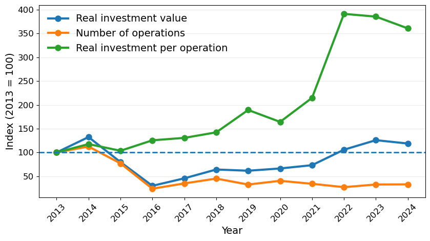
    


```python
print(
    figura2.loc[[2013, 2024]].round(2)
)
```

          Real investment value  Number of operations  \
    Ano                                                 
    2013               100.0000              100.0000   
    2024               118.8100               32.9200   
    
          Real investment per operation  
    Ano                                  
    2013                       100.0000  
    2024                       360.9400  
    

### Tabela para o artigo — síntese temporal e concentração territorial

Para sintetizar a evolução do crédito, foram selecionados cinco anos representativos
da série. A tabela combina cobertura territorial, evolução indexada do crédito e
medidas de concentração da distribuição estadual do valor real investido.


```python
anos_tabela = [2013, 2016, 2019, 2022, 2024]

tabela3 = pd.DataFrame(
    index=anos_tabela
)

tabela3.index.name = "Year"

# Cobertura territorial
tabela3["FUs with credit"] = (
    concentracao_anual.loc[
        anos_tabela,
        "UFs_com_credito"
    ]
)

# Índices temporais
tabela3["Investment index"] = (
    indices_2013.loc[
        anos_tabela,
        "VlInvestimento"
    ]
)

tabela3["Operations index"] = (
    indices_2013.loc[
        anos_tabela,
        "QtdInvestimento"
    ]
)

# Medidas de concentração do VALOR investido
tabela3["Gini"] = (
    concentracao_anual.loc[
        anos_tabela,
        "Gini_valor"
    ]
)

tabela3["HHI"] = (
    concentracao_anual.loc[
        anos_tabela,
        "HHI_valor"
    ]
)

# CR4 e CR5 armazenados como proporções -> converter para %
tabela3["CR4 (%)"] = (
    concentracao_anual.loc[
        anos_tabela,
        "CR4_valor"
    ] * 100
)

tabela3["CR5 (%)"] = (
    concentracao_anual.loc[
        anos_tabela,
        "CR5_valor"
    ] * 100
)

display(
    tabela3.round(
        {
            "FUs with credit": 0,
            "Investment index": 2,
            "Operations index": 2,
            "Gini": 4,
            "HHI": 4,
            "CR4 (%)": 2,
            "CR5 (%)": 2
        }
    )
)
```


<div>
<style scoped>
    .dataframe tbody tr th:only-of-type {
        vertical-align: middle;
    }

    .dataframe tbody tr th {
        vertical-align: top;
    }

    .dataframe thead th {
        text-align: right;
    }
</style>
<table border="1" class="dataframe">
  <thead>
    <tr style="text-align: right;">
      <th></th>
      <th>FUs with credit</th>
      <th>Investment index</th>
      <th>Operations index</th>
      <th>Gini</th>
      <th>HHI</th>
      <th>CR4 (%)</th>
      <th>CR5 (%)</th>
    </tr>
    <tr>
      <th>Year</th>
      <th></th>
      <th></th>
      <th></th>
      <th></th>
      <th></th>
      <th></th>
      <th></th>
    </tr>
  </thead>
  <tbody>
    <tr>
      <th>2013</th>
      <td>23</td>
      <td>100.0000</td>
      <td>100.0000</td>
      <td>0.6947</td>
      <td>0.1149</td>
      <td>60.3300</td>
      <td>70.4600</td>
    </tr>
    <tr>
      <th>2016</th>
      <td>19</td>
      <td>29.8800</td>
      <td>23.8000</td>
      <td>0.6455</td>
      <td>0.0997</td>
      <td>49.8700</td>
      <td>58.3600</td>
    </tr>
    <tr>
      <th>2019</th>
      <td>22</td>
      <td>61.6100</td>
      <td>32.5400</td>
      <td>0.6322</td>
      <td>0.0911</td>
      <td>47.9600</td>
      <td>56.1500</td>
    </tr>
    <tr>
      <th>2022</th>
      <td>21</td>
      <td>105.8200</td>
      <td>27.0300</td>
      <td>0.6855</td>
      <td>0.1142</td>
      <td>56.7100</td>
      <td>64.5200</td>
    </tr>
    <tr>
      <th>2024</th>
      <td>23</td>
      <td>118.8100</td>
      <td>32.9200</td>
      <td>0.7081</td>
      <td>0.1244</td>
      <td>63.8600</td>
      <td>70.7400</td>
    </tr>
  </tbody>
</table>
</div>


```python
# Gerar automaticamente as linhas LaTeX
tabela3_latex = tabela3.copy()

tabela3_latex["FUs with credit"] = (
    tabela3_latex["FUs with credit"].astype(int)
)

for ano, row in tabela3_latex.iterrows():

    linha = (
        f"{ano} & "
        f"{int(row['FUs with credit'])} & "
        f"{row['Investment index']:.2f} & "
        f"{row['Operations index']:.2f} & "
        f"{row['Gini']:.4f} & "
        f"{row['HHI']:.4f} & "
        f"{row['CR4 (%)']:.2f} & "
        f"{row['CR5 (%)']:.2f} \\\\"
    )

    print(linha)
```

    2013 & 23 & 100.00 & 100.00 & 0.6947 & 0.1149 & 60.33 & 70.46 \\
    2016 & 19 & 29.88 & 23.80 & 0.6455 & 0.0997 & 49.87 & 58.36 \\
    2019 & 22 & 61.61 & 32.54 & 0.6322 & 0.0911 & 47.96 & 56.15 \\
    2022 & 21 & 105.82 & 27.03 & 0.6855 & 0.1142 & 56.71 & 64.52 \\
    2024 & 23 & 118.81 & 32.92 & 0.7081 & 0.1244 & 63.86 & 70.74 \\
    

### 2.9 Concentração e distribuição territorial do crédito

A distribuição territorial do crédito foi examinada por meio das participações
anuais das UFs, das razões de concentração das quatro e cinco maiores
participações (CR4 e CR5), do índice de Herfindahl-Hirschman (HHI) e do
coeficiente de Gini. As medidas foram calculadas separadamente para o valor real
investido e para a quantidade de operações, preservando as UFs sem operação como
participações iguais a zero.

Os diferentes indicadores apresentam padrão temporal convergente. A concentração
territorial do valor investido diminuiu durante a primeira metade do período e
voltou a crescer nos anos finais da série. O coeficiente de Gini do valor passou
de 0,6947 em 2013 para 0,6079 em 2017, alcançando posteriormente 0,7083 em 2023
e 0,7081 em 2024. O HHI apresentou comportamento semelhante, passando de 0,1149
em 2013 para 0,0868 em 2017 e atingindo 0,1276 em 2023 e 0,1244 em 2024.

As razões de concentração corroboram esse padrão. As quatro UFs com maiores
valores investidos concentravam 60,33% dos recursos em 2013. Essa participação
diminuiu para valores inferiores a 50% entre 2016 e 2019, mas voltou a crescer,
atingindo 63,74% em 2023 e 63,86% em 2024. Considerando as cinco maiores UFs, a
participação alcançou 70,74% do valor total em 2024.

A evolução da concentração não corresponde simplesmente à cobertura territorial
do crédito. Em 2024, 23 das 27 UFs apresentaram operações, mesma quantidade
observada em 2013, embora as cinco maiores participações concentrassem
aproximadamente 71% do volume financeiro. Assim, a presença de operações em
grande parte das unidades territoriais coexistiu com distribuição fortemente
assimétrica dos valores investidos.

A composição das UFs com maiores participações também se modificou ao longo do
período. Entre 2013 e 2015, MG, MS, SP, GO e MT formaram de maneira estável o
grupo das cinco maiores participações, embora em posições distintas. Nos anos
intermediários, UFs como TO, BA e PA passaram a integrar esse grupo. Nos anos
finais, MT, MG e RS ganharam destaque, com Mato Grosso ocupando a primeira
posição entre 2020 e 2024. Sua participação no valor total alcançou 20,75% em
2022, 24,38% em 2023 e 21,15% em 2024.

A comparação entre valor financeiro e quantidade de operações revela ainda uma
distinção relevante. Em 2024, o Gini do valor investido foi de 0,7081, frente a
0,6735 para a quantidade de operações; o HHI foi de 0,1244 e 0,1132,
respectivamente. As quatro maiores participações concentraram 63,86% do valor e
58,96% das operações. Padrão semelhante é observado entre 2022 e 2024, indicando
que, nesse período, o volume financeiro apresentou concentração territorial
superior à quantidade de operações.

Esses resultados complementam a dinâmica temporal identificada anteriormente.
A recuperação do volume real de crédito nos anos finais da série ocorreu sem
recuperação equivalente do número de operações e foi acompanhada por aumento do
valor médio real por operação e por reconcentração territorial dos recursos.
Consequentemente, a evolução do crédito entre 2013 e 2024 não pode ser descrita
adequadamente apenas pelo volume financeiro agregado: ela envolve mudanças
simultâneas na cobertura territorial, na quantidade de operações, na intensidade
financeira e na distribuição dos recursos entre as UFs.

Os resultados são descritivos e não permitem concluir que a concentração decorra
de priorização institucional de determinadas UFs. Diferenças de escala econômica,
uso da terra, características produtivas, demanda por crédito e outras
heterogeneidades territoriais podem contribuir para o padrão observado. Essas
dimensões deverão ser consideradas nas etapas subsequentes antes de avaliar o
grau de alinhamento territorial entre crédito, características produtivas e
pressões ambientais.

## 2.10. Distribuição relativa e alinhamento territorial preliminar

### 2.10.1. Construção das participações relativas


```python
vars_referencia = [
    "Uso_Terra",
    "Emissoes",
    "PIB"
]

alinhamento = df[
    [
        "UF",
        "Ano",
        "VlInvestimento",
        "QtdInvestimento",
        "Uso_Terra",
        "Emissoes",
        "PIB",
        "SemOperacaoCredito"
    ]
].copy()


# Participação anual no valor do crédito
alinhamento["Share_Credito"] = (
    alinhamento["VlInvestimento"]
    / alinhamento.groupby("Ano")["VlInvestimento"].transform("sum")
)


# Participações anuais nas variáveis de referência
for var in vars_referencia:

    alinhamento[f"Share_{var}"] = (
        alinhamento[var]
        / alinhamento.groupby("Ano")[var].transform("sum")
    )


display(
    alinhamento.head()
)
```


<div>
<style scoped>
    .dataframe tbody tr th:only-of-type {
        vertical-align: middle;
    }

    .dataframe tbody tr th {
        vertical-align: top;
    }

    .dataframe thead th {
        text-align: right;
    }
</style>
<table border="1" class="dataframe">
  <thead>
    <tr style="text-align: right;">
      <th></th>
      <th>UF</th>
      <th>Ano</th>
      <th>VlInvestimento</th>
      <th>QtdInvestimento</th>
      <th>Uso_Terra</th>
      <th>Emissoes</th>
      <th>PIB</th>
      <th>SemOperacaoCredito</th>
      <th>Share_Credito</th>
      <th>Share_Uso_Terra</th>
      <th>Share_Emissoes</th>
      <th>Share_PIB</th>
    </tr>
  </thead>
  <tbody>
    <tr>
      <th>0</th>
      <td>AC</td>
      <td>2013</td>
      <td>26,913,562.0000</td>
      <td>172.0000</td>
      <td>1721189</td>
      <td>26503536</td>
      <td>23236732</td>
      <td>False</td>
      <td>0.0060</td>
      <td>0.0073</td>
      <td>0.0186</td>
      <td>0.0022</td>
    </tr>
    <tr>
      <th>1</th>
      <td>AC</td>
      <td>2014</td>
      <td>45,409,118.0000</td>
      <td>183.0000</td>
      <td>1755802</td>
      <td>28735408</td>
      <td>25273129</td>
      <td>False</td>
      <td>0.0076</td>
      <td>0.0074</td>
      <td>0.0211</td>
      <td>0.0023</td>
    </tr>
    <tr>
      <th>2</th>
      <td>AC</td>
      <td>2015</td>
      <td>24,135,465.0000</td>
      <td>119.0000</td>
      <td>1799895</td>
      <td>31866845</td>
      <td>23781907</td>
      <td>False</td>
      <td>0.0067</td>
      <td>0.0075</td>
      <td>0.0215</td>
      <td>0.0023</td>
    </tr>
    <tr>
      <th>3</th>
      <td>AC</td>
      <td>2016</td>
      <td>10,423,372.0000</td>
      <td>40.0000</td>
      <td>1830699</td>
      <td>28527812</td>
      <td>22211437</td>
      <td>False</td>
      <td>0.0077</td>
      <td>0.0076</td>
      <td>0.0192</td>
      <td>0.0022</td>
    </tr>
    <tr>
      <th>4</th>
      <td>AC</td>
      <td>2017</td>
      <td>10,699,673.0000</td>
      <td>41.0000</td>
      <td>1864772</td>
      <td>31319401</td>
      <td>22232824</td>
      <td>False</td>
      <td>0.0052</td>
      <td>0.0077</td>
      <td>0.0233</td>
      <td>0.0022</td>
    </tr>
  </tbody>
</table>
</div>


```python
print(
    alinhamento.head()
)
```

       UF   Ano  VlInvestimento  QtdInvestimento  Uso_Terra  Emissoes       PIB  \
    0  AC  2013 26,913,562.0000         172.0000    1721189  26503536  23236732   
    1  AC  2014 45,409,118.0000         183.0000    1755802  28735408  25273129   
    2  AC  2015 24,135,465.0000         119.0000    1799895  31866845  23781907   
    3  AC  2016 10,423,372.0000          40.0000    1830699  28527812  22211437   
    4  AC  2017 10,699,673.0000          41.0000    1864772  31319401  22232824   
    
       SemOperacaoCredito  Share_Credito  Share_Uso_Terra  Share_Emissoes  \
    0               False         0.0060           0.0073          0.0186   
    1               False         0.0076           0.0074          0.0211   
    2               False         0.0067           0.0075          0.0215   
    3               False         0.0077           0.0076          0.0192   
    4               False         0.0052           0.0077          0.0233   
    
       Share_PIB  
    0     0.0022  
    1     0.0023  
    2     0.0023  
    3     0.0022  
    4     0.0022  
    

### 2.10.2. Diferença e razão entre participações


```python
for var in vars_referencia:

    alinhamento[f"Gap_{var}"] = (
        alinhamento["Share_Credito"]
        - alinhamento[f"Share_{var}"]
    )

    alinhamento[f"Razao_{var}"] = (
        alinhamento["Share_Credito"]
        / alinhamento[f"Share_{var}"]
    )


cols_resultado = [
    "UF",
    "Ano",
    "Share_Credito",
    "Share_Uso_Terra",
    "Gap_Uso_Terra",
    "Razao_Uso_Terra",
    "Share_Emissoes",
    "Gap_Emissoes",
    "Razao_Emissoes",
    "Share_PIB",
    "Gap_PIB",
    "Razao_PIB"
]

display(
    alinhamento[cols_resultado]
    .round(4)
    .head(30)
)
```


<div>
<style scoped>
    .dataframe tbody tr th:only-of-type {
        vertical-align: middle;
    }

    .dataframe tbody tr th {
        vertical-align: top;
    }

    .dataframe thead th {
        text-align: right;
    }
</style>
<table border="1" class="dataframe">
  <thead>
    <tr style="text-align: right;">
      <th></th>
      <th>UF</th>
      <th>Ano</th>
      <th>Share_Credito</th>
      <th>Share_Uso_Terra</th>
      <th>Gap_Uso_Terra</th>
      <th>Razao_Uso_Terra</th>
      <th>Share_Emissoes</th>
      <th>Gap_Emissoes</th>
      <th>Razao_Emissoes</th>
      <th>Share_PIB</th>
      <th>Gap_PIB</th>
      <th>Razao_PIB</th>
    </tr>
  </thead>
  <tbody>
    <tr>
      <th>0</th>
      <td>AC</td>
      <td>2013</td>
      <td>0.0060</td>
      <td>0.0073</td>
      <td>-0.0013</td>
      <td>0.8181</td>
      <td>0.0186</td>
      <td>-0.0127</td>
      <td>0.3204</td>
      <td>0.0022</td>
      <td>0.0038</td>
      <td>2.7749</td>
    </tr>
    <tr>
      <th>1</th>
      <td>AC</td>
      <td>2014</td>
      <td>0.0076</td>
      <td>0.0074</td>
      <td>0.0002</td>
      <td>1.0278</td>
      <td>0.0211</td>
      <td>-0.0135</td>
      <td>0.3608</td>
      <td>0.0023</td>
      <td>0.0053</td>
      <td>3.2677</td>
    </tr>
    <tr>
      <th>2</th>
      <td>AC</td>
      <td>2015</td>
      <td>0.0067</td>
      <td>0.0075</td>
      <td>-0.0008</td>
      <td>0.8900</td>
      <td>0.0215</td>
      <td>-0.0147</td>
      <td>0.3127</td>
      <td>0.0023</td>
      <td>0.0044</td>
      <td>2.9524</td>
    </tr>
    <tr>
      <th>3</th>
      <td>AC</td>
      <td>2016</td>
      <td>0.0077</td>
      <td>0.0076</td>
      <td>0.0001</td>
      <td>1.0159</td>
      <td>0.0192</td>
      <td>-0.0115</td>
      <td>0.4021</td>
      <td>0.0022</td>
      <td>0.0055</td>
      <td>3.5279</td>
    </tr>
    <tr>
      <th>4</th>
      <td>AC</td>
      <td>2017</td>
      <td>0.0052</td>
      <td>0.0077</td>
      <td>-0.0025</td>
      <td>0.6743</td>
      <td>0.0233</td>
      <td>-0.0181</td>
      <td>0.2236</td>
      <td>0.0022</td>
      <td>0.0030</td>
      <td>2.4013</td>
    </tr>
    <tr>
      <th>5</th>
      <td>AC</td>
      <td>2018</td>
      <td>0.0061</td>
      <td>0.0079</td>
      <td>-0.0017</td>
      <td>0.7794</td>
      <td>0.0252</td>
      <td>-0.0191</td>
      <td>0.2435</td>
      <td>0.0022</td>
      <td>0.0040</td>
      <td>2.8049</td>
    </tr>
    <tr>
      <th>6</th>
      <td>AC</td>
      <td>2019</td>
      <td>0.0043</td>
      <td>0.0082</td>
      <td>-0.0039</td>
      <td>0.5285</td>
      <td>0.0380</td>
      <td>-0.0337</td>
      <td>0.1136</td>
      <td>0.0021</td>
      <td>0.0022</td>
      <td>2.0430</td>
    </tr>
    <tr>
      <th>7</th>
      <td>AC</td>
      <td>2020</td>
      <td>0.0007</td>
      <td>0.0085</td>
      <td>-0.0078</td>
      <td>0.0797</td>
      <td>0.0388</td>
      <td>-0.0381</td>
      <td>0.0174</td>
      <td>0.0022</td>
      <td>-0.0015</td>
      <td>0.3120</td>
    </tr>
    <tr>
      <th>8</th>
      <td>AC</td>
      <td>2021</td>
      <td>0.0033</td>
      <td>0.0088</td>
      <td>-0.0055</td>
      <td>0.3732</td>
      <td>0.0381</td>
      <td>-0.0348</td>
      <td>0.0862</td>
      <td>0.0024</td>
      <td>0.0009</td>
      <td>1.3844</td>
    </tr>
    <tr>
      <th>9</th>
      <td>AC</td>
      <td>2022</td>
      <td>0.0043</td>
      <td>0.0092</td>
      <td>-0.0049</td>
      <td>0.4646</td>
      <td>0.0439</td>
      <td>-0.0396</td>
      <td>0.0969</td>
      <td>0.0023</td>
      <td>0.0019</td>
      <td>1.8108</td>
    </tr>
    <tr>
      <th>10</th>
      <td>AC</td>
      <td>2023</td>
      <td>0.0035</td>
      <td>0.0093</td>
      <td>-0.0058</td>
      <td>0.3751</td>
      <td>0.0257</td>
      <td>-0.0222</td>
      <td>0.1356</td>
      <td>0.0024</td>
      <td>0.0011</td>
      <td>1.4498</td>
    </tr>
    <tr>
      <th>11</th>
      <td>AC</td>
      <td>2024</td>
      <td>0.0006</td>
      <td>0.0094</td>
      <td>-0.0088</td>
      <td>0.0634</td>
      <td>0.0303</td>
      <td>-0.0297</td>
      <td>0.0197</td>
      <td>0.0024</td>
      <td>-0.0018</td>
      <td>0.2477</td>
    </tr>
    <tr>
      <th>12</th>
      <td>AL</td>
      <td>2013</td>
      <td>0.0000</td>
      <td>0.0087</td>
      <td>-0.0087</td>
      <td>0.0000</td>
      <td>0.0033</td>
      <td>-0.0033</td>
      <td>0.0000</td>
      <td>0.0070</td>
      <td>-0.0070</td>
      <td>0.0000</td>
    </tr>
    <tr>
      <th>13</th>
      <td>AL</td>
      <td>2014</td>
      <td>0.0003</td>
      <td>0.0087</td>
      <td>-0.0084</td>
      <td>0.0329</td>
      <td>0.0036</td>
      <td>-0.0033</td>
      <td>0.0801</td>
      <td>0.0071</td>
      <td>-0.0068</td>
      <td>0.0403</td>
    </tr>
    <tr>
      <th>14</th>
      <td>AL</td>
      <td>2015</td>
      <td>0.0003</td>
      <td>0.0086</td>
      <td>-0.0083</td>
      <td>0.0381</td>
      <td>0.0032</td>
      <td>-0.0029</td>
      <td>0.1017</td>
      <td>0.0077</td>
      <td>-0.0074</td>
      <td>0.0424</td>
    </tr>
    <tr>
      <th>15</th>
      <td>AL</td>
      <td>2016</td>
      <td>0.0000</td>
      <td>0.0086</td>
      <td>-0.0086</td>
      <td>0.0000</td>
      <td>0.0032</td>
      <td>-0.0032</td>
      <td>0.0000</td>
      <td>0.0079</td>
      <td>-0.0079</td>
      <td>0.0000</td>
    </tr>
    <tr>
      <th>16</th>
      <td>AL</td>
      <td>2017</td>
      <td>0.0008</td>
      <td>0.0085</td>
      <td>-0.0077</td>
      <td>0.0904</td>
      <td>0.0039</td>
      <td>-0.0032</td>
      <td>0.1953</td>
      <td>0.0080</td>
      <td>-0.0073</td>
      <td>0.0959</td>
    </tr>
    <tr>
      <th>17</th>
      <td>AL</td>
      <td>2018</td>
      <td>0.0015</td>
      <td>0.0085</td>
      <td>-0.0069</td>
      <td>0.1812</td>
      <td>0.0037</td>
      <td>-0.0022</td>
      <td>0.4146</td>
      <td>0.0078</td>
      <td>-0.0062</td>
      <td>0.1972</td>
    </tr>
    <tr>
      <th>18</th>
      <td>AL</td>
      <td>2019</td>
      <td>0.0001</td>
      <td>0.0084</td>
      <td>-0.0083</td>
      <td>0.0094</td>
      <td>0.0026</td>
      <td>-0.0025</td>
      <td>0.0306</td>
      <td>0.0080</td>
      <td>-0.0079</td>
      <td>0.0099</td>
    </tr>
    <tr>
      <th>19</th>
      <td>AL</td>
      <td>2020</td>
      <td>0.0000</td>
      <td>0.0083</td>
      <td>-0.0083</td>
      <td>0.0000</td>
      <td>0.0025</td>
      <td>-0.0025</td>
      <td>0.0000</td>
      <td>0.0083</td>
      <td>-0.0083</td>
      <td>0.0000</td>
    </tr>
    <tr>
      <th>20</th>
      <td>AL</td>
      <td>2021</td>
      <td>0.0001</td>
      <td>0.0082</td>
      <td>-0.0081</td>
      <td>0.0139</td>
      <td>0.0024</td>
      <td>-0.0022</td>
      <td>0.0482</td>
      <td>0.0085</td>
      <td>-0.0083</td>
      <td>0.0134</td>
    </tr>
    <tr>
      <th>21</th>
      <td>AL</td>
      <td>2022</td>
      <td>0.0000</td>
      <td>0.0081</td>
      <td>-0.0081</td>
      <td>0.0000</td>
      <td>0.0023</td>
      <td>-0.0023</td>
      <td>0.0000</td>
      <td>0.0075</td>
      <td>-0.0075</td>
      <td>0.0000</td>
    </tr>
    <tr>
      <th>22</th>
      <td>AL</td>
      <td>2023</td>
      <td>0.0000</td>
      <td>0.0080</td>
      <td>-0.0080</td>
      <td>0.0038</td>
      <td>0.0028</td>
      <td>-0.0027</td>
      <td>0.0110</td>
      <td>0.0082</td>
      <td>-0.0082</td>
      <td>0.0037</td>
    </tr>
    <tr>
      <th>23</th>
      <td>AL</td>
      <td>2024</td>
      <td>0.0005</td>
      <td>0.0080</td>
      <td>-0.0075</td>
      <td>0.0621</td>
      <td>0.0031</td>
      <td>-0.0026</td>
      <td>0.1586</td>
      <td>0.0081</td>
      <td>-0.0076</td>
      <td>0.0615</td>
    </tr>
    <tr>
      <th>24</th>
      <td>AM</td>
      <td>2013</td>
      <td>0.0000</td>
      <td>0.0057</td>
      <td>-0.0057</td>
      <td>0.0000</td>
      <td>0.0290</td>
      <td>-0.0290</td>
      <td>0.0000</td>
      <td>0.0156</td>
      <td>-0.0156</td>
      <td>0.0000</td>
    </tr>
    <tr>
      <th>25</th>
      <td>AM</td>
      <td>2014</td>
      <td>0.0004</td>
      <td>0.0058</td>
      <td>-0.0055</td>
      <td>0.0629</td>
      <td>0.0303</td>
      <td>-0.0299</td>
      <td>0.0122</td>
      <td>0.0150</td>
      <td>-0.0146</td>
      <td>0.0245</td>
    </tr>
    <tr>
      <th>26</th>
      <td>AM</td>
      <td>2015</td>
      <td>0.0002</td>
      <td>0.0062</td>
      <td>-0.0060</td>
      <td>0.0390</td>
      <td>0.0435</td>
      <td>-0.0432</td>
      <td>0.0056</td>
      <td>0.0144</td>
      <td>-0.0142</td>
      <td>0.0168</td>
    </tr>
    <tr>
      <th>27</th>
      <td>AM</td>
      <td>2016</td>
      <td>0.0000</td>
      <td>0.0068</td>
      <td>-0.0068</td>
      <td>0.0000</td>
      <td>0.0632</td>
      <td>-0.0632</td>
      <td>0.0000</td>
      <td>0.0142</td>
      <td>-0.0142</td>
      <td>0.0000</td>
    </tr>
    <tr>
      <th>28</th>
      <td>AM</td>
      <td>2017</td>
      <td>0.0003</td>
      <td>0.0071</td>
      <td>-0.0068</td>
      <td>0.0408</td>
      <td>0.0486</td>
      <td>-0.0484</td>
      <td>0.0060</td>
      <td>0.0142</td>
      <td>-0.0139</td>
      <td>0.0205</td>
    </tr>
    <tr>
      <th>29</th>
      <td>AM</td>
      <td>2018</td>
      <td>0.0009</td>
      <td>0.0073</td>
      <td>-0.0064</td>
      <td>0.1239</td>
      <td>0.0450</td>
      <td>-0.0441</td>
      <td>0.0201</td>
      <td>0.0143</td>
      <td>-0.0134</td>
      <td>0.0634</td>
    </tr>
  </tbody>
</table>
</div>


```python
print(
    alinhamento[cols_resultado]
    .round(4)
    .head(30)
)
```

        UF   Ano  Share_Credito  Share_Uso_Terra  Gap_Uso_Terra  Razao_Uso_Terra  \
    0   AC  2013         0.0060           0.0073        -0.0013           0.8181   
    1   AC  2014         0.0076           0.0074         0.0002           1.0278   
    2   AC  2015         0.0067           0.0075        -0.0008           0.8900   
    3   AC  2016         0.0077           0.0076         0.0001           1.0159   
    4   AC  2017         0.0052           0.0077        -0.0025           0.6743   
    5   AC  2018         0.0061           0.0079        -0.0017           0.7794   
    6   AC  2019         0.0043           0.0082        -0.0039           0.5285   
    7   AC  2020         0.0007           0.0085        -0.0078           0.0797   
    8   AC  2021         0.0033           0.0088        -0.0055           0.3732   
    9   AC  2022         0.0043           0.0092        -0.0049           0.4646   
    10  AC  2023         0.0035           0.0093        -0.0058           0.3751   
    11  AC  2024         0.0006           0.0094        -0.0088           0.0634   
    12  AL  2013         0.0000           0.0087        -0.0087           0.0000   
    13  AL  2014         0.0003           0.0087        -0.0084           0.0329   
    14  AL  2015         0.0003           0.0086        -0.0083           0.0381   
    15  AL  2016         0.0000           0.0086        -0.0086           0.0000   
    16  AL  2017         0.0008           0.0085        -0.0077           0.0904   
    17  AL  2018         0.0015           0.0085        -0.0069           0.1812   
    18  AL  2019         0.0001           0.0084        -0.0083           0.0094   
    19  AL  2020         0.0000           0.0083        -0.0083           0.0000   
    20  AL  2021         0.0001           0.0082        -0.0081           0.0139   
    21  AL  2022         0.0000           0.0081        -0.0081           0.0000   
    22  AL  2023         0.0000           0.0080        -0.0080           0.0038   
    23  AL  2024         0.0005           0.0080        -0.0075           0.0621   
    24  AM  2013         0.0000           0.0057        -0.0057           0.0000   
    25  AM  2014         0.0004           0.0058        -0.0055           0.0629   
    26  AM  2015         0.0002           0.0062        -0.0060           0.0390   
    27  AM  2016         0.0000           0.0068        -0.0068           0.0000   
    28  AM  2017         0.0003           0.0071        -0.0068           0.0408   
    29  AM  2018         0.0009           0.0073        -0.0064           0.1239   
    
        Share_Emissoes  Gap_Emissoes  Razao_Emissoes  Share_PIB  Gap_PIB  \
    0           0.0186       -0.0127          0.3204     0.0022   0.0038   
    1           0.0211       -0.0135          0.3608     0.0023   0.0053   
    2           0.0215       -0.0147          0.3127     0.0023   0.0044   
    3           0.0192       -0.0115          0.4021     0.0022   0.0055   
    4           0.0233       -0.0181          0.2236     0.0022   0.0030   
    5           0.0252       -0.0191          0.2435     0.0022   0.0040   
    6           0.0380       -0.0337          0.1136     0.0021   0.0022   
    7           0.0388       -0.0381          0.0174     0.0022  -0.0015   
    8           0.0381       -0.0348          0.0862     0.0024   0.0009   
    9           0.0439       -0.0396          0.0969     0.0023   0.0019   
    10          0.0257       -0.0222          0.1356     0.0024   0.0011   
    11          0.0303       -0.0297          0.0197     0.0024  -0.0018   
    12          0.0033       -0.0033          0.0000     0.0070  -0.0070   
    13          0.0036       -0.0033          0.0801     0.0071  -0.0068   
    14          0.0032       -0.0029          0.1017     0.0077  -0.0074   
    15          0.0032       -0.0032          0.0000     0.0079  -0.0079   
    16          0.0039       -0.0032          0.1953     0.0080  -0.0073   
    17          0.0037       -0.0022          0.4146     0.0078  -0.0062   
    18          0.0026       -0.0025          0.0306     0.0080  -0.0079   
    19          0.0025       -0.0025          0.0000     0.0083  -0.0083   
    20          0.0024       -0.0022          0.0482     0.0085  -0.0083   
    21          0.0023       -0.0023          0.0000     0.0075  -0.0075   
    22          0.0028       -0.0027          0.0110     0.0082  -0.0082   
    23          0.0031       -0.0026          0.1586     0.0081  -0.0076   
    24          0.0290       -0.0290          0.0000     0.0156  -0.0156   
    25          0.0303       -0.0299          0.0122     0.0150  -0.0146   
    26          0.0435       -0.0432          0.0056     0.0144  -0.0142   
    27          0.0632       -0.0632          0.0000     0.0142  -0.0142   
    28          0.0486       -0.0484          0.0060     0.0142  -0.0139   
    29          0.0450       -0.0441          0.0201     0.0143  -0.0134   
    
        Razao_PIB  
    0      2.7749  
    1      3.2677  
    2      2.9524  
    3      3.5279  
    4      2.4013  
    5      2.8049  
    6      2.0430  
    7      0.3120  
    8      1.3844  
    9      1.8108  
    10     1.4498  
    11     0.2477  
    12     0.0000  
    13     0.0403  
    14     0.0424  
    15     0.0000  
    16     0.0959  
    17     0.1972  
    18     0.0099  
    19     0.0000  
    20     0.0134  
    21     0.0000  
    22     0.0037  
    23     0.0615  
    24     0.0000  
    25     0.0245  
    26     0.0168  
    27     0.0000  
    28     0.0205  
    29     0.0634  
    

### 2.10.3. Diagnóstico territorial — 2024


```python
diag_2024 = (
    alinhamento[
        alinhamento["Ano"] == 2024
    ][cols_resultado]
    .sort_values(
        "Share_Credito",
        ascending=False
    )
)

display(
    diag_2024.round(4)
)
```


<div>
<style scoped>
    .dataframe tbody tr th:only-of-type {
        vertical-align: middle;
    }

    .dataframe tbody tr th {
        vertical-align: top;
    }

    .dataframe thead th {
        text-align: right;
    }
</style>
<table border="1" class="dataframe">
  <thead>
    <tr style="text-align: right;">
      <th></th>
      <th>UF</th>
      <th>Ano</th>
      <th>Share_Credito</th>
      <th>Share_Uso_Terra</th>
      <th>Gap_Uso_Terra</th>
      <th>Razao_Uso_Terra</th>
      <th>Share_Emissoes</th>
      <th>Gap_Emissoes</th>
      <th>Razao_Emissoes</th>
      <th>Share_PIB</th>
      <th>Gap_PIB</th>
      <th>Razao_PIB</th>
    </tr>
  </thead>
  <tbody>
    <tr>
      <th>155</th>
      <td>MT</td>
      <td>2024</td>
      <td>0.2115</td>
      <td>0.1294</td>
      <td>0.0821</td>
      <td>1.6348</td>
      <td>0.1488</td>
      <td>0.0627</td>
      <td>1.4216</td>
      <td>0.0266</td>
      <td>0.1850</td>
      <td>7.9565</td>
    </tr>
    <tr>
      <th>131</th>
      <td>MG</td>
      <td>2024</td>
      <td>0.1713</td>
      <td>0.1182</td>
      <td>0.0531</td>
      <td>1.4490</td>
      <td>0.0737</td>
      <td>0.0976</td>
      <td>2.3251</td>
      <td>0.0911</td>
      <td>0.0802</td>
      <td>1.8804</td>
    </tr>
    <tr>
      <th>275</th>
      <td>RS</td>
      <td>2024</td>
      <td>0.1613</td>
      <td>0.0479</td>
      <td>0.1134</td>
      <td>3.3690</td>
      <td>0.0418</td>
      <td>0.1195</td>
      <td>3.8591</td>
      <td>0.0593</td>
      <td>0.1020</td>
      <td>2.7210</td>
    </tr>
    <tr>
      <th>107</th>
      <td>GO</td>
      <td>2024</td>
      <td>0.0945</td>
      <td>0.0827</td>
      <td>0.0118</td>
      <td>1.1428</td>
      <td>0.0476</td>
      <td>0.0469</td>
      <td>1.9836</td>
      <td>0.0313</td>
      <td>0.0632</td>
      <td>3.0200</td>
    </tr>
    <tr>
      <th>311</th>
      <td>SP</td>
      <td>2024</td>
      <td>0.0688</td>
      <td>0.0650</td>
      <td>0.0038</td>
      <td>1.0585</td>
      <td>0.0297</td>
      <td>0.0390</td>
      <td>2.3126</td>
      <td>0.3087</td>
      <td>-0.2399</td>
      <td>0.2228</td>
    </tr>
    <tr>
      <th>59</th>
      <td>BA</td>
      <td>2024</td>
      <td>0.0560</td>
      <td>0.0886</td>
      <td>-0.0327</td>
      <td>0.6314</td>
      <td>0.0552</td>
      <td>0.0008</td>
      <td>1.0146</td>
      <td>0.0392</td>
      <td>0.0167</td>
      <td>1.4262</td>
    </tr>
    <tr>
      <th>143</th>
      <td>MS</td>
      <td>2024</td>
      <td>0.0477</td>
      <td>0.0746</td>
      <td>-0.0269</td>
      <td>0.6399</td>
      <td>0.0273</td>
      <td>0.0204</td>
      <td>1.7488</td>
      <td>0.0169</td>
      <td>0.0308</td>
      <td>2.8231</td>
    </tr>
    <tr>
      <th>323</th>
      <td>TO</td>
      <td>2024</td>
      <td>0.0389</td>
      <td>0.0383</td>
      <td>0.0006</td>
      <td>1.0166</td>
      <td>0.0440</td>
      <td>-0.0050</td>
      <td>0.8858</td>
      <td>0.0060</td>
      <td>0.0330</td>
      <td>6.5112</td>
    </tr>
    <tr>
      <th>167</th>
      <td>PA</td>
      <td>2024</td>
      <td>0.0377</td>
      <td>0.0890</td>
      <td>-0.0513</td>
      <td>0.4234</td>
      <td>0.1761</td>
      <td>-0.1384</td>
      <td>0.2139</td>
      <td>0.0251</td>
      <td>0.0125</td>
      <td>1.4990</td>
    </tr>
    <tr>
      <th>215</th>
      <td>PR</td>
      <td>2024</td>
      <td>0.0304</td>
      <td>0.0475</td>
      <td>-0.0171</td>
      <td>0.6402</td>
      <td>0.0193</td>
      <td>0.0111</td>
      <td>1.5730</td>
      <td>0.0608</td>
      <td>-0.0304</td>
      <td>0.5003</td>
    </tr>
    <tr>
      <th>119</th>
      <td>MA</td>
      <td>2024</td>
      <td>0.0301</td>
      <td>0.0435</td>
      <td>-0.0134</td>
      <td>0.6916</td>
      <td>0.0781</td>
      <td>-0.0480</td>
      <td>0.3854</td>
      <td>0.0138</td>
      <td>0.0163</td>
      <td>2.1823</td>
    </tr>
    <tr>
      <th>203</th>
      <td>PI</td>
      <td>2024</td>
      <td>0.0159</td>
      <td>0.0164</td>
      <td>-0.0005</td>
      <td>0.9722</td>
      <td>0.0315</td>
      <td>-0.0156</td>
      <td>0.5050</td>
      <td>0.0074</td>
      <td>0.0086</td>
      <td>2.1617</td>
    </tr>
    <tr>
      <th>287</th>
      <td>SC</td>
      <td>2024</td>
      <td>0.0110</td>
      <td>0.0136</td>
      <td>-0.0026</td>
      <td>0.8112</td>
      <td>0.0067</td>
      <td>0.0043</td>
      <td>1.6354</td>
      <td>0.0479</td>
      <td>-0.0369</td>
      <td>0.2300</td>
    </tr>
    <tr>
      <th>251</th>
      <td>RO</td>
      <td>2024</td>
      <td>0.0084</td>
      <td>0.0355</td>
      <td>-0.0271</td>
      <td>0.2366</td>
      <td>0.0522</td>
      <td>-0.0438</td>
      <td>0.1609</td>
      <td>0.0068</td>
      <td>0.0016</td>
      <td>1.2314</td>
    </tr>
    <tr>
      <th>95</th>
      <td>ES</td>
      <td>2024</td>
      <td>0.0053</td>
      <td>0.0111</td>
      <td>-0.0058</td>
      <td>0.4749</td>
      <td>0.0040</td>
      <td>0.0013</td>
      <td>1.3213</td>
      <td>0.0193</td>
      <td>-0.0140</td>
      <td>0.2731</td>
    </tr>
    <tr>
      <th>263</th>
      <td>RR</td>
      <td>2024</td>
      <td>0.0053</td>
      <td>0.0047</td>
      <td>0.0005</td>
      <td>1.1058</td>
      <td>0.0283</td>
      <td>-0.0230</td>
      <td>0.1858</td>
      <td>0.0022</td>
      <td>0.0030</td>
      <td>2.3362</td>
    </tr>
    <tr>
      <th>227</th>
      <td>RJ</td>
      <td>2024</td>
      <td>0.0021</td>
      <td>0.0092</td>
      <td>-0.0072</td>
      <td>0.2244</td>
      <td>0.0054</td>
      <td>-0.0034</td>
      <td>0.3810</td>
      <td>0.1095</td>
      <td>-0.1074</td>
      <td>0.0189</td>
    </tr>
    <tr>
      <th>191</th>
      <td>PE</td>
      <td>2024</td>
      <td>0.0014</td>
      <td>0.0155</td>
      <td>-0.0141</td>
      <td>0.0906</td>
      <td>0.0087</td>
      <td>-0.0073</td>
      <td>0.1623</td>
      <td>0.0240</td>
      <td>-0.0226</td>
      <td>0.0586</td>
    </tr>
    <tr>
      <th>239</th>
      <td>RN</td>
      <td>2024</td>
      <td>0.0008</td>
      <td>0.0085</td>
      <td>-0.0078</td>
      <td>0.0909</td>
      <td>0.0034</td>
      <td>-0.0026</td>
      <td>0.2312</td>
      <td>0.0091</td>
      <td>-0.0083</td>
      <td>0.0851</td>
    </tr>
    <tr>
      <th>11</th>
      <td>AC</td>
      <td>2024</td>
      <td>0.0006</td>
      <td>0.0094</td>
      <td>-0.0088</td>
      <td>0.0634</td>
      <td>0.0303</td>
      <td>-0.0297</td>
      <td>0.0197</td>
      <td>0.0024</td>
      <td>-0.0018</td>
      <td>0.2477</td>
    </tr>
    <tr>
      <th>23</th>
      <td>AL</td>
      <td>2024</td>
      <td>0.0005</td>
      <td>0.0080</td>
      <td>-0.0075</td>
      <td>0.0621</td>
      <td>0.0031</td>
      <td>-0.0026</td>
      <td>0.1586</td>
      <td>0.0081</td>
      <td>-0.0076</td>
      <td>0.0615</td>
    </tr>
    <tr>
      <th>71</th>
      <td>CE</td>
      <td>2024</td>
      <td>0.0003</td>
      <td>0.0155</td>
      <td>-0.0152</td>
      <td>0.0202</td>
      <td>0.0161</td>
      <td>-0.0158</td>
      <td>0.0195</td>
      <td>0.0211</td>
      <td>-0.0208</td>
      <td>0.0149</td>
    </tr>
    <tr>
      <th>299</th>
      <td>SE</td>
      <td>2024</td>
      <td>0.0002</td>
      <td>0.0062</td>
      <td>-0.0060</td>
      <td>0.0384</td>
      <td>0.0031</td>
      <td>-0.0028</td>
      <td>0.0773</td>
      <td>0.0056</td>
      <td>-0.0053</td>
      <td>0.0430</td>
    </tr>
    <tr>
      <th>47</th>
      <td>AP</td>
      <td>2024</td>
      <td>0.0000</td>
      <td>0.0003</td>
      <td>-0.0003</td>
      <td>0.0000</td>
      <td>0.0010</td>
      <td>-0.0010</td>
      <td>0.0000</td>
      <td>0.0024</td>
      <td>-0.0024</td>
      <td>0.0000</td>
    </tr>
    <tr>
      <th>83</th>
      <td>DF</td>
      <td>2024</td>
      <td>0.0000</td>
      <td>0.0008</td>
      <td>-0.0008</td>
      <td>0.0000</td>
      <td>0.0006</td>
      <td>-0.0006</td>
      <td>0.0000</td>
      <td>0.0320</td>
      <td>-0.0320</td>
      <td>0.0000</td>
    </tr>
    <tr>
      <th>35</th>
      <td>AM</td>
      <td>2024</td>
      <td>0.0000</td>
      <td>0.0114</td>
      <td>-0.0114</td>
      <td>0.0000</td>
      <td>0.0602</td>
      <td>-0.0602</td>
      <td>0.0000</td>
      <td>0.0148</td>
      <td>-0.0148</td>
      <td>0.0000</td>
    </tr>
    <tr>
      <th>179</th>
      <td>PB</td>
      <td>2024</td>
      <td>0.0000</td>
      <td>0.0090</td>
      <td>-0.0090</td>
      <td>0.0000</td>
      <td>0.0039</td>
      <td>-0.0039</td>
      <td>0.0000</td>
      <td>0.0086</td>
      <td>-0.0086</td>
      <td>0.0000</td>
    </tr>
  </tbody>
</table>
</div>


```python
print(
    diag_2024.round(4)
)
```

         UF   Ano  Share_Credito  Share_Uso_Terra  Gap_Uso_Terra  Razao_Uso_Terra  \
    155  MT  2024         0.2115           0.1294         0.0821           1.6348   
    131  MG  2024         0.1713           0.1182         0.0531           1.4490   
    275  RS  2024         0.1613           0.0479         0.1134           3.3690   
    107  GO  2024         0.0945           0.0827         0.0118           1.1428   
    311  SP  2024         0.0688           0.0650         0.0038           1.0585   
    59   BA  2024         0.0560           0.0886        -0.0327           0.6314   
    143  MS  2024         0.0477           0.0746        -0.0269           0.6399   
    323  TO  2024         0.0389           0.0383         0.0006           1.0166   
    167  PA  2024         0.0377           0.0890        -0.0513           0.4234   
    215  PR  2024         0.0304           0.0475        -0.0171           0.6402   
    119  MA  2024         0.0301           0.0435        -0.0134           0.6916   
    203  PI  2024         0.0159           0.0164        -0.0005           0.9722   
    287  SC  2024         0.0110           0.0136        -0.0026           0.8112   
    251  RO  2024         0.0084           0.0355        -0.0271           0.2366   
    95   ES  2024         0.0053           0.0111        -0.0058           0.4749   
    263  RR  2024         0.0053           0.0047         0.0005           1.1058   
    227  RJ  2024         0.0021           0.0092        -0.0072           0.2244   
    191  PE  2024         0.0014           0.0155        -0.0141           0.0906   
    239  RN  2024         0.0008           0.0085        -0.0078           0.0909   
    11   AC  2024         0.0006           0.0094        -0.0088           0.0634   
    23   AL  2024         0.0005           0.0080        -0.0075           0.0621   
    71   CE  2024         0.0003           0.0155        -0.0152           0.0202   
    299  SE  2024         0.0002           0.0062        -0.0060           0.0384   
    47   AP  2024         0.0000           0.0003        -0.0003           0.0000   
    83   DF  2024         0.0000           0.0008        -0.0008           0.0000   
    35   AM  2024         0.0000           0.0114        -0.0114           0.0000   
    179  PB  2024         0.0000           0.0090        -0.0090           0.0000   
    
         Share_Emissoes  Gap_Emissoes  Razao_Emissoes  Share_PIB  Gap_PIB  \
    155          0.1488        0.0627          1.4216     0.0266   0.1850   
    131          0.0737        0.0976          2.3251     0.0911   0.0802   
    275          0.0418        0.1195          3.8591     0.0593   0.1020   
    107          0.0476        0.0469          1.9836     0.0313   0.0632   
    311          0.0297        0.0390          2.3126     0.3087  -0.2399   
    59           0.0552        0.0008          1.0146     0.0392   0.0167   
    143          0.0273        0.0204          1.7488     0.0169   0.0308   
    323          0.0440       -0.0050          0.8858     0.0060   0.0330   
    167          0.1761       -0.1384          0.2139     0.0251   0.0125   
    215          0.0193        0.0111          1.5730     0.0608  -0.0304   
    119          0.0781       -0.0480          0.3854     0.0138   0.0163   
    203          0.0315       -0.0156          0.5050     0.0074   0.0086   
    287          0.0067        0.0043          1.6354     0.0479  -0.0369   
    251          0.0522       -0.0438          0.1609     0.0068   0.0016   
    95           0.0040        0.0013          1.3213     0.0193  -0.0140   
    263          0.0283       -0.0230          0.1858     0.0022   0.0030   
    227          0.0054       -0.0034          0.3810     0.1095  -0.1074   
    191          0.0087       -0.0073          0.1623     0.0240  -0.0226   
    239          0.0034       -0.0026          0.2312     0.0091  -0.0083   
    11           0.0303       -0.0297          0.0197     0.0024  -0.0018   
    23           0.0031       -0.0026          0.1586     0.0081  -0.0076   
    71           0.0161       -0.0158          0.0195     0.0211  -0.0208   
    299          0.0031       -0.0028          0.0773     0.0056  -0.0053   
    47           0.0010       -0.0010          0.0000     0.0024  -0.0024   
    83           0.0006       -0.0006          0.0000     0.0320  -0.0320   
    35           0.0602       -0.0602          0.0000     0.0148  -0.0148   
    179          0.0039       -0.0039          0.0000     0.0086  -0.0086   
    
         Razao_PIB  
    155     7.9565  
    131     1.8804  
    275     2.7210  
    107     3.0200  
    311     0.2228  
    59      1.4262  
    143     2.8231  
    323     6.5112  
    167     1.4990  
    215     0.5003  
    119     2.1823  
    203     2.1617  
    287     0.2300  
    251     1.2314  
    95      0.2731  
    263     2.3362  
    227     0.0189  
    191     0.0586  
    239     0.0851  
    11      0.2477  
    23      0.0615  
    71      0.0149  
    299     0.0430  
    47      0.0000  
    83      0.0000  
    35      0.0000  
    179     0.0000  
    

### 2.10.4. Perfil territorial médio — 2013 a 2024


```python
perfil_medio_uf = (
    alinhamento
    .groupby("UF")
    .agg(
        Share_Credito_media=("Share_Credito", "mean"),

        Share_Uso_Terra_media=("Share_Uso_Terra", "mean"),
        Gap_Uso_Terra_medio=("Gap_Uso_Terra", "mean"),
        Razao_Uso_Terra_mediana=("Razao_Uso_Terra", "median"),

        Share_Emissoes_media=("Share_Emissoes", "mean"),
        Gap_Emissoes_medio=("Gap_Emissoes", "mean"),
        Razao_Emissoes_mediana=("Razao_Emissoes", "median"),

        Share_PIB_media=("Share_PIB", "mean"),
        Gap_PIB_medio=("Gap_PIB", "mean"),
        Razao_PIB_mediana=("Razao_PIB", "median")
    )
    .sort_values(
        "Share_Credito_media",
        ascending=False
    )
)

display(
    perfil_medio_uf.round(4)
)
```


<div>
<style scoped>
    .dataframe tbody tr th:only-of-type {
        vertical-align: middle;
    }

    .dataframe tbody tr th {
        vertical-align: top;
    }

    .dataframe thead th {
        text-align: right;
    }
</style>
<table border="1" class="dataframe">
  <thead>
    <tr style="text-align: right;">
      <th></th>
      <th>Share_Credito_media</th>
      <th>Share_Uso_Terra_media</th>
      <th>Gap_Uso_Terra_medio</th>
      <th>Razao_Uso_Terra_mediana</th>
      <th>Share_Emissoes_media</th>
      <th>Gap_Emissoes_medio</th>
      <th>Razao_Emissoes_mediana</th>
      <th>Share_PIB_media</th>
      <th>Gap_PIB_medio</th>
      <th>Razao_PIB_mediana</th>
    </tr>
    <tr>
      <th>UF</th>
      <th></th>
      <th></th>
      <th></th>
      <th></th>
      <th></th>
      <th></th>
      <th></th>
      <th></th>
      <th></th>
      <th></th>
    </tr>
  </thead>
  <tbody>
    <tr>
      <th>MG</th>
      <td>0.1576</td>
      <td>0.1223</td>
      <td>0.0352</td>
      <td>1.3213</td>
      <td>0.0595</td>
      <td>0.0980</td>
      <td>2.6671</td>
      <td>0.0894</td>
      <td>0.0682</td>
      <td>1.8033</td>
    </tr>
    <tr>
      <th>MT</th>
      <td>0.1356</td>
      <td>0.1298</td>
      <td>0.0057</td>
      <td>0.9029</td>
      <td>0.1513</td>
      <td>-0.0157</td>
      <td>0.7645</td>
      <td>0.0214</td>
      <td>0.1142</td>
      <td>5.8969</td>
    </tr>
    <tr>
      <th>GO</th>
      <td>0.1165</td>
      <td>0.0861</td>
      <td>0.0304</td>
      <td>1.2179</td>
      <td>0.0411</td>
      <td>0.0754</td>
      <td>2.7535</td>
      <td>0.0294</td>
      <td>0.0870</td>
      <td>3.4241</td>
    </tr>
    <tr>
      <th>SP</th>
      <td>0.0997</td>
      <td>0.0694</td>
      <td>0.0303</td>
      <td>1.4039</td>
      <td>0.0336</td>
      <td>0.0660</td>
      <td>3.0042</td>
      <td>0.3163</td>
      <td>-0.2166</td>
      <td>0.3048</td>
    </tr>
    <tr>
      <th>RS</th>
      <td>0.0818</td>
      <td>0.0477</td>
      <td>0.0341</td>
      <td>1.4888</td>
      <td>0.0418</td>
      <td>0.0400</td>
      <td>1.7655</td>
      <td>0.0627</td>
      <td>0.0191</td>
      <td>1.1000</td>
    </tr>
    <tr>
      <th>MS</th>
      <td>0.0744</td>
      <td>0.0788</td>
      <td>-0.0044</td>
      <td>0.9232</td>
      <td>0.0309</td>
      <td>0.0435</td>
      <td>2.4600</td>
      <td>0.0151</td>
      <td>0.0592</td>
      <td>4.7352</td>
    </tr>
    <tr>
      <th>BA</th>
      <td>0.0728</td>
      <td>0.0892</td>
      <td>-0.0164</td>
      <td>0.7931</td>
      <td>0.0454</td>
      <td>0.0274</td>
      <td>1.5798</td>
      <td>0.0399</td>
      <td>0.0330</td>
      <td>1.7915</td>
    </tr>
    <tr>
      <th>TO</th>
      <td>0.0659</td>
      <td>0.0360</td>
      <td>0.0299</td>
      <td>1.6511</td>
      <td>0.0356</td>
      <td>0.0303</td>
      <td>1.9296</td>
      <td>0.0053</td>
      <td>0.0606</td>
      <td>11.0602</td>
    </tr>
    <tr>
      <th>PA</th>
      <td>0.0446</td>
      <td>0.0829</td>
      <td>-0.0384</td>
      <td>0.4607</td>
      <td>0.2139</td>
      <td>-0.1693</td>
      <td>0.1964</td>
      <td>0.0240</td>
      <td>0.0206</td>
      <td>1.6223</td>
    </tr>
    <tr>
      <th>MA</th>
      <td>0.0388</td>
      <td>0.0397</td>
      <td>-0.0009</td>
      <td>0.9468</td>
      <td>0.0648</td>
      <td>-0.0261</td>
      <td>0.6400</td>
      <td>0.0136</td>
      <td>0.0252</td>
      <td>2.8124</td>
    </tr>
    <tr>
      <th>PR</th>
      <td>0.0379</td>
      <td>0.0506</td>
      <td>-0.0126</td>
      <td>0.7405</td>
      <td>0.0251</td>
      <td>0.0129</td>
      <td>1.5408</td>
      <td>0.0623</td>
      <td>-0.0244</td>
      <td>0.5898</td>
    </tr>
    <tr>
      <th>RO</th>
      <td>0.0202</td>
      <td>0.0340</td>
      <td>-0.0138</td>
      <td>0.4900</td>
      <td>0.0772</td>
      <td>-0.0570</td>
      <td>0.2084</td>
      <td>0.0064</td>
      <td>0.0138</td>
      <td>2.5607</td>
    </tr>
    <tr>
      <th>PI</th>
      <td>0.0192</td>
      <td>0.0138</td>
      <td>0.0054</td>
      <td>1.0683</td>
      <td>0.0184</td>
      <td>0.0008</td>
      <td>0.9752</td>
      <td>0.0069</td>
      <td>0.0123</td>
      <td>2.3134</td>
    </tr>
    <tr>
      <th>SC</th>
      <td>0.0109</td>
      <td>0.0140</td>
      <td>-0.0031</td>
      <td>0.7365</td>
      <td>0.0123</td>
      <td>-0.0014</td>
      <td>0.8848</td>
      <td>0.0440</td>
      <td>-0.0331</td>
      <td>0.2187</td>
    </tr>
    <tr>
      <th>ES</th>
      <td>0.0090</td>
      <td>0.0119</td>
      <td>-0.0029</td>
      <td>0.6168</td>
      <td>0.0058</td>
      <td>0.0032</td>
      <td>1.5099</td>
      <td>0.0194</td>
      <td>-0.0104</td>
      <td>0.4028</td>
    </tr>
    <tr>
      <th>RR</th>
      <td>0.0056</td>
      <td>0.0040</td>
      <td>0.0016</td>
      <td>1.2961</td>
      <td>0.0178</td>
      <td>-0.0123</td>
      <td>0.2906</td>
      <td>0.0019</td>
      <td>0.0036</td>
      <td>2.6237</td>
    </tr>
    <tr>
      <th>AC</th>
      <td>0.0047</td>
      <td>0.0082</td>
      <td>-0.0036</td>
      <td>0.6014</td>
      <td>0.0286</td>
      <td>-0.0240</td>
      <td>0.1796</td>
      <td>0.0023</td>
      <td>0.0024</td>
      <td>2.2222</td>
    </tr>
    <tr>
      <th>RJ</th>
      <td>0.0026</td>
      <td>0.0098</td>
      <td>-0.0072</td>
      <td>0.2390</td>
      <td>0.0046</td>
      <td>-0.0020</td>
      <td>0.4252</td>
      <td>0.1081</td>
      <td>-0.1055</td>
      <td>0.0205</td>
    </tr>
    <tr>
      <th>PE</th>
      <td>0.0011</td>
      <td>0.0157</td>
      <td>-0.0147</td>
      <td>0.0610</td>
      <td>0.0074</td>
      <td>-0.0063</td>
      <td>0.1365</td>
      <td>0.0258</td>
      <td>-0.0248</td>
      <td>0.0374</td>
    </tr>
    <tr>
      <th>AL</th>
      <td>0.0003</td>
      <td>0.0084</td>
      <td>-0.0081</td>
      <td>0.0116</td>
      <td>0.0030</td>
      <td>-0.0027</td>
      <td>0.0394</td>
      <td>0.0078</td>
      <td>-0.0075</td>
      <td>0.0117</td>
    </tr>
    <tr>
      <th>AP</th>
      <td>0.0002</td>
      <td>0.0003</td>
      <td>-0.0001</td>
      <td>0.0000</td>
      <td>0.0018</td>
      <td>-0.0016</td>
      <td>0.0000</td>
      <td>0.0024</td>
      <td>-0.0022</td>
      <td>0.0000</td>
    </tr>
    <tr>
      <th>CE</th>
      <td>0.0002</td>
      <td>0.0144</td>
      <td>-0.0142</td>
      <td>0.0000</td>
      <td>0.0120</td>
      <td>-0.0118</td>
      <td>0.0000</td>
      <td>0.0217</td>
      <td>-0.0215</td>
      <td>0.0000</td>
    </tr>
    <tr>
      <th>RN</th>
      <td>0.0002</td>
      <td>0.0087</td>
      <td>-0.0086</td>
      <td>0.0000</td>
      <td>0.0030</td>
      <td>-0.0028</td>
      <td>0.0000</td>
      <td>0.0094</td>
      <td>-0.0093</td>
      <td>0.0000</td>
    </tr>
    <tr>
      <th>AM</th>
      <td>0.0002</td>
      <td>0.0081</td>
      <td>-0.0079</td>
      <td>0.0000</td>
      <td>0.0585</td>
      <td>-0.0584</td>
      <td>0.0000</td>
      <td>0.0147</td>
      <td>-0.0145</td>
      <td>0.0000</td>
    </tr>
    <tr>
      <th>PB</th>
      <td>0.0001</td>
      <td>0.0088</td>
      <td>-0.0087</td>
      <td>0.0000</td>
      <td>0.0037</td>
      <td>-0.0036</td>
      <td>0.0000</td>
      <td>0.0090</td>
      <td>-0.0089</td>
      <td>0.0000</td>
    </tr>
    <tr>
      <th>DF</th>
      <td>0.0001</td>
      <td>0.0009</td>
      <td>-0.0008</td>
      <td>0.0000</td>
      <td>0.0004</td>
      <td>-0.0004</td>
      <td>0.0000</td>
      <td>0.0347</td>
      <td>-0.0346</td>
      <td>0.0000</td>
    </tr>
    <tr>
      <th>SE</th>
      <td>0.0001</td>
      <td>0.0064</td>
      <td>-0.0064</td>
      <td>0.0000</td>
      <td>0.0024</td>
      <td>-0.0023</td>
      <td>0.0000</td>
      <td>0.0060</td>
      <td>-0.0060</td>
      <td>0.0000</td>
    </tr>
  </tbody>
</table>
</div>


```python
print(
    perfil_medio_uf.round(4)
)
```

        Share_Credito_media  Share_Uso_Terra_media  Gap_Uso_Terra_medio  \
    UF                                                                    
    MG               0.1576                 0.1223               0.0352   
    MT               0.1356                 0.1298               0.0057   
    GO               0.1165                 0.0861               0.0304   
    SP               0.0997                 0.0694               0.0303   
    RS               0.0818                 0.0477               0.0341   
    MS               0.0744                 0.0788              -0.0044   
    BA               0.0728                 0.0892              -0.0164   
    TO               0.0659                 0.0360               0.0299   
    PA               0.0446                 0.0829              -0.0384   
    MA               0.0388                 0.0397              -0.0009   
    PR               0.0379                 0.0506              -0.0126   
    RO               0.0202                 0.0340              -0.0138   
    PI               0.0192                 0.0138               0.0054   
    SC               0.0109                 0.0140              -0.0031   
    ES               0.0090                 0.0119              -0.0029   
    RR               0.0056                 0.0040               0.0016   
    AC               0.0047                 0.0082              -0.0036   
    RJ               0.0026                 0.0098              -0.0072   
    PE               0.0011                 0.0157              -0.0147   
    AL               0.0003                 0.0084              -0.0081   
    AP               0.0002                 0.0003              -0.0001   
    CE               0.0002                 0.0144              -0.0142   
    RN               0.0002                 0.0087              -0.0086   
    AM               0.0002                 0.0081              -0.0079   
    PB               0.0001                 0.0088              -0.0087   
    DF               0.0001                 0.0009              -0.0008   
    SE               0.0001                 0.0064              -0.0064   
    
        Razao_Uso_Terra_mediana  Share_Emissoes_media  Gap_Emissoes_medio  \
    UF                                                                      
    MG                   1.3213                0.0595              0.0980   
    MT                   0.9029                0.1513             -0.0157   
    GO                   1.2179                0.0411              0.0754   
    SP                   1.4039                0.0336              0.0660   
    RS                   1.4888                0.0418              0.0400   
    MS                   0.9232                0.0309              0.0435   
    BA                   0.7931                0.0454              0.0274   
    TO                   1.6511                0.0356              0.0303   
    PA                   0.4607                0.2139             -0.1693   
    MA                   0.9468                0.0648             -0.0261   
    PR                   0.7405                0.0251              0.0129   
    RO                   0.4900                0.0772             -0.0570   
    PI                   1.0683                0.0184              0.0008   
    SC                   0.7365                0.0123             -0.0014   
    ES                   0.6168                0.0058              0.0032   
    RR                   1.2961                0.0178             -0.0123   
    AC                   0.6014                0.0286             -0.0240   
    RJ                   0.2390                0.0046             -0.0020   
    PE                   0.0610                0.0074             -0.0063   
    AL                   0.0116                0.0030             -0.0027   
    AP                   0.0000                0.0018             -0.0016   
    CE                   0.0000                0.0120             -0.0118   
    RN                   0.0000                0.0030             -0.0028   
    AM                   0.0000                0.0585             -0.0584   
    PB                   0.0000                0.0037             -0.0036   
    DF                   0.0000                0.0004             -0.0004   
    SE                   0.0000                0.0024             -0.0023   
    
        Razao_Emissoes_mediana  Share_PIB_media  Gap_PIB_medio  Razao_PIB_mediana  
    UF                                                                             
    MG                  2.6671           0.0894         0.0682             1.8033  
    MT                  0.7645           0.0214         0.1142             5.8969  
    GO                  2.7535           0.0294         0.0870             3.4241  
    SP                  3.0042           0.3163        -0.2166             0.3048  
    RS                  1.7655           0.0627         0.0191             1.1000  
    MS                  2.4600           0.0151         0.0592             4.7352  
    BA                  1.5798           0.0399         0.0330             1.7915  
    TO                  1.9296           0.0053         0.0606            11.0602  
    PA                  0.1964           0.0240         0.0206             1.6223  
    MA                  0.6400           0.0136         0.0252             2.8124  
    PR                  1.5408           0.0623        -0.0244             0.5898  
    RO                  0.2084           0.0064         0.0138             2.5607  
    PI                  0.9752           0.0069         0.0123             2.3134  
    SC                  0.8848           0.0440        -0.0331             0.2187  
    ES                  1.5099           0.0194        -0.0104             0.4028  
    RR                  0.2906           0.0019         0.0036             2.6237  
    AC                  0.1796           0.0023         0.0024             2.2222  
    RJ                  0.4252           0.1081        -0.1055             0.0205  
    PE                  0.1365           0.0258        -0.0248             0.0374  
    AL                  0.0394           0.0078        -0.0075             0.0117  
    AP                  0.0000           0.0024        -0.0022             0.0000  
    CE                  0.0000           0.0217        -0.0215             0.0000  
    RN                  0.0000           0.0094        -0.0093             0.0000  
    AM                  0.0000           0.0147        -0.0145             0.0000  
    PB                  0.0000           0.0090        -0.0089             0.0000  
    DF                  0.0000           0.0347        -0.0346             0.0000  
    SE                  0.0000           0.0060        -0.0060             0.0000  
    

### 2.10.5. Distância territorial entre as distribuições


```python
def distancia_distribuicoes(grupo, var):
    
    return (
        0.5
        * np.abs(
            grupo["Share_Credito"]
            - grupo[f"Share_{var}"]
        ).sum()
    )


distancias = []

for ano, grupo in alinhamento.groupby("Ano"):

    linha = {
        "Ano": ano
    }

    for var in vars_referencia:

        linha[f"Dist_{var}"] = (
            distancia_distribuicoes(
                grupo,
                var
            )
        )

    distancias.append(linha)


distancias_anuais = (
    pd.DataFrame(distancias)
    .set_index("Ano")
)

display(
    distancias_anuais.round(4)
)
```


<div>
<style scoped>
    .dataframe tbody tr th:only-of-type {
        vertical-align: middle;
    }

    .dataframe tbody tr th {
        vertical-align: top;
    }

    .dataframe thead th {
        text-align: right;
    }
</style>
<table border="1" class="dataframe">
  <thead>
    <tr style="text-align: right;">
      <th></th>
      <th>Dist_Uso_Terra</th>
      <th>Dist_Emissoes</th>
      <th>Dist_PIB</th>
    </tr>
    <tr>
      <th>Ano</th>
      <th></th>
      <th></th>
      <th></th>
    </tr>
  </thead>
  <tbody>
    <tr>
      <th>2013</th>
      <td>0.2484</td>
      <td>0.4281</td>
      <td>0.4928</td>
    </tr>
    <tr>
      <th>2014</th>
      <td>0.2358</td>
      <td>0.4337</td>
      <td>0.4978</td>
    </tr>
    <tr>
      <th>2015</th>
      <td>0.2165</td>
      <td>0.4406</td>
      <td>0.4902</td>
    </tr>
    <tr>
      <th>2016</th>
      <td>0.2345</td>
      <td>0.4367</td>
      <td>0.5329</td>
    </tr>
    <tr>
      <th>2017</th>
      <td>0.2340</td>
      <td>0.3957</td>
      <td>0.4901</td>
    </tr>
    <tr>
      <th>2018</th>
      <td>0.2297</td>
      <td>0.3854</td>
      <td>0.4929</td>
    </tr>
    <tr>
      <th>2019</th>
      <td>0.1428</td>
      <td>0.4067</td>
      <td>0.5202</td>
    </tr>
    <tr>
      <th>2020</th>
      <td>0.1779</td>
      <td>0.4189</td>
      <td>0.5483</td>
    </tr>
    <tr>
      <th>2021</th>
      <td>0.1761</td>
      <td>0.4423</td>
      <td>0.5328</td>
    </tr>
    <tr>
      <th>2022</th>
      <td>0.2179</td>
      <td>0.4667</td>
      <td>0.5525</td>
    </tr>
    <tr>
      <th>2023</th>
      <td>0.2657</td>
      <td>0.4338</td>
      <td>0.5739</td>
    </tr>
    <tr>
      <th>2024</th>
      <td>0.2654</td>
      <td>0.4036</td>
      <td>0.5529</td>
    </tr>
  </tbody>
</table>
</div>


```python
print(
    distancias_anuais.round(4)
)
```

          Dist_Uso_Terra  Dist_Emissoes  Dist_PIB
    Ano                                          
    2013          0.2484         0.4281    0.4928
    2014          0.2358         0.4337    0.4978
    2015          0.2165         0.4406    0.4902
    2016          0.2345         0.4367    0.5329
    2017          0.2340         0.3957    0.4901
    2018          0.2297         0.3854    0.4929
    2019          0.1428         0.4067    0.5202
    2020          0.1779         0.4189    0.5483
    2021          0.1761         0.4423    0.5328
    2022          0.2179         0.4667    0.5525
    2023          0.2657         0.4338    0.5739
    2024          0.2654         0.4036    0.5529
    

### 2.10.6. Evolução temporal dessas distâncias


```python
fig, ax = plt.subplots(figsize=(10, 5))

for coluna in [
    "Dist_Uso_Terra",
    "Dist_Emissoes",
    "Dist_PIB"
]:
    ax.plot(
        distancias_anuais.index,
        distancias_anuais[coluna],
        marker="o",
        label=coluna.replace("Dist_", "")
    )

ax.set_title(
    "Distância entre a distribuição territorial do crédito "
    "e as variáveis de referência"
)

ax.set_xlabel("Ano")
ax.set_ylabel("Distância entre distribuições")
ax.legend()

plt.tight_layout()
plt.show()
```


    
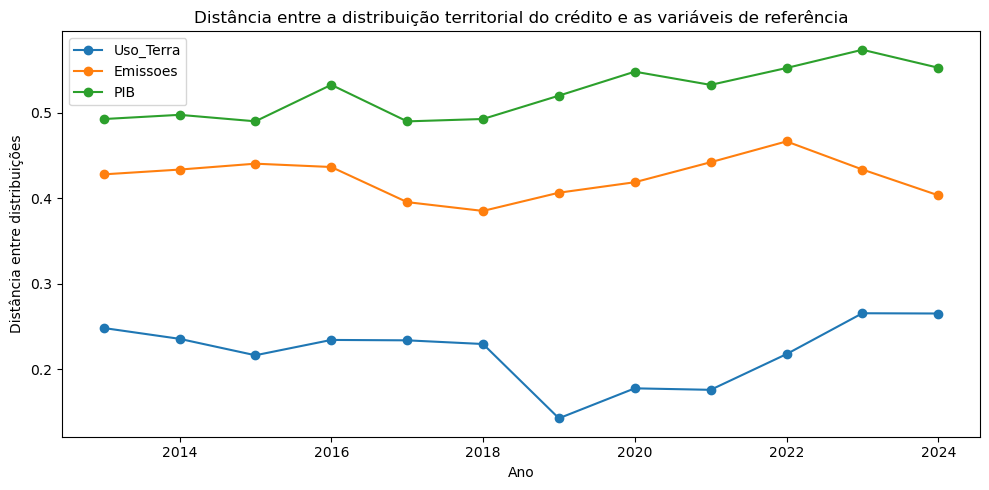
    


### 2.10.7. Correlações anuais entre participações territoriais


```python
correlacoes_anuais = []

for ano, grupo in alinhamento.groupby("Ano"):

    linha = {
        "Ano": ano
    }

    for var in vars_referencia:

        linha[f"Pearson_{var}"] = (
            grupo["Share_Credito"]
            .corr(
                grupo[f"Share_{var}"],
                method="pearson"
            )
        )

        linha[f"Spearman_{var}"] = (
            grupo["Share_Credito"]
            .corr(
                grupo[f"Share_{var}"],
                method="spearman"
            )
        )

    correlacoes_anuais.append(linha)


correlacoes_anuais = (
    pd.DataFrame(correlacoes_anuais)
    .set_index("Ano")
)

display(
    correlacoes_anuais.round(3)
)
```


<div>
<style scoped>
    .dataframe tbody tr th:only-of-type {
        vertical-align: middle;
    }

    .dataframe tbody tr th {
        vertical-align: top;
    }

    .dataframe thead th {
        text-align: right;
    }
</style>
<table border="1" class="dataframe">
  <thead>
    <tr style="text-align: right;">
      <th></th>
      <th>Pearson_Uso_Terra</th>
      <th>Spearman_Uso_Terra</th>
      <th>Pearson_Emissoes</th>
      <th>Spearman_Emissoes</th>
      <th>Pearson_PIB</th>
      <th>Spearman_PIB</th>
    </tr>
    <tr>
      <th>Ano</th>
      <th></th>
      <th></th>
      <th></th>
      <th></th>
      <th></th>
      <th></th>
    </tr>
  </thead>
  <tbody>
    <tr>
      <th>2013</th>
      <td>0.8710</td>
      <td>0.8680</td>
      <td>0.4150</td>
      <td>0.7760</td>
      <td>0.4810</td>
      <td>0.4180</td>
    </tr>
    <tr>
      <th>2014</th>
      <td>0.8790</td>
      <td>0.8590</td>
      <td>0.4230</td>
      <td>0.7910</td>
      <td>0.4700</td>
      <td>0.4440</td>
    </tr>
    <tr>
      <th>2015</th>
      <td>0.8850</td>
      <td>0.8560</td>
      <td>0.3970</td>
      <td>0.7400</td>
      <td>0.4780</td>
      <td>0.4110</td>
    </tr>
    <tr>
      <th>2016</th>
      <td>0.7750</td>
      <td>0.8550</td>
      <td>0.3010</td>
      <td>0.7270</td>
      <td>0.2630</td>
      <td>0.3490</td>
    </tr>
    <tr>
      <th>2017</th>
      <td>0.7800</td>
      <td>0.7950</td>
      <td>0.4220</td>
      <td>0.7660</td>
      <td>0.4630</td>
      <td>0.3190</td>
    </tr>
    <tr>
      <th>2018</th>
      <td>0.8170</td>
      <td>0.8100</td>
      <td>0.5030</td>
      <td>0.7860</td>
      <td>0.4720</td>
      <td>0.3800</td>
    </tr>
    <tr>
      <th>2019</th>
      <td>0.9530</td>
      <td>0.8780</td>
      <td>0.5260</td>
      <td>0.7000</td>
      <td>0.4340</td>
      <td>0.4000</td>
    </tr>
    <tr>
      <th>2020</th>
      <td>0.9420</td>
      <td>0.8930</td>
      <td>0.4520</td>
      <td>0.6920</td>
      <td>0.2790</td>
      <td>0.4350</td>
    </tr>
    <tr>
      <th>2021</th>
      <td>0.9430</td>
      <td>0.8880</td>
      <td>0.3820</td>
      <td>0.6960</td>
      <td>0.3110</td>
      <td>0.4690</td>
    </tr>
    <tr>
      <th>2022</th>
      <td>0.9090</td>
      <td>0.8910</td>
      <td>0.3990</td>
      <td>0.6920</td>
      <td>0.2870</td>
      <td>0.4470</td>
    </tr>
    <tr>
      <th>2023</th>
      <td>0.8500</td>
      <td>0.9060</td>
      <td>0.4930</td>
      <td>0.7300</td>
      <td>0.2090</td>
      <td>0.4530</td>
    </tr>
    <tr>
      <th>2024</th>
      <td>0.8380</td>
      <td>0.8840</td>
      <td>0.5740</td>
      <td>0.6790</td>
      <td>0.2790</td>
      <td>0.5020</td>
    </tr>
  </tbody>
</table>
</div>


```python
print(
    correlacoes_anuais.round(3)
)
```

          Pearson_Uso_Terra  Spearman_Uso_Terra  Pearson_Emissoes  \
    Ano                                                             
    2013             0.8710              0.8680            0.4150   
    2014             0.8790              0.8590            0.4230   
    2015             0.8850              0.8560            0.3970   
    2016             0.7750              0.8550            0.3010   
    2017             0.7800              0.7950            0.4220   
    2018             0.8170              0.8100            0.5030   
    2019             0.9530              0.8780            0.5260   
    2020             0.9420              0.8930            0.4520   
    2021             0.9430              0.8880            0.3820   
    2022             0.9090              0.8910            0.3990   
    2023             0.8500              0.9060            0.4930   
    2024             0.8380              0.8840            0.5740   
    
          Spearman_Emissoes  Pearson_PIB  Spearman_PIB  
    Ano                                                 
    2013             0.7760       0.4810        0.4180  
    2014             0.7910       0.4700        0.4440  
    2015             0.7400       0.4780        0.4110  
    2016             0.7270       0.2630        0.3490  
    2017             0.7660       0.4630        0.3190  
    2018             0.7860       0.4720        0.3800  
    2019             0.7000       0.4340        0.4000  
    2020             0.6920       0.2790        0.4350  
    2021             0.6960       0.3110        0.4690  
    2022             0.6920       0.2870        0.4470  
    2023             0.7300       0.2090        0.4530  
    2024             0.6790       0.2790        0.5020  
    

### 2.10 Distribuição relativa e alinhamento territorial preliminar

A correspondência territorial entre crédito e características das UFs foi
examinada comparando-se, para cada ano, a participação de cada unidade no valor
total investido com suas participações no uso da terra, nas emissões e no PIB.
Foram utilizadas diferenças entre participações (`gaps`), razões de participação,
distância absoluta entre distribuições e correlações de Pearson e Spearman. Nesta
etapa, o termo alinhamento possui sentido estritamente descritivo, indicando
similaridade ou proporcionalidade entre distribuições territoriais, sem implicar
avaliação normativa da alocação dos recursos.

Os resultados mostram que a distribuição territorial do crédito apresenta
proximidade sistematicamente maior com a distribuição do uso da terra. Em todos
os anos entre 2013 e 2024, a distância entre as participações do crédito e do
uso da terra foi inferior às distâncias correspondentes para emissões e PIB.
Essa distância diminuiu de 0,2484 em 2013 para 0,1428 em 2019, seu menor valor
na série, voltando posteriormente a crescer e alcançando 0,2654 em 2024.

As correlações anuais corroboram esse padrão. Entre crédito e uso da terra, os
coeficientes de Pearson variaram entre 0,775 e 0,953, enquanto os coeficientes
de Spearman permaneceram entre 0,795 e 0,906. Em 2024, os coeficientes foram
0,838 e 0,884, respectivamente. A elevada associação não representa, entretanto,
proporcionalidade perfeita, pois diferenças relevantes permanecem na magnitude
das participações de UFs específicas.

Em 2024, por exemplo, o Rio Grande do Sul concentrou 16,13% do valor investido
e 4,79% do uso da terra, correspondendo a um `gap` de +11,34 pontos percentuais.
Mato Grosso e Minas Gerais também apresentaram diferenças positivas, de +8,21 e
+5,31 pontos percentuais, respectivamente. Em sentido contrário, Pará, Bahia,
Rondônia e Mato Grosso do Sul apresentaram participações no crédito inferiores
às respectivas participações no uso da terra.

Parte dessas diferenças apresenta persistência temporal. Considerando as médias
de 2013 a 2024, MG, RS, GO, SP e TO apresentaram `gaps` positivos entre
participação no crédito e participação no uso da terra, enquanto PA, BA, PE, CE
e RO figuraram entre as UFs com diferenças negativas mais pronunciadas. Esses
resultados sugerem que a distribuição territorial do crédito não pode ser
completamente caracterizada apenas pela escala territorial do uso da terra,
apesar da elevada associação observada entre as duas distribuições.

A correspondência com as emissões foi substancialmente menor. As distâncias
anuais entre as distribuições de crédito e emissões variaram entre 0,3854 e
0,4667. Em 2024, a distância foi de 0,4036. Nesse ano, o Pará concentrou 17,61%
das emissões e 3,77% do crédito, resultando em diferença de -13,84 pontos
percentuais. Em contraste, Rio Grande do Sul e Minas Gerais apresentaram
participações no crédito superiores às respectivas participações nas emissões.

As correlações com emissões revelam ainda diferença entre ordenamento e
proporcionalidade. Os coeficientes anuais de Pearson variaram entre 0,301 e
0,574, enquanto os coeficientes de Spearman permaneceram entre 0,679 e 0,791.
Esse padrão indica que UFs relativamente mais elevadas na distribuição das
emissões tendem, em alguma medida, a ocupar posições superiores na distribuição
do crédito, mas as magnitudes de suas participações não apresentam
proporcionalidade equivalente.

O PIB apresentou a menor similaridade distributiva com o crédito. A distância
entre as duas distribuições permaneceu entre 0,4901 e 0,5739 durante o período,
sendo superior às distâncias observadas para uso da terra e emissões em todos os
anos. Em 2024, por exemplo, São Paulo respondeu por 30,87% do PIB agregado das
UFs, mas por 6,88% do valor do crédito analisado. Esse resultado não deve ser
interpretado como inadequação alocativa, uma vez que o PIB representa a escala
econômica total das UFs e não especificamente sua dimensão agropecuária.

Em conjunto, os resultados indicam que a geografia do crédito analisado se
aproxima mais da distribuição territorial do uso da terra do que das emissões
ou da atividade econômica agregada. Entretanto, essa correspondência não é
uniforme entre as UFs e apresentou redução nos anos finais da série. O aumento
da distância entre crédito e uso da terra após 2019 ocorre simultaneamente ao
processo de reconcentração territorial do volume financeiro identificado na
seção anterior, constituindo uma questão relevante para as etapas posteriores
de modelagem.

Esses resultados permanecem estritamente descritivos. Não se pressupõe que uma
alocação adequada de crédito deva ser proporcional ao uso da terra, às emissões
ou ao PIB. As diferenças observadas constituem evidências exploratórias sobre a
estrutura territorial dos dados e deverão ser analisadas posteriormente em
modelos capazes de considerar simultaneamente heterogeneidade entre UFs,
variação temporal e múltiplas características territoriais.
