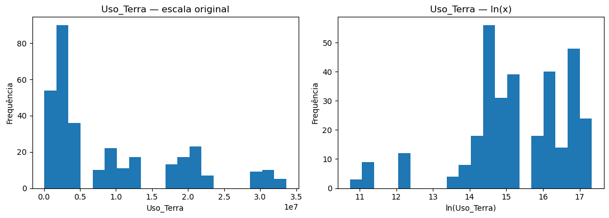
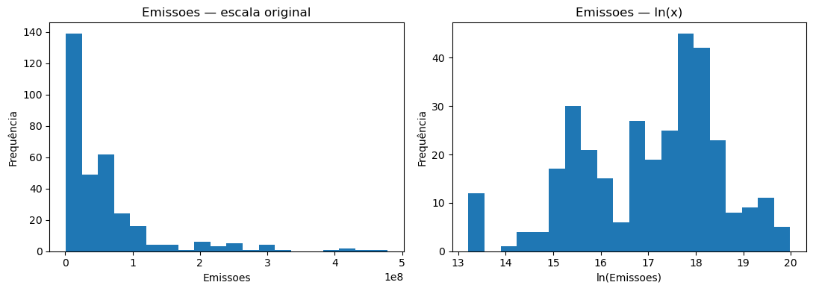
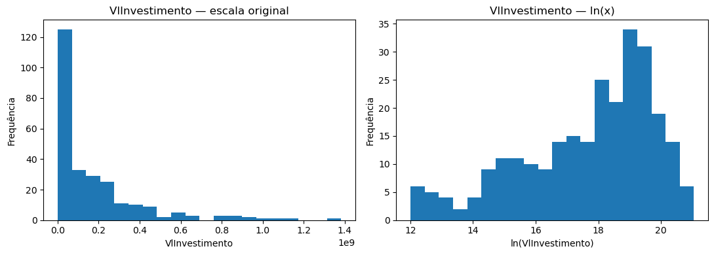
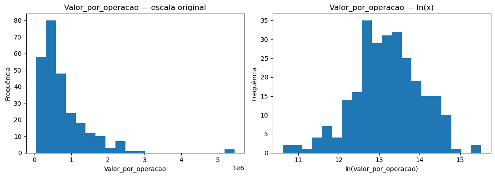

<center>
    
</center>

## <center>Departamento de Ciência da Computação</center>

## <center>PPCA - Programa de Pós-Graduação em Computação Aplicada</center>

# <center>DISTRIBUIÇÃO E CORRESPONDÊNCIA TERRITORIAL DOS INVESTIMENTOS ASSOCIADOS AO CRÉDITO RURAL SUSTENTÁVEL NO BRASIL</center>

## <center>Uma análise longitudinal das Unidades da Federação, 2013–2024</center>
=====================================================
=====================================================
 - #### <font color="blue">Adalberto Araujo Aragão</font>
 - #### <font color="blue">Projeto de Mineração de Dados - CRISP-DM</font>
 - #### <font color="blue">Professor: Marcelo Ladeira</font>
=====================================================
=====================================================

# 3. Data Preparation

A etapa de preparação dos dados tem como objetivo construir uma base analítica
reprodutível e adequada às etapas subsequentes de modelagem, preservando a
rastreabilidade entre os dados originalmente consolidados e as variáveis
derivadas utilizadas nas análises.

A base utilizada neste estudo resulta de um processo de curadoria e integração
de informações provenientes de fontes distintas. Além da compatibilização
territorial e temporal das séries, foi realizada a harmonização das principais
variáveis monetárias para valores reais de 2024. O PIB foi deflacionado pelo
deflator do PIB e o PIB per capita foi posteriormente calculado a partir do PIB
real e da população. O valor dos investimentos foi deflacionado pelo IPCA. A
variável Rendimento constitui uma exceção, pois os dados provenientes da fonte
original já se encontram expressos a preços médios de 2024.

As decisões de preparação serão orientadas pelos resultados obtidos na etapa de
Data Understanding. Em particular, serão considerados: a estrutura de painel
balanceado formada por 27 UFs observadas entre 2013 e 2024; a existência de
UF-anos sem operações de crédito; a indisponibilidade parcial da informação de
área financiada; a elevada assimetria de algumas distribuições; a heterogeneidade
entre UFs e ao longo do tempo; e as diferenças observadas entre a ocorrência,
a quantidade e o valor financeiro das operações.

Nesta etapa, os dados originais serão preservados sempre que possível, sendo
criadas variáveis analíticas derivadas de forma explícita. Valores extremos não
serão removidos automaticamente, e transformações de escala serão adotadas
somente quando justificadas pela finalidade analítica e pelas propriedades dos
modelos subsequentes.

## 3.1. Dicionário analítico das variáveis


```python
dicionario_analitico = pd.DataFrame([
    ["UF", "Identificação", "Categórica", "Unidade territorial do painel"],
    ["Estado", "Identificação", "Categórica", "Nome da Unidade da Federação"],
    ["Ano", "Temporal", "Inteira", "Dimensão temporal do painel"],

    ["PIB", "Escala econômica / controle", "Contínua",
     "PIB estadual em valores reais de 2024"],

    ["PIB_per_capita", "Controle socioeconômico", "Contínua",
     "PIB real dividido pela população"],

    ["Populacao", "Escala demográfica / controle", "Contínua",
     "População da UF"],

    ["Rendimento", "Controle socioeconômico", "Contínua",
     "Rendimento a preços médios de 2024 conforme a fonte original"],

    ["Uso_Terra", "Dimensão territorial/produtiva", "Contínua",
     "Medida de uso da terra"],

    ["Emissoes", "Dimensão ambiental", "Contínua",
     "Medida de emissões"],

    ["QtdInvestimento", "Desfecho creditício", "Contagem",
     "Quantidade de operações de crédito"],

    ["VlInvestimento", "Desfecho creditício", "Contínua",
     "Valor dos investimentos em valores reais de 2024"],

    ["AreaInvestimento", "Desfecho/escala creditícia", "Contínua",
     "Área registrada na fonte original"],

    ["SemOperacaoCredito", "Desfecho de ocorrência", "Binária",
     "Indica UF-ano sem operação de crédito"],

    ["AreaInvestimento_analitica", "Desfecho creditício derivado", "Contínua",
     "Área: zero sem operação; NaN quando há operação mas área não informada"],

    ["AreaNaoInformada", "Indicador de disponibilidade", "Binária",
     "Operação existente com informação de área indisponível"]
],
columns=[
    "Variavel",
    "Papel_metodologico",
    "Tipo_analitico",
    "Interpretacao"
])

display(dicionario_analitico)
```


<div>
<style scoped>
    .dataframe tbody tr th:only-of-type {
        vertical-align: middle;
    }

    .dataframe tbody tr th {
        vertical-align: top;
    }

    .dataframe thead th {
        text-align: right;
    }
</style>
<table border="1" class="dataframe">
  <thead>
    <tr style="text-align: right;">
      <th></th>
      <th>Variavel</th>
      <th>Papel_metodologico</th>
      <th>Tipo_analitico</th>
      <th>Interpretacao</th>
    </tr>
  </thead>
  <tbody>
    <tr>
      <th>0</th>
      <td>UF</td>
      <td>Identificação</td>
      <td>Categórica</td>
      <td>Unidade territorial do painel</td>
    </tr>
    <tr>
      <th>1</th>
      <td>Estado</td>
      <td>Identificação</td>
      <td>Categórica</td>
      <td>Nome da Unidade da Federação</td>
    </tr>
    <tr>
      <th>2</th>
      <td>Ano</td>
      <td>Temporal</td>
      <td>Inteira</td>
      <td>Dimensão temporal do painel</td>
    </tr>
    <tr>
      <th>3</th>
      <td>PIB</td>
      <td>Escala econômica / controle</td>
      <td>Contínua</td>
      <td>PIB estadual em valores reais de 2024</td>
    </tr>
    <tr>
      <th>4</th>
      <td>PIB_per_capita</td>
      <td>Controle socioeconômico</td>
      <td>Contínua</td>
      <td>PIB real dividido pela população</td>
    </tr>
    <tr>
      <th>5</th>
      <td>Populacao</td>
      <td>Escala demográfica / controle</td>
      <td>Contínua</td>
      <td>População da UF</td>
    </tr>
    <tr>
      <th>6</th>
      <td>Rendimento</td>
      <td>Controle socioeconômico</td>
      <td>Contínua</td>
      <td>Rendimento a preços médios de 2024 conforme a ...</td>
    </tr>
    <tr>
      <th>7</th>
      <td>Uso_Terra</td>
      <td>Dimensão territorial/produtiva</td>
      <td>Contínua</td>
      <td>Medida de uso da terra</td>
    </tr>
    <tr>
      <th>8</th>
      <td>Emissoes</td>
      <td>Dimensão ambiental</td>
      <td>Contínua</td>
      <td>Medida de emissões</td>
    </tr>
    <tr>
      <th>9</th>
      <td>QtdInvestimento</td>
      <td>Desfecho creditício</td>
      <td>Contagem</td>
      <td>Quantidade de operações de crédito</td>
    </tr>
    <tr>
      <th>10</th>
      <td>VlInvestimento</td>
      <td>Desfecho creditício</td>
      <td>Contínua</td>
      <td>Valor dos investimentos em valores reais de 2024</td>
    </tr>
    <tr>
      <th>11</th>
      <td>AreaInvestimento</td>
      <td>Desfecho/escala creditícia</td>
      <td>Contínua</td>
      <td>Área registrada na fonte original</td>
    </tr>
    <tr>
      <th>12</th>
      <td>SemOperacaoCredito</td>
      <td>Desfecho de ocorrência</td>
      <td>Binária</td>
      <td>Indica UF-ano sem operação de crédito</td>
    </tr>
    <tr>
      <th>13</th>
      <td>AreaInvestimento_analitica</td>
      <td>Desfecho creditício derivado</td>
      <td>Contínua</td>
      <td>Área: zero sem operação; NaN quando há operaçã...</td>
    </tr>
    <tr>
      <th>14</th>
      <td>AreaNaoInformada</td>
      <td>Indicador de disponibilidade</td>
      <td>Binária</td>
      <td>Operação existente com informação de área indi...</td>
    </tr>
  </tbody>
</table>
</div>


## 3.2. Construção da base analítica e rastreabilidade

A preparação dos dados foi estruturada de modo a preservar a base resultante do
processo de curadoria e integração das diferentes fontes. Para evitar alterações
silenciosas nos dados utilizados na etapa de Data Understanding, a partir deste
ponto será utilizada uma cópia independente da base, denominada `df_model`.

A variável `df` permanece como referência da base consolidada e auditada nas
etapas anteriores, enquanto `df_model` será destinada exclusivamente às
transformações necessárias à modelagem. Essa separação permite distinguir os
dados consolidados das variáveis posteriormente derivadas, mantendo a
rastreabilidade das decisões analíticas.

Antes da realização de qualquer transformação, são registrados o número de
observações, o número e os nomes das variáveis, a estrutura do painel, a
quantidade de valores ausentes e algumas estatísticas de controle. Esses
elementos funcionarão como pontos de verificação da integridade da base ao longo
das etapas subsequentes.

### 3.2.1. Base de referência e base destinada à modelagem


```python
df_model = df.copy(deep=True)

print(f"Base de referência (df): {df.shape}")
print(f"Base analítica (df_model): {df_model.shape}")

print(
    "\nObjetos independentes:",
    id(df) != id(df_model)
)
```

    Base de referência (df): (324, 16)
    Base analítica (df_model): (324, 16)
    
    Objetos independentes: True
    

### 3.2.2. Função de auditoria da base


```python
def auditar_base(data):
    return pd.Series({
        "n_linhas": len(data),
        "n_colunas": data.shape[1],
        "n_ufs": data["UF"].nunique(),
        "ano_min": data["Ano"].min(),
        "ano_max": data["Ano"].max(),
        "n_uf_ano_unicos": (
            data[["UF", "Ano"]]
            .drop_duplicates()
            .shape[0]
        ),
        "duplicatas_uf_ano": (
            data.duplicated(
                subset=["UF", "Ano"]
            ).sum()
        ),
        "missing_total": (
            data.isna().sum().sum()
        )
    })


auditoria_inicial = auditar_base(df_model)

display(
    auditoria_inicial.to_frame(
        name="Estado_inicial"
    )
)
```


<div>
<style scoped>
    .dataframe tbody tr th:only-of-type {
        vertical-align: middle;
    }

    .dataframe tbody tr th {
        vertical-align: top;
    }

    .dataframe thead th {
        text-align: right;
    }
</style>
<table border="1" class="dataframe">
  <thead>
    <tr style="text-align: right;">
      <th></th>
      <th>Estado_inicial</th>
    </tr>
  </thead>
  <tbody>
    <tr>
      <th>n_linhas</th>
      <td>324</td>
    </tr>
    <tr>
      <th>n_colunas</th>
      <td>16</td>
    </tr>
    <tr>
      <th>n_ufs</th>
      <td>27</td>
    </tr>
    <tr>
      <th>ano_min</th>
      <td>2013</td>
    </tr>
    <tr>
      <th>ano_max</th>
      <td>2024</td>
    </tr>
    <tr>
      <th>n_uf_ano_unicos</th>
      <td>324</td>
    </tr>
    <tr>
      <th>duplicatas_uf_ano</th>
      <td>0</td>
    </tr>
    <tr>
      <th>missing_total</th>
      <td>113</td>
    </tr>
  </tbody>
</table>
</div>


```python
print(
    auditoria_inicial.to_frame(
        name="Estado_inicial"
    )
)
```

                       Estado_inicial
    n_linhas                      324
    n_colunas                      16
    n_ufs                          27
    ano_min                      2013
    ano_max                      2024
    n_uf_ano_unicos               324
    duplicatas_uf_ano               0
    missing_total                 113
    

### 3.2.3. Inventário de valores ausentes


```python
inventario_missing = pd.DataFrame({
    "N_missing": df_model.isna().sum(),
    "Perc_missing": (
        df_model.isna().mean() * 100
    )
})

inventario_missing = (
    inventario_missing[
        inventario_missing["N_missing"] > 0
    ]
    .sort_values(
        "N_missing",
        ascending=False
    )
)

display(
    inventario_missing.round(2)
)
```


<div>
<style scoped>
    .dataframe tbody tr th:only-of-type {
        vertical-align: middle;
    }

    .dataframe tbody tr th {
        vertical-align: top;
    }

    .dataframe thead th {
        text-align: right;
    }
</style>
<table border="1" class="dataframe">
  <thead>
    <tr style="text-align: right;">
      <th></th>
      <th>N_missing</th>
      <th>Perc_missing</th>
    </tr>
  </thead>
  <tbody>
    <tr>
      <th>Valor_por_operacao</th>
      <td>60</td>
      <td>18.5200</td>
    </tr>
    <tr>
      <th>AreaInvestimento_analitica</th>
      <td>53</td>
      <td>16.3600</td>
    </tr>
  </tbody>
</table>
</div>


```python
print(
    inventario_missing.round(2)
)
```

                                N_missing  Perc_missing
    Valor_por_operacao                 60       18.5200
    AreaInvestimento_analitica         53       16.3600
    

### 3.2.4. Integridade da cópia


```python
integridade_copia = df.equals(df_model)

print(
    "df e df_model são idênticos neste ponto:",
    integridade_copia
)

assert integridade_copia, (
    "A cópia inicial não é idêntica à base de referência."
)
```

    df e df_model são idênticos neste ponto: True
    

### 3.2.5. Chave da observação UF-ano


```python
df_model["id_uf_ano"] = (
    df_model["UF"].astype(str)
    + "_"
    + df_model["Ano"].astype(str)
)

assert df_model["id_uf_ano"].is_unique

display(
    df_model[
        [
            "id_uf_ano",
            "UF",
            "Ano"
        ]
    ].head()
)
```


<div>
<style scoped>
    .dataframe tbody tr th:only-of-type {
        vertical-align: middle;
    }

    .dataframe tbody tr th {
        vertical-align: top;
    }

    .dataframe thead th {
        text-align: right;
    }
</style>
<table border="1" class="dataframe">
  <thead>
    <tr style="text-align: right;">
      <th></th>
      <th>id_uf_ano</th>
      <th>UF</th>
      <th>Ano</th>
    </tr>
  </thead>
  <tbody>
    <tr>
      <th>0</th>
      <td>AC_2013</td>
      <td>AC</td>
      <td>2013</td>
    </tr>
    <tr>
      <th>1</th>
      <td>AC_2014</td>
      <td>AC</td>
      <td>2014</td>
    </tr>
    <tr>
      <th>2</th>
      <td>AC_2015</td>
      <td>AC</td>
      <td>2015</td>
    </tr>
    <tr>
      <th>3</th>
      <td>AC_2016</td>
      <td>AC</td>
      <td>2016</td>
    </tr>
    <tr>
      <th>4</th>
      <td>AC_2017</td>
      <td>AC</td>
      <td>2017</td>
    </tr>
  </tbody>
</table>
</div>


```python
print(
    df_model[
        [
            "id_uf_ano",
            "UF",
            "Ano"
        ]
    ].head()
)
```

      id_uf_ano  UF   Ano
    0   AC_2013  AC  2013
    1   AC_2014  AC  2014
    2   AC_2015  AC  2015
    3   AC_2016  AC  2016
    4   AC_2017  AC  2017
    

### 3.2.6. Registro das transformações


```python
registro_preparacao = pd.DataFrame(
    columns=[
        "Etapa",
        "Variavel_origem",
        "Variavel_derivada",
        "Operacao",
        "Justificativa"
    ]
)

registro_preparacao.loc[len(registro_preparacao)] = [
    "3.2",
    "df",
    "df_model",
    "Cópia profunda da base",
    (
        "Preservar a base consolidada e separar os dados "
        "de referência das transformações destinadas à modelagem."
    )
]

registro_preparacao.loc[len(registro_preparacao)] = [
    "3.2",
    "UF + Ano",
    "id_uf_ano",
    "Concatenação para criação de identificador",
    (
        "Criar uma chave única e legível para auditoria "
        "das observações do painel."
    )
]

display(registro_preparacao)
```


<div>
<style scoped>
    .dataframe tbody tr th:only-of-type {
        vertical-align: middle;
    }

    .dataframe tbody tr th {
        vertical-align: top;
    }

    .dataframe thead th {
        text-align: right;
    }
</style>
<table border="1" class="dataframe">
  <thead>
    <tr style="text-align: right;">
      <th></th>
      <th>Etapa</th>
      <th>Variavel_origem</th>
      <th>Variavel_derivada</th>
      <th>Operacao</th>
      <th>Justificativa</th>
    </tr>
  </thead>
  <tbody>
    <tr>
      <th>0</th>
      <td>3.2</td>
      <td>df</td>
      <td>df_model</td>
      <td>Cópia profunda da base</td>
      <td>Preservar a base consolidada e separar os dado...</td>
    </tr>
    <tr>
      <th>1</th>
      <td>3.2</td>
      <td>UF + Ano</td>
      <td>id_uf_ano</td>
      <td>Concatenação para criação de identificador</td>
      <td>Criar uma chave única e legível para auditoria...</td>
    </tr>
  </tbody>
</table>
</div>


```python
print(registro_preparacao)
```

      Etapa Variavel_origem Variavel_derivada  \
    0   3.2              df          df_model   
    1   3.2        UF + Ano         id_uf_ano   
    
                                         Operacao  \
    0                      Cópia profunda da base   
    1  Concatenação para criação de identificador   
    
                                           Justificativa  
    0  Preservar a base consolidada e separar os dado...  
    1  Criar uma chave única e legível para auditoria...  
    

### 3.2.7. Auditoria após a criação da chave


```python
auditoria_pos_32 = auditar_base(df_model)

comparacao_auditoria = pd.concat(
    [
        auditoria_inicial.rename("Antes_3.2"),
        auditoria_pos_32.rename("Depois_3.2")
    ],
    axis=1
)

display(comparacao_auditoria)
```


<div>
<style scoped>
    .dataframe tbody tr th:only-of-type {
        vertical-align: middle;
    }

    .dataframe tbody tr th {
        vertical-align: top;
    }

    .dataframe thead th {
        text-align: right;
    }
</style>
<table border="1" class="dataframe">
  <thead>
    <tr style="text-align: right;">
      <th></th>
      <th>Antes_3.2</th>
      <th>Depois_3.2</th>
    </tr>
  </thead>
  <tbody>
    <tr>
      <th>n_linhas</th>
      <td>324</td>
      <td>324</td>
    </tr>
    <tr>
      <th>n_colunas</th>
      <td>16</td>
      <td>17</td>
    </tr>
    <tr>
      <th>n_ufs</th>
      <td>27</td>
      <td>27</td>
    </tr>
    <tr>
      <th>ano_min</th>
      <td>2013</td>
      <td>2013</td>
    </tr>
    <tr>
      <th>ano_max</th>
      <td>2024</td>
      <td>2024</td>
    </tr>
    <tr>
      <th>n_uf_ano_unicos</th>
      <td>324</td>
      <td>324</td>
    </tr>
    <tr>
      <th>duplicatas_uf_ano</th>
      <td>0</td>
      <td>0</td>
    </tr>
    <tr>
      <th>missing_total</th>
      <td>113</td>
      <td>113</td>
    </tr>
  </tbody>
</table>
</div>


```python
print(comparacao_auditoria)
```

                       Antes_3.2  Depois_3.2
    n_linhas                 324         324
    n_colunas                 16          17
    n_ufs                     27          27
    ano_min                 2013        2013
    ano_max                 2024        2024
    n_uf_ano_unicos          324         324
    duplicatas_uf_ano          0           0
    missing_total            113         113
    

### Ajustes


```python
nova_variavel = pd.DataFrame([[
    "Valor_por_operacao",
    "Indicador de intensidade creditícia",
    "Contínua derivada",
    (
        "Valor real investido dividido pela quantidade de operações; "
        "indefinido (NaN) quando não há operação de crédito"
    )
]], columns=dicionario_analitico.columns)

dicionario_analitico = pd.concat(
    [dicionario_analitico, nova_variavel],
    ignore_index=True
)

display(dicionario_analitico.tail())
```


<div>
<style scoped>
    .dataframe tbody tr th:only-of-type {
        vertical-align: middle;
    }

    .dataframe tbody tr th {
        vertical-align: top;
    }

    .dataframe thead th {
        text-align: right;
    }
</style>
<table border="1" class="dataframe">
  <thead>
    <tr style="text-align: right;">
      <th></th>
      <th>Variavel</th>
      <th>Papel_metodologico</th>
      <th>Tipo_analitico</th>
      <th>Interpretacao</th>
    </tr>
  </thead>
  <tbody>
    <tr>
      <th>11</th>
      <td>AreaInvestimento</td>
      <td>Desfecho/escala creditícia</td>
      <td>Contínua</td>
      <td>Área registrada na fonte original</td>
    </tr>
    <tr>
      <th>12</th>
      <td>SemOperacaoCredito</td>
      <td>Desfecho de ocorrência</td>
      <td>Binária</td>
      <td>Indica UF-ano sem operação de crédito</td>
    </tr>
    <tr>
      <th>13</th>
      <td>AreaInvestimento_analitica</td>
      <td>Desfecho creditício derivado</td>
      <td>Contínua</td>
      <td>Área: zero sem operação; NaN quando há operaçã...</td>
    </tr>
    <tr>
      <th>14</th>
      <td>AreaNaoInformada</td>
      <td>Indicador de disponibilidade</td>
      <td>Binária</td>
      <td>Operação existente com informação de área indi...</td>
    </tr>
    <tr>
      <th>15</th>
      <td>Valor_por_operacao</td>
      <td>Indicador de intensidade creditícia</td>
      <td>Contínua derivada</td>
      <td>Valor real investido dividido pela quantidade ...</td>
    </tr>
  </tbody>
</table>
</div>


```python
# Registrando sua origem
registro_preparacao.loc[len(registro_preparacao)] = [
    "3.2",
    "VlInvestimento + QtdInvestimento",
    "Valor_por_operacao",
    "VlInvestimento / QtdInvestimento",
    (
        "Mensurar a intensidade financeira média das operações; "
        "permanece NaN nos UF-anos sem operação de crédito."
    )
]
```


```python
# Verificar se os 60 NaN de Valor_por_operacao
# correspondem exatamente aos UF-anos sem operação
check_valor_operacao = pd.crosstab(
    df_model["SemOperacaoCredito"],
    df_model["Valor_por_operacao"].isna(),
    rownames=["SemOperacaoCredito"],
    colnames=["Valor_por_operacao_isna"]
)

display(check_valor_operacao)

assert (
    df_model["Valor_por_operacao"].isna()
    == df_model["SemOperacaoCredito"]
).all()
```


<div>
<style scoped>
    .dataframe tbody tr th:only-of-type {
        vertical-align: middle;
    }

    .dataframe tbody tr th {
        vertical-align: top;
    }

    .dataframe thead th {
        text-align: right;
    }
</style>
<table border="1" class="dataframe">
  <thead>
    <tr style="text-align: right;">
      <th>Valor_por_operacao_isna</th>
      <th>False</th>
      <th>True</th>
    </tr>
    <tr>
      <th>SemOperacaoCredito</th>
      <th></th>
      <th></th>
    </tr>
  </thead>
  <tbody>
    <tr>
      <th>False</th>
      <td>264</td>
      <td>0</td>
    </tr>
    <tr>
      <th>True</th>
      <td>0</td>
      <td>60</td>
    </tr>
  </tbody>
</table>
</div>


```python
print(check_valor_operacao)
```

    Valor_por_operacao_isna  False  True 
    SemOperacaoCredito                   
    False                      264      0
    True                         0     60
    

## 3.3. Tratamento formal de zeros, ausências e disponibilidade da informação

A análise exploratória demonstrou que os valores iguais a zero e os valores
ausentes presentes nas variáveis relacionadas ao crédito possuem significados
distintos. Consequentemente, esses registros não devem receber tratamento
uniforme durante a preparação dos dados.

Para `QtdInvestimento` e `VlInvestimento`, o valor zero representa ausência
efetiva de operação de crédito no respectivo par UF-ano. Esses registros
constituem informação substantiva e, portanto, são preservados na base.

A variável `Valor_por_operacao`, definida pela razão entre o valor real dos
investimentos e a quantidade de operações, somente possui interpretação quando
existe pelo menos uma operação. Por essa razão, seus 60 valores ausentes
correspondem exatamente aos 60 registros classificados como sem operação de
crédito e representam casos de não aplicabilidade, e não dados faltantes.

A variável de área exige tratamento distinto. Foram identificados 53 registros
nos quais existe operação de crédito, mas `AreaInvestimento` apresenta valor
igual a zero. A análise temporal e econômica desses registros indicou que eles
não devem ser interpretados automaticamente como operações financiando zero
hectare. Para fins analíticos, esses casos foram classificados como informação
de área indisponível, mantendo-se a variável original para rastreabilidade.
Assim, `AreaInvestimento_analitica` assume zero apenas quando não existe operação,
valor ausente quando existe operação mas a informação de área não está
disponível, e valor positivo quando a operação possui área informada.

Nenhum desses valores ausentes será imputado nesta etapa. Essa distinção preserva
a semântica dos dados e permite que cada variável seja posteriormente analisada
com uma amostra compatível com a informação efetivamente disponível.

### 3.3.1. Indicador de ocorrência de crédito


```python
df_model["TemCredito"] = (
    ~df_model["SemOperacaoCredito"]
).astype("int8")

display(
    df_model["TemCredito"]
    .value_counts()
    .sort_index()
    .rename_axis("TemCredito")
    .to_frame("N")
)
```


<div>
<style scoped>
    .dataframe tbody tr th:only-of-type {
        vertical-align: middle;
    }

    .dataframe tbody tr th {
        vertical-align: top;
    }

    .dataframe thead th {
        text-align: right;
    }
</style>
<table border="1" class="dataframe">
  <thead>
    <tr style="text-align: right;">
      <th></th>
      <th>N</th>
    </tr>
    <tr>
      <th>TemCredito</th>
      <th></th>
    </tr>
  </thead>
  <tbody>
    <tr>
      <th>0</th>
      <td>60</td>
    </tr>
    <tr>
      <th>1</th>
      <td>264</td>
    </tr>
  </tbody>
</table>
</div>


```python
check_credito = pd.DataFrame({
    "TemCredito": df_model["TemCredito"],
    "Qtd_positiva": (df_model["QtdInvestimento"] > 0).astype("int8"),
    "Valor_positivo": (df_model["VlInvestimento"] > 0).astype("int8")
})

display(
    check_credito.value_counts()
    .rename("N")
    .reset_index()
)

assert (
    df_model["TemCredito"]
    == (df_model["QtdInvestimento"] > 0).astype("int8")
).all()

assert (
    df_model["TemCredito"]
    == (df_model["VlInvestimento"] > 0).astype("int8")
).all()
```


<div>
<style scoped>
    .dataframe tbody tr th:only-of-type {
        vertical-align: middle;
    }

    .dataframe tbody tr th {
        vertical-align: top;
    }

    .dataframe thead th {
        text-align: right;
    }
</style>
<table border="1" class="dataframe">
  <thead>
    <tr style="text-align: right;">
      <th></th>
      <th>TemCredito</th>
      <th>Qtd_positiva</th>
      <th>Valor_positivo</th>
      <th>N</th>
    </tr>
  </thead>
  <tbody>
    <tr>
      <th>0</th>
      <td>1</td>
      <td>1</td>
      <td>1</td>
      <td>264</td>
    </tr>
    <tr>
      <th>1</th>
      <td>0</td>
      <td>0</td>
      <td>0</td>
      <td>60</td>
    </tr>
  </tbody>
</table>
</div>


```python
print(
    check_credito.value_counts()
    .rename("N")
    .reset_index()
)
```

       TemCredito  Qtd_positiva  Valor_positivo    N
    0           1             1               1  264
    1           0             0               0   60
    

### 3.3.2. Estado da informação de área


```python
import numpy as np
import pandas as pd

condicoes_area = [
    df_model["TemCredito"].eq(0),

    (
        df_model["TemCredito"].eq(1)
        & df_model["AreaInvestimento_analitica"].isna()
    ),

    (
        df_model["TemCredito"].eq(1)
        & df_model["AreaInvestimento_analitica"].gt(0)
    )
]

categorias_area = [
    "Sem operação",
    "Operação - área não informada",
    "Operação - área informada"
]

df_model["StatusArea"] = np.select(
    condicoes_area,
    categorias_area,
    default="Inconsistente"
)

display(
    df_model["StatusArea"]
    .value_counts()
    .to_frame("N")
)
```


<div>
<style scoped>
    .dataframe tbody tr th:only-of-type {
        vertical-align: middle;
    }

    .dataframe tbody tr th {
        vertical-align: top;
    }

    .dataframe thead th {
        text-align: right;
    }
</style>
<table border="1" class="dataframe">
  <thead>
    <tr style="text-align: right;">
      <th></th>
      <th>N</th>
    </tr>
    <tr>
      <th>StatusArea</th>
      <th></th>
    </tr>
  </thead>
  <tbody>
    <tr>
      <th>Operação - área informada</th>
      <td>211</td>
    </tr>
    <tr>
      <th>Sem operação</th>
      <td>60</td>
    </tr>
    <tr>
      <th>Operação - área não informada</th>
      <td>53</td>
    </tr>
  </tbody>
</table>
</div>


```python
print(
    df_model["StatusArea"]
    .value_counts()
    .to_frame("N")
)
```

                                     N
    StatusArea                        
    Operação - área informada      211
    Sem operação                    60
    Operação - área não informada   53
    


```python
assert (
    df_model["StatusArea"] != "Inconsistente"
).all()

assert (
    (df_model["StatusArea"] == "Sem operação").sum()
    == 60
)

assert (
    (df_model["StatusArea"] == "Operação - área não informada").sum()
    == 53
)

assert (
    (df_model["StatusArea"] == "Operação - área informada").sum()
    == 211
)
```

### 3.3.3. Auditoria dos estados da área


```python
auditoria_area = (
    df_model
    .groupby("StatusArea", observed=True)
    .agg(
        N=("UF", "size"),
        TemCredito=("TemCredito", "sum"),
        Area_original_zero=(
            "AreaInvestimento",
            lambda x: (x == 0).sum()
        ),
        Area_analitica_zero=(
            "AreaInvestimento_analitica",
            lambda x: (x == 0).sum()
        ),
        Area_analitica_missing=(
            "AreaInvestimento_analitica",
            lambda x: x.isna().sum()
        ),
        AreaNaoInformada=(
            "AreaNaoInformada",
            "sum"
        )
    )
)

display(auditoria_area)
```


<div>
<style scoped>
    .dataframe tbody tr th:only-of-type {
        vertical-align: middle;
    }

    .dataframe tbody tr th {
        vertical-align: top;
    }

    .dataframe thead th {
        text-align: right;
    }
</style>
<table border="1" class="dataframe">
  <thead>
    <tr style="text-align: right;">
      <th></th>
      <th>N</th>
      <th>TemCredito</th>
      <th>Area_original_zero</th>
      <th>Area_analitica_zero</th>
      <th>Area_analitica_missing</th>
      <th>AreaNaoInformada</th>
    </tr>
    <tr>
      <th>StatusArea</th>
      <th></th>
      <th></th>
      <th></th>
      <th></th>
      <th></th>
      <th></th>
    </tr>
  </thead>
  <tbody>
    <tr>
      <th>Operação - área informada</th>
      <td>211</td>
      <td>211</td>
      <td>0</td>
      <td>0</td>
      <td>0</td>
      <td>0</td>
    </tr>
    <tr>
      <th>Operação - área não informada</th>
      <td>53</td>
      <td>53</td>
      <td>53</td>
      <td>0</td>
      <td>53</td>
      <td>53</td>
    </tr>
    <tr>
      <th>Sem operação</th>
      <td>60</td>
      <td>0</td>
      <td>60</td>
      <td>60</td>
      <td>0</td>
      <td>0</td>
    </tr>
  </tbody>
</table>
</div>


```python
print(auditoria_area)
```

                                     N  TemCredito  Area_original_zero  \
    StatusArea                                                           
    Operação - área informada      211         211                   0   
    Operação - área não informada   53          53                  53   
    Sem operação                    60           0                  60   
    
                                   Area_analitica_zero  Area_analitica_missing  \
    StatusArea                                                                   
    Operação - área informada                        0                       0   
    Operação - área não informada                    0                      53   
    Sem operação                                    60                       0   
    
                                   AreaNaoInformada  
    StatusArea                                       
    Operação - área informada                     0  
    Operação - área não informada                53  
    Sem operação                                  0  
    

### 3.3.4. Disponibilidade da área por ano


```python
disponibilidade_area_ano = (
    df_model
    .groupby("Ano")
    .agg(
        N=("UF", "size"),
        Operacoes=("TemCredito", "sum"),
        Area_nao_informada=("AreaNaoInformada", "sum")
    )
)

disponibilidade_area_ano["Perc_operacoes_sem_area"] = (
    100
    * disponibilidade_area_ano["Area_nao_informada"]
    / disponibilidade_area_ano["Operacoes"]
)

display(
    disponibilidade_area_ano.round(2)
)
```


<div>
<style scoped>
    .dataframe tbody tr th:only-of-type {
        vertical-align: middle;
    }

    .dataframe tbody tr th {
        vertical-align: top;
    }

    .dataframe thead th {
        text-align: right;
    }
</style>
<table border="1" class="dataframe">
  <thead>
    <tr style="text-align: right;">
      <th></th>
      <th>N</th>
      <th>Operacoes</th>
      <th>Area_nao_informada</th>
      <th>Perc_operacoes_sem_area</th>
    </tr>
    <tr>
      <th>Ano</th>
      <th></th>
      <th></th>
      <th></th>
      <th></th>
    </tr>
  </thead>
  <tbody>
    <tr>
      <th>2013</th>
      <td>27</td>
      <td>23</td>
      <td>23</td>
      <td>100.0000</td>
    </tr>
    <tr>
      <th>2014</th>
      <td>27</td>
      <td>25</td>
      <td>25</td>
      <td>100.0000</td>
    </tr>
    <tr>
      <th>2015</th>
      <td>27</td>
      <td>23</td>
      <td>4</td>
      <td>17.3900</td>
    </tr>
    <tr>
      <th>2016</th>
      <td>27</td>
      <td>19</td>
      <td>0</td>
      <td>0.0000</td>
    </tr>
    <tr>
      <th>2017</th>
      <td>27</td>
      <td>23</td>
      <td>0</td>
      <td>0.0000</td>
    </tr>
    <tr>
      <th>2018</th>
      <td>27</td>
      <td>23</td>
      <td>1</td>
      <td>4.3500</td>
    </tr>
    <tr>
      <th>2019</th>
      <td>27</td>
      <td>22</td>
      <td>0</td>
      <td>0.0000</td>
    </tr>
    <tr>
      <th>2020</th>
      <td>27</td>
      <td>19</td>
      <td>0</td>
      <td>0.0000</td>
    </tr>
    <tr>
      <th>2021</th>
      <td>27</td>
      <td>20</td>
      <td>0</td>
      <td>0.0000</td>
    </tr>
    <tr>
      <th>2022</th>
      <td>27</td>
      <td>21</td>
      <td>0</td>
      <td>0.0000</td>
    </tr>
    <tr>
      <th>2023</th>
      <td>27</td>
      <td>23</td>
      <td>0</td>
      <td>0.0000</td>
    </tr>
    <tr>
      <th>2024</th>
      <td>27</td>
      <td>23</td>
      <td>0</td>
      <td>0.0000</td>
    </tr>
  </tbody>
</table>
</div>


```python
print(
    disponibilidade_area_ano.round(2)
)
```

           N  Operacoes  Area_nao_informada  Perc_operacoes_sem_area
    Ano                                                             
    2013  27         23                  23                 100.0000
    2014  27         25                  25                 100.0000
    2015  27         23                   4                  17.3900
    2016  27         19                   0                   0.0000
    2017  27         23                   0                   0.0000
    2018  27         23                   1                   4.3500
    2019  27         22                   0                   0.0000
    2020  27         19                   0                   0.0000
    2021  27         20                   0                   0.0000
    2022  27         21                   0                   0.0000
    2023  27         23                   0                   0.0000
    2024  27         23                   0                   0.0000
    

### 3.3.5. Tipologia dos valores ausentes


```python
tipologia_missing = pd.DataFrame({
    "Variavel": [
        "Valor_por_operacao",
        "AreaInvestimento_analitica"
    ],
    "N": [
        df_model["Valor_por_operacao"].isna().sum(),
        df_model["AreaInvestimento_analitica"].isna().sum()
    ],
    "Natureza": [
        "Não aplicável",
        "Informação indisponível"
    ],
    "Interpretacao": [
        "Não existe valor por operação quando não há operação de crédito.",
        "Existe operação de crédito, mas a informação de área não está disponível para análise."
    ]
})

display(tipologia_missing)
```


<div>
<style scoped>
    .dataframe tbody tr th:only-of-type {
        vertical-align: middle;
    }

    .dataframe tbody tr th {
        vertical-align: top;
    }

    .dataframe thead th {
        text-align: right;
    }
</style>
<table border="1" class="dataframe">
  <thead>
    <tr style="text-align: right;">
      <th></th>
      <th>Variavel</th>
      <th>N</th>
      <th>Natureza</th>
      <th>Interpretacao</th>
    </tr>
  </thead>
  <tbody>
    <tr>
      <th>0</th>
      <td>Valor_por_operacao</td>
      <td>60</td>
      <td>Não aplicável</td>
      <td>Não existe valor por operação quando não há op...</td>
    </tr>
    <tr>
      <th>1</th>
      <td>AreaInvestimento_analitica</td>
      <td>53</td>
      <td>Informação indisponível</td>
      <td>Existe operação de crédito, mas a informação d...</td>
    </tr>
  </tbody>
</table>
</div>


```python
print(tipologia_missing)
```

                         Variavel   N                 Natureza  \
    0          Valor_por_operacao  60            Não aplicável   
    1  AreaInvestimento_analitica  53  Informação indisponível   
    
                                           Interpretacao  
    0  Não existe valor por operação quando não há op...  
    1  Existe operação de crédito, mas a informação d...  
    

### 3.3.6. Registrar as decisões


```python
novos_registros = pd.DataFrame([
    [
        "3.3",
        "SemOperacaoCredito",
        "TemCredito",
        "Recodificação binária inversa",
        (
            "Representar diretamente a ocorrência de crédito, "
            "facilitando a modelagem da margem extensiva."
        )
    ],
    [
        "3.3",
        "AreaInvestimento + TemCredito",
        "StatusArea",
        "Classificação da disponibilidade da área",
        (
            "Distinguir ausência de operação, operação com área "
            "não informada e operação com área informada."
        )
    ]
], columns=registro_preparacao.columns)

registro_preparacao = pd.concat(
    [registro_preparacao, novos_registros],
    ignore_index=True
)

display(registro_preparacao)
```


<div>
<style scoped>
    .dataframe tbody tr th:only-of-type {
        vertical-align: middle;
    }

    .dataframe tbody tr th {
        vertical-align: top;
    }

    .dataframe thead th {
        text-align: right;
    }
</style>
<table border="1" class="dataframe">
  <thead>
    <tr style="text-align: right;">
      <th></th>
      <th>Etapa</th>
      <th>Variavel_origem</th>
      <th>Variavel_derivada</th>
      <th>Operacao</th>
      <th>Justificativa</th>
    </tr>
  </thead>
  <tbody>
    <tr>
      <th>0</th>
      <td>3.2</td>
      <td>df</td>
      <td>df_model</td>
      <td>Cópia profunda da base</td>
      <td>Preservar a base consolidada e separar os dado...</td>
    </tr>
    <tr>
      <th>1</th>
      <td>3.2</td>
      <td>UF + Ano</td>
      <td>id_uf_ano</td>
      <td>Concatenação para criação de identificador</td>
      <td>Criar uma chave única e legível para auditoria...</td>
    </tr>
    <tr>
      <th>2</th>
      <td>3.2</td>
      <td>VlInvestimento + QtdInvestimento</td>
      <td>Valor_por_operacao</td>
      <td>VlInvestimento / QtdInvestimento</td>
      <td>Mensurar a intensidade financeira média das op...</td>
    </tr>
    <tr>
      <th>3</th>
      <td>3.3</td>
      <td>SemOperacaoCredito</td>
      <td>TemCredito</td>
      <td>Recodificação binária inversa</td>
      <td>Representar diretamente a ocorrência de crédit...</td>
    </tr>
    <tr>
      <th>4</th>
      <td>3.3</td>
      <td>AreaInvestimento + TemCredito</td>
      <td>StatusArea</td>
      <td>Classificação da disponibilidade da área</td>
      <td>Distinguir ausência de operação, operação com ...</td>
    </tr>
  </tbody>
</table>
</div>


```python
print(registro_preparacao)
```

      Etapa                   Variavel_origem   Variavel_derivada  \
    0   3.2                                df            df_model   
    1   3.2                          UF + Ano           id_uf_ano   
    2   3.2  VlInvestimento + QtdInvestimento  Valor_por_operacao   
    3   3.3                SemOperacaoCredito          TemCredito   
    4   3.3     AreaInvestimento + TemCredito          StatusArea   
    
                                         Operacao  \
    0                      Cópia profunda da base   
    1  Concatenação para criação de identificador   
    2            VlInvestimento / QtdInvestimento   
    3               Recodificação binária inversa   
    4    Classificação da disponibilidade da área   
    
                                           Justificativa  
    0  Preservar a base consolidada e separar os dado...  
    1  Criar uma chave única e legível para auditoria...  
    2  Mensurar a intensidade financeira média das op...  
    3  Representar diretamente a ocorrência de crédit...  
    4  Distinguir ausência de operação, operação com ...  
    

### Síntese do tratamento de zeros e valores ausentes

A auditoria confirmou a consistência entre a ocorrência de crédito e os dois
principais indicadores creditícios: todas as 264 observações classificadas como
possuindo crédito apresentam simultaneamente quantidade e valor de investimento
positivos, enquanto as 60 observações sem crédito apresentam valor zero em ambas
as variáveis.

Os valores ausentes existentes na base possuem natureza conhecida e não devem
ser interpretados genericamente como dados faltantes. Os 60 valores ausentes de
`Valor_por_operacao` correspondem exclusivamente aos registros sem operação de
crédito, nos quais a razão entre valor investido e número de operações não é
aplicável.

Para a área financiada, foram distinguidos três estados: 60 observações sem
operação, para as quais a área analítica permanece igual a zero; 53 observações
com operação, mas sem informação de área disponível para análise; e 211
observações com operação e área positiva informada.

A indisponibilidade da área apresenta forte concentração temporal. Em 2013 e
2014, a informação de área encontra-se indisponível para todas as UFs que
registraram operações de crédito. Em 2015, essa condição ocorre em 4 das 23 UFs
com operações (17,39%) e, em 2018, em 1 das 23 UFs (4,35%). Nos demais anos,
todas as operações apresentam informação de área disponível na base analítica.

Esse padrão recomenda cautela em análises longitudinais envolvendo área
financiada, uma vez que sua disponibilidade informacional não é homogênea ao
longo de todo o período 2013–2024. Por essa razão, os valores indisponíveis não
serão imputados, e análises posteriores envolvendo essa dimensão deverão
considerar explicitamente sua cobertura temporal.

## 3.4. Engenharia de variáveis e indicadores de intensidade

A engenharia de variáveis foi conduzida de forma parcimoniosa, priorizando
indicadores derivados com interpretação substantiva direta e potencial utilidade
nas etapas posteriores de modelagem.

A distinção entre ocorrência, volume financeiro e quantidade de operações é
preservada. A variável `TemCredito` representa a margem extensiva do fenômeno,
enquanto `VlInvestimento` e `QtdInvestimento` caracterizam dimensões distintas
de sua intensidade. Adicionalmente, o valor médio por operação permite avaliar
se alterações no volume financeiro estão associadas à quantidade de operações
ou ao montante médio mobilizado em cada uma delas.

Razões envolvendo variáveis territoriais, ambientais ou socioeconômicas não são
criadas automaticamente. Embora indicadores como investimento por hectare,
investimento por unidade de emissão ou investimento por habitante possam possuir
utilidade descritiva em contextos específicos, sua utilização como variáveis de
modelagem pode introduzir problemas decorrentes da escolha do denominador e
dificultar a interpretação das relações entre as variáveis originais.

As variáveis derivadas nesta etapa são, portanto, consideradas representações
complementares do fenômeno e não substituem as variáveis originais.

### 3.4.1. Validação do valor por operação


```python
valor_por_operacao_recalculado = np.where(
    df_model["QtdInvestimento"] > 0,
    df_model["VlInvestimento"] / df_model["QtdInvestimento"],
    np.nan
)

diferenca_vpo = (
    df_model["Valor_por_operacao"]
    - valor_por_operacao_recalculado
)

print(
    "Máxima diferença absoluta:",
    np.nanmax(np.abs(diferenca_vpo))
)

print(
    "Observações com diferença > 1e-8:",
    (np.abs(diferenca_vpo) > 1e-8).sum()
)

print(
    "N válido de Valor_por_operacao:",
    df_model["Valor_por_operacao"].notna().sum()
)
```

    Máxima diferença absoluta: 0.0
    Observações com diferença > 1e-8: 0
    N válido de Valor_por_operacao: 264
    

### 3.4.2. Distribuição do valor por operação


```python
resumo_vpo = (
    df_model.loc[
        df_model["TemCredito"] == 1,
        "Valor_por_operacao"
    ]
    .describe(
        percentiles=[0.25, 0.50, 0.75]
    )
    .to_frame("Valor_por_operacao")
)

display(resumo_vpo)
```


<div>
<style scoped>
    .dataframe tbody tr th:only-of-type {
        vertical-align: middle;
    }

    .dataframe tbody tr th {
        vertical-align: top;
    }

    .dataframe thead th {
        text-align: right;
    }
</style>
<table border="1" class="dataframe">
  <thead>
    <tr style="text-align: right;">
      <th></th>
      <th>Valor_por_operacao</th>
    </tr>
  </thead>
  <tbody>
    <tr>
      <th>count</th>
      <td>264.0000</td>
    </tr>
    <tr>
      <th>mean</th>
      <td>749,189.6398</td>
    </tr>
    <tr>
      <th>std</th>
      <td>679,962.8081</td>
    </tr>
    <tr>
      <th>min</th>
      <td>40,909.5000</td>
    </tr>
    <tr>
      <th>25%</th>
      <td>333,413.1500</td>
    </tr>
    <tr>
      <th>50%</th>
      <td>546,889.4139</td>
    </tr>
    <tr>
      <th>75%</th>
      <td>932,855.5889</td>
    </tr>
    <tr>
      <th>max</th>
      <td>5,452,948.0000</td>
    </tr>
  </tbody>
</table>
</div>


```python
print(resumo_vpo)
```

           Valor_por_operacao
    count            264.0000
    mean         749,189.6398
    std          679,962.8081
    min           40,909.5000
    25%          333,413.1500
    50%          546,889.4139
    75%          932,855.5889
    max        5,452,948.0000
    


```python
from scipy.stats import skew

assimetria_vpo = skew(
    df_model.loc[
        df_model["TemCredito"] == 1,
        "Valor_por_operacao"
    ],
    bias=False
)

print(
    f"Assimetria de Valor_por_operacao: "
    f"{assimetria_vpo:.4f}"
)
```

    Assimetria de Valor_por_operacao: 2.9854
    

### 3.4.3. Valor por operação por ano


```python
vpo_ano = (
    df_model.loc[df_model["TemCredito"] == 1]
    .groupby("Ano")["Valor_por_operacao"]
    .agg(
        N="count",
        Media="mean",
        Mediana="median",
        Q1=lambda x: x.quantile(0.25),
        Q3=lambda x: x.quantile(0.75)
    )
)

display(vpo_ano.round(2))
```


<div>
<style scoped>
    .dataframe tbody tr th:only-of-type {
        vertical-align: middle;
    }

    .dataframe tbody tr th {
        vertical-align: top;
    }

    .dataframe thead th {
        text-align: right;
    }
</style>
<table border="1" class="dataframe">
  <thead>
    <tr style="text-align: right;">
      <th></th>
      <th>N</th>
      <th>Media</th>
      <th>Mediana</th>
      <th>Q1</th>
      <th>Q3</th>
    </tr>
    <tr>
      <th>Ano</th>
      <th></th>
      <th></th>
      <th></th>
      <th></th>
      <th></th>
    </tr>
  </thead>
  <tbody>
    <tr>
      <th>2013</th>
      <td>23</td>
      <td>347,639.4200</td>
      <td>313,559.3600</td>
      <td>224,090.5300</td>
      <td>402,697.9400</td>
    </tr>
    <tr>
      <th>2014</th>
      <td>25</td>
      <td>466,058.5000</td>
      <td>361,995.3300</td>
      <td>287,124.3200</td>
      <td>568,548.3300</td>
    </tr>
    <tr>
      <th>2015</th>
      <td>23</td>
      <td>508,004.0600</td>
      <td>361,916.6700</td>
      <td>281,805.0900</td>
      <td>616,795.0700</td>
    </tr>
    <tr>
      <th>2016</th>
      <td>19</td>
      <td>473,043.0200</td>
      <td>493,766.3900</td>
      <td>379,274.7300</td>
      <td>601,819.3900</td>
    </tr>
    <tr>
      <th>2017</th>
      <td>23</td>
      <td>496,505.9000</td>
      <td>460,634.0200</td>
      <td>286,914.3200</td>
      <td>642,104.3100</td>
    </tr>
    <tr>
      <th>2018</th>
      <td>23</td>
      <td>556,436.9100</td>
      <td>500,328.3400</td>
      <td>339,414.0600</td>
      <td>707,773.2000</td>
    </tr>
    <tr>
      <th>2019</th>
      <td>22</td>
      <td>663,595.3600</td>
      <td>634,295.7600</td>
      <td>424,259.7400</td>
      <td>843,607.3900</td>
    </tr>
    <tr>
      <th>2020</th>
      <td>19</td>
      <td>662,343.7500</td>
      <td>583,398.1300</td>
      <td>381,414.9400</td>
      <td>835,152.8800</td>
    </tr>
    <tr>
      <th>2021</th>
      <td>20</td>
      <td>768,312.7700</td>
      <td>705,429.0400</td>
      <td>424,485.7800</td>
      <td>956,840.6400</td>
    </tr>
    <tr>
      <th>2022</th>
      <td>21</td>
      <td>1,546,083.4800</td>
      <td>1,265,260.2100</td>
      <td>988,910.0900</td>
      <td>2,092,141.1800</td>
    </tr>
    <tr>
      <th>2023</th>
      <td>23</td>
      <td>1,423,598.3500</td>
      <td>1,291,073.9600</td>
      <td>849,070.3300</td>
      <td>1,793,574.7200</td>
    </tr>
    <tr>
      <th>2024</th>
      <td>23</td>
      <td>1,108,213.0700</td>
      <td>1,071,101.2400</td>
      <td>580,177.6900</td>
      <td>1,591,084.4400</td>
    </tr>
  </tbody>
</table>
</div>


```python
print(vpo_ano.round(2))
```

           N          Media        Mediana           Q1             Q3
    Ano                                                               
    2013  23   347,639.4200   313,559.3600 224,090.5300   402,697.9400
    2014  25   466,058.5000   361,995.3300 287,124.3200   568,548.3300
    2015  23   508,004.0600   361,916.6700 281,805.0900   616,795.0700
    2016  19   473,043.0200   493,766.3900 379,274.7300   601,819.3900
    2017  23   496,505.9000   460,634.0200 286,914.3200   642,104.3100
    2018  23   556,436.9100   500,328.3400 339,414.0600   707,773.2000
    2019  22   663,595.3600   634,295.7600 424,259.7400   843,607.3900
    2020  19   662,343.7500   583,398.1300 381,414.9400   835,152.8800
    2021  20   768,312.7700   705,429.0400 424,485.7800   956,840.6400
    2022  21 1,546,083.4800 1,265,260.2100 988,910.0900 2,092,141.1800
    2023  23 1,423,598.3500 1,291,073.9600 849,070.3300 1,793,574.7200
    2024  23 1,108,213.0700 1,071,101.2400 580,177.6900 1,591,084.4400
    

### 3.4.4. Área média por operação


```python
df_model["Area_por_operacao"] = np.where(
    (
        df_model["TemCredito"].eq(1)
        & df_model["AreaInvestimento_analitica"].notna()
    ),
    (
        df_model["AreaInvestimento_analitica"]
        / df_model["QtdInvestimento"]
    ),
    np.nan
)

resumo_apo = (
    df_model["Area_por_operacao"]
    .describe(
        percentiles=[0.25, 0.50, 0.75]
    )
    .to_frame("Area_por_operacao")
)

display(resumo_apo)
```


<div>
<style scoped>
    .dataframe tbody tr th:only-of-type {
        vertical-align: middle;
    }

    .dataframe tbody tr th {
        vertical-align: top;
    }

    .dataframe thead th {
        text-align: right;
    }
</style>
<table border="1" class="dataframe">
  <thead>
    <tr style="text-align: right;">
      <th></th>
      <th>Area_por_operacao</th>
    </tr>
  </thead>
  <tbody>
    <tr>
      <th>count</th>
      <td>211.0000</td>
    </tr>
    <tr>
      <th>mean</th>
      <td>186.8525</td>
    </tr>
    <tr>
      <th>std</th>
      <td>212.4989</td>
    </tr>
    <tr>
      <th>min</th>
      <td>3.1143</td>
    </tr>
    <tr>
      <th>25%</th>
      <td>52.0615</td>
    </tr>
    <tr>
      <th>50%</th>
      <td>128.3902</td>
    </tr>
    <tr>
      <th>75%</th>
      <td>235.1377</td>
    </tr>
    <tr>
      <th>max</th>
      <td>2,163.8186</td>
    </tr>
  </tbody>
</table>
</div>


```python
print(resumo_apo)
```

           Area_por_operacao
    count           211.0000
    mean            186.8525
    std             212.4989
    min               3.1143
    25%              52.0615
    50%             128.3902
    75%             235.1377
    max           2,163.8186
    


```python
print(
    "N válido de Area_por_operacao:",
    df_model["Area_por_operacao"].notna().sum()
)

assert (
    df_model["Area_por_operacao"].notna().sum()
    == 211
)
```

    N válido de Area_por_operacao: 211
    

### 3.4.5. Valor do investimento por unidade de uso da terra


```python
assert (df_model["Uso_Terra"] > 0).all()

df_model["Valor_por_UsoTerra"] = (
    df_model["VlInvestimento"]
    / df_model["Uso_Terra"]
)

resumo_vut = (
    df_model["Valor_por_UsoTerra"]
    .describe(
        percentiles=[0.25, 0.50, 0.75]
    )
    .to_frame("Valor_por_UsoTerra")
)

display(resumo_vut)
```


<div>
<style scoped>
    .dataframe tbody tr th:only-of-type {
        vertical-align: middle;
    }

    .dataframe tbody tr th {
        vertical-align: top;
    }

    .dataframe thead th {
        text-align: right;
    }
</style>
<table border="1" class="dataframe">
  <thead>
    <tr style="text-align: right;">
      <th></th>
      <th>Valor_por_UsoTerra</th>
    </tr>
  </thead>
  <tbody>
    <tr>
      <th>count</th>
      <td>324.0000</td>
    </tr>
    <tr>
      <th>mean</th>
      <td>10.8091</td>
    </tr>
    <tr>
      <th>std</th>
      <td>11.8680</td>
    </tr>
    <tr>
      <th>min</th>
      <td>0.0000</td>
    </tr>
    <tr>
      <th>25%</th>
      <td>0.8244</td>
    </tr>
    <tr>
      <th>50%</th>
      <td>8.1229</td>
    </tr>
    <tr>
      <th>75%</th>
      <td>16.1422</td>
    </tr>
    <tr>
      <th>max</th>
      <td>75.0566</td>
    </tr>
  </tbody>
</table>
</div>


```python
print(resumo_vut)
```

           Valor_por_UsoTerra
    count            324.0000
    mean              10.8091
    std               11.8680
    min                0.0000
    25%                0.8244
    50%                8.1229
    75%               16.1422
    max               75.0566
    

### 3.4.6. Diagnóstico dos indicadores de intensidade


```python
variaveis_intensidade = [
    "Valor_por_operacao",
    "Area_por_operacao",
    "Valor_por_UsoTerra"
]

diagnostico_intensidade = []

for var in variaveis_intensidade:

    x = df_model[var].dropna()

    diagnostico_intensidade.append({
        "Variavel": var,
        "N": len(x),
        "Zeros": (x == 0).sum(),
        "Media": x.mean(),
        "Mediana": x.median(),
        "Q1": x.quantile(0.25),
        "Q3": x.quantile(0.75),
        "Min": x.min(),
        "Max": x.max(),
        "Assimetria": skew(x, bias=False)
    })

diagnostico_intensidade = pd.DataFrame(
    diagnostico_intensidade
)

display(
    diagnostico_intensidade.round(4)
)
```


<div>
<style scoped>
    .dataframe tbody tr th:only-of-type {
        vertical-align: middle;
    }

    .dataframe tbody tr th {
        vertical-align: top;
    }

    .dataframe thead th {
        text-align: right;
    }
</style>
<table border="1" class="dataframe">
  <thead>
    <tr style="text-align: right;">
      <th></th>
      <th>Variavel</th>
      <th>N</th>
      <th>Zeros</th>
      <th>Media</th>
      <th>Mediana</th>
      <th>Q1</th>
      <th>Q3</th>
      <th>Min</th>
      <th>Max</th>
      <th>Assimetria</th>
    </tr>
  </thead>
  <tbody>
    <tr>
      <th>0</th>
      <td>Valor_por_operacao</td>
      <td>264</td>
      <td>0</td>
      <td>749,189.6398</td>
      <td>546,889.4139</td>
      <td>333,413.1500</td>
      <td>932,855.5889</td>
      <td>40,909.5000</td>
      <td>5,452,948.0000</td>
      <td>2.9854</td>
    </tr>
    <tr>
      <th>1</th>
      <td>Area_por_operacao</td>
      <td>211</td>
      <td>0</td>
      <td>186.8525</td>
      <td>128.3902</td>
      <td>52.0615</td>
      <td>235.1377</td>
      <td>3.1143</td>
      <td>2,163.8186</td>
      <td>4.4445</td>
    </tr>
    <tr>
      <th>2</th>
      <td>Valor_por_UsoTerra</td>
      <td>324</td>
      <td>60</td>
      <td>10.8091</td>
      <td>8.1229</td>
      <td>0.8244</td>
      <td>16.1422</td>
      <td>0.0000</td>
      <td>75.0566</td>
      <td>1.8672</td>
    </tr>
  </tbody>
</table>
</div>


```python
print(
    diagnostico_intensidade.round(4)
)
```

                 Variavel    N  Zeros        Media      Mediana           Q1  \
    0  Valor_por_operacao  264      0 749,189.6398 546,889.4139 333,413.1500   
    1   Area_por_operacao  211      0     186.8525     128.3902      52.0615   
    2  Valor_por_UsoTerra  324     60      10.8091       8.1229       0.8244   
    
                Q3         Min            Max  Assimetria  
    0 932,855.5889 40,909.5000 5,452,948.0000      2.9854  
    1     235.1377      3.1143     2,163.8186      4.4445  
    2      16.1422      0.0000        75.0566      1.8672  
    

### 3.4.7. Registro das variáveis derivadas


```python
novos_registros = pd.DataFrame([
    [
        "3.4",
        "AreaInvestimento_analitica + QtdInvestimento",
        "Area_por_operacao",
        "AreaInvestimento_analitica / QtdInvestimento",
        (
            "Mensurar a área média associada a cada operação "
            "somente quando a informação de área está disponível."
        )
    ],
    [
        "3.4",
        "VlInvestimento + Uso_Terra",
        "Valor_por_UsoTerra",
        "VlInvestimento / Uso_Terra",
        (
            "Criar indicador complementar da intensidade financeira "
            "do crédito relativamente à escala territorial de uso da terra."
        )
    ]
], columns=registro_preparacao.columns)

registro_preparacao = pd.concat(
    [registro_preparacao, novos_registros],
    ignore_index=True
)

display(registro_preparacao.tail(5))
```


<div>
<style scoped>
    .dataframe tbody tr th:only-of-type {
        vertical-align: middle;
    }

    .dataframe tbody tr th {
        vertical-align: top;
    }

    .dataframe thead th {
        text-align: right;
    }
</style>
<table border="1" class="dataframe">
  <thead>
    <tr style="text-align: right;">
      <th></th>
      <th>Etapa</th>
      <th>Variavel_origem</th>
      <th>Variavel_derivada</th>
      <th>Operacao</th>
      <th>Justificativa</th>
    </tr>
  </thead>
  <tbody>
    <tr>
      <th>2</th>
      <td>3.2</td>
      <td>VlInvestimento + QtdInvestimento</td>
      <td>Valor_por_operacao</td>
      <td>VlInvestimento / QtdInvestimento</td>
      <td>Mensurar a intensidade financeira média das op...</td>
    </tr>
    <tr>
      <th>3</th>
      <td>3.3</td>
      <td>SemOperacaoCredito</td>
      <td>TemCredito</td>
      <td>Recodificação binária inversa</td>
      <td>Representar diretamente a ocorrência de crédit...</td>
    </tr>
    <tr>
      <th>4</th>
      <td>3.3</td>
      <td>AreaInvestimento + TemCredito</td>
      <td>StatusArea</td>
      <td>Classificação da disponibilidade da área</td>
      <td>Distinguir ausência de operação, operação com ...</td>
    </tr>
    <tr>
      <th>5</th>
      <td>3.4</td>
      <td>AreaInvestimento_analitica + QtdInvestimento</td>
      <td>Area_por_operacao</td>
      <td>AreaInvestimento_analitica / QtdInvestimento</td>
      <td>Mensurar a área média associada a cada operaçã...</td>
    </tr>
    <tr>
      <th>6</th>
      <td>3.4</td>
      <td>VlInvestimento + Uso_Terra</td>
      <td>Valor_por_UsoTerra</td>
      <td>VlInvestimento / Uso_Terra</td>
      <td>Criar indicador complementar da intensidade fi...</td>
    </tr>
  </tbody>
</table>
</div>


```python
print(registro_preparacao.tail(5))
```

      Etapa                               Variavel_origem   Variavel_derivada  \
    2   3.2              VlInvestimento + QtdInvestimento  Valor_por_operacao   
    3   3.3                            SemOperacaoCredito          TemCredito   
    4   3.3                 AreaInvestimento + TemCredito          StatusArea   
    5   3.4  AreaInvestimento_analitica + QtdInvestimento   Area_por_operacao   
    6   3.4                    VlInvestimento + Uso_Terra  Valor_por_UsoTerra   
    
                                           Operacao  \
    2              VlInvestimento / QtdInvestimento   
    3                 Recodificação binária inversa   
    4      Classificação da disponibilidade da área   
    5  AreaInvestimento_analitica / QtdInvestimento   
    6                    VlInvestimento / Uso_Terra   
    
                                           Justificativa  
    2  Mensurar a intensidade financeira média das op...  
    3  Representar diretamente a ocorrência de crédit...  
    4  Distinguir ausência de operação, operação com ...  
    5  Mensurar a área média associada a cada operaçã...  
    6  Criar indicador complementar da intensidade fi...  
    

### Síntese da engenharia de variáveis e dos indicadores de intensidade

A engenharia de variáveis confirmou a consistência do indicador
`Valor_por_operacao`, calculado como a razão entre o valor real dos investimentos
e a quantidade de operações nos 264 registros com crédito. A recomputação do
indicador não apresentou qualquer diferença em relação à variável previamente
calculada.

O valor por operação apresenta elevada assimetria à direita (2,9854). Sua média
é de aproximadamente R$\$$ 749,2 mil e sua mediana de R$\$$ 546,9 mil, enquanto o
valor máximo alcança aproximadamente R$\$$ 5,45 milhões. A evolução temporal
confirma aumento expressivo da intensidade financeira média das operações ao
longo do período. A mediana estadual passa de aproximadamente R$\$$ 313,6 mil em
2013 para R$\$$ 1,071 milhão em 2024, com elevação particularmente pronunciada a
partir de 2022.

A variável `Area_por_operacao`, disponível para 211 observações, também apresenta
forte assimetria à direita (4,4445), com média de 186,85 e mediana de 128,39.
Sua utilização posterior requer cautela adicional devido à disponibilidade
temporal não homogênea da informação de área identificada na seção anterior.

Como indicador complementar de intensidade territorial, foi calculado
`Valor_por_UsoTerra`. Diferentemente das razões por operação, essa variável é
definida para as 324 observações do painel e preserva os 60 zeros correspondentes
aos UF-anos sem crédito. Sua distribuição também é assimétrica à direita
(1,8672).

Os indicadores derivados não substituem as variáveis originais. Em particular,
a ocorrência de crédito, a quantidade de operações, o volume financeiro, o
valor médio por operação e a intensidade relativa ao uso da terra representam
dimensões analiticamente distintas do fenômeno. Essa distinção será preservada
nas transformações e especificações de modelagem subsequentes.

## 3.5. Transformações de escala e tratamento da assimetria

As análises descritivas evidenciaram diferenças expressivas de escala e elevada
assimetria à direita em diversas variáveis quantitativas. Essas características
não constituem, por si mesmas, problemas de qualidade dos dados e não justificam
a exclusão de observações extremas. Entretanto, podem influenciar a especificação,
a estabilidade numérica e a interpretação dos modelos subsequentes.

A decisão de transformar uma variável depende de seu papel analítico e da
natureza de seus valores. São distinguidos três casos principais: variáveis
estritamente positivas, para as quais a transformação logarítmica pode ser
aplicada diretamente; variáveis creditícias com zeros substantivos, cuja
transformação deve preservar a distinção entre ocorrência e intensidade do
crédito; e indicadores definidos apenas quando existe operação ou informação
disponível.

A transformação logarítmica, quando adotada, não tem como objetivo produzir
normalidade das variáveis. Sua finalidade principal é representar relações
multiplicativas, reduzir a influência da escala absoluta e permitir, em
determinadas especificações, interpretações proporcionais ou em termos de
elasticidades.

As decisões serão tomadas individualmente, preservando sempre as variáveis
originais na base analítica.

### 3.5.1. Auditoria das variáveis candidatas à transformação


```python
from scipy.stats import skew
import numpy as np
import pandas as pd

variaveis_transformacao = [
    "PIB",
    "PIB_per_capita",
    "Populacao",
    "Rendimento",
    "Uso_Terra",
    "Emissoes",
    "QtdInvestimento",
    "VlInvestimento",
    "Valor_por_operacao",
    "AreaInvestimento_analitica",
    "Area_por_operacao",
    "Valor_por_UsoTerra"
]

diagnostico_transformacao = []

for var in variaveis_transformacao:

    x = df_model[var].dropna()

    positivos = x[x > 0]

    diagnostico_transformacao.append({
        "Variavel": var,
        "N": len(x),
        "Missing": df_model[var].isna().sum(),
        "Zeros": (x == 0).sum(),
        "Negativos": (x < 0).sum(),
        "Min_positivo": (
            positivos.min()
            if len(positivos) > 0
            else np.nan
        ),
        "Mediana": x.median(),
        "Max": x.max(),
        "Assimetria": skew(x, bias=False)
    })

diagnostico_transformacao = pd.DataFrame(
    diagnostico_transformacao
)

display(
    diagnostico_transformacao.round(4)
)
```


<div>
<style scoped>
    .dataframe tbody tr th:only-of-type {
        vertical-align: middle;
    }

    .dataframe tbody tr th {
        vertical-align: top;
    }

    .dataframe thead th {
        text-align: right;
    }
</style>
<table border="1" class="dataframe">
  <thead>
    <tr style="text-align: right;">
      <th></th>
      <th>Variavel</th>
      <th>N</th>
      <th>Missing</th>
      <th>Zeros</th>
      <th>Negativos</th>
      <th>Min_positivo</th>
      <th>Mediana</th>
      <th>Max</th>
      <th>Assimetria</th>
    </tr>
  </thead>
  <tbody>
    <tr>
      <th>0</th>
      <td>PIB</td>
      <td>324</td>
      <td>0</td>
      <td>0</td>
      <td>0</td>
      <td>17,785,048.0000</td>
      <td>194,229,157.0000</td>
      <td>3,585,351,215.0000</td>
      <td>3.6449</td>
    </tr>
    <tr>
      <th>1</th>
      <td>PIB_per_capita</td>
      <td>324</td>
      <td>0</td>
      <td>0</td>
      <td>0</td>
      <td>19,638.8100</td>
      <td>38,547.7450</td>
      <td>134,946.8600</td>
      <td>1.8700</td>
    </tr>
    <tr>
      <th>2</th>
      <td>Populacao</td>
      <td>324</td>
      <td>0</td>
      <td>0</td>
      <td>0</td>
      <td>449.0000</td>
      <td>3,961.5000</td>
      <td>45,968.0000</td>
      <td>2.8035</td>
    </tr>
    <tr>
      <th>3</th>
      <td>Rendimento</td>
      <td>324</td>
      <td>0</td>
      <td>0</td>
      <td>0</td>
      <td>703.0000</td>
      <td>6,497.5000</td>
      <td>125,104.0000</td>
      <td>3.5009</td>
    </tr>
    <tr>
      <th>4</th>
      <td>Uso_Terra</td>
      <td>324</td>
      <td>0</td>
      <td>0</td>
      <td>0</td>
      <td>45,954.0000</td>
      <td>3,637,764.5000</td>
      <td>33,628,538.0000</td>
      <td>1.0616</td>
    </tr>
    <tr>
      <th>5</th>
      <td>Emissoes</td>
      <td>324</td>
      <td>0</td>
      <td>0</td>
      <td>0</td>
      <td>550,084.0000</td>
      <td>37,508,873.5000</td>
      <td>478,338,442.0000</td>
      <td>2.7034</td>
    </tr>
    <tr>
      <th>6</th>
      <td>QtdInvestimento</td>
      <td>324</td>
      <td>0</td>
      <td>60</td>
      <td>0</td>
      <td>1.0000</td>
      <td>56.0000</td>
      <td>2,399.0000</td>
      <td>3.1996</td>
    </tr>
    <tr>
      <th>7</th>
      <td>VlInvestimento</td>
      <td>324</td>
      <td>0</td>
      <td>60</td>
      <td>0</td>
      <td>163,638.0000</td>
      <td>41,974,145.5000</td>
      <td>1,382,899,884.0000</td>
      <td>2.4792</td>
    </tr>
    <tr>
      <th>8</th>
      <td>Valor_por_operacao</td>
      <td>264</td>
      <td>60</td>
      <td>0</td>
      <td>0</td>
      <td>40,909.5000</td>
      <td>546,889.4139</td>
      <td>5,452,948.0000</td>
      <td>2.9854</td>
    </tr>
    <tr>
      <th>9</th>
      <td>AreaInvestimento_analitica</td>
      <td>271</td>
      <td>53</td>
      <td>60</td>
      <td>0</td>
      <td>24.0000</td>
      <td>5,767.0000</td>
      <td>978,046.0000</td>
      <td>8.3849</td>
    </tr>
    <tr>
      <th>10</th>
      <td>Area_por_operacao</td>
      <td>211</td>
      <td>113</td>
      <td>0</td>
      <td>0</td>
      <td>3.1143</td>
      <td>128.3902</td>
      <td>2,163.8186</td>
      <td>4.4445</td>
    </tr>
    <tr>
      <th>11</th>
      <td>Valor_por_UsoTerra</td>
      <td>324</td>
      <td>0</td>
      <td>60</td>
      <td>0</td>
      <td>0.0836</td>
      <td>8.1229</td>
      <td>75.0566</td>
      <td>1.8672</td>
    </tr>
  </tbody>
</table>
</div>


```python
print(
    diagnostico_transformacao.round(4)
)
```

                          Variavel    N  Missing  Zeros  Negativos  \
    0                          PIB  324        0      0          0   
    1               PIB_per_capita  324        0      0          0   
    2                    Populacao  324        0      0          0   
    3                   Rendimento  324        0      0          0   
    4                    Uso_Terra  324        0      0          0   
    5                     Emissoes  324        0      0          0   
    6              QtdInvestimento  324        0     60          0   
    7               VlInvestimento  324        0     60          0   
    8           Valor_por_operacao  264       60      0          0   
    9   AreaInvestimento_analitica  271       53     60          0   
    10           Area_por_operacao  211      113      0          0   
    11          Valor_por_UsoTerra  324        0     60          0   
    
          Min_positivo          Mediana                Max  Assimetria  
    0  17,785,048.0000 194,229,157.0000 3,585,351,215.0000      3.6449  
    1      19,638.8100      38,547.7450       134,946.8600      1.8700  
    2         449.0000       3,961.5000        45,968.0000      2.8035  
    3         703.0000       6,497.5000       125,104.0000      3.5009  
    4      45,954.0000   3,637,764.5000    33,628,538.0000      1.0616  
    5     550,084.0000  37,508,873.5000   478,338,442.0000      2.7034  
    6           1.0000          56.0000         2,399.0000      3.1996  
    7     163,638.0000  41,974,145.5000 1,382,899,884.0000      2.4792  
    8      40,909.5000     546,889.4139     5,452,948.0000      2.9854  
    9          24.0000       5,767.0000       978,046.0000      8.3849  
    10          3.1143         128.3902         2,163.8186      4.4445  
    11          0.0836           8.1229            75.0566      1.8672  
    

### 3.5.2. Regime matemático das variáveis


```python
def classificar_regime_log(serie):

    x = serie.dropna()

    if (x < 0).any():
        return "Possui valores negativos"

    elif (x == 0).any():
        return "Possui zeros"

    else:
        return "Estritamente positiva"


regime_log = pd.DataFrame({
    "Variavel": variaveis_transformacao,
    "Regime": [
        classificar_regime_log(df_model[var])
        for var in variaveis_transformacao
    ]
})

display(regime_log)
```


<div>
<style scoped>
    .dataframe tbody tr th:only-of-type {
        vertical-align: middle;
    }

    .dataframe tbody tr th {
        vertical-align: top;
    }

    .dataframe thead th {
        text-align: right;
    }
</style>
<table border="1" class="dataframe">
  <thead>
    <tr style="text-align: right;">
      <th></th>
      <th>Variavel</th>
      <th>Regime</th>
    </tr>
  </thead>
  <tbody>
    <tr>
      <th>0</th>
      <td>PIB</td>
      <td>Estritamente positiva</td>
    </tr>
    <tr>
      <th>1</th>
      <td>PIB_per_capita</td>
      <td>Estritamente positiva</td>
    </tr>
    <tr>
      <th>2</th>
      <td>Populacao</td>
      <td>Estritamente positiva</td>
    </tr>
    <tr>
      <th>3</th>
      <td>Rendimento</td>
      <td>Estritamente positiva</td>
    </tr>
    <tr>
      <th>4</th>
      <td>Uso_Terra</td>
      <td>Estritamente positiva</td>
    </tr>
    <tr>
      <th>5</th>
      <td>Emissoes</td>
      <td>Estritamente positiva</td>
    </tr>
    <tr>
      <th>6</th>
      <td>QtdInvestimento</td>
      <td>Possui zeros</td>
    </tr>
    <tr>
      <th>7</th>
      <td>VlInvestimento</td>
      <td>Possui zeros</td>
    </tr>
    <tr>
      <th>8</th>
      <td>Valor_por_operacao</td>
      <td>Estritamente positiva</td>
    </tr>
    <tr>
      <th>9</th>
      <td>AreaInvestimento_analitica</td>
      <td>Possui zeros</td>
    </tr>
    <tr>
      <th>10</th>
      <td>Area_por_operacao</td>
      <td>Estritamente positiva</td>
    </tr>
    <tr>
      <th>11</th>
      <td>Valor_por_UsoTerra</td>
      <td>Possui zeros</td>
    </tr>
  </tbody>
</table>
</div>


```python
print(regime_log)
```

                          Variavel                 Regime
    0                          PIB  Estritamente positiva
    1               PIB_per_capita  Estritamente positiva
    2                    Populacao  Estritamente positiva
    3                   Rendimento  Estritamente positiva
    4                    Uso_Terra  Estritamente positiva
    5                     Emissoes  Estritamente positiva
    6              QtdInvestimento           Possui zeros
    7               VlInvestimento           Possui zeros
    8           Valor_por_operacao  Estritamente positiva
    9   AreaInvestimento_analitica           Possui zeros
    10           Area_por_operacao  Estritamente positiva
    11          Valor_por_UsoTerra           Possui zeros
    

### 3.5.3. Efeito diagnóstico da transformação ln(x)


```python
candidatas_log_diagnostico = [
    "PIB",
    "PIB_per_capita",
    "Populacao",
    "Rendimento",
    "Uso_Terra",
    "Emissoes",
    "Valor_por_operacao",
    "Area_por_operacao"
]

comparacao_log = []

for var in candidatas_log_diagnostico:

    x = df_model[var].dropna()

    # Apenas domínio positivo
    x = x[x > 0]

    lx = np.log(x)

    comparacao_log.append({
        "Variavel": var,
        "N": len(x),
        "Assimetria_original": skew(
            x,
            bias=False
        ),
        "Assimetria_log": skew(
            lx,
            bias=False
        ),
        "Media_log": lx.mean(),
        "DP_log": lx.std(ddof=1)
    })

comparacao_log = pd.DataFrame(comparacao_log)

comparacao_log["Reducao_abs_assimetria"] = (
    comparacao_log["Assimetria_original"].abs()
    - comparacao_log["Assimetria_log"].abs()
)

display(
    comparacao_log.round(4)
)
```


<div>
<style scoped>
    .dataframe tbody tr th:only-of-type {
        vertical-align: middle;
    }

    .dataframe tbody tr th {
        vertical-align: top;
    }

    .dataframe thead th {
        text-align: right;
    }
</style>
<table border="1" class="dataframe">
  <thead>
    <tr style="text-align: right;">
      <th></th>
      <th>Variavel</th>
      <th>N</th>
      <th>Assimetria_original</th>
      <th>Assimetria_log</th>
      <th>Media_log</th>
      <th>DP_log</th>
      <th>Reducao_abs_assimetria</th>
    </tr>
  </thead>
  <tbody>
    <tr>
      <th>0</th>
      <td>PIB</td>
      <td>324</td>
      <td>3.6449</td>
      <td>0.1625</td>
      <td>19.0428</td>
      <td>1.2102</td>
      <td>3.4824</td>
    </tr>
    <tr>
      <th>1</th>
      <td>PIB_per_capita</td>
      <td>324</td>
      <td>1.8700</td>
      <td>0.5937</td>
      <td>10.6090</td>
      <td>0.4371</td>
      <td>1.2763</td>
    </tr>
    <tr>
      <th>2</th>
      <td>Populacao</td>
      <td>324</td>
      <td>2.8035</td>
      <td>-0.0884</td>
      <td>8.4338</td>
      <td>1.0314</td>
      <td>2.7151</td>
    </tr>
    <tr>
      <th>3</th>
      <td>Rendimento</td>
      <td>324</td>
      <td>3.5009</td>
      <td>0.1366</td>
      <td>8.8676</td>
      <td>1.1674</td>
      <td>3.3642</td>
    </tr>
    <tr>
      <th>4</th>
      <td>Uso_Terra</td>
      <td>324</td>
      <td>1.0616</td>
      <td>-0.9089</td>
      <td>15.3046</td>
      <td>1.4452</td>
      <td>0.1526</td>
    </tr>
    <tr>
      <th>5</th>
      <td>Emissoes</td>
      <td>324</td>
      <td>2.7034</td>
      <td>-0.4651</td>
      <td>17.0333</td>
      <td>1.4756</td>
      <td>2.2383</td>
    </tr>
    <tr>
      <th>6</th>
      <td>Valor_por_operacao</td>
      <td>264</td>
      <td>2.9854</td>
      <td>-0.2381</td>
      <td>13.2043</td>
      <td>0.8259</td>
      <td>2.7473</td>
    </tr>
    <tr>
      <th>7</th>
      <td>Area_por_operacao</td>
      <td>211</td>
      <td>4.4445</td>
      <td>-0.6966</td>
      <td>4.6913</td>
      <td>1.1677</td>
      <td>3.7479</td>
    </tr>
  </tbody>
</table>
</div>


```python
print(
    comparacao_log.round(4)
)
```

                 Variavel    N  Assimetria_original  Assimetria_log  Media_log  \
    0                 PIB  324               3.6449          0.1625    19.0428   
    1      PIB_per_capita  324               1.8700          0.5937    10.6090   
    2           Populacao  324               2.8035         -0.0884     8.4338   
    3          Rendimento  324               3.5009          0.1366     8.8676   
    4           Uso_Terra  324               1.0616         -0.9089    15.3046   
    5            Emissoes  324               2.7034         -0.4651    17.0333   
    6  Valor_por_operacao  264               2.9854         -0.2381    13.2043   
    7   Area_por_operacao  211               4.4445         -0.6966     4.6913   
    
       DP_log  Reducao_abs_assimetria  
    0  1.2102                  3.4824  
    1  0.4371                  1.2763  
    2  1.0314                  2.7151  
    3  1.1674                  3.3642  
    4  1.4452                  0.1526  
    5  1.4756                  2.2383  
    6  0.8259                  2.7473  
    7  1.1677                  3.7479  
    

### 3.5.4. Diagnóstico dos desfechos creditícios positivos


```python
desfechos_credito = [
    "QtdInvestimento",
    "VlInvestimento"
]

diag_credito_positivo = []

for var in desfechos_credito:

    x = df_model.loc[
        df_model["TemCredito"] == 1,
        var
    ]

    lx = np.log(x)

    diag_credito_positivo.append({
        "Variavel": var,
        "N_positivo": len(x),
        "Min": x.min(),
        "Mediana": x.median(),
        "Max": x.max(),
        "Assimetria_original": skew(
            x,
            bias=False
        ),
        "Assimetria_log": skew(
            lx,
            bias=False
        )
    })

diag_credito_positivo = pd.DataFrame(
    diag_credito_positivo
)

display(
    diag_credito_positivo.round(4)
)
```


<div>
<style scoped>
    .dataframe tbody tr th:only-of-type {
        vertical-align: middle;
    }

    .dataframe tbody tr th {
        vertical-align: top;
    }

    .dataframe thead th {
        text-align: right;
    }
</style>
<table border="1" class="dataframe">
  <thead>
    <tr style="text-align: right;">
      <th></th>
      <th>Variavel</th>
      <th>N_positivo</th>
      <th>Min</th>
      <th>Mediana</th>
      <th>Max</th>
      <th>Assimetria_original</th>
      <th>Assimetria_log</th>
    </tr>
  </thead>
  <tbody>
    <tr>
      <th>0</th>
      <td>QtdInvestimento</td>
      <td>264</td>
      <td>1.0000</td>
      <td>134.5000</td>
      <td>2,399.0000</td>
      <td>2.9405</td>
      <td>-0.6187</td>
    </tr>
    <tr>
      <th>1</th>
      <td>VlInvestimento</td>
      <td>264</td>
      <td>163,638.0000</td>
      <td>84,673,150.0000</td>
      <td>1,382,899,884.0000</td>
      <td>2.2255</td>
      <td>-0.7984</td>
    </tr>
  </tbody>
</table>
</div>


```python
print(
    diag_credito_positivo.round(4)
)
```

              Variavel  N_positivo          Min         Mediana  \
    0  QtdInvestimento         264       1.0000        134.5000   
    1   VlInvestimento         264 163,638.0000 84,673,150.0000   
    
                     Max  Assimetria_original  Assimetria_log  
    0         2,399.0000               2.9405         -0.6187  
    1 1,382,899,884.0000               2.2255         -0.7984  
    

### 3.5.5. Valor por uso da terra condicionado à existência de crédito


```python
vut_positivo = df_model.loc[
    df_model["TemCredito"] == 1,
    "Valor_por_UsoTerra"
]

diag_vut = pd.Series({
    "N": len(vut_positivo),
    "Min": vut_positivo.min(),
    "Mediana": vut_positivo.median(),
    "Max": vut_positivo.max(),
    "Assimetria_original": skew(
        vut_positivo,
        bias=False
    ),
    "Assimetria_log": skew(
        np.log(vut_positivo),
        bias=False
    )
})

display(
    diag_vut.to_frame("Valor")
    .round(4)
)
```


<div>
<style scoped>
    .dataframe tbody tr th:only-of-type {
        vertical-align: middle;
    }

    .dataframe tbody tr th {
        vertical-align: top;
    }

    .dataframe thead th {
        text-align: right;
    }
</style>
<table border="1" class="dataframe">
  <thead>
    <tr style="text-align: right;">
      <th></th>
      <th>Valor</th>
    </tr>
  </thead>
  <tbody>
    <tr>
      <th>N</th>
      <td>264.0000</td>
    </tr>
    <tr>
      <th>Min</th>
      <td>0.0836</td>
    </tr>
    <tr>
      <th>Mediana</th>
      <td>10.4605</td>
    </tr>
    <tr>
      <th>Max</th>
      <td>75.0566</td>
    </tr>
    <tr>
      <th>Assimetria_original</th>
      <td>1.8493</td>
    </tr>
    <tr>
      <th>Assimetria_log</th>
      <td>-1.3653</td>
    </tr>
  </tbody>
</table>
</div>


```python
print(
    diag_vut.to_frame("Valor")
    .round(4)
)
```

                           Valor
    N                   264.0000
    Min                   0.0836
    Mediana              10.4605
    Max                  75.0566
    Assimetria_original   1.8493
    Assimetria_log       -1.3653
    

### 3.5.6. Diagnóstico gráfico original versus log


```python
import matplotlib.pyplot as plt

variaveis_grafico = [
    ("Uso_Terra", False),
    ("Emissoes", False),
    ("VlInvestimento", True),
    ("Valor_por_operacao", True)
]

for var, somente_credito in variaveis_grafico:

    if somente_credito:
        x = df_model.loc[
            df_model["TemCredito"] == 1,
            var
        ].dropna()
    else:
        x = df_model[var].dropna()

    x = x[x > 0]

    fig, axes = plt.subplots(
        1, 2,
        figsize=(11, 4)
    )

    axes[0].hist(x, bins=20)
    axes[0].set_title(
        f"{var} — escala original"
    )
    axes[0].set_xlabel(var)
    axes[0].set_ylabel("Frequência")

    axes[1].hist(
        np.log(x),
        bins=20
    )
    axes[1].set_title(
        f"{var} — ln(x)"
    )
    axes[1].set_xlabel(f"ln({var})")
    axes[1].set_ylabel("Frequência")

    plt.tight_layout()
    plt.show()
```


    

    


    

    


    

    


    

    


### 3.5.8. Transformações logarítmicas selecionadas


```python
# Variáveis estritamente positivas em todo o painel
vars_log_completas = [
    "PIB",
    "PIB_per_capita",
    "Populacao",
    "Rendimento",
    "Uso_Terra",
    "Emissoes"
]

for var in vars_log_completas:
    df_model[f"ln_{var}"] = np.log(df_model[var])


# Indicadores definidos somente em seus domínios válidos
df_model["ln_Valor_por_operacao"] = np.log(
    df_model["Valor_por_operacao"]
)

df_model["ln_Area_por_operacao"] = np.log(
    df_model["Area_por_operacao"]
)


# Valor do investimento apenas na margem intensiva
df_model["ln_VlInvestimento_pos"] = np.where(
    df_model["TemCredito"].eq(1),
    np.log(df_model["VlInvestimento"].where(
        df_model["VlInvestimento"] > 0
    )),
    np.nan
)
```

### 3.5.9. Auditoria das variáveis transformadas


```python
vars_log_criadas = [
    "ln_PIB",
    "ln_PIB_per_capita",
    "ln_Populacao",
    "ln_Rendimento",
    "ln_Uso_Terra",
    "ln_Emissoes",
    "ln_Valor_por_operacao",
    "ln_Area_por_operacao",
    "ln_VlInvestimento_pos"
]

auditoria_logs = []

for var in vars_log_criadas:

    x = df_model[var]

    auditoria_logs.append({
        "Variavel": var,
        "N_valido": x.notna().sum(),
        "Missing": x.isna().sum(),
        "Inf": np.isinf(x).sum(),
        "Min": x.min(),
        "Mediana": x.median(),
        "Max": x.max(),
        "Assimetria": skew(
            x.dropna(),
            bias=False
        )
    })

auditoria_logs = pd.DataFrame(auditoria_logs)

display(
    auditoria_logs.round(4)
)
```


<div>
<style scoped>
    .dataframe tbody tr th:only-of-type {
        vertical-align: middle;
    }

    .dataframe tbody tr th {
        vertical-align: top;
    }

    .dataframe thead th {
        text-align: right;
    }
</style>
<table border="1" class="dataframe">
  <thead>
    <tr style="text-align: right;">
      <th></th>
      <th>Variavel</th>
      <th>N_valido</th>
      <th>Missing</th>
      <th>Inf</th>
      <th>Min</th>
      <th>Mediana</th>
      <th>Max</th>
      <th>Assimetria</th>
    </tr>
  </thead>
  <tbody>
    <tr>
      <th>0</th>
      <td>ln_PIB</td>
      <td>324</td>
      <td>0</td>
      <td>0</td>
      <td>16.6939</td>
      <td>19.0845</td>
      <td>22.0001</td>
      <td>0.1625</td>
    </tr>
    <tr>
      <th>1</th>
      <td>ln_PIB_per_capita</td>
      <td>324</td>
      <td>0</td>
      <td>0</td>
      <td>9.8853</td>
      <td>10.5597</td>
      <td>11.8126</td>
      <td>0.5937</td>
    </tr>
    <tr>
      <th>2</th>
      <td>ln_Populacao</td>
      <td>324</td>
      <td>0</td>
      <td>0</td>
      <td>6.1070</td>
      <td>8.2844</td>
      <td>10.7357</td>
      <td>-0.0884</td>
    </tr>
    <tr>
      <th>3</th>
      <td>ln_Rendimento</td>
      <td>324</td>
      <td>0</td>
      <td>0</td>
      <td>6.5554</td>
      <td>8.7792</td>
      <td>11.7369</td>
      <td>0.1366</td>
    </tr>
    <tr>
      <th>4</th>
      <td>ln_Uso_Terra</td>
      <td>324</td>
      <td>0</td>
      <td>0</td>
      <td>10.7354</td>
      <td>15.1067</td>
      <td>17.3309</td>
      <td>-0.9089</td>
    </tr>
    <tr>
      <th>5</th>
      <td>ln_Emissoes</td>
      <td>324</td>
      <td>0</td>
      <td>0</td>
      <td>13.2178</td>
      <td>17.4401</td>
      <td>19.9858</td>
      <td>-0.4651</td>
    </tr>
    <tr>
      <th>6</th>
      <td>ln_Valor_por_operacao</td>
      <td>264</td>
      <td>60</td>
      <td>0</td>
      <td>10.6191</td>
      <td>13.2120</td>
      <td>15.5117</td>
      <td>-0.2381</td>
    </tr>
    <tr>
      <th>7</th>
      <td>ln_Area_por_operacao</td>
      <td>211</td>
      <td>113</td>
      <td>0</td>
      <td>1.1360</td>
      <td>4.8551</td>
      <td>7.6796</td>
      <td>-0.6966</td>
    </tr>
    <tr>
      <th>8</th>
      <td>ln_VlInvestimento_pos</td>
      <td>264</td>
      <td>60</td>
      <td>0</td>
      <td>12.0054</td>
      <td>18.2543</td>
      <td>21.0474</td>
      <td>-0.7984</td>
    </tr>
  </tbody>
</table>
</div>


```python
print(
    auditoria_logs.round(4)
)
```

                    Variavel  N_valido  Missing  Inf     Min  Mediana     Max  \
    0                 ln_PIB       324        0    0 16.6939  19.0845 22.0001   
    1      ln_PIB_per_capita       324        0    0  9.8853  10.5597 11.8126   
    2           ln_Populacao       324        0    0  6.1070   8.2844 10.7357   
    3          ln_Rendimento       324        0    0  6.5554   8.7792 11.7369   
    4           ln_Uso_Terra       324        0    0 10.7354  15.1067 17.3309   
    5            ln_Emissoes       324        0    0 13.2178  17.4401 19.9858   
    6  ln_Valor_por_operacao       264       60    0 10.6191  13.2120 15.5117   
    7   ln_Area_por_operacao       211      113    0  1.1360   4.8551  7.6796   
    8  ln_VlInvestimento_pos       264       60    0 12.0054  18.2543 21.0474   
    
       Assimetria  
    0      0.1625  
    1      0.5937  
    2     -0.0884  
    3      0.1366  
    4     -0.9089  
    5     -0.4651  
    6     -0.2381  
    7     -0.6966  
    8     -0.7984  
    

### 3.5.10. Preservação da margem extensiva


```python
check_margem_credito = pd.crosstab(
    df_model["TemCredito"],
    df_model["ln_VlInvestimento_pos"].isna(),
    rownames=["TemCredito"],
    colnames=["ln_VlInvestimento_pos_isna"]
)

display(check_margem_credito)

assert (
    df_model.loc[
        df_model["TemCredito"].eq(0),
        "ln_VlInvestimento_pos"
    ].isna().all()
)

assert (
    df_model.loc[
        df_model["TemCredito"].eq(1),
        "ln_VlInvestimento_pos"
    ].notna().all()
)
```


<div>
<style scoped>
    .dataframe tbody tr th:only-of-type {
        vertical-align: middle;
    }

    .dataframe tbody tr th {
        vertical-align: top;
    }

    .dataframe thead th {
        text-align: right;
    }
</style>
<table border="1" class="dataframe">
  <thead>
    <tr style="text-align: right;">
      <th>ln_VlInvestimento_pos_isna</th>
      <th>False</th>
      <th>True</th>
    </tr>
    <tr>
      <th>TemCredito</th>
      <th></th>
      <th></th>
    </tr>
  </thead>
  <tbody>
    <tr>
      <th>0</th>
      <td>0</td>
      <td>60</td>
    </tr>
    <tr>
      <th>1</th>
      <td>264</td>
      <td>0</td>
    </tr>
  </tbody>
</table>
</div>


```python
print(check_margem_credito)
```

    ln_VlInvestimento_pos_isna  False  True 
    TemCredito                              
    0                               0     60
    1                             264      0
    

### 3.5.11. Reversibilidade das transformações


```python
check_reversibilidade = pd.DataFrame({
    "PIB": [
        np.max(
            np.abs(
                np.exp(df_model["ln_PIB"])
                - df_model["PIB"]
            )
        )
    ],
    "Uso_Terra": [
        np.max(
            np.abs(
                np.exp(df_model["ln_Uso_Terra"])
                - df_model["Uso_Terra"]
            )
        )
    ],
    "Emissoes": [
        np.max(
            np.abs(
                np.exp(df_model["ln_Emissoes"])
                - df_model["Emissoes"]
            )
        )
    ]
})

display(check_reversibilidade)
```


<div>
<style scoped>
    .dataframe tbody tr th:only-of-type {
        vertical-align: middle;
    }

    .dataframe tbody tr th {
        vertical-align: top;
    }

    .dataframe thead th {
        text-align: right;
    }
</style>
<table border="1" class="dataframe">
  <thead>
    <tr style="text-align: right;">
      <th></th>
      <th>PIB</th>
      <th>Uso_Terra</th>
      <th>Emissoes</th>
    </tr>
  </thead>
  <tbody>
    <tr>
      <th>0</th>
      <td>0.0000</td>
      <td>0.0000</td>
      <td>0.0000</td>
    </tr>
  </tbody>
</table>
</div>


```python
print(check_reversibilidade)
```

         PIB  Uso_Terra  Emissoes
    0 0.0000     0.0000    0.0000
    

### 3.5.12. Registro das transformações


```python
registros_log = []

for var in vars_log_completas:

    registros_log.append([
        "3.5",
        var,
        f"ln_{var}",
        "Logaritmo natural",
        (
            "Representar a variável em escala proporcional, "
            "preservando a versão original."
        )
    ])

registros_log.extend([
    [
        "3.5",
        "Valor_por_operacao",
        "ln_Valor_por_operacao",
        "Logaritmo natural no domínio válido",
        (
            "Reduzir a influência da cauda direita e permitir "
            "interpretação proporcional da intensidade financeira."
        )
    ],
    [
        "3.5",
        "Area_por_operacao",
        "ln_Area_por_operacao",
        "Logaritmo natural no domínio válido",
        (
            "Representar proporcionalmente a área média por operação; "
            "mantidos os valores ausentes originais."
        )
    ],
    [
        "3.5",
        "VlInvestimento",
        "ln_VlInvestimento_pos",
        "Logaritmo natural condicionado a TemCredito = 1",
        (
            "Representar a margem intensiva do crédito sem converter "
            "os zeros substantivos em valores contínuos artificiais."
        )
    ]
])

registro_preparacao = pd.concat(
    [
        registro_preparacao,
        pd.DataFrame(
            registros_log,
            columns=registro_preparacao.columns
        )
    ],
    ignore_index=True
)
```


```python
display(registro_preparacao)
```


<div>
<style scoped>
    .dataframe tbody tr th:only-of-type {
        vertical-align: middle;
    }

    .dataframe tbody tr th {
        vertical-align: top;
    }

    .dataframe thead th {
        text-align: right;
    }
</style>
<table border="1" class="dataframe">
  <thead>
    <tr style="text-align: right;">
      <th></th>
      <th>Etapa</th>
      <th>Variavel_origem</th>
      <th>Variavel_derivada</th>
      <th>Operacao</th>
      <th>Justificativa</th>
    </tr>
  </thead>
  <tbody>
    <tr>
      <th>0</th>
      <td>3.2</td>
      <td>df</td>
      <td>df_model</td>
      <td>Cópia profunda da base</td>
      <td>Preservar a base consolidada e separar os dado...</td>
    </tr>
    <tr>
      <th>1</th>
      <td>3.2</td>
      <td>UF + Ano</td>
      <td>id_uf_ano</td>
      <td>Concatenação para criação de identificador</td>
      <td>Criar uma chave única e legível para auditoria...</td>
    </tr>
    <tr>
      <th>2</th>
      <td>3.2</td>
      <td>VlInvestimento + QtdInvestimento</td>
      <td>Valor_por_operacao</td>
      <td>VlInvestimento / QtdInvestimento</td>
      <td>Mensurar a intensidade financeira média das op...</td>
    </tr>
    <tr>
      <th>3</th>
      <td>3.3</td>
      <td>SemOperacaoCredito</td>
      <td>TemCredito</td>
      <td>Recodificação binária inversa</td>
      <td>Representar diretamente a ocorrência de crédit...</td>
    </tr>
    <tr>
      <th>4</th>
      <td>3.3</td>
      <td>AreaInvestimento + TemCredito</td>
      <td>StatusArea</td>
      <td>Classificação da disponibilidade da área</td>
      <td>Distinguir ausência de operação, operação com ...</td>
    </tr>
    <tr>
      <th>5</th>
      <td>3.4</td>
      <td>AreaInvestimento_analitica + QtdInvestimento</td>
      <td>Area_por_operacao</td>
      <td>AreaInvestimento_analitica / QtdInvestimento</td>
      <td>Mensurar a área média associada a cada operaçã...</td>
    </tr>
    <tr>
      <th>6</th>
      <td>3.4</td>
      <td>VlInvestimento + Uso_Terra</td>
      <td>Valor_por_UsoTerra</td>
      <td>VlInvestimento / Uso_Terra</td>
      <td>Criar indicador complementar da intensidade fi...</td>
    </tr>
    <tr>
      <th>7</th>
      <td>3.5</td>
      <td>PIB</td>
      <td>ln_PIB</td>
      <td>Logaritmo natural</td>
      <td>Representar a variável em escala proporcional,...</td>
    </tr>
    <tr>
      <th>8</th>
      <td>3.5</td>
      <td>PIB_per_capita</td>
      <td>ln_PIB_per_capita</td>
      <td>Logaritmo natural</td>
      <td>Representar a variável em escala proporcional,...</td>
    </tr>
    <tr>
      <th>9</th>
      <td>3.5</td>
      <td>Populacao</td>
      <td>ln_Populacao</td>
      <td>Logaritmo natural</td>
      <td>Representar a variável em escala proporcional,...</td>
    </tr>
    <tr>
      <th>10</th>
      <td>3.5</td>
      <td>Rendimento</td>
      <td>ln_Rendimento</td>
      <td>Logaritmo natural</td>
      <td>Representar a variável em escala proporcional,...</td>
    </tr>
    <tr>
      <th>11</th>
      <td>3.5</td>
      <td>Uso_Terra</td>
      <td>ln_Uso_Terra</td>
      <td>Logaritmo natural</td>
      <td>Representar a variável em escala proporcional,...</td>
    </tr>
    <tr>
      <th>12</th>
      <td>3.5</td>
      <td>Emissoes</td>
      <td>ln_Emissoes</td>
      <td>Logaritmo natural</td>
      <td>Representar a variável em escala proporcional,...</td>
    </tr>
    <tr>
      <th>13</th>
      <td>3.5</td>
      <td>Valor_por_operacao</td>
      <td>ln_Valor_por_operacao</td>
      <td>Logaritmo natural no domínio válido</td>
      <td>Reduzir a influência da cauda direita e permit...</td>
    </tr>
    <tr>
      <th>14</th>
      <td>3.5</td>
      <td>Area_por_operacao</td>
      <td>ln_Area_por_operacao</td>
      <td>Logaritmo natural no domínio válido</td>
      <td>Representar proporcionalmente a área média por...</td>
    </tr>
    <tr>
      <th>15</th>
      <td>3.5</td>
      <td>VlInvestimento</td>
      <td>ln_VlInvestimento_pos</td>
      <td>Logaritmo natural condicionado a TemCredito = 1</td>
      <td>Representar a margem intensiva do crédito sem ...</td>
    </tr>
  </tbody>
</table>
</div>


```python
print(registro_preparacao)
```

       Etapa                               Variavel_origem      Variavel_derivada  \
    0    3.2                                            df               df_model   
    1    3.2                                      UF + Ano              id_uf_ano   
    2    3.2              VlInvestimento + QtdInvestimento     Valor_por_operacao   
    3    3.3                            SemOperacaoCredito             TemCredito   
    4    3.3                 AreaInvestimento + TemCredito             StatusArea   
    5    3.4  AreaInvestimento_analitica + QtdInvestimento      Area_por_operacao   
    6    3.4                    VlInvestimento + Uso_Terra     Valor_por_UsoTerra   
    7    3.5                                           PIB                 ln_PIB   
    8    3.5                                PIB_per_capita      ln_PIB_per_capita   
    9    3.5                                     Populacao           ln_Populacao   
    10   3.5                                    Rendimento          ln_Rendimento   
    11   3.5                                     Uso_Terra           ln_Uso_Terra   
    12   3.5                                      Emissoes            ln_Emissoes   
    13   3.5                            Valor_por_operacao  ln_Valor_por_operacao   
    14   3.5                             Area_por_operacao   ln_Area_por_operacao   
    15   3.5                                VlInvestimento  ln_VlInvestimento_pos   
    
                                               Operacao  \
    0                            Cópia profunda da base   
    1        Concatenação para criação de identificador   
    2                  VlInvestimento / QtdInvestimento   
    3                     Recodificação binária inversa   
    4          Classificação da disponibilidade da área   
    5      AreaInvestimento_analitica / QtdInvestimento   
    6                        VlInvestimento / Uso_Terra   
    7                                 Logaritmo natural   
    8                                 Logaritmo natural   
    9                                 Logaritmo natural   
    10                                Logaritmo natural   
    11                                Logaritmo natural   
    12                                Logaritmo natural   
    13              Logaritmo natural no domínio válido   
    14              Logaritmo natural no domínio válido   
    15  Logaritmo natural condicionado a TemCredito = 1   
    
                                            Justificativa  
    0   Preservar a base consolidada e separar os dado...  
    1   Criar uma chave única e legível para auditoria...  
    2   Mensurar a intensidade financeira média das op...  
    3   Representar diretamente a ocorrência de crédit...  
    4   Distinguir ausência de operação, operação com ...  
    5   Mensurar a área média associada a cada operaçã...  
    6   Criar indicador complementar da intensidade fi...  
    7   Representar a variável em escala proporcional,...  
    8   Representar a variável em escala proporcional,...  
    9   Representar a variável em escala proporcional,...  
    10  Representar a variável em escala proporcional,...  
    11  Representar a variável em escala proporcional,...  
    12  Representar a variável em escala proporcional,...  
    13  Reduzir a influência da cauda direita e permit...  
    14  Representar proporcionalmente a área média por...  
    15  Representar a margem intensiva do crédito sem ...  
    

### Síntese das transformações de escala

A avaliação das variáveis quantitativas demonstrou que a transformação
logarítmica é adequada para representar diversas dimensões do painel em escala
proporcional, sem necessidade de eliminar observações extremas ou modificar os
valores originais.

Foram criadas versões em logaritmo natural para PIB, PIB per capita, população,
rendimento, uso da terra e emissões, todas estritamente positivas ao longo das
324 observações. As variáveis originais foram integralmente preservadas.

A transformação reduziu substancialmente a assimetria de PIB (3,6449 para
0,1625), população (2,8035 para -0,0884), rendimento (3,5009 para 0,1366) e
emissões (2,7034 para -0,4651). Para o PIB per capita, a assimetria passou de
1,8700 para 0,5937. No caso do uso da terra, a transformação apresentou efeito
mais limitado sobre a assimetria, que passou de 1,0616 para -0,9089. Sua versão
logarítmica foi mantida principalmente por sua interpretação proporcional e por
sua possível utilização em especificações multiplicativas, e não como tentativa
de obtenção de simetria.

Para os indicadores definidos somente em domínios específicos, os valores
ausentes foram preservados. O logaritmo do valor por operação possui 264
observações válidas e reduziu sua assimetria de 2,9854 para -0,2381. O logaritmo
da área por operação possui 211 observações válidas, com assimetria reduzida de
4,4445 para -0,6966.

O valor total dos investimentos recebeu tratamento específico. Como seus 60
zeros representam ausência efetiva de operação de crédito, não foi utilizada a
transformação log(1+x). Em seu lugar, foi criada `ln_VlInvestimento_pos`,
definida exclusivamente para as 264 observações com crédito. Dessa forma,
preserva-se a distinção entre a margem extensiva — ocorrência de crédito — e a
margem intensiva — volume financeiro condicionado à existência de operação.

A quantidade de operações não foi transformada nesta etapa, apesar de sua
assimetria, por constituir uma variável de contagem cuja distribuição deverá ser
considerada explicitamente na escolha dos modelos. De modo semelhante,
`Valor_por_UsoTerra` foi preservada em sua escala original.

As transformações logarítmicas não implicam sua utilização obrigatória nos
modelos finais. Elas constituem representações alternativas, construídas de
forma rastreável, cuja adequação será avaliada de acordo com cada especificação.
Também não foi realizada padronização por escore-z nesta etapa, uma vez que ela
não constitui requisito para os modelos de painel previstos.

## 3.6. Estrutura do painel e decomposição within/between

A estrutura longitudinal dos dados permite distinguir duas fontes de variação:
diferenças persistentes entre as Unidades da Federação e mudanças ocorridas
dentro de uma mesma UF ao longo do tempo. Essa distinção é relevante porque
associações observadas em dados empilhados podem refletir predominantemente
heterogeneidade transversal, variação temporal ou uma combinação das duas.

Para uma variável $X_{it}$, observada na unidade $i$ no período $t$, define-se
a média temporal da unidade como:

$$
\bar{X}_i=\frac{1}{T_i}\sum_t X_{it}.
$$

A variável pode então ser decomposta em:

$$
X_{it}=\bar{X}_i+(X_{it}-\bar{X}_i),
$$

em que $\bar{X}_i$ representa o componente *between*, associado às diferenças
entre UFs, e $X_{it}-\bar{X}_i$ representa o componente *within*, associado aos
desvios temporais em relação à média da própria UF.

Essa decomposição não possui interpretação causal por si só. Sua finalidade
nesta etapa é caracterizar a estrutura de variação do painel e preparar a base
para especificações que possam distinguir associações transversais de
associações longitudinais.

### 3.6.1. Validação da estrutura do painel


```python
estrutura_painel = pd.Series({
    "N_observacoes": len(df_model),
    "N_UFs": df_model["UF"].nunique(),
    "N_anos": df_model["Ano"].nunique(),
    "Ano_inicial": df_model["Ano"].min(),
    "Ano_final": df_model["Ano"].max(),
    "N_UF_Ano": df_model[["UF", "Ano"]].drop_duplicates().shape[0],
    "Duplicatas_UF_Ano": df_model.duplicated(["UF", "Ano"]).sum()
})

display(estrutura_painel)

obs_por_uf = (
    df_model.groupby("UF")
    .size()
    .describe()
)

print("\nObservações por UF:")
display(obs_por_uf)
```


    N_observacoes         324
    N_UFs                  27
    N_anos                 12
    Ano_inicial          2013
    Ano_final            2024
    N_UF_Ano              324
    Duplicatas_UF_Ano       0
    dtype: int64


    
    Observações por UF:
    


    count   27.0000
    mean    12.0000
    std      0.0000
    min     12.0000
    25%     12.0000
    50%     12.0000
    75%     12.0000
    max     12.0000
    dtype: float64


### 3.6.2. Decomposição da variabilidade within/between


```python
variaveis_painel = [
    "ln_PIB",
    "ln_PIB_per_capita",
    "ln_Populacao",
    "ln_Rendimento",
    "ln_Uso_Terra",
    "ln_Emissoes",
    "QtdInvestimento",
    "VlInvestimento",
    "TemCredito"
]

decomp_painel = []

for var in variaveis_painel:

    dados = df_model[["UF", var]].dropna().copy()

    # Média de cada UF
    media_uf = dados.groupby("UF")[var].transform("mean")

    # Componente within
    within = dados[var] - media_uf

    # Uma observação da média para cada UF
    medias_between = (
        dados.groupby("UF")[var]
        .mean()
    )

    sd_total = dados[var].std(ddof=1)
    sd_between = medias_between.std(ddof=1)
    sd_within = within.std(ddof=1)

    decomp_painel.append({
        "Variavel": var,
        "N": len(dados),
        "SD_total": sd_total,
        "SD_between": sd_between,
        "SD_within": sd_within,
        "Razao_within_between": (
            sd_within / sd_between
            if sd_between > 0 else np.nan
        )
    })

decomp_painel = pd.DataFrame(decomp_painel)

display(
    decomp_painel.round(4)
)
```


<div>
<style scoped>
    .dataframe tbody tr th:only-of-type {
        vertical-align: middle;
    }

    .dataframe tbody tr th {
        vertical-align: top;
    }

    .dataframe thead th {
        text-align: right;
    }
</style>
<table border="1" class="dataframe">
  <thead>
    <tr style="text-align: right;">
      <th></th>
      <th>Variavel</th>
      <th>N</th>
      <th>SD_total</th>
      <th>SD_between</th>
      <th>SD_within</th>
      <th>Razao_within_between</th>
    </tr>
  </thead>
  <tbody>
    <tr>
      <th>0</th>
      <td>ln_PIB</td>
      <td>324</td>
      <td>1.2102</td>
      <td>1.2289</td>
      <td>0.0763</td>
      <td>0.0621</td>
    </tr>
    <tr>
      <th>1</th>
      <td>ln_PIB_per_capita</td>
      <td>324</td>
      <td>0.4371</td>
      <td>0.4402</td>
      <td>0.0621</td>
      <td>0.1410</td>
    </tr>
    <tr>
      <th>2</th>
      <td>ln_Populacao</td>
      <td>324</td>
      <td>1.0314</td>
      <td>1.0488</td>
      <td>0.0346</td>
      <td>0.0330</td>
    </tr>
    <tr>
      <th>3</th>
      <td>ln_Rendimento</td>
      <td>324</td>
      <td>1.1674</td>
      <td>1.1838</td>
      <td>0.0958</td>
      <td>0.0809</td>
    </tr>
    <tr>
      <th>4</th>
      <td>ln_Uso_Terra</td>
      <td>324</td>
      <td>1.4452</td>
      <td>1.4681</td>
      <td>0.0825</td>
      <td>0.0562</td>
    </tr>
    <tr>
      <th>5</th>
      <td>ln_Emissoes</td>
      <td>324</td>
      <td>1.4756</td>
      <td>1.4872</td>
      <td>0.2026</td>
      <td>0.1362</td>
    </tr>
    <tr>
      <th>6</th>
      <td>QtdInvestimento</td>
      <td>324</td>
      <td>345.7780</td>
      <td>267.9863</td>
      <td>224.0347</td>
      <td>0.8360</td>
    </tr>
    <tr>
      <th>7</th>
      <td>VlInvestimento</td>
      <td>324</td>
      <td>218,792,751.2397</td>
      <td>183,446,606.5702</td>
      <td>123,950,297.5668</td>
      <td>0.6757</td>
    </tr>
    <tr>
      <th>8</th>
      <td>TemCredito</td>
      <td>324</td>
      <td>0.3890</td>
      <td>0.2981</td>
      <td>0.2560</td>
      <td>0.8588</td>
    </tr>
  </tbody>
</table>
</div>


```python
print(
    decomp_painel.round(4)
)
```

                Variavel    N         SD_total       SD_between        SD_within  \
    0             ln_PIB  324           1.2102           1.2289           0.0763   
    1  ln_PIB_per_capita  324           0.4371           0.4402           0.0621   
    2       ln_Populacao  324           1.0314           1.0488           0.0346   
    3      ln_Rendimento  324           1.1674           1.1838           0.0958   
    4       ln_Uso_Terra  324           1.4452           1.4681           0.0825   
    5        ln_Emissoes  324           1.4756           1.4872           0.2026   
    6    QtdInvestimento  324         345.7780         267.9863         224.0347   
    7     VlInvestimento  324 218,792,751.2397 183,446,606.5702 123,950,297.5668   
    8         TemCredito  324           0.3890           0.2981           0.2560   
    
       Razao_within_between  
    0                0.0621  
    1                0.1410  
    2                0.0330  
    3                0.0809  
    4                0.0562  
    5                0.1362  
    6                0.8360  
    7                0.6757  
    8                0.8588  
    

### 3.6.3. Componentes within/between das covariáveis


```python
covariaveis_wb = [
    "ln_PIB",
    "ln_PIB_per_capita",
    "ln_Populacao",
    "ln_Rendimento",
    "ln_Uso_Terra",
    "ln_Emissoes"
]

for var in covariaveis_wb:

    media_uf = (
        df_model
        .groupby("UF")[var]
        .transform("mean")
    )

    df_model[f"{var}_between"] = media_uf

    df_model[f"{var}_within"] = (
        df_model[var] - media_uf
    )
```

### 3.6.4. Validação matemática da decomposição


```python
validacao_wb = []

for var in covariaveis_wb:

    reconstruida = (
        df_model[f"{var}_between"]
        + df_model[f"{var}_within"]
    )

    erro = (
        reconstruida - df_model[var]
    ).abs()

    media_within_por_uf = (
        df_model
        .groupby("UF")[f"{var}_within"]
        .mean()
        .abs()
    )

    validacao_wb.append({
        "Variavel": var,
        "Erro_max_reconstrucao": erro.max(),
        "Max_media_within_UF": media_within_por_uf.max()
    })

validacao_wb = pd.DataFrame(validacao_wb)

display(
    validacao_wb.round(12)
)
```


<div>
<style scoped>
    .dataframe tbody tr th:only-of-type {
        vertical-align: middle;
    }

    .dataframe tbody tr th {
        vertical-align: top;
    }

    .dataframe thead th {
        text-align: right;
    }
</style>
<table border="1" class="dataframe">
  <thead>
    <tr style="text-align: right;">
      <th></th>
      <th>Variavel</th>
      <th>Erro_max_reconstrucao</th>
      <th>Max_media_within_UF</th>
    </tr>
  </thead>
  <tbody>
    <tr>
      <th>0</th>
      <td>ln_PIB</td>
      <td>0.0000</td>
      <td>0.0000</td>
    </tr>
    <tr>
      <th>1</th>
      <td>ln_PIB_per_capita</td>
      <td>0.0000</td>
      <td>0.0000</td>
    </tr>
    <tr>
      <th>2</th>
      <td>ln_Populacao</td>
      <td>0.0000</td>
      <td>0.0000</td>
    </tr>
    <tr>
      <th>3</th>
      <td>ln_Rendimento</td>
      <td>0.0000</td>
      <td>0.0000</td>
    </tr>
    <tr>
      <th>4</th>
      <td>ln_Uso_Terra</td>
      <td>0.0000</td>
      <td>0.0000</td>
    </tr>
    <tr>
      <th>5</th>
      <td>ln_Emissoes</td>
      <td>0.0000</td>
      <td>0.0000</td>
    </tr>
  </tbody>
</table>
</div>


```python
print(
    validacao_wb.round(12)
)
```

                Variavel  Erro_max_reconstrucao  Max_media_within_UF
    0             ln_PIB                 0.0000               0.0000
    1  ln_PIB_per_capita                 0.0000               0.0000
    2       ln_Populacao                 0.0000               0.0000
    3      ln_Rendimento                 0.0000               0.0000
    4       ln_Uso_Terra                 0.0000               0.0000
    5        ln_Emissoes                 0.0000               0.0000
    

### 3.6.5. Amplitude temporal dentro das UFs


```python
amplitude_within = []

for var in covariaveis_wb:

    amplitudes = (
        df_model
        .groupby("UF")[var]
        .agg(lambda x: x.max() - x.min())
    )

    amplitude_within.append({
        "Variavel": var,
        "Amplitude_min_UF": amplitudes.min(),
        "Amplitude_mediana_UF": amplitudes.median(),
        "Amplitude_media_UF": amplitudes.mean(),
        "Amplitude_max_UF": amplitudes.max()
    })

amplitude_within = pd.DataFrame(
    amplitude_within
)

display(
    amplitude_within.round(4)
)
```


<div>
<style scoped>
    .dataframe tbody tr th:only-of-type {
        vertical-align: middle;
    }

    .dataframe tbody tr th {
        vertical-align: top;
    }

    .dataframe thead th {
        text-align: right;
    }
</style>
<table border="1" class="dataframe">
  <thead>
    <tr style="text-align: right;">
      <th></th>
      <th>Variavel</th>
      <th>Amplitude_min_UF</th>
      <th>Amplitude_mediana_UF</th>
      <th>Amplitude_media_UF</th>
      <th>Amplitude_max_UF</th>
    </tr>
  </thead>
  <tbody>
    <tr>
      <th>0</th>
      <td>ln_PIB</td>
      <td>0.0734</td>
      <td>0.1970</td>
      <td>0.2073</td>
      <td>0.5132</td>
    </tr>
    <tr>
      <th>1</th>
      <td>ln_PIB_per_capita</td>
      <td>0.0841</td>
      <td>0.1574</td>
      <td>0.1789</td>
      <td>0.3427</td>
    </tr>
    <tr>
      <th>2</th>
      <td>ln_Populacao</td>
      <td>0.0173</td>
      <td>0.0658</td>
      <td>0.0868</td>
      <td>0.3339</td>
    </tr>
    <tr>
      <th>3</th>
      <td>ln_Rendimento</td>
      <td>0.1320</td>
      <td>0.3233</td>
      <td>0.3161</td>
      <td>0.4675</td>
    </tr>
    <tr>
      <th>4</th>
      <td>ln_Uso_Terra</td>
      <td>0.0117</td>
      <td>0.0790</td>
      <td>0.1693</td>
      <td>0.7921</td>
    </tr>
    <tr>
      <th>5</th>
      <td>ln_Emissoes</td>
      <td>0.1435</td>
      <td>0.4435</td>
      <td>0.5636</td>
      <td>1.5630</td>
    </tr>
  </tbody>
</table>
</div>


```python
print(
    amplitude_within.round(4)
)
```

                Variavel  Amplitude_min_UF  Amplitude_mediana_UF  \
    0             ln_PIB            0.0734                0.1970   
    1  ln_PIB_per_capita            0.0841                0.1574   
    2       ln_Populacao            0.0173                0.0658   
    3      ln_Rendimento            0.1320                0.3233   
    4       ln_Uso_Terra            0.0117                0.0790   
    5        ln_Emissoes            0.1435                0.4435   
    
       Amplitude_media_UF  Amplitude_max_UF  
    0              0.2073            0.5132  
    1              0.1789            0.3427  
    2              0.0868            0.3339  
    3              0.3161            0.4675  
    4              0.1693            0.7921  
    5              0.5636            1.5630  
    

### 3.6.6. Variação within de TemCredito


```python
variacao_credito_uf = (
    df_model
    .groupby("UF")
    .agg(
        N_anos=("Ano", "count"),
        Anos_com_credito=("TemCredito", "sum"),
        Min_TemCredito=("TemCredito", "min"),
        Max_TemCredito=("TemCredito", "max")
    )
    .reset_index()
)

variacao_credito_uf["Status_variacao"] = np.select(
    [
        (
            variacao_credito_uf["Min_TemCredito"].eq(1)
            & variacao_credito_uf["Max_TemCredito"].eq(1)
        ),
        (
            variacao_credito_uf["Min_TemCredito"].eq(0)
            & variacao_credito_uf["Max_TemCredito"].eq(0)
        )
    ],
    [
        "Sempre com crédito",
        "Nunca com crédito"
    ],
    default="Varia entre 0 e 1"
)

display(
    variacao_credito_uf
    .sort_values(
        ["Status_variacao", "Anos_com_credito", "UF"]
    )
)

print("\nResumo:")
display(
    variacao_credito_uf["Status_variacao"]
    .value_counts()
    .to_frame("N_UFs")
)
```


<div>
<style scoped>
    .dataframe tbody tr th:only-of-type {
        vertical-align: middle;
    }

    .dataframe tbody tr th {
        vertical-align: top;
    }

    .dataframe thead th {
        text-align: right;
    }
</style>
<table border="1" class="dataframe">
  <thead>
    <tr style="text-align: right;">
      <th></th>
      <th>UF</th>
      <th>N_anos</th>
      <th>Anos_com_credito</th>
      <th>Min_TemCredito</th>
      <th>Max_TemCredito</th>
      <th>Status_variacao</th>
    </tr>
  </thead>
  <tbody>
    <tr>
      <th>0</th>
      <td>AC</td>
      <td>12</td>
      <td>12</td>
      <td>1</td>
      <td>1</td>
      <td>Sempre com crédito</td>
    </tr>
    <tr>
      <th>4</th>
      <td>BA</td>
      <td>12</td>
      <td>12</td>
      <td>1</td>
      <td>1</td>
      <td>Sempre com crédito</td>
    </tr>
    <tr>
      <th>7</th>
      <td>ES</td>
      <td>12</td>
      <td>12</td>
      <td>1</td>
      <td>1</td>
      <td>Sempre com crédito</td>
    </tr>
    <tr>
      <th>8</th>
      <td>GO</td>
      <td>12</td>
      <td>12</td>
      <td>1</td>
      <td>1</td>
      <td>Sempre com crédito</td>
    </tr>
    <tr>
      <th>9</th>
      <td>MA</td>
      <td>12</td>
      <td>12</td>
      <td>1</td>
      <td>1</td>
      <td>Sempre com crédito</td>
    </tr>
    <tr>
      <th>10</th>
      <td>MG</td>
      <td>12</td>
      <td>12</td>
      <td>1</td>
      <td>1</td>
      <td>Sempre com crédito</td>
    </tr>
    <tr>
      <th>11</th>
      <td>MS</td>
      <td>12</td>
      <td>12</td>
      <td>1</td>
      <td>1</td>
      <td>Sempre com crédito</td>
    </tr>
    <tr>
      <th>12</th>
      <td>MT</td>
      <td>12</td>
      <td>12</td>
      <td>1</td>
      <td>1</td>
      <td>Sempre com crédito</td>
    </tr>
    <tr>
      <th>13</th>
      <td>PA</td>
      <td>12</td>
      <td>12</td>
      <td>1</td>
      <td>1</td>
      <td>Sempre com crédito</td>
    </tr>
    <tr>
      <th>15</th>
      <td>PE</td>
      <td>12</td>
      <td>12</td>
      <td>1</td>
      <td>1</td>
      <td>Sempre com crédito</td>
    </tr>
    <tr>
      <th>16</th>
      <td>PI</td>
      <td>12</td>
      <td>12</td>
      <td>1</td>
      <td>1</td>
      <td>Sempre com crédito</td>
    </tr>
    <tr>
      <th>17</th>
      <td>PR</td>
      <td>12</td>
      <td>12</td>
      <td>1</td>
      <td>1</td>
      <td>Sempre com crédito</td>
    </tr>
    <tr>
      <th>18</th>
      <td>RJ</td>
      <td>12</td>
      <td>12</td>
      <td>1</td>
      <td>1</td>
      <td>Sempre com crédito</td>
    </tr>
    <tr>
      <th>20</th>
      <td>RO</td>
      <td>12</td>
      <td>12</td>
      <td>1</td>
      <td>1</td>
      <td>Sempre com crédito</td>
    </tr>
    <tr>
      <th>21</th>
      <td>RR</td>
      <td>12</td>
      <td>12</td>
      <td>1</td>
      <td>1</td>
      <td>Sempre com crédito</td>
    </tr>
    <tr>
      <th>22</th>
      <td>RS</td>
      <td>12</td>
      <td>12</td>
      <td>1</td>
      <td>1</td>
      <td>Sempre com crédito</td>
    </tr>
    <tr>
      <th>23</th>
      <td>SC</td>
      <td>12</td>
      <td>12</td>
      <td>1</td>
      <td>1</td>
      <td>Sempre com crédito</td>
    </tr>
    <tr>
      <th>25</th>
      <td>SP</td>
      <td>12</td>
      <td>12</td>
      <td>1</td>
      <td>1</td>
      <td>Sempre com crédito</td>
    </tr>
    <tr>
      <th>26</th>
      <td>TO</td>
      <td>12</td>
      <td>12</td>
      <td>1</td>
      <td>1</td>
      <td>Sempre com crédito</td>
    </tr>
    <tr>
      <th>14</th>
      <td>PB</td>
      <td>12</td>
      <td>3</td>
      <td>0</td>
      <td>1</td>
      <td>Varia entre 0 e 1</td>
    </tr>
    <tr>
      <th>2</th>
      <td>AM</td>
      <td>12</td>
      <td>4</td>
      <td>0</td>
      <td>1</td>
      <td>Varia entre 0 e 1</td>
    </tr>
    <tr>
      <th>3</th>
      <td>AP</td>
      <td>12</td>
      <td>4</td>
      <td>0</td>
      <td>1</td>
      <td>Varia entre 0 e 1</td>
    </tr>
    <tr>
      <th>5</th>
      <td>CE</td>
      <td>12</td>
      <td>4</td>
      <td>0</td>
      <td>1</td>
      <td>Varia entre 0 e 1</td>
    </tr>
    <tr>
      <th>6</th>
      <td>DF</td>
      <td>12</td>
      <td>4</td>
      <td>0</td>
      <td>1</td>
      <td>Varia entre 0 e 1</td>
    </tr>
    <tr>
      <th>19</th>
      <td>RN</td>
      <td>12</td>
      <td>4</td>
      <td>0</td>
      <td>1</td>
      <td>Varia entre 0 e 1</td>
    </tr>
    <tr>
      <th>24</th>
      <td>SE</td>
      <td>12</td>
      <td>5</td>
      <td>0</td>
      <td>1</td>
      <td>Varia entre 0 e 1</td>
    </tr>
    <tr>
      <th>1</th>
      <td>AL</td>
      <td>12</td>
      <td>8</td>
      <td>0</td>
      <td>1</td>
      <td>Varia entre 0 e 1</td>
    </tr>
  </tbody>
</table>
</div>


    
    Resumo:
    


<div>
<style scoped>
    .dataframe tbody tr th:only-of-type {
        vertical-align: middle;
    }

    .dataframe tbody tr th {
        vertical-align: top;
    }

    .dataframe thead th {
        text-align: right;
    }
</style>
<table border="1" class="dataframe">
  <thead>
    <tr style="text-align: right;">
      <th></th>
      <th>N_UFs</th>
    </tr>
    <tr>
      <th>Status_variacao</th>
      <th></th>
    </tr>
  </thead>
  <tbody>
    <tr>
      <th>Sempre com crédito</th>
      <td>19</td>
    </tr>
    <tr>
      <th>Varia entre 0 e 1</th>
      <td>8</td>
    </tr>
  </tbody>
</table>
</div>


```python
print(
    variacao_credito_uf
    .sort_values(
        ["Status_variacao", "Anos_com_credito", "UF"]
    )
)

print("\nResumo:")
print(
    variacao_credito_uf["Status_variacao"]
    .value_counts()
    .to_frame("N_UFs")
)
```

        UF  N_anos  Anos_com_credito  Min_TemCredito  Max_TemCredito  \
    0   AC      12                12               1               1   
    4   BA      12                12               1               1   
    7   ES      12                12               1               1   
    8   GO      12                12               1               1   
    9   MA      12                12               1               1   
    10  MG      12                12               1               1   
    11  MS      12                12               1               1   
    12  MT      12                12               1               1   
    13  PA      12                12               1               1   
    15  PE      12                12               1               1   
    16  PI      12                12               1               1   
    17  PR      12                12               1               1   
    18  RJ      12                12               1               1   
    20  RO      12                12               1               1   
    21  RR      12                12               1               1   
    22  RS      12                12               1               1   
    23  SC      12                12               1               1   
    25  SP      12                12               1               1   
    26  TO      12                12               1               1   
    14  PB      12                 3               0               1   
    2   AM      12                 4               0               1   
    3   AP      12                 4               0               1   
    5   CE      12                 4               0               1   
    6   DF      12                 4               0               1   
    19  RN      12                 4               0               1   
    24  SE      12                 5               0               1   
    1   AL      12                 8               0               1   
    
           Status_variacao  
    0   Sempre com crédito  
    4   Sempre com crédito  
    7   Sempre com crédito  
    8   Sempre com crédito  
    9   Sempre com crédito  
    10  Sempre com crédito  
    11  Sempre com crédito  
    12  Sempre com crédito  
    13  Sempre com crédito  
    15  Sempre com crédito  
    16  Sempre com crédito  
    17  Sempre com crédito  
    18  Sempre com crédito  
    20  Sempre com crédito  
    21  Sempre com crédito  
    22  Sempre com crédito  
    23  Sempre com crédito  
    25  Sempre com crédito  
    26  Sempre com crédito  
    14   Varia entre 0 e 1  
    2    Varia entre 0 e 1  
    3    Varia entre 0 e 1  
    5    Varia entre 0 e 1  
    6    Varia entre 0 e 1  
    19   Varia entre 0 e 1  
    24   Varia entre 0 e 1  
    1    Varia entre 0 e 1  
    
    Resumo:
                        N_UFs
    Status_variacao          
    Sempre com crédito     19
    Varia entre 0 e 1       8
    

### 3.6.7. Disponibilidade da margem intensiva por UF


```python
disponibilidade_intensiva = (
    df_model
    .groupby("UF")
    .agg(
        N_total=("Ano", "count"),
        N_credito=("TemCredito", "sum"),
        N_ln_valor=(
            "ln_VlInvestimento_pos",
            lambda x: x.notna().sum()
        )
    )
    .reset_index()
)

disponibilidade_intensiva["Proporcao_credito"] = (
    disponibilidade_intensiva["N_credito"]
    / disponibilidade_intensiva["N_total"]
)

display(
    disponibilidade_intensiva
    .sort_values(
        ["N_credito", "UF"]
    )
    .round(4)
)
```


<div>
<style scoped>
    .dataframe tbody tr th:only-of-type {
        vertical-align: middle;
    }

    .dataframe tbody tr th {
        vertical-align: top;
    }

    .dataframe thead th {
        text-align: right;
    }
</style>
<table border="1" class="dataframe">
  <thead>
    <tr style="text-align: right;">
      <th></th>
      <th>UF</th>
      <th>N_total</th>
      <th>N_credito</th>
      <th>N_ln_valor</th>
      <th>Proporcao_credito</th>
    </tr>
  </thead>
  <tbody>
    <tr>
      <th>14</th>
      <td>PB</td>
      <td>12</td>
      <td>3</td>
      <td>3</td>
      <td>0.2500</td>
    </tr>
    <tr>
      <th>2</th>
      <td>AM</td>
      <td>12</td>
      <td>4</td>
      <td>4</td>
      <td>0.3333</td>
    </tr>
    <tr>
      <th>3</th>
      <td>AP</td>
      <td>12</td>
      <td>4</td>
      <td>4</td>
      <td>0.3333</td>
    </tr>
    <tr>
      <th>5</th>
      <td>CE</td>
      <td>12</td>
      <td>4</td>
      <td>4</td>
      <td>0.3333</td>
    </tr>
    <tr>
      <th>6</th>
      <td>DF</td>
      <td>12</td>
      <td>4</td>
      <td>4</td>
      <td>0.3333</td>
    </tr>
    <tr>
      <th>19</th>
      <td>RN</td>
      <td>12</td>
      <td>4</td>
      <td>4</td>
      <td>0.3333</td>
    </tr>
    <tr>
      <th>24</th>
      <td>SE</td>
      <td>12</td>
      <td>5</td>
      <td>5</td>
      <td>0.4167</td>
    </tr>
    <tr>
      <th>1</th>
      <td>AL</td>
      <td>12</td>
      <td>8</td>
      <td>8</td>
      <td>0.6667</td>
    </tr>
    <tr>
      <th>0</th>
      <td>AC</td>
      <td>12</td>
      <td>12</td>
      <td>12</td>
      <td>1.0000</td>
    </tr>
    <tr>
      <th>4</th>
      <td>BA</td>
      <td>12</td>
      <td>12</td>
      <td>12</td>
      <td>1.0000</td>
    </tr>
    <tr>
      <th>7</th>
      <td>ES</td>
      <td>12</td>
      <td>12</td>
      <td>12</td>
      <td>1.0000</td>
    </tr>
    <tr>
      <th>8</th>
      <td>GO</td>
      <td>12</td>
      <td>12</td>
      <td>12</td>
      <td>1.0000</td>
    </tr>
    <tr>
      <th>9</th>
      <td>MA</td>
      <td>12</td>
      <td>12</td>
      <td>12</td>
      <td>1.0000</td>
    </tr>
    <tr>
      <th>10</th>
      <td>MG</td>
      <td>12</td>
      <td>12</td>
      <td>12</td>
      <td>1.0000</td>
    </tr>
    <tr>
      <th>11</th>
      <td>MS</td>
      <td>12</td>
      <td>12</td>
      <td>12</td>
      <td>1.0000</td>
    </tr>
    <tr>
      <th>12</th>
      <td>MT</td>
      <td>12</td>
      <td>12</td>
      <td>12</td>
      <td>1.0000</td>
    </tr>
    <tr>
      <th>13</th>
      <td>PA</td>
      <td>12</td>
      <td>12</td>
      <td>12</td>
      <td>1.0000</td>
    </tr>
    <tr>
      <th>15</th>
      <td>PE</td>
      <td>12</td>
      <td>12</td>
      <td>12</td>
      <td>1.0000</td>
    </tr>
    <tr>
      <th>16</th>
      <td>PI</td>
      <td>12</td>
      <td>12</td>
      <td>12</td>
      <td>1.0000</td>
    </tr>
    <tr>
      <th>17</th>
      <td>PR</td>
      <td>12</td>
      <td>12</td>
      <td>12</td>
      <td>1.0000</td>
    </tr>
    <tr>
      <th>18</th>
      <td>RJ</td>
      <td>12</td>
      <td>12</td>
      <td>12</td>
      <td>1.0000</td>
    </tr>
    <tr>
      <th>20</th>
      <td>RO</td>
      <td>12</td>
      <td>12</td>
      <td>12</td>
      <td>1.0000</td>
    </tr>
    <tr>
      <th>21</th>
      <td>RR</td>
      <td>12</td>
      <td>12</td>
      <td>12</td>
      <td>1.0000</td>
    </tr>
    <tr>
      <th>22</th>
      <td>RS</td>
      <td>12</td>
      <td>12</td>
      <td>12</td>
      <td>1.0000</td>
    </tr>
    <tr>
      <th>23</th>
      <td>SC</td>
      <td>12</td>
      <td>12</td>
      <td>12</td>
      <td>1.0000</td>
    </tr>
    <tr>
      <th>25</th>
      <td>SP</td>
      <td>12</td>
      <td>12</td>
      <td>12</td>
      <td>1.0000</td>
    </tr>
    <tr>
      <th>26</th>
      <td>TO</td>
      <td>12</td>
      <td>12</td>
      <td>12</td>
      <td>1.0000</td>
    </tr>
  </tbody>
</table>
</div>


```python
print(
    disponibilidade_intensiva
    .sort_values(
        ["N_credito", "UF"]
    )
    .round(4)
)
```

        UF  N_total  N_credito  N_ln_valor  Proporcao_credito
    14  PB       12          3           3             0.2500
    2   AM       12          4           4             0.3333
    3   AP       12          4           4             0.3333
    5   CE       12          4           4             0.3333
    6   DF       12          4           4             0.3333
    19  RN       12          4           4             0.3333
    24  SE       12          5           5             0.4167
    1   AL       12          8           8             0.6667
    0   AC       12         12          12             1.0000
    4   BA       12         12          12             1.0000
    7   ES       12         12          12             1.0000
    8   GO       12         12          12             1.0000
    9   MA       12         12          12             1.0000
    10  MG       12         12          12             1.0000
    11  MS       12         12          12             1.0000
    12  MT       12         12          12             1.0000
    13  PA       12         12          12             1.0000
    15  PE       12         12          12             1.0000
    16  PI       12         12          12             1.0000
    17  PR       12         12          12             1.0000
    18  RJ       12         12          12             1.0000
    20  RO       12         12          12             1.0000
    21  RR       12         12          12             1.0000
    22  RS       12         12          12             1.0000
    23  SC       12         12          12             1.0000
    25  SP       12         12          12             1.0000
    26  TO       12         12          12             1.0000
    

### Síntese da estrutura longitudinal do painel

A base analítica constitui um painel fortemente balanceado, formado por 27
Unidades da Federação observadas anualmente entre 2013 e 2024, totalizando 324
observações e sem duplicidades UF-ano.

A decomposição da variabilidade revelou diferenças marcantes entre as
covariáveis estruturais e os indicadores de crédito. Nas variáveis estruturais,
a heterogeneidade entre UFs é substancialmente superior à variação temporal
dentro das próprias unidades. A razão entre os desvios-padrão *within* e
*between* foi de 0,0330 para população, 0,0562 para uso da terra, 0,0621 para
PIB, 0,0809 para rendimento, 0,1362 para emissões e 0,1410 para PIB per capita.

Em contraste, os indicadores de crédito apresentaram componente longitudinal
consideravelmente mais expressivo. As razões *within/between* foram de 0,8360
para a quantidade de operações, 0,6757 para o valor dos investimentos e 0,8588
para a ocorrência de crédito.

A análise das amplitudes temporais confirmou que o conteúdo longitudinal não é
homogêneo entre as covariáveis. O logaritmo do uso da terra apresentou amplitude
mediana intragrupo de 0,0790, enquanto para emissões essa amplitude foi de
0,4435. Dessa forma, determinadas dimensões oferecem maior informação para
análises de mudanças dentro das UFs do que outras.

A decomposição construída foi matematicamente validada, verificando-se tanto a
reconstrução exata das variáveis originais pela soma dos componentes *between*
e *within* quanto média temporal igual a zero para os componentes *within* de
cada UF.

A ocorrência de crédito apresenta uma característica adicional relevante.
Dezenove das 27 UFs registraram crédito em todos os 12 anos analisados, enquanto
oito alternaram entre presença e ausência de operações. Nenhuma UF permaneceu
sem crédito durante todo o período. Consequentemente, modelos da margem
extensiva identificados exclusivamente pela variação intragrupo dispõem de
variação do desfecho em apenas oito UFs, aspecto que deverá ser considerado na
escolha da estratégia econométrica.

Condicionada à existência de crédito, a margem intensiva compreende 264
observações. Todas as 27 UFs permanecem representadas, embora o painel
condicional seja desbalanceado: dezenove UFs possuem observações positivas nos
12 anos, enquanto as demais possuem entre três e oito anos com crédito.

Os resultados indicam que associações obtidas em modelos empilhados podem
combinar processos distintos: diferenças estruturais entre UFs e mudanças
temporais dentro das mesmas UFs. Por essa razão, especificações capazes de
distinguir componentes *between* e *within*, incluindo abordagens do tipo
Mundlak/*within-between*, serão consideradas posteriormente. A escolha do
estimador será realizada na etapa de modelagem e não é determinada apenas pela
decomposição descritiva apresentada nesta seção.

## 3.7. Redundância, multicolinearidade e seleção conceitual de covariáveis

A seleção de covariáveis não será realizada exclusivamente por critérios
estatísticos automáticos. Em dados em painel, correlações elevadas podem refletir
tanto diferenças estruturais entre unidades quanto movimentos temporais comuns,
e a multicolinearidade deve ser interpretada conjuntamente com o papel
substantivo de cada variável.

A análise será conduzida em quatro níveis: (i) identificação de dependências
algébricas ou conceituais conhecidas; (ii) avaliação das associações na escala
empilhada; (iii) separação das associações entre UFs (*between*) e dentro das
UFs ao longo do tempo (*within*); e (iv) diagnóstico complementar de
multicolinearidade.

Particular atenção é necessária para PIB, população e PIB per capita. Como o
PIB per capita é derivado do PIB e da população, essas variáveis não constituem
três dimensões independentes. Em escala logarítmica, sua relação é aditiva,
consideradas as respectivas unidades de medida. Assim, sua utilização conjunta
em uma mesma especificação pode gerar redundância estrutural.

O objetivo desta etapa não é selecionar covariáveis por um limiar estatístico
isolado, mas construir conjuntos parcimoniosos e teoricamente interpretáveis
para posterior comparação na etapa de modelagem.

### 3.7.1. Dependência estrutural:
### PIB, população e PIB per capita


```python
relacao_pib = (
    df_model["ln_PIB"]
    - df_model["ln_Populacao"]
    - df_model["ln_PIB_per_capita"]
)

diagnostico_identidade_pib = pd.Series({
    "N": relacao_pib.notna().sum(),
    "Media": relacao_pib.mean(),
    "DP": relacao_pib.std(ddof=1),
    "Min": relacao_pib.min(),
    "Mediana": relacao_pib.median(),
    "Max": relacao_pib.max(),
    "Amplitude": relacao_pib.max() - relacao_pib.min()
})

display(
    diagnostico_identidade_pib
    .to_frame("Valor")
    .round(10)
)
```


<div>
<style scoped>
    .dataframe tbody tr th:only-of-type {
        vertical-align: middle;
    }

    .dataframe tbody tr th {
        vertical-align: top;
    }

    .dataframe thead th {
        text-align: right;
    }
</style>
<table border="1" class="dataframe">
  <thead>
    <tr style="text-align: right;">
      <th></th>
      <th>Valor</th>
    </tr>
  </thead>
  <tbody>
    <tr>
      <th>N</th>
      <td>324.0000</td>
    </tr>
    <tr>
      <th>Media</th>
      <td>-0.0000</td>
    </tr>
    <tr>
      <th>DP</th>
      <td>0.0000</td>
    </tr>
    <tr>
      <th>Min</th>
      <td>-0.0000</td>
    </tr>
    <tr>
      <th>Mediana</th>
      <td>-0.0000</td>
    </tr>
    <tr>
      <th>Max</th>
      <td>0.0000</td>
    </tr>
    <tr>
      <th>Amplitude</th>
      <td>0.0000</td>
    </tr>
  </tbody>
</table>
</div>


```python
print(
    diagnostico_identidade_pib
    .to_frame("Valor")
    .round(10)
)
```

                 Valor
    N         324.0000
    Media      -0.0000
    DP          0.0000
    Min        -0.0000
    Mediana    -0.0000
    Max         0.0000
    Amplitude   0.0000
    

### 3.7.2. Correlação pooled das covariáveis


```python
covariaveis_estruturais = [
    "ln_PIB",
    "ln_PIB_per_capita",
    "ln_Populacao",
    "ln_Rendimento",
    "ln_Uso_Terra",
    "ln_Emissoes"
]

corr_pearson_pooled = (
    df_model[covariaveis_estruturais]
    .corr(method="pearson")
)

corr_spearman_pooled = (
    df_model[covariaveis_estruturais]
    .corr(method="spearman")
)

print("Pearson — pooled")
display(corr_pearson_pooled.round(3))

print("\nSpearman — pooled")
display(corr_spearman_pooled.round(3))
```

    Pearson — pooled
    


<div>
<style scoped>
    .dataframe tbody tr th:only-of-type {
        vertical-align: middle;
    }

    .dataframe tbody tr th {
        vertical-align: top;
    }

    .dataframe thead th {
        text-align: right;
    }
</style>
<table border="1" class="dataframe">
  <thead>
    <tr style="text-align: right;">
      <th></th>
      <th>ln_PIB</th>
      <th>ln_PIB_per_capita</th>
      <th>ln_Populacao</th>
      <th>ln_Rendimento</th>
      <th>ln_Uso_Terra</th>
      <th>ln_Emissoes</th>
    </tr>
  </thead>
  <tbody>
    <tr>
      <th>ln_PIB</th>
      <td>1.0000</td>
      <td>0.5590</td>
      <td>0.9360</td>
      <td>0.9890</td>
      <td>0.4990</td>
      <td>0.1780</td>
    </tr>
    <tr>
      <th>ln_PIB_per_capita</th>
      <td>0.5590</td>
      <td>1.0000</td>
      <td>0.2330</td>
      <td>0.4650</td>
      <td>0.0420</td>
      <td>-0.0800</td>
    </tr>
    <tr>
      <th>ln_Populacao</th>
      <td>0.9360</td>
      <td>0.2330</td>
      <td>1.0000</td>
      <td>0.9630</td>
      <td>0.5680</td>
      <td>0.2430</td>
    </tr>
    <tr>
      <th>ln_Rendimento</th>
      <td>0.9890</td>
      <td>0.4650</td>
      <td>0.9630</td>
      <td>1.0000</td>
      <td>0.5140</td>
      <td>0.1680</td>
    </tr>
    <tr>
      <th>ln_Uso_Terra</th>
      <td>0.4990</td>
      <td>0.0420</td>
      <td>0.5680</td>
      <td>0.5140</td>
      <td>1.0000</td>
      <td>0.8010</td>
    </tr>
    <tr>
      <th>ln_Emissoes</th>
      <td>0.1780</td>
      <td>-0.0800</td>
      <td>0.2430</td>
      <td>0.1680</td>
      <td>0.8010</td>
      <td>1.0000</td>
    </tr>
  </tbody>
</table>
</div>


    
    Spearman — pooled
    


<div>
<style scoped>
    .dataframe tbody tr th:only-of-type {
        vertical-align: middle;
    }

    .dataframe tbody tr th {
        vertical-align: top;
    }

    .dataframe thead th {
        text-align: right;
    }
</style>
<table border="1" class="dataframe">
  <thead>
    <tr style="text-align: right;">
      <th></th>
      <th>ln_PIB</th>
      <th>ln_PIB_per_capita</th>
      <th>ln_Populacao</th>
      <th>ln_Rendimento</th>
      <th>ln_Uso_Terra</th>
      <th>ln_Emissoes</th>
    </tr>
  </thead>
  <tbody>
    <tr>
      <th>ln_PIB</th>
      <td>1.0000</td>
      <td>0.5800</td>
      <td>0.8920</td>
      <td>0.9820</td>
      <td>0.5420</td>
      <td>0.2020</td>
    </tr>
    <tr>
      <th>ln_PIB_per_capita</th>
      <td>0.5800</td>
      <td>1.0000</td>
      <td>0.2080</td>
      <td>0.4710</td>
      <td>0.2170</td>
      <td>0.0890</td>
    </tr>
    <tr>
      <th>ln_Populacao</th>
      <td>0.8920</td>
      <td>0.2080</td>
      <td>1.0000</td>
      <td>0.9340</td>
      <td>0.5650</td>
      <td>0.2610</td>
    </tr>
    <tr>
      <th>ln_Rendimento</th>
      <td>0.9820</td>
      <td>0.4710</td>
      <td>0.9340</td>
      <td>1.0000</td>
      <td>0.5670</td>
      <td>0.1930</td>
    </tr>
    <tr>
      <th>ln_Uso_Terra</th>
      <td>0.5420</td>
      <td>0.2170</td>
      <td>0.5650</td>
      <td>0.5670</td>
      <td>1.0000</td>
      <td>0.7650</td>
    </tr>
    <tr>
      <th>ln_Emissoes</th>
      <td>0.2020</td>
      <td>0.0890</td>
      <td>0.2610</td>
      <td>0.1930</td>
      <td>0.7650</td>
      <td>1.0000</td>
    </tr>
  </tbody>
</table>
</div>


```python
print("Pearson — pooled")
print(corr_pearson_pooled.round(3))

print("\nSpearman — pooled")
print(corr_spearman_pooled.round(3))
```

    Pearson — pooled
                       ln_PIB  ln_PIB_per_capita  ln_Populacao  ln_Rendimento  \
    ln_PIB             1.0000             0.5590        0.9360         0.9890   
    ln_PIB_per_capita  0.5590             1.0000        0.2330         0.4650   
    ln_Populacao       0.9360             0.2330        1.0000         0.9630   
    ln_Rendimento      0.9890             0.4650        0.9630         1.0000   
    ln_Uso_Terra       0.4990             0.0420        0.5680         0.5140   
    ln_Emissoes        0.1780            -0.0800        0.2430         0.1680   
    
                       ln_Uso_Terra  ln_Emissoes  
    ln_PIB                   0.4990       0.1780  
    ln_PIB_per_capita        0.0420      -0.0800  
    ln_Populacao             0.5680       0.2430  
    ln_Rendimento            0.5140       0.1680  
    ln_Uso_Terra             1.0000       0.8010  
    ln_Emissoes              0.8010       1.0000  
    
    Spearman — pooled
                       ln_PIB  ln_PIB_per_capita  ln_Populacao  ln_Rendimento  \
    ln_PIB             1.0000             0.5800        0.8920         0.9820   
    ln_PIB_per_capita  0.5800             1.0000        0.2080         0.4710   
    ln_Populacao       0.8920             0.2080        1.0000         0.9340   
    ln_Rendimento      0.9820             0.4710        0.9340         1.0000   
    ln_Uso_Terra       0.5420             0.2170        0.5650         0.5670   
    ln_Emissoes        0.2020             0.0890        0.2610         0.1930   
    
                       ln_Uso_Terra  ln_Emissoes  
    ln_PIB                   0.5420       0.2020  
    ln_PIB_per_capita        0.2170       0.0890  
    ln_Populacao             0.5650       0.2610  
    ln_Rendimento            0.5670       0.1930  
    ln_Uso_Terra             1.0000       0.7650  
    ln_Emissoes              0.7650       1.0000  
    

### 3.7.3. Correlação between


```python
between_uf = (
    df_model
    .groupby("UF")[covariaveis_estruturais]
    .mean()
)

corr_between = between_uf.corr(
    method="pearson"
)

display(
    corr_between.round(3)
)
```


<div>
<style scoped>
    .dataframe tbody tr th:only-of-type {
        vertical-align: middle;
    }

    .dataframe tbody tr th {
        vertical-align: top;
    }

    .dataframe thead th {
        text-align: right;
    }
</style>
<table border="1" class="dataframe">
  <thead>
    <tr style="text-align: right;">
      <th></th>
      <th>ln_PIB</th>
      <th>ln_PIB_per_capita</th>
      <th>ln_Populacao</th>
      <th>ln_Rendimento</th>
      <th>ln_Uso_Terra</th>
      <th>ln_Emissoes</th>
    </tr>
  </thead>
  <tbody>
    <tr>
      <th>ln_PIB</th>
      <td>1.0000</td>
      <td>0.5580</td>
      <td>0.9370</td>
      <td>0.9910</td>
      <td>0.4990</td>
      <td>0.1790</td>
    </tr>
    <tr>
      <th>ln_PIB_per_capita</th>
      <td>0.5580</td>
      <td>1.0000</td>
      <td>0.2340</td>
      <td>0.4670</td>
      <td>0.0410</td>
      <td>-0.0840</td>
    </tr>
    <tr>
      <th>ln_Populacao</th>
      <td>0.9370</td>
      <td>0.2340</td>
      <td>1.0000</td>
      <td>0.9660</td>
      <td>0.5680</td>
      <td>0.2440</td>
    </tr>
    <tr>
      <th>ln_Rendimento</th>
      <td>0.9910</td>
      <td>0.4670</td>
      <td>0.9660</td>
      <td>1.0000</td>
      <td>0.5150</td>
      <td>0.1700</td>
    </tr>
    <tr>
      <th>ln_Uso_Terra</th>
      <td>0.4990</td>
      <td>0.0410</td>
      <td>0.5680</td>
      <td>0.5150</td>
      <td>1.0000</td>
      <td>0.8070</td>
    </tr>
    <tr>
      <th>ln_Emissoes</th>
      <td>0.1790</td>
      <td>-0.0840</td>
      <td>0.2440</td>
      <td>0.1700</td>
      <td>0.8070</td>
      <td>1.0000</td>
    </tr>
  </tbody>
</table>
</div>


```python
print(
    corr_between.round(3)
)
```

                       ln_PIB  ln_PIB_per_capita  ln_Populacao  ln_Rendimento  \
    ln_PIB             1.0000             0.5580        0.9370         0.9910   
    ln_PIB_per_capita  0.5580             1.0000        0.2340         0.4670   
    ln_Populacao       0.9370             0.2340        1.0000         0.9660   
    ln_Rendimento      0.9910             0.4670        0.9660         1.0000   
    ln_Uso_Terra       0.4990             0.0410        0.5680         0.5150   
    ln_Emissoes        0.1790            -0.0840        0.2440         0.1700   
    
                       ln_Uso_Terra  ln_Emissoes  
    ln_PIB                   0.4990       0.1790  
    ln_PIB_per_capita        0.0410      -0.0840  
    ln_Populacao             0.5680       0.2440  
    ln_Rendimento            0.5150       0.1700  
    ln_Uso_Terra             1.0000       0.8070  
    ln_Emissoes              0.8070       1.0000  
    

### 3.7.4. Correlação within


```python
cols_within = [
    f"{var}_within"
    for var in covariaveis_estruturais
]

corr_within = (
    df_model[cols_within]
    .corr(method="pearson")
)

# Renomeia apenas para facilitar a leitura
corr_within.index = covariaveis_estruturais
corr_within.columns = covariaveis_estruturais

display(
    corr_within.round(3)
)
```


<div>
<style scoped>
    .dataframe tbody tr th:only-of-type {
        vertical-align: middle;
    }

    .dataframe tbody tr th {
        vertical-align: top;
    }

    .dataframe thead th {
        text-align: right;
    }
</style>
<table border="1" class="dataframe">
  <thead>
    <tr style="text-align: right;">
      <th></th>
      <th>ln_PIB</th>
      <th>ln_PIB_per_capita</th>
      <th>ln_Populacao</th>
      <th>ln_Rendimento</th>
      <th>ln_Uso_Terra</th>
      <th>ln_Emissoes</th>
    </tr>
  </thead>
  <tbody>
    <tr>
      <th>ln_PIB</th>
      <td>1.0000</td>
      <td>0.8950</td>
      <td>0.5990</td>
      <td>0.5930</td>
      <td>0.4140</td>
      <td>0.1200</td>
    </tr>
    <tr>
      <th>ln_PIB_per_capita</th>
      <td>0.8950</td>
      <td>1.0000</td>
      <td>0.1790</td>
      <td>0.4370</td>
      <td>0.1580</td>
      <td>0.0770</td>
    </tr>
    <tr>
      <th>ln_Populacao</th>
      <td>0.5990</td>
      <td>0.1790</td>
      <td>1.0000</td>
      <td>0.5230</td>
      <td>0.6290</td>
      <td>0.1260</td>
    </tr>
    <tr>
      <th>ln_Rendimento</th>
      <td>0.5930</td>
      <td>0.4370</td>
      <td>0.5230</td>
      <td>1.0000</td>
      <td>0.4040</td>
      <td>-0.0050</td>
    </tr>
    <tr>
      <th>ln_Uso_Terra</th>
      <td>0.4140</td>
      <td>0.1580</td>
      <td>0.6290</td>
      <td>0.4040</td>
      <td>1.0000</td>
      <td>0.4160</td>
    </tr>
    <tr>
      <th>ln_Emissoes</th>
      <td>0.1200</td>
      <td>0.0770</td>
      <td>0.1260</td>
      <td>-0.0050</td>
      <td>0.4160</td>
      <td>1.0000</td>
    </tr>
  </tbody>
</table>
</div>


```python
print(
    corr_within.round(3)
)
```

                       ln_PIB  ln_PIB_per_capita  ln_Populacao  ln_Rendimento  \
    ln_PIB             1.0000             0.8950        0.5990         0.5930   
    ln_PIB_per_capita  0.8950             1.0000        0.1790         0.4370   
    ln_Populacao       0.5990             0.1790        1.0000         0.5230   
    ln_Rendimento      0.5930             0.4370        0.5230         1.0000   
    ln_Uso_Terra       0.4140             0.1580        0.6290         0.4040   
    ln_Emissoes        0.1200             0.0770        0.1260        -0.0050   
    
                       ln_Uso_Terra  ln_Emissoes  
    ln_PIB                   0.4140       0.1200  
    ln_PIB_per_capita        0.1580       0.0770  
    ln_Populacao             0.6290       0.1260  
    ln_Rendimento            0.4040      -0.0050  
    ln_Uso_Terra             1.0000       0.4160  
    ln_Emissoes              0.4160       1.0000  
    

### 3.7.5. Comparação das correlações
### pooled × between × within


```python
from itertools import combinations

comparacao_correlacoes = []

for var1, var2 in combinations(
    covariaveis_estruturais, 2
):

    comparacao_correlacoes.append({
        "Variavel_1": var1,
        "Variavel_2": var2,
        "Pooled": corr_pearson_pooled.loc[
            var1, var2
        ],
        "Between": corr_between.loc[
            var1, var2
        ],
        "Within": corr_within.loc[
            var1, var2
        ]
    })

comparacao_correlacoes = pd.DataFrame(
    comparacao_correlacoes
)

comparacao_correlacoes[
    "Abs_max"
] = (
    comparacao_correlacoes[
        ["Pooled", "Between", "Within"]
    ]
    .abs()
    .max(axis=1)
)

display(
    comparacao_correlacoes
    .sort_values(
        "Abs_max",
        ascending=False
    )
    .round(3)
)
```


<div>
<style scoped>
    .dataframe tbody tr th:only-of-type {
        vertical-align: middle;
    }

    .dataframe tbody tr th {
        vertical-align: top;
    }

    .dataframe thead th {
        text-align: right;
    }
</style>
<table border="1" class="dataframe">
  <thead>
    <tr style="text-align: right;">
      <th></th>
      <th>Variavel_1</th>
      <th>Variavel_2</th>
      <th>Pooled</th>
      <th>Between</th>
      <th>Within</th>
      <th>Abs_max</th>
    </tr>
  </thead>
  <tbody>
    <tr>
      <th>2</th>
      <td>ln_PIB</td>
      <td>ln_Rendimento</td>
      <td>0.9890</td>
      <td>0.9910</td>
      <td>0.5930</td>
      <td>0.9910</td>
    </tr>
    <tr>
      <th>9</th>
      <td>ln_Populacao</td>
      <td>ln_Rendimento</td>
      <td>0.9630</td>
      <td>0.9660</td>
      <td>0.5230</td>
      <td>0.9660</td>
    </tr>
    <tr>
      <th>1</th>
      <td>ln_PIB</td>
      <td>ln_Populacao</td>
      <td>0.9360</td>
      <td>0.9370</td>
      <td>0.5990</td>
      <td>0.9370</td>
    </tr>
    <tr>
      <th>0</th>
      <td>ln_PIB</td>
      <td>ln_PIB_per_capita</td>
      <td>0.5590</td>
      <td>0.5580</td>
      <td>0.8950</td>
      <td>0.8950</td>
    </tr>
    <tr>
      <th>14</th>
      <td>ln_Uso_Terra</td>
      <td>ln_Emissoes</td>
      <td>0.8010</td>
      <td>0.8070</td>
      <td>0.4160</td>
      <td>0.8070</td>
    </tr>
    <tr>
      <th>10</th>
      <td>ln_Populacao</td>
      <td>ln_Uso_Terra</td>
      <td>0.5680</td>
      <td>0.5680</td>
      <td>0.6290</td>
      <td>0.6290</td>
    </tr>
    <tr>
      <th>12</th>
      <td>ln_Rendimento</td>
      <td>ln_Uso_Terra</td>
      <td>0.5140</td>
      <td>0.5150</td>
      <td>0.4040</td>
      <td>0.5150</td>
    </tr>
    <tr>
      <th>3</th>
      <td>ln_PIB</td>
      <td>ln_Uso_Terra</td>
      <td>0.4990</td>
      <td>0.4990</td>
      <td>0.4140</td>
      <td>0.4990</td>
    </tr>
    <tr>
      <th>6</th>
      <td>ln_PIB_per_capita</td>
      <td>ln_Rendimento</td>
      <td>0.4650</td>
      <td>0.4670</td>
      <td>0.4370</td>
      <td>0.4670</td>
    </tr>
    <tr>
      <th>11</th>
      <td>ln_Populacao</td>
      <td>ln_Emissoes</td>
      <td>0.2430</td>
      <td>0.2440</td>
      <td>0.1260</td>
      <td>0.2440</td>
    </tr>
    <tr>
      <th>5</th>
      <td>ln_PIB_per_capita</td>
      <td>ln_Populacao</td>
      <td>0.2330</td>
      <td>0.2340</td>
      <td>0.1790</td>
      <td>0.2340</td>
    </tr>
    <tr>
      <th>4</th>
      <td>ln_PIB</td>
      <td>ln_Emissoes</td>
      <td>0.1780</td>
      <td>0.1790</td>
      <td>0.1200</td>
      <td>0.1790</td>
    </tr>
    <tr>
      <th>13</th>
      <td>ln_Rendimento</td>
      <td>ln_Emissoes</td>
      <td>0.1680</td>
      <td>0.1700</td>
      <td>-0.0050</td>
      <td>0.1700</td>
    </tr>
    <tr>
      <th>7</th>
      <td>ln_PIB_per_capita</td>
      <td>ln_Uso_Terra</td>
      <td>0.0420</td>
      <td>0.0410</td>
      <td>0.1580</td>
      <td>0.1580</td>
    </tr>
    <tr>
      <th>8</th>
      <td>ln_PIB_per_capita</td>
      <td>ln_Emissoes</td>
      <td>-0.0800</td>
      <td>-0.0840</td>
      <td>0.0770</td>
      <td>0.0840</td>
    </tr>
  </tbody>
</table>
</div>


```python
print(
    comparacao_correlacoes
    .sort_values(
        "Abs_max",
        ascending=False
    )
    .round(3)
)
```

               Variavel_1         Variavel_2  Pooled  Between  Within  Abs_max
    2              ln_PIB      ln_Rendimento  0.9890   0.9910  0.5930   0.9910
    9        ln_Populacao      ln_Rendimento  0.9630   0.9660  0.5230   0.9660
    1              ln_PIB       ln_Populacao  0.9360   0.9370  0.5990   0.9370
    0              ln_PIB  ln_PIB_per_capita  0.5590   0.5580  0.8950   0.8950
    14       ln_Uso_Terra        ln_Emissoes  0.8010   0.8070  0.4160   0.8070
    10       ln_Populacao       ln_Uso_Terra  0.5680   0.5680  0.6290   0.6290
    12      ln_Rendimento       ln_Uso_Terra  0.5140   0.5150  0.4040   0.5150
    3              ln_PIB       ln_Uso_Terra  0.4990   0.4990  0.4140   0.4990
    6   ln_PIB_per_capita      ln_Rendimento  0.4650   0.4670  0.4370   0.4670
    11       ln_Populacao        ln_Emissoes  0.2430   0.2440  0.1260   0.2440
    5   ln_PIB_per_capita       ln_Populacao  0.2330   0.2340  0.1790   0.2340
    4              ln_PIB        ln_Emissoes  0.1780   0.1790  0.1200   0.1790
    13      ln_Rendimento        ln_Emissoes  0.1680   0.1700 -0.0050   0.1700
    7   ln_PIB_per_capita       ln_Uso_Terra  0.0420   0.0410  0.1580   0.1580
    8   ln_PIB_per_capita        ln_Emissoes -0.0800  -0.0840  0.0770   0.0840
    

### 3.7.6. Posto da matriz e número de condição


```python
X_diag = (
    df_model[covariaveis_estruturais]
    .dropna()
    .copy()
)

# Padronização apenas para o diagnóstico numérico.
# NÃO são criadas novas variáveis no df_model.
X_std = (
    X_diag - X_diag.mean()
) / X_diag.std(ddof=1)

rank_sem_intercepto = np.linalg.matrix_rank(
    X_std.to_numpy()
)

X_std_intercepto = np.column_stack([
    np.ones(len(X_std)),
    X_std.to_numpy()
])

rank_com_intercepto = np.linalg.matrix_rank(
    X_std_intercepto
)

cond_number = np.linalg.cond(
    X_std_intercepto
)

diagnostico_matriz = pd.Series({
    "N_observacoes": len(X_std),
    "N_covariaveis": X_std.shape[1],
    "Rank_sem_intercepto": rank_sem_intercepto,
    "Rank_com_intercepto": rank_com_intercepto,
    "N_colunas_com_intercepto": X_std_intercepto.shape[1],
    "Numero_condicao": cond_number
})

display(
    diagnostico_matriz
    .to_frame("Valor")
    .round(6)
)
```


<div>
<style scoped>
    .dataframe tbody tr th:only-of-type {
        vertical-align: middle;
    }

    .dataframe tbody tr th {
        vertical-align: top;
    }

    .dataframe thead th {
        text-align: right;
    }
</style>
<table border="1" class="dataframe">
  <thead>
    <tr style="text-align: right;">
      <th></th>
      <th>Valor</th>
    </tr>
  </thead>
  <tbody>
    <tr>
      <th>N_observacoes</th>
      <td>324.0000</td>
    </tr>
    <tr>
      <th>N_covariaveis</th>
      <td>6.0000</td>
    </tr>
    <tr>
      <th>Rank_sem_intercepto</th>
      <td>6.0000</td>
    </tr>
    <tr>
      <th>Rank_com_intercepto</th>
      <td>7.0000</td>
    </tr>
    <tr>
      <th>N_colunas_com_intercepto</th>
      <td>7.0000</td>
    </tr>
    <tr>
      <th>Numero_condicao</th>
      <td>37,686,876.6195</td>
    </tr>
  </tbody>
</table>
</div>


```python
print(
    diagnostico_matriz
    .to_frame("Valor")
    .round(6)
)
```

                                       Valor
    N_observacoes                   324.0000
    N_covariaveis                     6.0000
    Rank_sem_intercepto               6.0000
    Rank_com_intercepto               7.0000
    N_colunas_com_intercepto          7.0000
    Numero_condicao          37,686,876.6195
    

### 3.7.7. VIF — diagnóstico complementar


```python
from statsmodels.stats.outliers_influence import (
    variance_inflation_factor
)

X_vif = X_std.copy()

vif_completo = pd.DataFrame({
    "Variavel": X_vif.columns,
    "VIF": [
        variance_inflation_factor(
            X_vif.to_numpy(),
            i
        )
        for i in range(X_vif.shape[1])
    ]
})

display(
    vif_completo
    .sort_values(
        "VIF",
        ascending=False
    )
    .round(3)
)
```


<div>
<style scoped>
    .dataframe tbody tr th:only-of-type {
        vertical-align: middle;
    }

    .dataframe tbody tr th {
        vertical-align: top;
    }

    .dataframe thead th {
        text-align: right;
    }
</style>
<table border="1" class="dataframe">
  <thead>
    <tr style="text-align: right;">
      <th></th>
      <th>Variavel</th>
      <th>VIF</th>
    </tr>
  </thead>
  <tbody>
    <tr>
      <th>0</th>
      <td>ln_PIB</td>
      <td>214,457,125,112,880.7500</td>
    </tr>
    <tr>
      <th>2</th>
      <td>ln_Populacao</td>
      <td>152,664,394,148,152.4062</td>
    </tr>
    <tr>
      <th>1</th>
      <td>ln_PIB_per_capita</td>
      <td>27,629,445,566,690.1602</td>
    </tr>
    <tr>
      <th>3</th>
      <td>ln_Rendimento</td>
      <td>118.0850</td>
    </tr>
    <tr>
      <th>4</th>
      <td>ln_Uso_Terra</td>
      <td>5.1370</td>
    </tr>
    <tr>
      <th>5</th>
      <td>ln_Emissoes</td>
      <td>4.0870</td>
    </tr>
  </tbody>
</table>
</div>


```python
print(
    vif_completo
    .sort_values(
        "VIF",
        ascending=False
    )
    .round(3)
)
```

                Variavel                      VIF
    0             ln_PIB 214,457,125,112,880.7500
    2       ln_Populacao 152,664,394,148,152.4062
    1  ln_PIB_per_capita  27,629,445,566,690.1602
    3      ln_Rendimento                 118.0850
    4       ln_Uso_Terra                   5.1370
    5        ln_Emissoes                   4.0870
    

### 3.7.8. Conjuntos alternativos de covariáveis


```python
conjuntos_candidatos = {
    
    "A_PIB": [
        "ln_PIB",
        "ln_Rendimento",
        "ln_Uso_Terra",
        "ln_Emissoes"
    ],

    "B_PIBpc_Pop": [
        "ln_PIB_per_capita",
        "ln_Populacao",
        "ln_Rendimento",
        "ln_Uso_Terra",
        "ln_Emissoes"
    ],

    "C_PIBpc": [
        "ln_PIB_per_capita",
        "ln_Rendimento",
        "ln_Uso_Terra",
        "ln_Emissoes"
    ]
}


diagnostico_conjuntos = []

for nome, vars_ in conjuntos_candidatos.items():

    X = df_model[vars_].dropna()

    Xz = (
        X - X.mean()
    ) / X.std(ddof=1)

    vifs = [
        variance_inflation_factor(
            Xz.to_numpy(),
            i
        )
        for i in range(Xz.shape[1])
    ]

    diagnostico_conjuntos.append({
        "Conjunto": nome,
        "N_covariaveis": len(vars_),
        "VIF_max": np.max(vifs),
        "VIF_mediano": np.median(vifs),
        "Numero_condicao": np.linalg.cond(
            np.column_stack([
                np.ones(len(Xz)),
                Xz.to_numpy()
            ])
        )
    })


diagnostico_conjuntos = pd.DataFrame(
    diagnostico_conjuntos
)

display(
    diagnostico_conjuntos.round(3)
)
```


<div>
<style scoped>
    .dataframe tbody tr th:only-of-type {
        vertical-align: middle;
    }

    .dataframe tbody tr th {
        vertical-align: top;
    }

    .dataframe thead th {
        text-align: right;
    }
</style>
<table border="1" class="dataframe">
  <thead>
    <tr style="text-align: right;">
      <th></th>
      <th>Conjunto</th>
      <th>N_covariaveis</th>
      <th>VIF_max</th>
      <th>VIF_mediano</th>
      <th>Numero_condicao</th>
    </tr>
  </thead>
  <tbody>
    <tr>
      <th>0</th>
      <td>A_PIB</td>
      <td>4</td>
      <td>54.4740</td>
      <td>27.8580</td>
      <td>16.5630</td>
    </tr>
    <tr>
      <th>1</th>
      <td>B_PIBpc_Pop</td>
      <td>5</td>
      <td>117.7530</td>
      <td>8.4330</td>
      <td>24.5520</td>
    </tr>
    <tr>
      <th>2</th>
      <td>C_PIBpc</td>
      <td>4</td>
      <td>4.9580</td>
      <td>2.9720</td>
      <td>4.3080</td>
    </tr>
  </tbody>
</table>
</div>


```python
print(
    diagnostico_conjuntos.round(3)
)
```

          Conjunto  N_covariaveis  VIF_max  VIF_mediano  Numero_condicao
    0        A_PIB              4  54.4740      27.8580          16.5630
    1  B_PIBpc_Pop              5 117.7530       8.4330          24.5520
    2      C_PIBpc              4   4.9580       2.9720           4.3080
    

### 3.7.9. Diagnóstico de colinearidade within/between
### do núcleo conceitual candidato


```python
nucleo = [
    "ln_PIB_per_capita",
    "ln_Uso_Terra",
    "ln_Emissoes"
]

resultados_vif_wb = []

for componente in ["within", "between"]:

    cols = [
        f"{var}_{componente}"
        for var in nucleo
    ]

    X = df_model[cols].copy()

    # No componente between, os valores são repetidos dentro da UF.
    # Isso não altera o VIF, mas representa a estrutura já criada.
    Xz = (
        X - X.mean()
    ) / X.std(ddof=1)

    for i, var in enumerate(cols):

        resultados_vif_wb.append({
            "Componente": componente,
            "Variavel": var,
            "VIF": variance_inflation_factor(
                Xz.to_numpy(),
                i
            )
        })


vif_wb_nucleo = pd.DataFrame(
    resultados_vif_wb
)

display(
    vif_wb_nucleo.round(3)
)
```


<div>
<style scoped>
    .dataframe tbody tr th:only-of-type {
        vertical-align: middle;
    }

    .dataframe tbody tr th {
        vertical-align: top;
    }

    .dataframe thead th {
        text-align: right;
    }
</style>
<table border="1" class="dataframe">
  <thead>
    <tr style="text-align: right;">
      <th></th>
      <th>Componente</th>
      <th>Variavel</th>
      <th>VIF</th>
    </tr>
  </thead>
  <tbody>
    <tr>
      <th>0</th>
      <td>within</td>
      <td>ln_PIB_per_capita_within</td>
      <td>1.0260</td>
    </tr>
    <tr>
      <th>1</th>
      <td>within</td>
      <td>ln_Uso_Terra_within</td>
      <td>1.2330</td>
    </tr>
    <tr>
      <th>2</th>
      <td>within</td>
      <td>ln_Emissoes_within</td>
      <td>1.2100</td>
    </tr>
    <tr>
      <th>3</th>
      <td>between</td>
      <td>ln_PIB_per_capita_between</td>
      <td>1.0420</td>
    </tr>
    <tr>
      <th>4</th>
      <td>between</td>
      <td>ln_Uso_Terra_between</td>
      <td>2.9620</td>
    </tr>
    <tr>
      <th>5</th>
      <td>between</td>
      <td>ln_Emissoes_between</td>
      <td>2.9780</td>
    </tr>
  </tbody>
</table>
</div>


```python
print(
    vif_wb_nucleo.round(3)
)
```

      Componente                   Variavel    VIF
    0     within   ln_PIB_per_capita_within 1.0260
    1     within        ln_Uso_Terra_within 1.2330
    2     within         ln_Emissoes_within 1.2100
    3    between  ln_PIB_per_capita_between 1.0420
    4    between       ln_Uso_Terra_between 2.9620
    5    between        ln_Emissoes_between 2.9780
    

### 3.7.10. Condicionamento da especificação
### within-between completa


```python
cols_mundlak = []

for var in nucleo:
    cols_mundlak.extend([
        f"{var}_within",
        f"{var}_between"
    ])

X_m = df_model[cols_mundlak].copy()

X_mz = (
    X_m - X_m.mean()
) / X_m.std(ddof=1)

vif_mundlak = pd.DataFrame({
    "Variavel": cols_mundlak,
    "VIF": [
        variance_inflation_factor(
            X_mz.to_numpy(),
            i
        )
        for i in range(
            X_mz.shape[1]
        )
    ]
})

numero_condicao_mundlak = np.linalg.cond(
    np.column_stack([
        np.ones(len(X_mz)),
        X_mz.to_numpy()
    ])
)

display(
    vif_mundlak
    .sort_values(
        "VIF",
        ascending=False
    )
    .round(3)
)

print(
    "Número de condição:",
    round(numero_condicao_mundlak, 3)
)
```


<div>
<style scoped>
    .dataframe tbody tr th:only-of-type {
        vertical-align: middle;
    }

    .dataframe tbody tr th {
        vertical-align: top;
    }

    .dataframe thead th {
        text-align: right;
    }
</style>
<table border="1" class="dataframe">
  <thead>
    <tr style="text-align: right;">
      <th></th>
      <th>Variavel</th>
      <th>VIF</th>
    </tr>
  </thead>
  <tbody>
    <tr>
      <th>5</th>
      <td>ln_Emissoes_between</td>
      <td>2.9780</td>
    </tr>
    <tr>
      <th>3</th>
      <td>ln_Uso_Terra_between</td>
      <td>2.9620</td>
    </tr>
    <tr>
      <th>2</th>
      <td>ln_Uso_Terra_within</td>
      <td>1.2330</td>
    </tr>
    <tr>
      <th>4</th>
      <td>ln_Emissoes_within</td>
      <td>1.2100</td>
    </tr>
    <tr>
      <th>1</th>
      <td>ln_PIB_per_capita_between</td>
      <td>1.0420</td>
    </tr>
    <tr>
      <th>0</th>
      <td>ln_PIB_per_capita_within</td>
      <td>1.0260</td>
    </tr>
  </tbody>
</table>
</div>


    Número de condição: 3.135
    


```python
print(
    vif_mundlak
    .sort_values(
        "VIF",
        ascending=False
    )
    .round(3)
)

print(
    "Número de condição:",
    round(numero_condicao_mundlak, 3)
)
```

                        Variavel    VIF
    5        ln_Emissoes_between 2.9780
    3       ln_Uso_Terra_between 2.9620
    2        ln_Uso_Terra_within 1.2330
    4         ln_Emissoes_within 1.2100
    1  ln_PIB_per_capita_between 1.0420
    0   ln_PIB_per_capita_within 1.0260
    Número de condição: 3.135
    

### Síntese da seleção conceitual e dos diagnósticos de multicolinearidade

A análise evidenciou que a seleção de covariáveis não deve ser realizada
exclusivamente por critérios automáticos de correlação ou VIF. Foram
identificados diferentes tipos de dependência entre as variáveis, com
implicações distintas para a especificação dos modelos.

Primeiramente, verificou-se uma dependência algébrica entre PIB, população e
PIB per capita. Na escala logarítmica, a diferença entre $\ln(PIB)$ e a soma
de $\ln(População)$ e $\ln(PIB\ per\ capita)$ foi numericamente nula em toda
a base. Consequentemente, essas três variáveis não representam dimensões
independentes e não deverão ser utilizadas simultaneamente em uma mesma
especificação linear.

Os diagnósticos também revelaram forte associação entre rendimento e medidas
de porte econômico. As correlações *between* de $\ln(Rendimento)$ com
$\ln(PIB)$ e $\ln(População)$ foram, respectivamente, 0,991 e 0,966. Essa
sobreposição produziu níveis elevados de multicolinearidade em especificações
que combinavam essas variáveis, recomendando cautela em sua utilização
simultânea.

As correlações *pooled* mostraram-se, em geral, muito próximas das correlações
*between*, resultado consistente com a predominância da heterogeneidade
transversal identificada anteriormente. Em contraste, a estrutura de
correlações *within* apresentou diferenças relevantes. A associação entre uso
da terra e emissões, por exemplo, foi de 0,807 no componente *between* e de
0,416 no componente *within*. Assim, a forte associação observada entre UFs
não implica que mudanças temporais dessas variáveis dentro de uma mesma UF
ocorram na mesma intensidade.

Com base nos resultados estatísticos e na interpretação substantiva das
variáveis, definiu-se como núcleo explicativo candidato o conjunto formado por
PIB per capita, uso da terra e emissões. Essas dimensões representam,
respectivamente, condição econômica relativa, escala territorial/produtiva e
dimensão ambiental.

A manutenção conjunta de uso da terra e emissões é deliberada. Embora essas
variáveis apresentem associação transversal relativamente elevada, elas
representam dimensões conceitualmente distintas e apresentam associação
consideravelmente menor no componente *within*.

Os diagnósticos aplicados aos componentes *within* e *between* do núcleo
selecionado não indicaram multicolinearidade severa. No componente *within*,
os VIFs variaram entre 1,026 e 1,233. No componente *between*, variaram entre
1,042 e 2,978. Quando os seis componentes foram considerados simultaneamente,
o maior VIF permaneceu em 2,978 e o número de condição foi de 3,135.

Esses resultados indicam que uma parametrização *within-between* baseada nesse
núcleo é numericamente viável. Entretanto, baixo grau de multicolinearidade não
implica necessariamente alta precisão das estimativas longitudinais, uma vez
que algumas covariáveis apresentam variação temporal limitada dentro das UFs.

PIB, população e rendimento serão preservados na base analítica para
especificações alternativas e análises de robustez, sem exclusão física das
variáveis. A definição do modelo final será realizada posteriormente, na etapa
de modelagem, considerando conjuntamente interpretação substantiva,
estrutura do painel, incerteza das estimativas e robustez a especificações
alternativas.

#### Especificação conceitual da variável Rendimento

A inspeção da fonte original da variável `Rendimento`, extraída da Tabela 7427
do SIDRA/IBGE, permitiu precisar sua interpretação. A variável corresponde à
"Massa de rendimento mensal real domiciliar per capita, a preços médios do
último ano", expressa em milhões de reais, tendo sido utilizada a categoria
"Total".

Consequentemente, `Rendimento` não representa o rendimento médio individual
nem uma medida média de rendimento domiciliar per capita. Trata-se de uma
massa monetária agregada, característica que explica sua forte associação com
variáveis relacionadas ao porte econômico e demográfico das Unidades da
Federação.

A própria fonte informa que o rendimento é apresentado em termos reais,
conforme o procedimento de deflacionamento da PNAD Contínua, e a preços médios
do último ano da série. Dessa forma, não foi aplicado novo procedimento de
deflacionamento a essa variável na construção da base analítica.

Essa caracterização reforça a decisão de não incluir `Rendimento` no núcleo
principal de covariáveis, composto por PIB per capita, uso da terra e emissões.
A variável será preservada como medida socioeconômica agregada para
especificações alternativas e análises de robustez.


```python
print(dicionario_analitico.columns.tolist())

display(
    dicionario_analitico[
        dicionario_analitico["Variavel"].eq("Rendimento")
    ]
)
```

    ['Variavel', 'Papel_metodologico', 'Tipo_analitico', 'Interpretacao']
    


<div>
<style scoped>
    .dataframe tbody tr th:only-of-type {
        vertical-align: middle;
    }

    .dataframe tbody tr th {
        vertical-align: top;
    }

    .dataframe thead th {
        text-align: right;
    }
</style>
<table border="1" class="dataframe">
  <thead>
    <tr style="text-align: right;">
      <th></th>
      <th>Variavel</th>
      <th>Papel_metodologico</th>
      <th>Tipo_analitico</th>
      <th>Interpretacao</th>
    </tr>
  </thead>
  <tbody>
    <tr>
      <th>6</th>
      <td>Rendimento</td>
      <td>Controle socioeconômico</td>
      <td>Contínua</td>
      <td>Rendimento a preços médios de 2024 conforme a ...</td>
    </tr>
  </tbody>
</table>
</div>


```python
print(dicionario_analitico.columns.tolist())

print(
    dicionario_analitico[
        dicionario_analitico["Variavel"].eq("Rendimento")
    ]
)
```

    ['Variavel', 'Papel_metodologico', 'Tipo_analitico', 'Interpretacao']
         Variavel       Papel_metodologico Tipo_analitico  \
    6  Rendimento  Controle socioeconômico       Contínua   
    
                                           Interpretacao  
    6  Rendimento a preços médios de 2024 conforme a ...  
    

### Atualização conceitual da variável Rendimento


```python
mask = dicionario_analitico["Variavel"].eq("Rendimento")

dicionario_analitico.loc[mask, "Papel_metodologico"] = (
    "Covariável socioeconômica alternativa / robustez"
)

dicionario_analitico.loc[mask, "Tipo_analitico"] = (
    "Contínua"
)

dicionario_analitico.loc[mask, "Interpretacao"] = (
    "Massa de rendimento mensal real domiciliar per capita, "
    "a preços médios do último ano, categoria Total, expressa "
    "em milhões de reais. Trata-se de uma medida monetária "
    "agregada, e não do rendimento médio individual ou do "
    "rendimento domiciliar per capita médio. A série já é "
    "divulgada em termos reais pela fonte, não sendo aplicado "
    "novo deflacionamento na construção da base analítica."
)

display(
    dicionario_analitico.loc[mask]
)
```


<div>
<style scoped>
    .dataframe tbody tr th:only-of-type {
        vertical-align: middle;
    }

    .dataframe tbody tr th {
        vertical-align: top;
    }

    .dataframe thead th {
        text-align: right;
    }
</style>
<table border="1" class="dataframe">
  <thead>
    <tr style="text-align: right;">
      <th></th>
      <th>Variavel</th>
      <th>Papel_metodologico</th>
      <th>Tipo_analitico</th>
      <th>Interpretacao</th>
    </tr>
  </thead>
  <tbody>
    <tr>
      <th>6</th>
      <td>Rendimento</td>
      <td>Covariável socioeconômica alternativa / robustez</td>
      <td>Contínua</td>
      <td>Massa de rendimento mensal real domiciliar per...</td>
    </tr>
  </tbody>
</table>
</div>


```python
display(
    dicionario_analitico[
        dicionario_analitico["Variavel"].isin(
            [
                "PIB",
                "PIB_per_capita",
                "Populacao",
                "Rendimento",
                "Uso_Terra",
                "Emissoes"
            ]
        )
    ]
)
```


<div>
<style scoped>
    .dataframe tbody tr th:only-of-type {
        vertical-align: middle;
    }

    .dataframe tbody tr th {
        vertical-align: top;
    }

    .dataframe thead th {
        text-align: right;
    }
</style>
<table border="1" class="dataframe">
  <thead>
    <tr style="text-align: right;">
      <th></th>
      <th>Variavel</th>
      <th>Papel_metodologico</th>
      <th>Tipo_analitico</th>
      <th>Interpretacao</th>
    </tr>
  </thead>
  <tbody>
    <tr>
      <th>3</th>
      <td>PIB</td>
      <td>Escala econômica / controle</td>
      <td>Contínua</td>
      <td>PIB estadual em valores reais de 2024</td>
    </tr>
    <tr>
      <th>4</th>
      <td>PIB_per_capita</td>
      <td>Controle socioeconômico</td>
      <td>Contínua</td>
      <td>PIB real dividido pela população</td>
    </tr>
    <tr>
      <th>5</th>
      <td>Populacao</td>
      <td>Escala demográfica / controle</td>
      <td>Contínua</td>
      <td>População da UF</td>
    </tr>
    <tr>
      <th>6</th>
      <td>Rendimento</td>
      <td>Covariável socioeconômica alternativa / robustez</td>
      <td>Contínua</td>
      <td>Massa de rendimento mensal real domiciliar per...</td>
    </tr>
    <tr>
      <th>7</th>
      <td>Uso_Terra</td>
      <td>Dimensão territorial/produtiva</td>
      <td>Contínua</td>
      <td>Medida de uso da terra</td>
    </tr>
    <tr>
      <th>8</th>
      <td>Emissoes</td>
      <td>Dimensão ambiental</td>
      <td>Contínua</td>
      <td>Medida de emissões</td>
    </tr>
  </tbody>
</table>
</div>


## 3.8. Validação final da base de modelagem

A etapa final de preparação dos dados consiste na validação da base que será
utilizada na modelagem. O objetivo é verificar a integridade estrutural do
painel, a coerência das variáveis derivadas, os padrões esperados de dados
ausentes, a validade das transformações realizadas e o tamanho das amostras
efetivamente disponíveis para diferentes estratégias de modelagem.

Essa etapa funciona como um *quality gate*: não tem por objetivo selecionar
novas variáveis ou modificar substantivamente os dados, mas assegurar que as
decisões tomadas durante a preparação foram implementadas de forma consistente
e permanecem rastreáveis.

A base original é preservada em `df`, enquanto `df_model` contém as variáveis
derivadas e transformações destinadas às análises subsequentes.

### 3.8.1. Integridade estrutural final


```python
validacao_estrutura = pd.Series({
    "N_observacoes": len(df_model),
    "N_UFs": df_model["UF"].nunique(),
    "N_anos": df_model["Ano"].nunique(),
    "Ano_min": df_model["Ano"].min(),
    "Ano_max": df_model["Ano"].max(),
    "N_UF_Ano_unicos":
        df_model[["UF", "Ano"]].drop_duplicates().shape[0],
    "Duplicatas_UF_Ano":
        df_model.duplicated(["UF", "Ano"]).sum(),
    "ID_unico":
        df_model["id_uf_ano"].is_unique
})

display(validacao_estrutura)

# Número de observações por UF
validacao_balanceamento = (
    df_model.groupby("UF")
    .size()
    .value_counts()
    .sort_index()
    .rename_axis("N_observacoes_por_UF")
    .to_frame("N_UFs")
)

display(validacao_balanceamento)
```


    N_observacoes         324
    N_UFs                  27
    N_anos                 12
    Ano_min              2013
    Ano_max              2024
    N_UF_Ano_unicos       324
    Duplicatas_UF_Ano       0
    ID_unico             True
    dtype: object


<div>
<style scoped>
    .dataframe tbody tr th:only-of-type {
        vertical-align: middle;
    }

    .dataframe tbody tr th {
        vertical-align: top;
    }

    .dataframe thead th {
        text-align: right;
    }
</style>
<table border="1" class="dataframe">
  <thead>
    <tr style="text-align: right;">
      <th></th>
      <th>N_UFs</th>
    </tr>
    <tr>
      <th>N_observacoes_por_UF</th>
      <th></th>
    </tr>
  </thead>
  <tbody>
    <tr>
      <th>12</th>
      <td>27</td>
    </tr>
  </tbody>
</table>
</div>


```python
print(validacao_estrutura)
print(validacao_balanceamento)
```

    N_observacoes         324
    N_UFs                  27
    N_anos                 12
    Ano_min              2013
    Ano_max              2024
    N_UF_Ano_unicos       324
    Duplicatas_UF_Ano       0
    ID_unico             True
    dtype: object
                          N_UFs
    N_observacoes_por_UF       
    12                       27
    

### 3.8.2. Missingness final


```python
missing_final = (
    df_model
    .isna()
    .sum()
    .loc[lambda x: x > 0]
    .sort_values(ascending=False)
    .to_frame("N_missing")
)

missing_final["Pct_missing"] = (
    100 * missing_final["N_missing"] / len(df_model)
)

display(
    missing_final.round(2)
)
```


<div>
<style scoped>
    .dataframe tbody tr th:only-of-type {
        vertical-align: middle;
    }

    .dataframe tbody tr th {
        vertical-align: top;
    }

    .dataframe thead th {
        text-align: right;
    }
</style>
<table border="1" class="dataframe">
  <thead>
    <tr style="text-align: right;">
      <th></th>
      <th>N_missing</th>
      <th>Pct_missing</th>
    </tr>
  </thead>
  <tbody>
    <tr>
      <th>ln_Area_por_operacao</th>
      <td>113</td>
      <td>34.8800</td>
    </tr>
    <tr>
      <th>Area_por_operacao</th>
      <td>113</td>
      <td>34.8800</td>
    </tr>
    <tr>
      <th>ln_Valor_por_operacao</th>
      <td>60</td>
      <td>18.5200</td>
    </tr>
    <tr>
      <th>Valor_por_operacao</th>
      <td>60</td>
      <td>18.5200</td>
    </tr>
    <tr>
      <th>ln_VlInvestimento_pos</th>
      <td>60</td>
      <td>18.5200</td>
    </tr>
    <tr>
      <th>AreaInvestimento_analitica</th>
      <td>53</td>
      <td>16.3600</td>
    </tr>
  </tbody>
</table>
</div>


```python
print(
    missing_final.round(2)
)
```

                                N_missing  Pct_missing
    ln_Area_por_operacao              113      34.8800
    Area_por_operacao                 113      34.8800
    ln_Valor_por_operacao              60      18.5200
    Valor_por_operacao                 60      18.5200
    ln_VlInvestimento_pos              60      18.5200
    AreaInvestimento_analitica         53      16.3600
    

### 3.8.2b. Missingness esperado por regra analítica


```python
validacao_missing = pd.Series({

    "VPO_missing_sem_credito":
        (
            df_model["Valor_por_operacao"].isna()
            == df_model["TemCredito"].eq(0)
        ).all(),

    "ln_VPO_missing_sem_credito":
        (
            df_model["ln_Valor_por_operacao"].isna()
            == df_model["TemCredito"].eq(0)
        ).all(),

    "ln_Vl_pos_missing_sem_credito":
        (
            df_model["ln_VlInvestimento_pos"].isna()
            == df_model["TemCredito"].eq(0)
        ).all(),

    "Area_analitica_missing_area_nao_informada":
        (
            df_model["AreaInvestimento_analitica"].isna()
            == df_model["AreaNaoInformada"]
        ).all(),

    "Area_por_operacao_valida_somente_com_area":
        (
            df_model["Area_por_operacao"].notna()
            ==
            (
                df_model["TemCredito"].eq(1)
                & ~df_model["AreaNaoInformada"]
            )
        ).all(),

    "ln_Area_por_operacao_mesmo_dominio":
        (
            df_model["ln_Area_por_operacao"].notna()
            ==
            df_model["Area_por_operacao"].notna()
        ).all()
})

display(
    validacao_missing.to_frame("Valido")
)
```


<div>
<style scoped>
    .dataframe tbody tr th:only-of-type {
        vertical-align: middle;
    }

    .dataframe tbody tr th {
        vertical-align: top;
    }

    .dataframe thead th {
        text-align: right;
    }
</style>
<table border="1" class="dataframe">
  <thead>
    <tr style="text-align: right;">
      <th></th>
      <th>Valido</th>
    </tr>
  </thead>
  <tbody>
    <tr>
      <th>VPO_missing_sem_credito</th>
      <td>True</td>
    </tr>
    <tr>
      <th>ln_VPO_missing_sem_credito</th>
      <td>True</td>
    </tr>
    <tr>
      <th>ln_Vl_pos_missing_sem_credito</th>
      <td>True</td>
    </tr>
    <tr>
      <th>Area_analitica_missing_area_nao_informada</th>
      <td>True</td>
    </tr>
    <tr>
      <th>Area_por_operacao_valida_somente_com_area</th>
      <td>True</td>
    </tr>
    <tr>
      <th>ln_Area_por_operacao_mesmo_dominio</th>
      <td>True</td>
    </tr>
  </tbody>
</table>
</div>


```python
print(
    validacao_missing.to_frame("Valido")
)
```

                                               Valido
    VPO_missing_sem_credito                      True
    ln_VPO_missing_sem_credito                   True
    ln_Vl_pos_missing_sem_credito                True
    Area_analitica_missing_area_nao_informada    True
    Area_por_operacao_valida_somente_com_area    True
    ln_Area_por_operacao_mesmo_dominio           True
    

### 3.8.3. Coerência das variáveis de crédito


```python
validacao_credito = pd.Series({

    "TemCredito_equiv_QtdPositiva":
        (
            df_model["TemCredito"].eq(1)
            ==
            df_model["QtdInvestimento"].gt(0)
        ).all(),

    "TemCredito_equiv_ValorPositivo":
        (
            df_model["TemCredito"].eq(1)
            ==
            df_model["VlInvestimento"].gt(0)
        ).all(),

    "SemOperacao_inverso_TemCredito":
        (
            df_model["SemOperacaoCredito"]
            ==
            df_model["TemCredito"].eq(0)
        ).all(),

    "VPO_valido_quando_credito":
        (
            df_model["Valor_por_operacao"].notna()
            ==
            df_model["TemCredito"].eq(1)
        ).all(),

    "ln_Vl_pos_valido_quando_credito":
        (
            df_model["ln_VlInvestimento_pos"].notna()
            ==
            df_model["TemCredito"].eq(1)
        ).all()
})

display(
    validacao_credito.to_frame("Valido")
)
```


<div>
<style scoped>
    .dataframe tbody tr th:only-of-type {
        vertical-align: middle;
    }

    .dataframe tbody tr th {
        vertical-align: top;
    }

    .dataframe thead th {
        text-align: right;
    }
</style>
<table border="1" class="dataframe">
  <thead>
    <tr style="text-align: right;">
      <th></th>
      <th>Valido</th>
    </tr>
  </thead>
  <tbody>
    <tr>
      <th>TemCredito_equiv_QtdPositiva</th>
      <td>True</td>
    </tr>
    <tr>
      <th>TemCredito_equiv_ValorPositivo</th>
      <td>True</td>
    </tr>
    <tr>
      <th>SemOperacao_inverso_TemCredito</th>
      <td>True</td>
    </tr>
    <tr>
      <th>VPO_valido_quando_credito</th>
      <td>True</td>
    </tr>
    <tr>
      <th>ln_Vl_pos_valido_quando_credito</th>
      <td>True</td>
    </tr>
  </tbody>
</table>
</div>


```python
print(
    validacao_credito.to_frame("Valido")
)
```

                                     Valido
    TemCredito_equiv_QtdPositiva       True
    TemCredito_equiv_ValorPositivo     True
    SemOperacao_inverso_TemCredito     True
    VPO_valido_quando_credito          True
    ln_Vl_pos_valido_quando_credito    True
    

### 3.8.4. Validação das transformações logarítmicas


```python
variaveis_log = [
    "ln_PIB",
    "ln_PIB_per_capita",
    "ln_Populacao",
    "ln_Rendimento",
    "ln_Uso_Terra",
    "ln_Emissoes",
    "ln_Valor_por_operacao",
    "ln_Area_por_operacao",
    "ln_VlInvestimento_pos"
]

auditoria_logs = []

for var in variaveis_log:

    s = df_model[var]

    auditoria_logs.append({
        "Variavel": var,
        "N": s.notna().sum(),
        "Missing": s.isna().sum(),
        "Inf": np.isinf(s.dropna()).sum(),
        "Min": s.min(),
        "Max": s.max()
    })

auditoria_logs = pd.DataFrame(
    auditoria_logs
)

display(
    auditoria_logs.round(4)
)
```


<div>
<style scoped>
    .dataframe tbody tr th:only-of-type {
        vertical-align: middle;
    }

    .dataframe tbody tr th {
        vertical-align: top;
    }

    .dataframe thead th {
        text-align: right;
    }
</style>
<table border="1" class="dataframe">
  <thead>
    <tr style="text-align: right;">
      <th></th>
      <th>Variavel</th>
      <th>N</th>
      <th>Missing</th>
      <th>Inf</th>
      <th>Min</th>
      <th>Max</th>
    </tr>
  </thead>
  <tbody>
    <tr>
      <th>0</th>
      <td>ln_PIB</td>
      <td>324</td>
      <td>0</td>
      <td>0</td>
      <td>16.6939</td>
      <td>22.0001</td>
    </tr>
    <tr>
      <th>1</th>
      <td>ln_PIB_per_capita</td>
      <td>324</td>
      <td>0</td>
      <td>0</td>
      <td>9.8853</td>
      <td>11.8126</td>
    </tr>
    <tr>
      <th>2</th>
      <td>ln_Populacao</td>
      <td>324</td>
      <td>0</td>
      <td>0</td>
      <td>6.1070</td>
      <td>10.7357</td>
    </tr>
    <tr>
      <th>3</th>
      <td>ln_Rendimento</td>
      <td>324</td>
      <td>0</td>
      <td>0</td>
      <td>6.5554</td>
      <td>11.7369</td>
    </tr>
    <tr>
      <th>4</th>
      <td>ln_Uso_Terra</td>
      <td>324</td>
      <td>0</td>
      <td>0</td>
      <td>10.7354</td>
      <td>17.3309</td>
    </tr>
    <tr>
      <th>5</th>
      <td>ln_Emissoes</td>
      <td>324</td>
      <td>0</td>
      <td>0</td>
      <td>13.2178</td>
      <td>19.9858</td>
    </tr>
    <tr>
      <th>6</th>
      <td>ln_Valor_por_operacao</td>
      <td>264</td>
      <td>60</td>
      <td>0</td>
      <td>10.6191</td>
      <td>15.5117</td>
    </tr>
    <tr>
      <th>7</th>
      <td>ln_Area_por_operacao</td>
      <td>211</td>
      <td>113</td>
      <td>0</td>
      <td>1.1360</td>
      <td>7.6796</td>
    </tr>
    <tr>
      <th>8</th>
      <td>ln_VlInvestimento_pos</td>
      <td>264</td>
      <td>60</td>
      <td>0</td>
      <td>12.0054</td>
      <td>21.0474</td>
    </tr>
  </tbody>
</table>
</div>


```python
print(
    auditoria_logs.round(4)
)
```

                    Variavel    N  Missing  Inf     Min     Max
    0                 ln_PIB  324        0    0 16.6939 22.0001
    1      ln_PIB_per_capita  324        0    0  9.8853 11.8126
    2           ln_Populacao  324        0    0  6.1070 10.7357
    3          ln_Rendimento  324        0    0  6.5554 11.7369
    4           ln_Uso_Terra  324        0    0 10.7354 17.3309
    5            ln_Emissoes  324        0    0 13.2178 19.9858
    6  ln_Valor_por_operacao  264       60    0 10.6191 15.5117
    7   ln_Area_por_operacao  211      113    0  1.1360  7.6796
    8  ln_VlInvestimento_pos  264       60    0 12.0054 21.0474
    

### 3.8.5. Validação dos componentes within/between


```python
nucleo_wb = [
    "ln_PIB",
    "ln_PIB_per_capita",
    "ln_Populacao",
    "ln_Rendimento",
    "ln_Uso_Terra",
    "ln_Emissoes"
]

validacao_componentes = []

for var in nucleo_wb:

    b = f"{var}_between"
    w = f"{var}_within"

    erro_reconstrucao = (
        df_model[var]
        - (
            df_model[b]
            + df_model[w]
        )
    ).abs().max()

    media_within = (
        df_model
        .groupby("UF")[w]
        .mean()
        .abs()
        .max()
    )

    n_missing = (
        df_model[[b, w]]
        .isna()
        .sum()
        .sum()
    )

    validacao_componentes.append({
        "Variavel": var,
        "Erro_max_reconstrucao":
            erro_reconstrucao,
        "Max_media_within_UF":
            media_within,
        "Missing_componentes":
            n_missing
    })

validacao_componentes = pd.DataFrame(
    validacao_componentes
)

display(
    validacao_componentes.round(12)
)
```


<div>
<style scoped>
    .dataframe tbody tr th:only-of-type {
        vertical-align: middle;
    }

    .dataframe tbody tr th {
        vertical-align: top;
    }

    .dataframe thead th {
        text-align: right;
    }
</style>
<table border="1" class="dataframe">
  <thead>
    <tr style="text-align: right;">
      <th></th>
      <th>Variavel</th>
      <th>Erro_max_reconstrucao</th>
      <th>Max_media_within_UF</th>
      <th>Missing_componentes</th>
    </tr>
  </thead>
  <tbody>
    <tr>
      <th>0</th>
      <td>ln_PIB</td>
      <td>0.0000</td>
      <td>0.0000</td>
      <td>0</td>
    </tr>
    <tr>
      <th>1</th>
      <td>ln_PIB_per_capita</td>
      <td>0.0000</td>
      <td>0.0000</td>
      <td>0</td>
    </tr>
    <tr>
      <th>2</th>
      <td>ln_Populacao</td>
      <td>0.0000</td>
      <td>0.0000</td>
      <td>0</td>
    </tr>
    <tr>
      <th>3</th>
      <td>ln_Rendimento</td>
      <td>0.0000</td>
      <td>0.0000</td>
      <td>0</td>
    </tr>
    <tr>
      <th>4</th>
      <td>ln_Uso_Terra</td>
      <td>0.0000</td>
      <td>0.0000</td>
      <td>0</td>
    </tr>
    <tr>
      <th>5</th>
      <td>ln_Emissoes</td>
      <td>0.0000</td>
      <td>0.0000</td>
      <td>0</td>
    </tr>
  </tbody>
</table>
</div>


```python
print(
    validacao_componentes.round(12)
)
```

                Variavel  Erro_max_reconstrucao  Max_media_within_UF  \
    0             ln_PIB                 0.0000               0.0000   
    1  ln_PIB_per_capita                 0.0000               0.0000   
    2       ln_Populacao                 0.0000               0.0000   
    3      ln_Rendimento                 0.0000               0.0000   
    4       ln_Uso_Terra                 0.0000               0.0000   
    5        ln_Emissoes                 0.0000               0.0000   
    
       Missing_componentes  
    0                    0  
    1                    0  
    2                    0  
    3                    0  
    4                    0  
    5                    0  
    

### 3.8.6. Amostras analíticas disponíveis


```python
nucleo_modelagem = [
    "ln_PIB_per_capita",
    "ln_Uso_Terra",
    "ln_Emissoes"
]

# Painel completo
mask_completo = (
    df_model[nucleo_modelagem]
    .notna()
    .all(axis=1)
)

# Margem extensiva:
# ocorrência ou não de crédito
mask_extensiva = (
    mask_completo
    & df_model["TemCredito"].notna()
)

# Margem intensiva:
# valor positivo condicionado à existência de crédito
mask_intensiva = (
    mask_completo
    & df_model["ln_VlInvestimento_pos"].notna()
)

# Análises que dependem de área informada
mask_area = (
    mask_completo
    & df_model["Area_por_operacao"].notna()
)

amostras_analiticas = pd.DataFrame({
    "Amostra": [
        "Painel completo",
        "Margem extensiva - TemCredito",
        "Margem intensiva - ln(VlInvestimento)",
        "Área por operação"
    ],
    "N": [
        mask_completo.sum(),
        mask_extensiva.sum(),
        mask_intensiva.sum(),
        mask_area.sum()
    ],
    "N_UFs": [
        df_model.loc[mask_completo, "UF"].nunique(),
        df_model.loc[mask_extensiva, "UF"].nunique(),
        df_model.loc[mask_intensiva, "UF"].nunique(),
        df_model.loc[mask_area, "UF"].nunique()
    ],
    "Ano_min": [
        df_model.loc[mask_completo, "Ano"].min(),
        df_model.loc[mask_extensiva, "Ano"].min(),
        df_model.loc[mask_intensiva, "Ano"].min(),
        df_model.loc[mask_area, "Ano"].min()
    ],
    "Ano_max": [
        df_model.loc[mask_completo, "Ano"].max(),
        df_model.loc[mask_extensiva, "Ano"].max(),
        df_model.loc[mask_intensiva, "Ano"].max(),
        df_model.loc[mask_area, "Ano"].max()
    ]
})

display(amostras_analiticas)
```


<div>
<style scoped>
    .dataframe tbody tr th:only-of-type {
        vertical-align: middle;
    }

    .dataframe tbody tr th {
        vertical-align: top;
    }

    .dataframe thead th {
        text-align: right;
    }
</style>
<table border="1" class="dataframe">
  <thead>
    <tr style="text-align: right;">
      <th></th>
      <th>Amostra</th>
      <th>N</th>
      <th>N_UFs</th>
      <th>Ano_min</th>
      <th>Ano_max</th>
    </tr>
  </thead>
  <tbody>
    <tr>
      <th>0</th>
      <td>Painel completo</td>
      <td>324</td>
      <td>27</td>
      <td>2013</td>
      <td>2024</td>
    </tr>
    <tr>
      <th>1</th>
      <td>Margem extensiva - TemCredito</td>
      <td>324</td>
      <td>27</td>
      <td>2013</td>
      <td>2024</td>
    </tr>
    <tr>
      <th>2</th>
      <td>Margem intensiva - ln(VlInvestimento)</td>
      <td>264</td>
      <td>27</td>
      <td>2013</td>
      <td>2024</td>
    </tr>
    <tr>
      <th>3</th>
      <td>Área por operação</td>
      <td>211</td>
      <td>26</td>
      <td>2015</td>
      <td>2024</td>
    </tr>
  </tbody>
</table>
</div>


```python
print(amostras_analiticas)
```

                                     Amostra    N  N_UFs  Ano_min  Ano_max
    0                        Painel completo  324     27     2013     2024
    1          Margem extensiva - TemCredito  324     27     2013     2024
    2  Margem intensiva - ln(VlInvestimento)  264     27     2013     2024
    3                      Área por operação  211     26     2015     2024
    

### 3.8.7. Cobertura anual das amostras analíticas


```python
cobertura_anual = (
    df_model
    .assign(
        Amostra_extensiva=mask_extensiva,
        Amostra_intensiva=mask_intensiva,
        Amostra_area=mask_area
    )
    .groupby("Ano")
    .agg(
        N_total=("UF", "size"),
        N_extensiva=("Amostra_extensiva", "sum"),
        N_intensiva=("Amostra_intensiva", "sum"),
        N_area=("Amostra_area", "sum")
    )
)

display(cobertura_anual)
```


<div>
<style scoped>
    .dataframe tbody tr th:only-of-type {
        vertical-align: middle;
    }

    .dataframe tbody tr th {
        vertical-align: top;
    }

    .dataframe thead th {
        text-align: right;
    }
</style>
<table border="1" class="dataframe">
  <thead>
    <tr style="text-align: right;">
      <th></th>
      <th>N_total</th>
      <th>N_extensiva</th>
      <th>N_intensiva</th>
      <th>N_area</th>
    </tr>
    <tr>
      <th>Ano</th>
      <th></th>
      <th></th>
      <th></th>
      <th></th>
    </tr>
  </thead>
  <tbody>
    <tr>
      <th>2013</th>
      <td>27</td>
      <td>27</td>
      <td>23</td>
      <td>0</td>
    </tr>
    <tr>
      <th>2014</th>
      <td>27</td>
      <td>27</td>
      <td>25</td>
      <td>0</td>
    </tr>
    <tr>
      <th>2015</th>
      <td>27</td>
      <td>27</td>
      <td>23</td>
      <td>19</td>
    </tr>
    <tr>
      <th>2016</th>
      <td>27</td>
      <td>27</td>
      <td>19</td>
      <td>19</td>
    </tr>
    <tr>
      <th>2017</th>
      <td>27</td>
      <td>27</td>
      <td>23</td>
      <td>23</td>
    </tr>
    <tr>
      <th>2018</th>
      <td>27</td>
      <td>27</td>
      <td>23</td>
      <td>22</td>
    </tr>
    <tr>
      <th>2019</th>
      <td>27</td>
      <td>27</td>
      <td>22</td>
      <td>22</td>
    </tr>
    <tr>
      <th>2020</th>
      <td>27</td>
      <td>27</td>
      <td>19</td>
      <td>19</td>
    </tr>
    <tr>
      <th>2021</th>
      <td>27</td>
      <td>27</td>
      <td>20</td>
      <td>20</td>
    </tr>
    <tr>
      <th>2022</th>
      <td>27</td>
      <td>27</td>
      <td>21</td>
      <td>21</td>
    </tr>
    <tr>
      <th>2023</th>
      <td>27</td>
      <td>27</td>
      <td>23</td>
      <td>23</td>
    </tr>
    <tr>
      <th>2024</th>
      <td>27</td>
      <td>27</td>
      <td>23</td>
      <td>23</td>
    </tr>
  </tbody>
</table>
</div>


```python
print(cobertura_anual)
```

          N_total  N_extensiva  N_intensiva  N_area
    Ano                                            
    2013       27           27           23       0
    2014       27           27           25       0
    2015       27           27           23      19
    2016       27           27           19      19
    2017       27           27           23      23
    2018       27           27           23      22
    2019       27           27           22      22
    2020       27           27           19      19
    2021       27           27           20      20
    2022       27           27           21      21
    2023       27           27           23      23
    2024       27           27           23      23
    

### 3.8.8. Quality gate da Data Preparation


```python
quality_gate = pd.Series({

    "Painel_324":
        len(df_model) == 324,

    "UFs_27":
        df_model["UF"].nunique() == 27,

    "Anos_12":
        df_model["Ano"].nunique() == 12,

    "Sem_duplicatas_UF_Ano":
        not df_model.duplicated(
            ["UF", "Ano"]
        ).any(),

    "ID_UF_Ano_unico":
        df_model["id_uf_ano"].is_unique,

    "TemCredito_coerente":
        validacao_credito.all(),

    "Missingness_coerente":
        validacao_missing.all(),

    "Logs_sem_inf":
        auditoria_logs["Inf"].eq(0).all(),

    "WB_sem_missing":
        validacao_componentes[
            "Missing_componentes"
        ].eq(0).all(),

    "WB_reconstrucao_valida":
        validacao_componentes[
            "Erro_max_reconstrucao"
        ].lt(1e-10).all(),

    "WB_media_zero":
        validacao_componentes[
            "Max_media_within_UF"
        ].lt(1e-10).all(),

    "Nucleo_sem_missing":
        df_model[
            nucleo_modelagem
        ].notna().all().all()
})

display(
    quality_gate.to_frame("Aprovado")
)

print(
    "\nQuality gate geral:",
    "APROVADO"
    if quality_gate.all()
    else "REVISAR"
)
```


<div>
<style scoped>
    .dataframe tbody tr th:only-of-type {
        vertical-align: middle;
    }

    .dataframe tbody tr th {
        vertical-align: top;
    }

    .dataframe thead th {
        text-align: right;
    }
</style>
<table border="1" class="dataframe">
  <thead>
    <tr style="text-align: right;">
      <th></th>
      <th>Aprovado</th>
    </tr>
  </thead>
  <tbody>
    <tr>
      <th>Painel_324</th>
      <td>True</td>
    </tr>
    <tr>
      <th>UFs_27</th>
      <td>True</td>
    </tr>
    <tr>
      <th>Anos_12</th>
      <td>True</td>
    </tr>
    <tr>
      <th>Sem_duplicatas_UF_Ano</th>
      <td>True</td>
    </tr>
    <tr>
      <th>ID_UF_Ano_unico</th>
      <td>True</td>
    </tr>
    <tr>
      <th>TemCredito_coerente</th>
      <td>True</td>
    </tr>
    <tr>
      <th>Missingness_coerente</th>
      <td>True</td>
    </tr>
    <tr>
      <th>Logs_sem_inf</th>
      <td>True</td>
    </tr>
    <tr>
      <th>WB_sem_missing</th>
      <td>True</td>
    </tr>
    <tr>
      <th>WB_reconstrucao_valida</th>
      <td>True</td>
    </tr>
    <tr>
      <th>WB_media_zero</th>
      <td>True</td>
    </tr>
    <tr>
      <th>Nucleo_sem_missing</th>
      <td>True</td>
    </tr>
  </tbody>
</table>
</div>


    
    Quality gate geral: APROVADO
    


```python
print(
    quality_gate.to_frame("Aprovado")
)

print(
    "\nQuality gate geral:",
    "APROVADO"
    if quality_gate.all()
    else "REVISAR"
)
```

                            Aprovado
    Painel_324                  True
    UFs_27                      True
    Anos_12                     True
    Sem_duplicatas_UF_Ano       True
    ID_UF_Ano_unico             True
    TemCredito_coerente         True
    Missingness_coerente        True
    Logs_sem_inf                True
    WB_sem_missing              True
    WB_reconstrucao_valida      True
    WB_media_zero               True
    Nucleo_sem_missing          True
    
    Quality gate geral: APROVADO
    

### Síntese da validação final da base de modelagem

A validação final confirmou a integridade da base preparada para a etapa de
modelagem. O painel permanece constituído por 324 observações, correspondentes
a 27 Unidades da Federação acompanhadas anualmente entre 2013 e 2024. Todas as
UFs possuem 12 observações, não foram identificadas duplicidades UF-ano e o
identificador construído para cada combinação territorial e temporal é único.

Os valores ausentes existentes na base preparada são integralmente explicados
pelas regras analíticas definidas nas etapas anteriores. As 60 observações sem
operações de crédito correspondem aos valores não aplicáveis das variáveis
valor por operação e valor positivo do investimento. Adicionalmente, 53
observações apresentam operações de crédito, mas não dispõem de informação
analiticamente utilizável sobre a área associada às operações. Como
consequência, as variáveis de área por operação possuem 113 valores ausentes,
correspondentes à combinação de 60 casos em que o indicador não é aplicável e
53 casos em que a informação de área está indisponível. Não foi realizada
imputação para nenhuma dessas situações.

A consistência entre as variáveis representativas das margens extensiva e
intensiva também foi confirmada. A presença de crédito coincide exatamente
com valores positivos tanto da quantidade de operações quanto do valor dos
investimentos, enquanto a ausência de operações corresponde à categoria
`SemOperacaoCredito`. As variáveis condicionais de intensidade estão definidas
exclusivamente nas observações em que ocorreram operações.

As transformações logarítmicas foram verificadas quanto ao domínio de definição
e à ocorrência de valores infinitos. Nenhuma transformação apresentou valores
infinitos. As covariáveis estruturais transformadas estão disponíveis nas 324
observações, enquanto as variáveis condicionais preservam os padrões de
disponibilidade definidos pelas regras substantivas da análise.

Os componentes *within* e *between* das seis covariáveis estruturais foram
novamente validados. Em todos os casos, a soma dos componentes reproduz a
variável original na precisão numérica utilizada, a média do componente
*within* dentro de cada UF é igual a zero e não existem valores ausentes nos
componentes construídos.

Foram formalmente identificadas diferentes amostras analíticas. O painel
completo e a margem extensiva compreendem 324 observações e 27 UFs entre 2013
e 2024. A margem intensiva, condicionada à ocorrência de crédito, contém 264
observações, mantendo as 27 UFs, mas constituindo um painel desbalanceado. As
análises dependentes de área por operação dispõem de 211 observações,
distribuídas entre 26 UFs no período de 2015 a 2024.

A disponibilidade de informação sobre área apresenta importante componente
temporal. Não existem observações utilizáveis de área por operação em 2013 e
2014, e a cobertura permanece parcial nos primeiros anos subsequentes. Por
essa razão, indicadores dependentes de área não serão tratados como desfechos
centrais da análise principal de 2013–2024, podendo ser empregados em análises
complementares ou de sensibilidade com delimitação explícita da cobertura
temporal e territorial.

O núcleo candidato de covariáveis — PIB per capita, uso da terra e emissões —
não apresenta valores ausentes e encontra-se disponível para todas as
observações do painel. As demais variáveis e seus componentes derivados foram
preservados para especificações alternativas e análises de robustez.

Por fim, todos os critérios definidos no *quality gate* da preparação dos dados
foram satisfeitos. Dessa forma, considera-se encerrada a etapa de Data
Preparation, estando a base analítica apta para a etapa subsequente de
Modeling.
