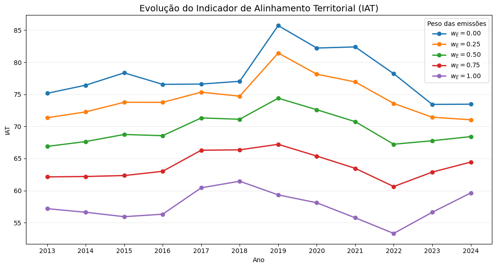
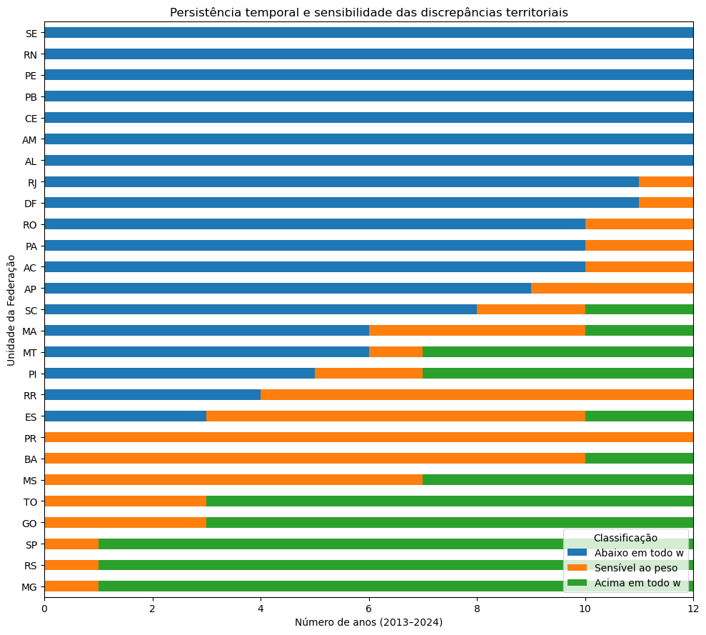

<center>
    
</center>

## <center>Departamento de Ciência da Computação</center>

## <center>PPCA - Programa de Pós-Graduação em Computação Aplicada</center>

# <center>DISTRIBUIÇÃO E CORRESPONDÊNCIA TERRITORIAL DOS INVESTIMENTOS ASSOCIADOS AO CRÉDITO RURAL SUSTENTÁVEL NO BRASIL</center>

## <center>Uma análise longitudinal das Unidades da Federação, 2013–2024</center>
=====================================================
=====================================================
 - #### <font color="blue">Adalberto Araujo Aragão</font>
 - #### <font color="blue">Projeto de Mineração de Dados - CRISP-DM</font>
 - #### <font color="blue">Professor: Marcelo Ladeira</font>
=====================================================
=====================================================

# 5. Evaluation

## 5.1. Integração e avaliação dos resultados

A etapa de avaliação integra as evidências produzidas nas fases de compreensão
dos dados e modelagem, buscando verificar em que medida os resultados obtidos
respondem à questão central da pesquisa e fornecem fundamento para a construção
do produto analítico-metodológico proposto.

As análises descritivas evidenciaram distribuição territorial heterogênea dos
investimentos ao longo do período de 2013 a 2024. Embora a cobertura do crédito
tenha alcançado parcela expressiva das Unidades da Federação em diferentes anos,
a distribuição dos valores permaneceu concentrada, com redução relativa da
concentração aproximadamente entre 2016 e 2021 e posterior reconcentração.

A comparação das participações estaduais mostrou ainda que a distribuição do
crédito apresentou maior proximidade com a distribuição territorial do uso da
terra do que com as distribuições das emissões ou do PIB. Essa regularidade foi
observada ao longo dos 12 anos analisados, embora a magnitude das discrepâncias
entre crédito e uso da terra tenha variado no tempo e entre Unidades da
Federação.

Os modelos econométricos complementaram essa evidência ao distinguir diferenças
estruturais entre UFs de mudanças ocorridas dentro das próprias unidades ao
longo do tempo. Na margem intensiva, observou-se elevada heterogeneidade
territorial persistente, com coeficiente de correlação intraclasse condicional
de aproximadamente 0,812. As verificações de robustez mostraram elevada
estabilidade das estimativas within diante de diferentes tratamentos da
heterogeneidade estadual.

Entre as dimensões territoriais consideradas, o uso da terra apresentou a
associação between mais consistente com o valor dos investimentos. Essa
associação permaneceu positiva tanto no modelo condicionado à ocorrência de
crédito quanto na especificação PPML que incorporou os períodos sem crédito.
Para as emissões, entretanto, a associação between positiva observada na margem
intensiva não permaneceu quando considerado o valor total dos investimentos,
indicando maior sensibilidade ao estimando adotado.

Em conjunto, os resultados caracterizam um padrão de alinhamento territorial
parcial e heterogêneo. A distribuição dos investimentos apresenta associação
mais consistente com a dimensão territorial-produtiva representada pelo uso da
terra, mas essa proximidade agregada não implica proporcionalidade distributiva
entre todas as UFs. As emissões, por sua vez, apresentam relação menos estável
com a distribuição financeira quando consideradas diferentes margens do crédito.

Essa avaliação fornece a base para a construção de um indicador de discrepância
ou alinhamento territorial. O indicador não será utilizado como medida causal
de efetividade, eficiência ou sustentabilidade do crédito. Sua finalidade será
comparar, de forma transparente e reproduzível, a distribuição territorial
observada dos investimentos com uma distribuição de referência construída a
partir de dimensões explicitamente definidas, permitindo identificar padrões
relativos de concentração, correspondência e discrepância territorial.

## 5.2. Construção do indicador analítico-metodológico

Com base na integração dos resultados, propõe-se um Indicador de Alinhamento
Territorial (IAT) destinado a comparar a distribuição observada dos
investimentos com uma distribuição territorial de referência. O indicador
possui caráter distributivo e relativo, não devendo ser interpretado como
medida de eficiência, efetividade, impacto ambiental ou necessidade ótima de
financiamento.

Para cada Unidade da Federação $i$ e ano $t$, são definidas as participações
nacionais no valor dos investimentos, no uso da terra e nas emissões:

$$
s^V_{it}=\frac{V_{it}}{\sum_j V_{jt}},
$$

$$
s^U_{it}=\frac{U_{it}}{\sum_j U_{jt}},
$$

e

$$
s^E_{it}=\frac{E_{it}}{\sum_j E_{jt}}.
$$

Como as três medidas são participações relativas, cada distribuição apresenta
soma unitária em determinado ano, permitindo comparação direta entre dimensões
originalmente expressas em diferentes unidades.

A participação territorial de referência é definida como combinação convexa
das dimensões territorial-produtiva e ambiental:

$$
R_{it}(w)=(1-w)s^U_{it}+ws^E_{it},
\qquad 0\leq w\leq1,
$$

em que $w$ representa o peso atribuído às emissões e $1-w$ o peso atribuído ao
uso da terra.

A discrepância territorial de cada UF é então definida por:

$$
D_{it}(w)=s^V_{it}-R_{it}(w).
$$

Valores positivos indicam participação nos investimentos superior à
participação territorial de referência, enquanto valores negativos indicam
participação inferior à referência. Como as duas distribuições possuem soma
unitária, verifica-se necessariamente:

$$
\sum_iD_{it}(w)=0.
$$

A discrepância agregada nacional é mensurada pela distância:

$$
L_t(w)=\frac{1}{2}\sum_i|D_{it}(w)|,
$$

com $0\leq L_t(w)\leq1$. A partir dela, define-se o indicador agregado de
alinhamento:

$$
A_t(w)=1-L_t(w),
$$

de forma que valores mais elevados representam maior correspondência
distributiva entre os investimentos observados e a referência territorial.

Os pesos não são estimados a partir dos coeficientes dos modelos econométricos,
evitando que a distribuição observada do próprio crédito determine
circularmente a referência utilizada para avaliá-la. Em vez disso, serão
considerados cenários explícitos de ponderação, abrangendo desde uma referência
baseada exclusivamente no uso da terra ($w=0$) até uma referência baseada
exclusivamente nas emissões ($w=1$). O cenário $w=0,5$ representa uma
ponderação balanceada e será tratado como cenário de referência analítica, não
como ponderação normativa ótima.

A estabilidade dos resultados diante da variação dos pesos será avaliada
posteriormente por análise de sensibilidade. Essa estratégia permite identificar
tanto discrepâncias territoriais persistentes quanto resultados dependentes da
ponderação adotada.

## 5.2. Indicador de Alinhamento Territorial (IAT)
## Base analítica específica do indicador


```python
df_iat = (
    df_model[
        ["UF", "Estado", "Ano",
         "VlInvestimento", "Uso_Terra", "Emissoes"]
    ]
    .copy()
    .sort_values(["Ano", "UF"])
    .reset_index(drop=True)
)

# Participações nacionais em cada ano
df_iat["share_credito"] = (
    df_iat["VlInvestimento"]
    / df_iat.groupby("Ano")["VlInvestimento"].transform("sum")
)

df_iat["share_uso"] = (
    df_iat["Uso_Terra"]
    / df_iat.groupby("Ano")["Uso_Terra"].transform("sum")
)

df_iat["share_emissoes"] = (
    df_iat["Emissoes"]
    / df_iat.groupby("Ano")["Emissoes"].transform("sum")
)

print("Dimensão:", df_iat.shape)
print("UFs:", df_iat["UF"].nunique())
print("Anos:", df_iat["Ano"].nunique())
print("Missing total:", df_iat.isna().sum().sum())
```

    Dimensão: (324, 9)
    UFs: 27
    Anos: 12
    Missing total: 0
    

### Validação das participações


```python
somas_shares = (
    df_iat.groupby("Ano")[
        ["share_credito", "share_uso", "share_emissoes"]
    ]
    .sum()
)

display(somas_shares.round(10))

print("\nDesvios máximos em relação a 1:")

for col in ["share_credito", "share_uso", "share_emissoes"]:
    erro = np.abs(somas_shares[col] - 1).max()
    print(f"{col}: {erro:.3e}")
```


<div>
<style scoped>
    .dataframe tbody tr th:only-of-type {
        vertical-align: middle;
    }

    .dataframe tbody tr th {
        vertical-align: top;
    }

    .dataframe thead th {
        text-align: right;
    }
</style>
<table border="1" class="dataframe">
  <thead>
    <tr style="text-align: right;">
      <th></th>
      <th>share_credito</th>
      <th>share_uso</th>
      <th>share_emissoes</th>
    </tr>
    <tr>
      <th>Ano</th>
      <th></th>
      <th></th>
      <th></th>
    </tr>
  </thead>
  <tbody>
    <tr>
      <th>2013</th>
      <td>1.0000</td>
      <td>1.0000</td>
      <td>1.0000</td>
    </tr>
    <tr>
      <th>2014</th>
      <td>1.0000</td>
      <td>1.0000</td>
      <td>1.0000</td>
    </tr>
    <tr>
      <th>2015</th>
      <td>1.0000</td>
      <td>1.0000</td>
      <td>1.0000</td>
    </tr>
    <tr>
      <th>2016</th>
      <td>1.0000</td>
      <td>1.0000</td>
      <td>1.0000</td>
    </tr>
    <tr>
      <th>2017</th>
      <td>1.0000</td>
      <td>1.0000</td>
      <td>1.0000</td>
    </tr>
    <tr>
      <th>2018</th>
      <td>1.0000</td>
      <td>1.0000</td>
      <td>1.0000</td>
    </tr>
    <tr>
      <th>2019</th>
      <td>1.0000</td>
      <td>1.0000</td>
      <td>1.0000</td>
    </tr>
    <tr>
      <th>2020</th>
      <td>1.0000</td>
      <td>1.0000</td>
      <td>1.0000</td>
    </tr>
    <tr>
      <th>2021</th>
      <td>1.0000</td>
      <td>1.0000</td>
      <td>1.0000</td>
    </tr>
    <tr>
      <th>2022</th>
      <td>1.0000</td>
      <td>1.0000</td>
      <td>1.0000</td>
    </tr>
    <tr>
      <th>2023</th>
      <td>1.0000</td>
      <td>1.0000</td>
      <td>1.0000</td>
    </tr>
    <tr>
      <th>2024</th>
      <td>1.0000</td>
      <td>1.0000</td>
      <td>1.0000</td>
    </tr>
  </tbody>
</table>
</div>


    
    Desvios máximos em relação a 1:
    share_credito: 0.000e+00
    share_uso: 0.000e+00
    share_emissoes: 0.000e+00
    


```python
print(somas_shares.round(10))

print("\nDesvios máximos em relação a 1:")

for col in ["share_credito", "share_uso", "share_emissoes"]:
    erro = np.abs(somas_shares[col] - 1).max()
    print(f"{col}: {erro:.3e}")
```

          share_credito  share_uso  share_emissoes
    Ano                                           
    2013         1.0000     1.0000          1.0000
    2014         1.0000     1.0000          1.0000
    2015         1.0000     1.0000          1.0000
    2016         1.0000     1.0000          1.0000
    2017         1.0000     1.0000          1.0000
    2018         1.0000     1.0000          1.0000
    2019         1.0000     1.0000          1.0000
    2020         1.0000     1.0000          1.0000
    2021         1.0000     1.0000          1.0000
    2022         1.0000     1.0000          1.0000
    2023         1.0000     1.0000          1.0000
    2024         1.0000     1.0000          1.0000
    
    Desvios máximos em relação a 1:
    share_credito: 0.000e+00
    share_uso: 0.000e+00
    share_emissoes: 0.000e+00
    

### Cenários explícitos de ponderação


```python
pesos_emissoes = [0.00, 0.25, 0.50, 0.75, 1.00]

iat = pd.concat(
    [
        df_iat.assign(w_emissoes=w)
        for w in pesos_emissoes
    ],
    ignore_index=True
)

iat["w_uso"] = 1 - iat["w_emissoes"]

# Referência territorial
iat["referencia"] = (
    iat["w_uso"] * iat["share_uso"]
    + iat["w_emissoes"] * iat["share_emissoes"]
)

# Discrepância da UF
iat["discrepancia"] = (
    iat["share_credito"]
    - iat["referencia"]
)

print("Dimensão esperada: 1620 linhas")
print("Dimensão obtida:", iat.shape)

display(
    iat[
        ["UF", "Ano",
         "w_uso", "w_emissoes",
         "share_credito",
         "share_uso",
         "share_emissoes",
         "referencia",
         "discrepancia"]
    ].head()
)
```

    Dimensão esperada: 1620 linhas
    Dimensão obtida: (1620, 13)
    


<div>
<style scoped>
    .dataframe tbody tr th:only-of-type {
        vertical-align: middle;
    }

    .dataframe tbody tr th {
        vertical-align: top;
    }

    .dataframe thead th {
        text-align: right;
    }
</style>
<table border="1" class="dataframe">
  <thead>
    <tr style="text-align: right;">
      <th></th>
      <th>UF</th>
      <th>Ano</th>
      <th>w_uso</th>
      <th>w_emissoes</th>
      <th>share_credito</th>
      <th>share_uso</th>
      <th>share_emissoes</th>
      <th>referencia</th>
      <th>discrepancia</th>
    </tr>
  </thead>
  <tbody>
    <tr>
      <th>0</th>
      <td>AC</td>
      <td>2013</td>
      <td>1.0000</td>
      <td>0.0000</td>
      <td>0.0060</td>
      <td>0.0073</td>
      <td>0.0186</td>
      <td>0.0073</td>
      <td>-0.0013</td>
    </tr>
    <tr>
      <th>1</th>
      <td>AL</td>
      <td>2013</td>
      <td>1.0000</td>
      <td>0.0000</td>
      <td>0.0000</td>
      <td>0.0087</td>
      <td>0.0033</td>
      <td>0.0087</td>
      <td>-0.0087</td>
    </tr>
    <tr>
      <th>2</th>
      <td>AM</td>
      <td>2013</td>
      <td>1.0000</td>
      <td>0.0000</td>
      <td>0.0000</td>
      <td>0.0057</td>
      <td>0.0290</td>
      <td>0.0057</td>
      <td>-0.0057</td>
    </tr>
    <tr>
      <th>3</th>
      <td>AP</td>
      <td>2013</td>
      <td>1.0000</td>
      <td>0.0000</td>
      <td>0.0008</td>
      <td>0.0002</td>
      <td>0.0013</td>
      <td>0.0002</td>
      <td>0.0006</td>
    </tr>
    <tr>
      <th>4</th>
      <td>BA</td>
      <td>2013</td>
      <td>1.0000</td>
      <td>0.0000</td>
      <td>0.0575</td>
      <td>0.0903</td>
      <td>0.0562</td>
      <td>0.0903</td>
      <td>-0.0328</td>
    </tr>
  </tbody>
</table>
</div>


```python
print("Dimensão esperada: 1620 linhas")
print("Dimensão obtida:", iat.shape)

print(
    iat[
        ["UF", "Ano",
         "w_uso", "w_emissoes",
         "share_credito",
         "share_uso",
         "share_emissoes",
         "referencia",
         "discrepancia"]
    ].head()
)
```

    Dimensão esperada: 1620 linhas
    Dimensão obtida: (1620, 13)
       UF   Ano  w_uso  w_emissoes  share_credito  share_uso  share_emissoes  \
    0  AC  2013 1.0000      0.0000         0.0060     0.0073          0.0186   
    1  AL  2013 1.0000      0.0000         0.0000     0.0087          0.0033   
    2  AM  2013 1.0000      0.0000         0.0000     0.0057          0.0290   
    3  AP  2013 1.0000      0.0000         0.0008     0.0002          0.0013   
    4  BA  2013 1.0000      0.0000         0.0575     0.0903          0.0562   
    
       referencia  discrepancia  
    0      0.0073       -0.0013  
    1      0.0087       -0.0087  
    2      0.0057       -0.0057  
    3      0.0002        0.0006  
    4      0.0903       -0.0328  
    

### Indicadores nacionais por ano e cenário


```python
iat_nacional = (
    iat.groupby(["Ano", "w_emissoes"], as_index=False)
    .agg(
        soma_referencia=("referencia", "sum"),
        soma_discrepancia=("discrepancia", "sum"),
        soma_abs_discrepancia=(
            "discrepancia",
            lambda x: np.abs(x).sum()
        )
    )
)

iat_nacional["L"] = (
    0.5 * iat_nacional["soma_abs_discrepancia"]
)

iat_nacional["A"] = 1 - iat_nacional["L"]

# Escala opcional de comunicação
iat_nacional["IAT_100"] = 100 * iat_nacional["A"]

display(iat_nacional.round(6))
```


<div>
<style scoped>
    .dataframe tbody tr th:only-of-type {
        vertical-align: middle;
    }

    .dataframe tbody tr th {
        vertical-align: top;
    }

    .dataframe thead th {
        text-align: right;
    }
</style>
<table border="1" class="dataframe">
  <thead>
    <tr style="text-align: right;">
      <th></th>
      <th>Ano</th>
      <th>w_emissoes</th>
      <th>soma_referencia</th>
      <th>soma_discrepancia</th>
      <th>soma_abs_discrepancia</th>
      <th>L</th>
      <th>A</th>
      <th>IAT_100</th>
    </tr>
  </thead>
  <tbody>
    <tr>
      <th>0</th>
      <td>2013</td>
      <td>0.0000</td>
      <td>1.0000</td>
      <td>0.0000</td>
      <td>0.4969</td>
      <td>0.2484</td>
      <td>0.7516</td>
      <td>75.1574</td>
    </tr>
    <tr>
      <th>1</th>
      <td>2013</td>
      <td>0.2500</td>
      <td>1.0000</td>
      <td>0.0000</td>
      <td>0.5730</td>
      <td>0.2865</td>
      <td>0.7135</td>
      <td>71.3510</td>
    </tr>
    <tr>
      <th>2</th>
      <td>2013</td>
      <td>0.5000</td>
      <td>1.0000</td>
      <td>0.0000</td>
      <td>0.6622</td>
      <td>0.3311</td>
      <td>0.6689</td>
      <td>66.8894</td>
    </tr>
    <tr>
      <th>3</th>
      <td>2013</td>
      <td>0.7500</td>
      <td>1.0000</td>
      <td>0.0000</td>
      <td>0.7573</td>
      <td>0.3786</td>
      <td>0.6214</td>
      <td>62.1373</td>
    </tr>
    <tr>
      <th>4</th>
      <td>2013</td>
      <td>1.0000</td>
      <td>1.0000</td>
      <td>0.0000</td>
      <td>0.8563</td>
      <td>0.4281</td>
      <td>0.5719</td>
      <td>57.1862</td>
    </tr>
    <tr>
      <th>5</th>
      <td>2014</td>
      <td>0.0000</td>
      <td>1.0000</td>
      <td>-0.0000</td>
      <td>0.4715</td>
      <td>0.2358</td>
      <td>0.7642</td>
      <td>76.4233</td>
    </tr>
    <tr>
      <th>6</th>
      <td>2014</td>
      <td>0.2500</td>
      <td>1.0000</td>
      <td>-0.0000</td>
      <td>0.5548</td>
      <td>0.2774</td>
      <td>0.7226</td>
      <td>72.2615</td>
    </tr>
    <tr>
      <th>7</th>
      <td>2014</td>
      <td>0.5000</td>
      <td>1.0000</td>
      <td>-0.0000</td>
      <td>0.6472</td>
      <td>0.3236</td>
      <td>0.6764</td>
      <td>67.6383</td>
    </tr>
    <tr>
      <th>8</th>
      <td>2014</td>
      <td>0.7500</td>
      <td>1.0000</td>
      <td>-0.0000</td>
      <td>0.7560</td>
      <td>0.3780</td>
      <td>0.6220</td>
      <td>62.1985</td>
    </tr>
    <tr>
      <th>9</th>
      <td>2014</td>
      <td>1.0000</td>
      <td>1.0000</td>
      <td>0.0000</td>
      <td>0.8675</td>
      <td>0.4337</td>
      <td>0.5663</td>
      <td>56.6275</td>
    </tr>
    <tr>
      <th>10</th>
      <td>2015</td>
      <td>0.0000</td>
      <td>1.0000</td>
      <td>0.0000</td>
      <td>0.4331</td>
      <td>0.2165</td>
      <td>0.7835</td>
      <td>78.3469</td>
    </tr>
    <tr>
      <th>11</th>
      <td>2015</td>
      <td>0.2500</td>
      <td>1.0000</td>
      <td>0.0000</td>
      <td>0.5246</td>
      <td>0.2623</td>
      <td>0.7377</td>
      <td>73.7678</td>
    </tr>
    <tr>
      <th>12</th>
      <td>2015</td>
      <td>0.5000</td>
      <td>1.0000</td>
      <td>0.0000</td>
      <td>0.6250</td>
      <td>0.3125</td>
      <td>0.6875</td>
      <td>68.7483</td>
    </tr>
    <tr>
      <th>13</th>
      <td>2015</td>
      <td>0.7500</td>
      <td>1.0000</td>
      <td>0.0000</td>
      <td>0.7531</td>
      <td>0.3765</td>
      <td>0.6235</td>
      <td>62.3456</td>
    </tr>
    <tr>
      <th>14</th>
      <td>2015</td>
      <td>1.0000</td>
      <td>1.0000</td>
      <td>0.0000</td>
      <td>0.8813</td>
      <td>0.4406</td>
      <td>0.5594</td>
      <td>55.9366</td>
    </tr>
    <tr>
      <th>15</th>
      <td>2016</td>
      <td>0.0000</td>
      <td>1.0000</td>
      <td>-0.0000</td>
      <td>0.4689</td>
      <td>0.2345</td>
      <td>0.7655</td>
      <td>76.5538</td>
    </tr>
    <tr>
      <th>16</th>
      <td>2016</td>
      <td>0.2500</td>
      <td>1.0000</td>
      <td>0.0000</td>
      <td>0.5250</td>
      <td>0.2625</td>
      <td>0.7375</td>
      <td>73.7513</td>
    </tr>
    <tr>
      <th>17</th>
      <td>2016</td>
      <td>0.5000</td>
      <td>1.0000</td>
      <td>-0.0000</td>
      <td>0.6289</td>
      <td>0.3144</td>
      <td>0.6856</td>
      <td>68.5568</td>
    </tr>
    <tr>
      <th>18</th>
      <td>2016</td>
      <td>0.7500</td>
      <td>1.0000</td>
      <td>0.0000</td>
      <td>0.7399</td>
      <td>0.3699</td>
      <td>0.6301</td>
      <td>63.0055</td>
    </tr>
    <tr>
      <th>19</th>
      <td>2016</td>
      <td>1.0000</td>
      <td>1.0000</td>
      <td>0.0000</td>
      <td>0.8735</td>
      <td>0.4367</td>
      <td>0.5633</td>
      <td>56.3258</td>
    </tr>
    <tr>
      <th>20</th>
      <td>2017</td>
      <td>0.0000</td>
      <td>1.0000</td>
      <td>0.0000</td>
      <td>0.4680</td>
      <td>0.2340</td>
      <td>0.7660</td>
      <td>76.6005</td>
    </tr>
    <tr>
      <th>21</th>
      <td>2017</td>
      <td>0.2500</td>
      <td>1.0000</td>
      <td>0.0000</td>
      <td>0.4933</td>
      <td>0.2466</td>
      <td>0.7534</td>
      <td>75.3374</td>
    </tr>
    <tr>
      <th>22</th>
      <td>2017</td>
      <td>0.5000</td>
      <td>1.0000</td>
      <td>-0.0000</td>
      <td>0.5735</td>
      <td>0.2868</td>
      <td>0.7132</td>
      <td>71.3236</td>
    </tr>
    <tr>
      <th>23</th>
      <td>2017</td>
      <td>0.7500</td>
      <td>1.0000</td>
      <td>-0.0000</td>
      <td>0.6742</td>
      <td>0.3371</td>
      <td>0.6629</td>
      <td>66.2920</td>
    </tr>
    <tr>
      <th>24</th>
      <td>2017</td>
      <td>1.0000</td>
      <td>1.0000</td>
      <td>-0.0000</td>
      <td>0.7913</td>
      <td>0.3957</td>
      <td>0.6043</td>
      <td>60.4340</td>
    </tr>
    <tr>
      <th>25</th>
      <td>2018</td>
      <td>0.0000</td>
      <td>1.0000</td>
      <td>-0.0000</td>
      <td>0.4594</td>
      <td>0.2297</td>
      <td>0.7703</td>
      <td>77.0307</td>
    </tr>
    <tr>
      <th>26</th>
      <td>2018</td>
      <td>0.2500</td>
      <td>1.0000</td>
      <td>-0.0000</td>
      <td>0.5058</td>
      <td>0.2529</td>
      <td>0.7471</td>
      <td>74.7094</td>
    </tr>
    <tr>
      <th>27</th>
      <td>2018</td>
      <td>0.5000</td>
      <td>1.0000</td>
      <td>-0.0000</td>
      <td>0.5776</td>
      <td>0.2888</td>
      <td>0.7112</td>
      <td>71.1185</td>
    </tr>
    <tr>
      <th>28</th>
      <td>2018</td>
      <td>0.7500</td>
      <td>1.0000</td>
      <td>-0.0000</td>
      <td>0.6729</td>
      <td>0.3365</td>
      <td>0.6635</td>
      <td>66.3549</td>
    </tr>
    <tr>
      <th>29</th>
      <td>2018</td>
      <td>1.0000</td>
      <td>1.0000</td>
      <td>0.0000</td>
      <td>0.7707</td>
      <td>0.3854</td>
      <td>0.6146</td>
      <td>61.4636</td>
    </tr>
    <tr>
      <th>30</th>
      <td>2019</td>
      <td>0.0000</td>
      <td>1.0000</td>
      <td>0.0000</td>
      <td>0.2856</td>
      <td>0.1428</td>
      <td>0.8572</td>
      <td>85.7195</td>
    </tr>
    <tr>
      <th>31</th>
      <td>2019</td>
      <td>0.2500</td>
      <td>1.0000</td>
      <td>0.0000</td>
      <td>0.3713</td>
      <td>0.1857</td>
      <td>0.8143</td>
      <td>81.4331</td>
    </tr>
    <tr>
      <th>32</th>
      <td>2019</td>
      <td>0.5000</td>
      <td>1.0000</td>
      <td>-0.0000</td>
      <td>0.5120</td>
      <td>0.2560</td>
      <td>0.7440</td>
      <td>74.3976</td>
    </tr>
    <tr>
      <th>33</th>
      <td>2019</td>
      <td>0.7500</td>
      <td>1.0000</td>
      <td>-0.0000</td>
      <td>0.6558</td>
      <td>0.3279</td>
      <td>0.6721</td>
      <td>67.2111</td>
    </tr>
    <tr>
      <th>34</th>
      <td>2019</td>
      <td>1.0000</td>
      <td>1.0000</td>
      <td>0.0000</td>
      <td>0.8134</td>
      <td>0.4067</td>
      <td>0.5933</td>
      <td>59.3325</td>
    </tr>
    <tr>
      <th>35</th>
      <td>2020</td>
      <td>0.0000</td>
      <td>1.0000</td>
      <td>0.0000</td>
      <td>0.3557</td>
      <td>0.1779</td>
      <td>0.8221</td>
      <td>82.2144</td>
    </tr>
    <tr>
      <th>36</th>
      <td>2020</td>
      <td>0.2500</td>
      <td>1.0000</td>
      <td>-0.0000</td>
      <td>0.4371</td>
      <td>0.2185</td>
      <td>0.7815</td>
      <td>78.1453</td>
    </tr>
    <tr>
      <th>37</th>
      <td>2020</td>
      <td>0.5000</td>
      <td>1.0000</td>
      <td>-0.0000</td>
      <td>0.5479</td>
      <td>0.2740</td>
      <td>0.7260</td>
      <td>72.6034</td>
    </tr>
    <tr>
      <th>38</th>
      <td>2020</td>
      <td>0.7500</td>
      <td>1.0000</td>
      <td>-0.0000</td>
      <td>0.6923</td>
      <td>0.3461</td>
      <td>0.6539</td>
      <td>65.3869</td>
    </tr>
    <tr>
      <th>39</th>
      <td>2020</td>
      <td>1.0000</td>
      <td>1.0000</td>
      <td>-0.0000</td>
      <td>0.8379</td>
      <td>0.4189</td>
      <td>0.5811</td>
      <td>58.1071</td>
    </tr>
    <tr>
      <th>40</th>
      <td>2021</td>
      <td>0.0000</td>
      <td>1.0000</td>
      <td>-0.0000</td>
      <td>0.3522</td>
      <td>0.1761</td>
      <td>0.8239</td>
      <td>82.3897</td>
    </tr>
    <tr>
      <th>41</th>
      <td>2021</td>
      <td>0.2500</td>
      <td>1.0000</td>
      <td>-0.0000</td>
      <td>0.4615</td>
      <td>0.2307</td>
      <td>0.7693</td>
      <td>76.9271</td>
    </tr>
    <tr>
      <th>42</th>
      <td>2021</td>
      <td>0.5000</td>
      <td>1.0000</td>
      <td>-0.0000</td>
      <td>0.5851</td>
      <td>0.2926</td>
      <td>0.7074</td>
      <td>70.7434</td>
    </tr>
    <tr>
      <th>43</th>
      <td>2021</td>
      <td>0.7500</td>
      <td>1.0000</td>
      <td>-0.0000</td>
      <td>0.7306</td>
      <td>0.3653</td>
      <td>0.6347</td>
      <td>63.4715</td>
    </tr>
    <tr>
      <th>44</th>
      <td>2021</td>
      <td>1.0000</td>
      <td>1.0000</td>
      <td>-0.0000</td>
      <td>0.8847</td>
      <td>0.4423</td>
      <td>0.5577</td>
      <td>55.7670</td>
    </tr>
    <tr>
      <th>45</th>
      <td>2022</td>
      <td>0.0000</td>
      <td>1.0000</td>
      <td>-0.0000</td>
      <td>0.4357</td>
      <td>0.2179</td>
      <td>0.7821</td>
      <td>78.2128</td>
    </tr>
    <tr>
      <th>46</th>
      <td>2022</td>
      <td>0.2500</td>
      <td>1.0000</td>
      <td>0.0000</td>
      <td>0.5283</td>
      <td>0.2642</td>
      <td>0.7358</td>
      <td>73.5829</td>
    </tr>
    <tr>
      <th>47</th>
      <td>2022</td>
      <td>0.5000</td>
      <td>1.0000</td>
      <td>-0.0000</td>
      <td>0.6555</td>
      <td>0.3277</td>
      <td>0.6723</td>
      <td>67.2270</td>
    </tr>
    <tr>
      <th>48</th>
      <td>2022</td>
      <td>0.7500</td>
      <td>1.0000</td>
      <td>-0.0000</td>
      <td>0.7874</td>
      <td>0.3937</td>
      <td>0.6063</td>
      <td>60.6317</td>
    </tr>
    <tr>
      <th>49</th>
      <td>2022</td>
      <td>1.0000</td>
      <td>1.0000</td>
      <td>-0.0000</td>
      <td>0.9334</td>
      <td>0.4667</td>
      <td>0.5333</td>
      <td>53.3317</td>
    </tr>
    <tr>
      <th>50</th>
      <td>2023</td>
      <td>0.0000</td>
      <td>1.0000</td>
      <td>0.0000</td>
      <td>0.5314</td>
      <td>0.2657</td>
      <td>0.7343</td>
      <td>73.4319</td>
    </tr>
    <tr>
      <th>51</th>
      <td>2023</td>
      <td>0.2500</td>
      <td>1.0000</td>
      <td>0.0000</td>
      <td>0.5714</td>
      <td>0.2857</td>
      <td>0.7143</td>
      <td>71.4311</td>
    </tr>
    <tr>
      <th>52</th>
      <td>2023</td>
      <td>0.5000</td>
      <td>1.0000</td>
      <td>0.0000</td>
      <td>0.6446</td>
      <td>0.3223</td>
      <td>0.6777</td>
      <td>67.7704</td>
    </tr>
    <tr>
      <th>53</th>
      <td>2023</td>
      <td>0.7500</td>
      <td>1.0000</td>
      <td>0.0000</td>
      <td>0.7423</td>
      <td>0.3711</td>
      <td>0.6289</td>
      <td>62.8850</td>
    </tr>
    <tr>
      <th>54</th>
      <td>2023</td>
      <td>1.0000</td>
      <td>1.0000</td>
      <td>0.0000</td>
      <td>0.8676</td>
      <td>0.4338</td>
      <td>0.5662</td>
      <td>56.6195</td>
    </tr>
    <tr>
      <th>55</th>
      <td>2024</td>
      <td>0.0000</td>
      <td>1.0000</td>
      <td>0.0000</td>
      <td>0.5308</td>
      <td>0.2654</td>
      <td>0.7346</td>
      <td>73.4623</td>
    </tr>
    <tr>
      <th>56</th>
      <td>2024</td>
      <td>0.2500</td>
      <td>1.0000</td>
      <td>0.0000</td>
      <td>0.5792</td>
      <td>0.2896</td>
      <td>0.7104</td>
      <td>71.0382</td>
    </tr>
    <tr>
      <th>57</th>
      <td>2024</td>
      <td>0.5000</td>
      <td>1.0000</td>
      <td>0.0000</td>
      <td>0.6317</td>
      <td>0.3159</td>
      <td>0.6841</td>
      <td>68.4147</td>
    </tr>
    <tr>
      <th>58</th>
      <td>2024</td>
      <td>0.7500</td>
      <td>1.0000</td>
      <td>-0.0000</td>
      <td>0.7112</td>
      <td>0.3556</td>
      <td>0.6444</td>
      <td>64.4404</td>
    </tr>
    <tr>
      <th>59</th>
      <td>2024</td>
      <td>1.0000</td>
      <td>1.0000</td>
      <td>0.0000</td>
      <td>0.8073</td>
      <td>0.4036</td>
      <td>0.5964</td>
      <td>59.6356</td>
    </tr>
  </tbody>
</table>
</div>


```python
print(iat_nacional.round(6))
```

         Ano  w_emissoes  soma_referencia  soma_discrepancia  \
    0   2013      0.0000           1.0000             0.0000   
    1   2013      0.2500           1.0000             0.0000   
    2   2013      0.5000           1.0000             0.0000   
    3   2013      0.7500           1.0000             0.0000   
    4   2013      1.0000           1.0000             0.0000   
    5   2014      0.0000           1.0000            -0.0000   
    6   2014      0.2500           1.0000            -0.0000   
    7   2014      0.5000           1.0000            -0.0000   
    8   2014      0.7500           1.0000            -0.0000   
    9   2014      1.0000           1.0000             0.0000   
    10  2015      0.0000           1.0000             0.0000   
    11  2015      0.2500           1.0000             0.0000   
    12  2015      0.5000           1.0000             0.0000   
    13  2015      0.7500           1.0000             0.0000   
    14  2015      1.0000           1.0000             0.0000   
    15  2016      0.0000           1.0000            -0.0000   
    16  2016      0.2500           1.0000             0.0000   
    17  2016      0.5000           1.0000            -0.0000   
    18  2016      0.7500           1.0000             0.0000   
    19  2016      1.0000           1.0000             0.0000   
    20  2017      0.0000           1.0000             0.0000   
    21  2017      0.2500           1.0000             0.0000   
    22  2017      0.5000           1.0000            -0.0000   
    23  2017      0.7500           1.0000            -0.0000   
    24  2017      1.0000           1.0000            -0.0000   
    25  2018      0.0000           1.0000            -0.0000   
    26  2018      0.2500           1.0000            -0.0000   
    27  2018      0.5000           1.0000            -0.0000   
    28  2018      0.7500           1.0000            -0.0000   
    29  2018      1.0000           1.0000             0.0000   
    30  2019      0.0000           1.0000             0.0000   
    31  2019      0.2500           1.0000             0.0000   
    32  2019      0.5000           1.0000            -0.0000   
    33  2019      0.7500           1.0000            -0.0000   
    34  2019      1.0000           1.0000             0.0000   
    35  2020      0.0000           1.0000             0.0000   
    36  2020      0.2500           1.0000            -0.0000   
    37  2020      0.5000           1.0000            -0.0000   
    38  2020      0.7500           1.0000            -0.0000   
    39  2020      1.0000           1.0000            -0.0000   
    40  2021      0.0000           1.0000            -0.0000   
    41  2021      0.2500           1.0000            -0.0000   
    42  2021      0.5000           1.0000            -0.0000   
    43  2021      0.7500           1.0000            -0.0000   
    44  2021      1.0000           1.0000            -0.0000   
    45  2022      0.0000           1.0000            -0.0000   
    46  2022      0.2500           1.0000             0.0000   
    47  2022      0.5000           1.0000            -0.0000   
    48  2022      0.7500           1.0000            -0.0000   
    49  2022      1.0000           1.0000            -0.0000   
    50  2023      0.0000           1.0000             0.0000   
    51  2023      0.2500           1.0000             0.0000   
    52  2023      0.5000           1.0000             0.0000   
    53  2023      0.7500           1.0000             0.0000   
    54  2023      1.0000           1.0000             0.0000   
    55  2024      0.0000           1.0000             0.0000   
    56  2024      0.2500           1.0000             0.0000   
    57  2024      0.5000           1.0000             0.0000   
    58  2024      0.7500           1.0000            -0.0000   
    59  2024      1.0000           1.0000             0.0000   
    
        soma_abs_discrepancia      L      A  IAT_100  
    0                  0.4969 0.2484 0.7516  75.1574  
    1                  0.5730 0.2865 0.7135  71.3510  
    2                  0.6622 0.3311 0.6689  66.8894  
    3                  0.7573 0.3786 0.6214  62.1373  
    4                  0.8563 0.4281 0.5719  57.1862  
    5                  0.4715 0.2358 0.7642  76.4233  
    6                  0.5548 0.2774 0.7226  72.2615  
    7                  0.6472 0.3236 0.6764  67.6383  
    8                  0.7560 0.3780 0.6220  62.1985  
    9                  0.8675 0.4337 0.5663  56.6275  
    10                 0.4331 0.2165 0.7835  78.3469  
    11                 0.5246 0.2623 0.7377  73.7678  
    12                 0.6250 0.3125 0.6875  68.7483  
    13                 0.7531 0.3765 0.6235  62.3456  
    14                 0.8813 0.4406 0.5594  55.9366  
    15                 0.4689 0.2345 0.7655  76.5538  
    16                 0.5250 0.2625 0.7375  73.7513  
    17                 0.6289 0.3144 0.6856  68.5568  
    18                 0.7399 0.3699 0.6301  63.0055  
    19                 0.8735 0.4367 0.5633  56.3258  
    20                 0.4680 0.2340 0.7660  76.6005  
    21                 0.4933 0.2466 0.7534  75.3374  
    22                 0.5735 0.2868 0.7132  71.3236  
    23                 0.6742 0.3371 0.6629  66.2920  
    24                 0.7913 0.3957 0.6043  60.4340  
    25                 0.4594 0.2297 0.7703  77.0307  
    26                 0.5058 0.2529 0.7471  74.7094  
    27                 0.5776 0.2888 0.7112  71.1185  
    28                 0.6729 0.3365 0.6635  66.3549  
    29                 0.7707 0.3854 0.6146  61.4636  
    30                 0.2856 0.1428 0.8572  85.7195  
    31                 0.3713 0.1857 0.8143  81.4331  
    32                 0.5120 0.2560 0.7440  74.3976  
    33                 0.6558 0.3279 0.6721  67.2111  
    34                 0.8134 0.4067 0.5933  59.3325  
    35                 0.3557 0.1779 0.8221  82.2144  
    36                 0.4371 0.2185 0.7815  78.1453  
    37                 0.5479 0.2740 0.7260  72.6034  
    38                 0.6923 0.3461 0.6539  65.3869  
    39                 0.8379 0.4189 0.5811  58.1071  
    40                 0.3522 0.1761 0.8239  82.3897  
    41                 0.4615 0.2307 0.7693  76.9271  
    42                 0.5851 0.2926 0.7074  70.7434  
    43                 0.7306 0.3653 0.6347  63.4715  
    44                 0.8847 0.4423 0.5577  55.7670  
    45                 0.4357 0.2179 0.7821  78.2128  
    46                 0.5283 0.2642 0.7358  73.5829  
    47                 0.6555 0.3277 0.6723  67.2270  
    48                 0.7874 0.3937 0.6063  60.6317  
    49                 0.9334 0.4667 0.5333  53.3317  
    50                 0.5314 0.2657 0.7343  73.4319  
    51                 0.5714 0.2857 0.7143  71.4311  
    52                 0.6446 0.3223 0.6777  67.7704  
    53                 0.7423 0.3711 0.6289  62.8850  
    54                 0.8676 0.4338 0.5662  56.6195  
    55                 0.5308 0.2654 0.7346  73.4623  
    56                 0.5792 0.2896 0.7104  71.0382  
    57                 0.6317 0.3159 0.6841  68.4147  
    58                 0.7112 0.3556 0.6444  64.4404  
    59                 0.8073 0.4036 0.5964  59.6356  
    

### Quality gate — IAT


```python
tol = 1e-10

checks_iat = {
    # Estrutura
    "N_base_324":
        len(df_iat) == 324,

    "UFs_27":
        df_iat["UF"].nunique() == 27,

    "Anos_12":
        df_iat["Ano"].nunique() == 12,

    "N_cenarios_5":
        iat["w_emissoes"].nunique() == 5,

    "N_expandido_1620":
        len(iat) == 1620,

    # Shares
    "Share_credito_soma_1":
        np.allclose(
            somas_shares["share_credito"],
            1,
            atol=tol
        ),

    "Share_uso_soma_1":
        np.allclose(
            somas_shares["share_uso"],
            1,
            atol=tol
        ),

    "Share_emissoes_soma_1":
        np.allclose(
            somas_shares["share_emissoes"],
            1,
            atol=tol
        ),

    # Referência
    "Referencia_soma_1":
        np.allclose(
            iat_nacional["soma_referencia"],
            1,
            atol=tol
        ),

    # Discrepância
    "Discrepancia_soma_0":
        np.allclose(
            iat_nacional["soma_discrepancia"],
            0,
            atol=tol
        ),

    # Limites
    "L_entre_0_e_1":
        iat_nacional["L"].between(
            -tol, 1 + tol
        ).all(),

    "A_entre_0_e_1":
        iat_nacional["A"].between(
            -tol, 1 + tol
        ).all(),

    # Identidade
    "A_igual_1_menos_L":
        np.allclose(
            iat_nacional["A"],
            1 - iat_nacional["L"],
            atol=tol
        ),

    # Casos-limite da referência
    "w0_igual_share_uso":
        np.allclose(
            iat.loc[
                iat["w_emissoes"] == 0,
                "referencia"
            ],
            iat.loc[
                iat["w_emissoes"] == 0,
                "share_uso"
            ],
            atol=tol
        ),

    "w1_igual_share_emissoes":
        np.allclose(
            iat.loc[
                iat["w_emissoes"] == 1,
                "referencia"
            ],
            iat.loc[
                iat["w_emissoes"] == 1,
                "share_emissoes"
            ],
            atol=tol
        )
}

quality_gate_iat = pd.Series(
    checks_iat,
    name="Aprovado"
).to_frame()

display(quality_gate_iat)

print(
    "\nQUALITY GATE GERAL:",
    "APROVADO"
    if quality_gate_iat["Aprovado"].all()
    else "REPROVADO"
)
```


<div>
<style scoped>
    .dataframe tbody tr th:only-of-type {
        vertical-align: middle;
    }

    .dataframe tbody tr th {
        vertical-align: top;
    }

    .dataframe thead th {
        text-align: right;
    }
</style>
<table border="1" class="dataframe">
  <thead>
    <tr style="text-align: right;">
      <th></th>
      <th>Aprovado</th>
    </tr>
  </thead>
  <tbody>
    <tr>
      <th>N_base_324</th>
      <td>True</td>
    </tr>
    <tr>
      <th>UFs_27</th>
      <td>True</td>
    </tr>
    <tr>
      <th>Anos_12</th>
      <td>True</td>
    </tr>
    <tr>
      <th>N_cenarios_5</th>
      <td>True</td>
    </tr>
    <tr>
      <th>N_expandido_1620</th>
      <td>True</td>
    </tr>
    <tr>
      <th>Share_credito_soma_1</th>
      <td>True</td>
    </tr>
    <tr>
      <th>Share_uso_soma_1</th>
      <td>True</td>
    </tr>
    <tr>
      <th>Share_emissoes_soma_1</th>
      <td>True</td>
    </tr>
    <tr>
      <th>Referencia_soma_1</th>
      <td>True</td>
    </tr>
    <tr>
      <th>Discrepancia_soma_0</th>
      <td>True</td>
    </tr>
    <tr>
      <th>L_entre_0_e_1</th>
      <td>True</td>
    </tr>
    <tr>
      <th>A_entre_0_e_1</th>
      <td>True</td>
    </tr>
    <tr>
      <th>A_igual_1_menos_L</th>
      <td>True</td>
    </tr>
    <tr>
      <th>w0_igual_share_uso</th>
      <td>True</td>
    </tr>
    <tr>
      <th>w1_igual_share_emissoes</th>
      <td>True</td>
    </tr>
  </tbody>
</table>
</div>


    
    QUALITY GATE GERAL: APROVADO
    


```python
print(quality_gate_iat)

print(
    "\nQUALITY GATE GERAL:",
    "APROVADO"
    if quality_gate_iat["Aprovado"].all()
    else "REPROVADO"
)
```

                             Aprovado
    N_base_324                   True
    UFs_27                       True
    Anos_12                      True
    N_cenarios_5                 True
    N_expandido_1620             True
    Share_credito_soma_1         True
    Share_uso_soma_1             True
    Share_emissoes_soma_1        True
    Referencia_soma_1            True
    Discrepancia_soma_0          True
    L_entre_0_e_1                True
    A_entre_0_e_1                True
    A_igual_1_menos_L            True
    w0_igual_share_uso           True
    w1_igual_share_emissoes      True
    
    QUALITY GATE GERAL: APROVADO
    

### Matriz Ano × peso — IAT em escala 0–100
#### Evolução temporal do IAT segundo diferentes referências

A evolução temporal do Indicador de Alinhamento Territorial (IAT) é apresentada
para diferentes combinações entre as dimensões territorial-produtiva e ambiental.
O parâmetro $w_E$ representa o peso atribuído às emissões, enquanto
$1-w_E$ corresponde ao peso atribuído ao uso da terra.

São considerados cinco cenários:

- $w_E=0$: referência exclusivamente baseada no uso da terra;
- $w_E=0{,}25$: predominância do uso da terra;
- $w_E=0{,}50$: referência balanceada;
- $w_E=0{,}75$: predominância das emissões;
- $w_E=1$: referência exclusivamente baseada nas emissões.

Valores mais elevados do IAT representam maior correspondência entre a
distribuição territorial observada dos investimentos e a distribuição de
referência. As diferentes trajetórias não representam cenários de eficiência
ou de alocação ótima, mas permitem visualizar como a correspondência
distributiva varia conforme a composição da referência adotada.


```python
tabela_iat = (
    iat_nacional
    .pivot(
        index="Ano",
        columns="w_emissoes",
        values="IAT_100"
    )
    .rename(
        columns={
            0.00: "wE_0.00",
            0.25: "wE_0.25",
            0.50: "wE_0.50",
            0.75: "wE_0.75",
            1.00: "wE_1.00"
        }
    )
)

display(tabela_iat.round(2))
```


<div>
<style scoped>
    .dataframe tbody tr th:only-of-type {
        vertical-align: middle;
    }

    .dataframe tbody tr th {
        vertical-align: top;
    }

    .dataframe thead th {
        text-align: right;
    }
</style>
<table border="1" class="dataframe">
  <thead>
    <tr style="text-align: right;">
      <th>w_emissoes</th>
      <th>wE_0.00</th>
      <th>wE_0.25</th>
      <th>wE_0.50</th>
      <th>wE_0.75</th>
      <th>wE_1.00</th>
    </tr>
    <tr>
      <th>Ano</th>
      <th></th>
      <th></th>
      <th></th>
      <th></th>
      <th></th>
    </tr>
  </thead>
  <tbody>
    <tr>
      <th>2013</th>
      <td>75.1600</td>
      <td>71.3500</td>
      <td>66.8900</td>
      <td>62.1400</td>
      <td>57.1900</td>
    </tr>
    <tr>
      <th>2014</th>
      <td>76.4200</td>
      <td>72.2600</td>
      <td>67.6400</td>
      <td>62.2000</td>
      <td>56.6300</td>
    </tr>
    <tr>
      <th>2015</th>
      <td>78.3500</td>
      <td>73.7700</td>
      <td>68.7500</td>
      <td>62.3500</td>
      <td>55.9400</td>
    </tr>
    <tr>
      <th>2016</th>
      <td>76.5500</td>
      <td>73.7500</td>
      <td>68.5600</td>
      <td>63.0100</td>
      <td>56.3300</td>
    </tr>
    <tr>
      <th>2017</th>
      <td>76.6000</td>
      <td>75.3400</td>
      <td>71.3200</td>
      <td>66.2900</td>
      <td>60.4300</td>
    </tr>
    <tr>
      <th>2018</th>
      <td>77.0300</td>
      <td>74.7100</td>
      <td>71.1200</td>
      <td>66.3500</td>
      <td>61.4600</td>
    </tr>
    <tr>
      <th>2019</th>
      <td>85.7200</td>
      <td>81.4300</td>
      <td>74.4000</td>
      <td>67.2100</td>
      <td>59.3300</td>
    </tr>
    <tr>
      <th>2020</th>
      <td>82.2100</td>
      <td>78.1500</td>
      <td>72.6000</td>
      <td>65.3900</td>
      <td>58.1100</td>
    </tr>
    <tr>
      <th>2021</th>
      <td>82.3900</td>
      <td>76.9300</td>
      <td>70.7400</td>
      <td>63.4700</td>
      <td>55.7700</td>
    </tr>
    <tr>
      <th>2022</th>
      <td>78.2100</td>
      <td>73.5800</td>
      <td>67.2300</td>
      <td>60.6300</td>
      <td>53.3300</td>
    </tr>
    <tr>
      <th>2023</th>
      <td>73.4300</td>
      <td>71.4300</td>
      <td>67.7700</td>
      <td>62.8900</td>
      <td>56.6200</td>
    </tr>
    <tr>
      <th>2024</th>
      <td>73.4600</td>
      <td>71.0400</td>
      <td>68.4100</td>
      <td>64.4400</td>
      <td>59.6400</td>
    </tr>
  </tbody>
</table>
</div>


```python
print(tabela_iat.round(2))
```

    w_emissoes  wE_0.00  wE_0.25  wE_0.50  wE_0.75  wE_1.00
    Ano                                                    
    2013        75.1600  71.3500  66.8900  62.1400  57.1900
    2014        76.4200  72.2600  67.6400  62.2000  56.6300
    2015        78.3500  73.7700  68.7500  62.3500  55.9400
    2016        76.5500  73.7500  68.5600  63.0100  56.3300
    2017        76.6000  75.3400  71.3200  66.2900  60.4300
    2018        77.0300  74.7100  71.1200  66.3500  61.4600
    2019        85.7200  81.4300  74.4000  67.2100  59.3300
    2020        82.2100  78.1500  72.6000  65.3900  58.1100
    2021        82.3900  76.9300  70.7400  63.4700  55.7700
    2022        78.2100  73.5800  67.2300  60.6300  53.3300
    2023        73.4300  71.4300  67.7700  62.8900  56.6200
    2024        73.4600  71.0400  68.4100  64.4400  59.6400
    


```python
import matplotlib.pyplot as plt

fig, ax = plt.subplots(figsize=(11, 6))

for w, grupo in iat_nacional.groupby("w_emissoes"):
    grupo = grupo.sort_values("Ano")

    ax.plot(
        grupo["Ano"],
        grupo["IAT_100"],
        marker="o",
        linewidth=2,
        label=fr"$w_E={w:.2f}$"
    )

ax.set_title(
    "Evolução do Indicador de Alinhamento Territorial (IAT)",
    fontsize=14
)
ax.set_xlabel("Ano")
ax.set_ylabel("IAT")
ax.set_xticks(sorted(iat_nacional["Ano"].unique()))

ax.legend(
    title="Peso das emissões",
    ncol=1
)

ax.grid(
    axis="y",
    alpha=0.25
)

plt.tight_layout()
plt.show()
```


    

    


Nos cinco cenários avaliados, a atribuição de maior peso ao uso da terra
produz valores mais elevados do IAT, enquanto o aumento do peso atribuído
às emissões reduz o grau de correspondência com a distribuição observada
dos investimentos. Esse resultado indica que, ao longo de todo o período,
a geografia dos investimentos esteve mais próxima da distribuição
territorial do uso da terra do que da distribuição das emissões.

As trajetórias também evidenciam que não houve aumento monotônico do
alinhamento territorial entre 2013 e 2024. No cenário balanceado
($w_E=0{,}50$), por exemplo, o IAT passou de 66,89 em 2013 para 74,40
em 2019, recuou posteriormente e atingiu 68,41 em 2024.

A distância entre as trajetórias varia ao longo do período, mostrando que
a sensibilidade do indicador à composição da referência também possui
dimensão temporal. Essa evidência será examinada formalmente na análise
de sensibilidade da Seção 5.3.

As diferenças entre os cenários não identificam uma ponderação superior
ou ótima. Cada trajetória corresponde a uma referência distributiva
distinta, e sua comparação explicita como a mensuração do alinhamento
depende das dimensões utilizadas para construir essa referência.

## 5.2. Implementação e validação interna do indicador

A implementação computacional do Indicador de Alinhamento Territorial (IAT)
preservou as 324 observações do painel, correspondentes às 27 Unidades da
Federação e aos 12 anos compreendidos entre 2013 e 2024, sem introdução de
valores ausentes.

Foram avaliados cinco cenários de ponderação da dimensão ambiental,
correspondentes a $w_E=\{0;0,25;0,50;0,75;1\}$, totalizando 1.620 combinações
UF-ano-cenário. Os testes de consistência confirmaram que as participações
anuais dos investimentos, do uso da terra e das emissões possuem soma unitária;
que a distribuição territorial de referência também apresenta soma igual a
um; e que as discrepâncias estaduais apresentam soma igual a zero em cada
combinação de ano e ponderação.

Foram igualmente confirmados os limites teóricos das medidas agregadas,
$0\leq L_t(w)\leq1$ e $0\leq A_t(w)\leq1$, bem como a identidade
$A_t(w)=1-L_t(w)$. Os casos-limite também foram reproduzidos exatamente:
quando $w_E=0$, a referência corresponde integralmente à distribuição do uso
da terra; quando $w_E=1$, corresponde integralmente à distribuição das
emissões.

Os resultados nacionais evidenciaram um padrão consistente em todo o período:
o alinhamento distributivo diminui à medida que aumenta o peso atribuído às
emissões na distribuição de referência. Em todos os 12 anos analisados, o
maior IAT foi obtido no cenário baseado exclusivamente no uso da terra e o
menor no cenário baseado exclusivamente nas emissões.

No cenário balanceado ($w_E=0,50$), o IAT passou de 66,89 em 2013 para um
máximo de 74,40 em 2019, reduzindo-se posteriormente para 67,23 em 2022 e
alcançando 68,41 em 2024. A evolução temporal, portanto, não caracteriza uma
trajetória monotônica de aumento do alinhamento.

Os casos-limite reproduziram os resultados anteriormente obtidos pelas
distâncias distributivas individuais. Em 2019, por exemplo, a distância em
relação ao uso da terra foi de 0,1428, correspondendo a
$A_t=1-0,1428=0,8572$, ou 85,72 pontos na escala de comunicação do IAT.
Essa equivalência fornece uma verificação adicional da consistência entre a
formulação metodológica e sua implementação computacional.

A escala de 0 a 100 deve ser interpretada exclusivamente como transformação
do grau de correspondência distributiva. Um IAT de 70, por exemplo, não
significa que 70% dos recursos foram alocados de maneira adequada, eficiente
ou sustentável. O indicador mensura a proximidade entre duas distribuições
territoriais relativas, segundo a referência e a ponderação explicitamente
adotadas.

## 5.3. Sensibilidade e validação do IAT
### 5.3.1. Robustez exata da discrepância em relação aos pesos


```python
sens_iat = df_iat.copy()

# Discrepâncias nos dois extremos da ponderação
sens_iat["D_uso"] = (
    sens_iat["share_credito"] - sens_iat["share_uso"]
)

sens_iat["D_emissoes"] = (
    sens_iat["share_credito"] - sens_iat["share_emissoes"]
)

tol = 1e-12

def classificar_robustez(row):
    d0 = row["D_uso"]
    d1 = row["D_emissoes"]

    if d0 > tol and d1 > tol:
        return "Acima em todo w"

    elif d0 < -tol and d1 < -tol:
        return "Abaixo em todo w"

    elif abs(d0) <= tol and abs(d1) <= tol:
        return "Correspondência em todo w"

    else:
        return "Sensível ao peso"

sens_iat["robustez_peso"] = sens_iat.apply(
    classificar_robustez,
    axis=1
)

display(
    sens_iat["robustez_peso"]
    .value_counts()
    .rename("N")
    .to_frame()
)
```


<div>
<style scoped>
    .dataframe tbody tr th:only-of-type {
        vertical-align: middle;
    }

    .dataframe tbody tr th {
        vertical-align: top;
    }

    .dataframe thead th {
        text-align: right;
    }
</style>
<table border="1" class="dataframe">
  <thead>
    <tr style="text-align: right;">
      <th></th>
      <th>N</th>
    </tr>
    <tr>
      <th>robustez_peso</th>
      <th></th>
    </tr>
  </thead>
  <tbody>
    <tr>
      <th>Abaixo em todo w</th>
      <td>177</td>
    </tr>
    <tr>
      <th>Acima em todo w</th>
      <td>74</td>
    </tr>
    <tr>
      <th>Sensível ao peso</th>
      <td>73</td>
    </tr>
  </tbody>
</table>
</div>


```python
print(
    sens_iat["robustez_peso"]
    .value_counts()
    .rename("N")
    .to_frame()
)
```

                        N
    robustez_peso        
    Abaixo em todo w  177
    Acima em todo w    74
    Sensível ao peso   73
    

### Peso crítico $w*$ para observações sensíveis


```python
den = (
    sens_iat["share_emissoes"]
    - sens_iat["share_uso"]
)

sens_iat["w_critico"] = np.nan

mask_sensivel = (
    sens_iat["robustez_peso"] == "Sensível ao peso"
) & (np.abs(den) > tol)

sens_iat.loc[mask_sensivel, "w_critico"] = (
    sens_iat.loc[mask_sensivel, "D_uso"]
    / den.loc[mask_sensivel]
)

# Auditoria
audit_w = sens_iat.loc[
    sens_iat["robustez_peso"] == "Sensível ao peso",
    ["UF", "Ano", "D_uso", "D_emissoes", "w_critico"]
].copy()

print("Casos sensíveis:", len(audit_w))

print(
    "w* fora de [0,1]:",
    (~audit_w["w_critico"].between(0, 1)).sum()
)

display(
    audit_w["w_critico"]
    .describe()
    .to_frame("w_critico")
)
```

    Casos sensíveis: 73
    w* fora de [0,1]: 0
    


<div>
<style scoped>
    .dataframe tbody tr th:only-of-type {
        vertical-align: middle;
    }

    .dataframe tbody tr th {
        vertical-align: top;
    }

    .dataframe thead th {
        text-align: right;
    }
</style>
<table border="1" class="dataframe">
  <thead>
    <tr style="text-align: right;">
      <th></th>
      <th>w_critico</th>
    </tr>
  </thead>
  <tbody>
    <tr>
      <th>count</th>
      <td>73.0000</td>
    </tr>
    <tr>
      <th>mean</th>
      <td>0.4036</td>
    </tr>
    <tr>
      <th>std</th>
      <td>0.2728</td>
    </tr>
    <tr>
      <th>min</th>
      <td>0.0104</td>
    </tr>
    <tr>
      <th>25%</th>
      <td>0.1723</td>
    </tr>
    <tr>
      <th>50%</th>
      <td>0.3643</td>
    </tr>
    <tr>
      <th>75%</th>
      <td>0.5679</td>
    </tr>
    <tr>
      <th>max</th>
      <td>0.9964</td>
    </tr>
  </tbody>
</table>
</div>


```python
print(
    audit_w["w_critico"]
    .describe()
    .to_frame("w_critico")
)
```

           w_critico
    count    73.0000
    mean      0.4036
    std       0.2728
    min       0.0104
    25%       0.1723
    50%       0.3643
    75%       0.5679
    max       0.9964
    

### Distribuição anual da robustez


```python
robustez_ano = pd.crosstab(
    sens_iat["Ano"],
    sens_iat["robustez_peso"]
)

robustez_ano_pct = (
    pd.crosstab(
        sens_iat["Ano"],
        sens_iat["robustez_peso"],
        normalize="index"
    ) * 100
)

print("Número de UFs:")
display(robustez_ano)

print("\nPercentual das 27 UFs:")
display(robustez_ano_pct.round(1))
```

    Número de UFs:
    


<div>
<style scoped>
    .dataframe tbody tr th:only-of-type {
        vertical-align: middle;
    }

    .dataframe tbody tr th {
        vertical-align: top;
    }

    .dataframe thead th {
        text-align: right;
    }
</style>
<table border="1" class="dataframe">
  <thead>
    <tr style="text-align: right;">
      <th>robustez_peso</th>
      <th>Abaixo em todo w</th>
      <th>Acima em todo w</th>
      <th>Sensível ao peso</th>
    </tr>
    <tr>
      <th>Ano</th>
      <th></th>
      <th></th>
      <th></th>
    </tr>
  </thead>
  <tbody>
    <tr>
      <th>2013</th>
      <td>17</td>
      <td>4</td>
      <td>6</td>
    </tr>
    <tr>
      <th>2014</th>
      <td>17</td>
      <td>7</td>
      <td>3</td>
    </tr>
    <tr>
      <th>2015</th>
      <td>17</td>
      <td>6</td>
      <td>4</td>
    </tr>
    <tr>
      <th>2016</th>
      <td>12</td>
      <td>6</td>
      <td>9</td>
    </tr>
    <tr>
      <th>2017</th>
      <td>12</td>
      <td>7</td>
      <td>8</td>
    </tr>
    <tr>
      <th>2018</th>
      <td>14</td>
      <td>8</td>
      <td>5</td>
    </tr>
    <tr>
      <th>2019</th>
      <td>13</td>
      <td>5</td>
      <td>9</td>
    </tr>
    <tr>
      <th>2020</th>
      <td>14</td>
      <td>7</td>
      <td>6</td>
    </tr>
    <tr>
      <th>2021</th>
      <td>14</td>
      <td>9</td>
      <td>4</td>
    </tr>
    <tr>
      <th>2022</th>
      <td>17</td>
      <td>6</td>
      <td>4</td>
    </tr>
    <tr>
      <th>2023</th>
      <td>15</td>
      <td>4</td>
      <td>8</td>
    </tr>
    <tr>
      <th>2024</th>
      <td>15</td>
      <td>5</td>
      <td>7</td>
    </tr>
  </tbody>
</table>
</div>


    
    Percentual das 27 UFs:
    


<div>
<style scoped>
    .dataframe tbody tr th:only-of-type {
        vertical-align: middle;
    }

    .dataframe tbody tr th {
        vertical-align: top;
    }

    .dataframe thead th {
        text-align: right;
    }
</style>
<table border="1" class="dataframe">
  <thead>
    <tr style="text-align: right;">
      <th>robustez_peso</th>
      <th>Abaixo em todo w</th>
      <th>Acima em todo w</th>
      <th>Sensível ao peso</th>
    </tr>
    <tr>
      <th>Ano</th>
      <th></th>
      <th></th>
      <th></th>
    </tr>
  </thead>
  <tbody>
    <tr>
      <th>2013</th>
      <td>63.0000</td>
      <td>14.8000</td>
      <td>22.2000</td>
    </tr>
    <tr>
      <th>2014</th>
      <td>63.0000</td>
      <td>25.9000</td>
      <td>11.1000</td>
    </tr>
    <tr>
      <th>2015</th>
      <td>63.0000</td>
      <td>22.2000</td>
      <td>14.8000</td>
    </tr>
    <tr>
      <th>2016</th>
      <td>44.4000</td>
      <td>22.2000</td>
      <td>33.3000</td>
    </tr>
    <tr>
      <th>2017</th>
      <td>44.4000</td>
      <td>25.9000</td>
      <td>29.6000</td>
    </tr>
    <tr>
      <th>2018</th>
      <td>51.9000</td>
      <td>29.6000</td>
      <td>18.5000</td>
    </tr>
    <tr>
      <th>2019</th>
      <td>48.1000</td>
      <td>18.5000</td>
      <td>33.3000</td>
    </tr>
    <tr>
      <th>2020</th>
      <td>51.9000</td>
      <td>25.9000</td>
      <td>22.2000</td>
    </tr>
    <tr>
      <th>2021</th>
      <td>51.9000</td>
      <td>33.3000</td>
      <td>14.8000</td>
    </tr>
    <tr>
      <th>2022</th>
      <td>63.0000</td>
      <td>22.2000</td>
      <td>14.8000</td>
    </tr>
    <tr>
      <th>2023</th>
      <td>55.6000</td>
      <td>14.8000</td>
      <td>29.6000</td>
    </tr>
    <tr>
      <th>2024</th>
      <td>55.6000</td>
      <td>18.5000</td>
      <td>25.9000</td>
    </tr>
  </tbody>
</table>
</div>


```python
print("Número de UFs:")
print(robustez_ano)

print("\nPercentual das 27 UFs:")
print(robustez_ano_pct.round(1))
```

    Número de UFs:
    robustez_peso  Abaixo em todo w  Acima em todo w  Sensível ao peso
    Ano                                                               
    2013                         17                4                 6
    2014                         17                7                 3
    2015                         17                6                 4
    2016                         12                6                 9
    2017                         12                7                 8
    2018                         14                8                 5
    2019                         13                5                 9
    2020                         14                7                 6
    2021                         14                9                 4
    2022                         17                6                 4
    2023                         15                4                 8
    2024                         15                5                 7
    
    Percentual das 27 UFs:
    robustez_peso  Abaixo em todo w  Acima em todo w  Sensível ao peso
    Ano                                                               
    2013                    63.0000          14.8000           22.2000
    2014                    63.0000          25.9000           11.1000
    2015                    63.0000          22.2000           14.8000
    2016                    44.4000          22.2000           33.3000
    2017                    44.4000          25.9000           29.6000
    2018                    51.9000          29.6000           18.5000
    2019                    48.1000          18.5000           33.3000
    2020                    51.9000          25.9000           22.2000
    2021                    51.9000          33.3000           14.8000
    2022                    63.0000          22.2000           14.8000
    2023                    55.6000          14.8000           29.6000
    2024                    55.6000          18.5000           25.9000
    

### Persistência temporal da classificação por UF


```python
persistencia_uf = (
    sens_iat
    .groupby(["UF", "robustez_peso"])
    .size()
    .unstack(fill_value=0)
)

for col in [
    "Acima em todo w",
    "Abaixo em todo w",
    "Sensível ao peso",
    "Correspondência em todo w"
]:
    if col not in persistencia_uf.columns:
        persistencia_uf[col] = 0

persistencia_uf["Total_anos"] = (
    persistencia_uf[
        [
            "Acima em todo w",
            "Abaixo em todo w",
            "Sensível ao peso",
            "Correspondência em todo w"
        ]
    ].sum(axis=1)
)

persistencia_uf = persistencia_uf[
    [
        "Acima em todo w",
        "Abaixo em todo w",
        "Sensível ao peso",
        "Correspondência em todo w",
        "Total_anos"
    ]
]

display(
    persistencia_uf.sort_values(
        ["Abaixo em todo w", "Acima em todo w"],
        ascending=[False, False]
    )
)
```


<div>
<style scoped>
    .dataframe tbody tr th:only-of-type {
        vertical-align: middle;
    }

    .dataframe tbody tr th {
        vertical-align: top;
    }

    .dataframe thead th {
        text-align: right;
    }
</style>
<table border="1" class="dataframe">
  <thead>
    <tr style="text-align: right;">
      <th>robustez_peso</th>
      <th>Acima em todo w</th>
      <th>Abaixo em todo w</th>
      <th>Sensível ao peso</th>
      <th>Correspondência em todo w</th>
      <th>Total_anos</th>
    </tr>
    <tr>
      <th>UF</th>
      <th></th>
      <th></th>
      <th></th>
      <th></th>
      <th></th>
    </tr>
  </thead>
  <tbody>
    <tr>
      <th>AL</th>
      <td>0</td>
      <td>12</td>
      <td>0</td>
      <td>0</td>
      <td>12</td>
    </tr>
    <tr>
      <th>AM</th>
      <td>0</td>
      <td>12</td>
      <td>0</td>
      <td>0</td>
      <td>12</td>
    </tr>
    <tr>
      <th>CE</th>
      <td>0</td>
      <td>12</td>
      <td>0</td>
      <td>0</td>
      <td>12</td>
    </tr>
    <tr>
      <th>PB</th>
      <td>0</td>
      <td>12</td>
      <td>0</td>
      <td>0</td>
      <td>12</td>
    </tr>
    <tr>
      <th>PE</th>
      <td>0</td>
      <td>12</td>
      <td>0</td>
      <td>0</td>
      <td>12</td>
    </tr>
    <tr>
      <th>RN</th>
      <td>0</td>
      <td>12</td>
      <td>0</td>
      <td>0</td>
      <td>12</td>
    </tr>
    <tr>
      <th>SE</th>
      <td>0</td>
      <td>12</td>
      <td>0</td>
      <td>0</td>
      <td>12</td>
    </tr>
    <tr>
      <th>DF</th>
      <td>0</td>
      <td>11</td>
      <td>1</td>
      <td>0</td>
      <td>12</td>
    </tr>
    <tr>
      <th>RJ</th>
      <td>0</td>
      <td>11</td>
      <td>1</td>
      <td>0</td>
      <td>12</td>
    </tr>
    <tr>
      <th>AC</th>
      <td>0</td>
      <td>10</td>
      <td>2</td>
      <td>0</td>
      <td>12</td>
    </tr>
    <tr>
      <th>PA</th>
      <td>0</td>
      <td>10</td>
      <td>2</td>
      <td>0</td>
      <td>12</td>
    </tr>
    <tr>
      <th>RO</th>
      <td>0</td>
      <td>10</td>
      <td>2</td>
      <td>0</td>
      <td>12</td>
    </tr>
    <tr>
      <th>AP</th>
      <td>0</td>
      <td>9</td>
      <td>3</td>
      <td>0</td>
      <td>12</td>
    </tr>
    <tr>
      <th>SC</th>
      <td>2</td>
      <td>8</td>
      <td>2</td>
      <td>0</td>
      <td>12</td>
    </tr>
    <tr>
      <th>MT</th>
      <td>5</td>
      <td>6</td>
      <td>1</td>
      <td>0</td>
      <td>12</td>
    </tr>
    <tr>
      <th>MA</th>
      <td>2</td>
      <td>6</td>
      <td>4</td>
      <td>0</td>
      <td>12</td>
    </tr>
    <tr>
      <th>PI</th>
      <td>5</td>
      <td>5</td>
      <td>2</td>
      <td>0</td>
      <td>12</td>
    </tr>
    <tr>
      <th>RR</th>
      <td>0</td>
      <td>4</td>
      <td>8</td>
      <td>0</td>
      <td>12</td>
    </tr>
    <tr>
      <th>ES</th>
      <td>2</td>
      <td>3</td>
      <td>7</td>
      <td>0</td>
      <td>12</td>
    </tr>
    <tr>
      <th>MG</th>
      <td>11</td>
      <td>0</td>
      <td>1</td>
      <td>0</td>
      <td>12</td>
    </tr>
    <tr>
      <th>RS</th>
      <td>11</td>
      <td>0</td>
      <td>1</td>
      <td>0</td>
      <td>12</td>
    </tr>
    <tr>
      <th>SP</th>
      <td>11</td>
      <td>0</td>
      <td>1</td>
      <td>0</td>
      <td>12</td>
    </tr>
    <tr>
      <th>GO</th>
      <td>9</td>
      <td>0</td>
      <td>3</td>
      <td>0</td>
      <td>12</td>
    </tr>
    <tr>
      <th>TO</th>
      <td>9</td>
      <td>0</td>
      <td>3</td>
      <td>0</td>
      <td>12</td>
    </tr>
    <tr>
      <th>MS</th>
      <td>5</td>
      <td>0</td>
      <td>7</td>
      <td>0</td>
      <td>12</td>
    </tr>
    <tr>
      <th>BA</th>
      <td>2</td>
      <td>0</td>
      <td>10</td>
      <td>0</td>
      <td>12</td>
    </tr>
    <tr>
      <th>PR</th>
      <td>0</td>
      <td>0</td>
      <td>12</td>
      <td>0</td>
      <td>12</td>
    </tr>
  </tbody>
</table>
</div>


```python
print(
    persistencia_uf.sort_values(
        ["Abaixo em todo w", "Acima em todo w"],
        ascending=[False, False]
    )
)
```

    robustez_peso  Acima em todo w  Abaixo em todo w  Sensível ao peso  \
    UF                                                                   
    AL                           0                12                 0   
    AM                           0                12                 0   
    CE                           0                12                 0   
    PB                           0                12                 0   
    PE                           0                12                 0   
    RN                           0                12                 0   
    SE                           0                12                 0   
    DF                           0                11                 1   
    RJ                           0                11                 1   
    AC                           0                10                 2   
    PA                           0                10                 2   
    RO                           0                10                 2   
    AP                           0                 9                 3   
    SC                           2                 8                 2   
    MT                           5                 6                 1   
    MA                           2                 6                 4   
    PI                           5                 5                 2   
    RR                           0                 4                 8   
    ES                           2                 3                 7   
    MG                          11                 0                 1   
    RS                          11                 0                 1   
    SP                          11                 0                 1   
    GO                           9                 0                 3   
    TO                           9                 0                 3   
    MS                           5                 0                 7   
    BA                           2                 0                10   
    PR                           0                 0                12   
    
    robustez_peso  Correspondência em todo w  Total_anos  
    UF                                                    
    AL                                     0          12  
    AM                                     0          12  
    CE                                     0          12  
    PB                                     0          12  
    PE                                     0          12  
    RN                                     0          12  
    SE                                     0          12  
    DF                                     0          12  
    RJ                                     0          12  
    AC                                     0          12  
    PA                                     0          12  
    RO                                     0          12  
    AP                                     0          12  
    SC                                     0          12  
    MT                                     0          12  
    MA                                     0          12  
    PI                                     0          12  
    RR                                     0          12  
    ES                                     0          12  
    MG                                     0          12  
    RS                                     0          12  
    SP                                     0          12  
    GO                                     0          12  
    TO                                     0          12  
    MS                                     0          12  
    BA                                     0          12  
    PR                                     0          12  
    

### Validação cruzada:
### solução analítica × cinco cenários implementados


```python
sinais_grade = (
    iat.assign(
        sinal=np.select(
            [
                iat["discrepancia"] > tol,
                iat["discrepancia"] < -tol
            ],
            [
                1,
                -1
            ],
            default=0
        )
    )
    .groupby(["UF", "Ano"])["sinal"]
    .agg(["min", "max"])
    .reset_index()
)

validacao = sens_iat[
    ["UF", "Ano", "robustez_peso"]
].merge(
    sinais_grade,
    on=["UF", "Ano"],
    how="left"
)

validacao["coerente"] = np.select(
    [
        validacao["robustez_peso"].eq("Acima em todo w"),
        validacao["robustez_peso"].eq("Abaixo em todo w"),
        validacao["robustez_peso"].eq("Correspondência em todo w"),
        validacao["robustez_peso"].eq("Sensível ao peso")
    ],
    [
        validacao["min"].ge(0) & validacao["max"].gt(0),
        validacao["max"].le(0) & validacao["min"].lt(0),
        validacao["min"].eq(0) & validacao["max"].eq(0),

        # Para casos sensíveis, a grade pode ou não capturar
        # os dois lados dependendo da posição exata de w*.
        True
    ],
    default=False
)

print(
    "Casos robustos incoerentes:",
    (
        (~validacao["coerente"])
        & (~validacao["robustez_peso"].eq("Sensível ao peso"))
    ).sum()
)
```

    Casos robustos incoerentes: 0
    

## 5.3. Síntese visual da robustez e persistência do IAT


```python
cols_plot = [
    "Abaixo em todo w",
    "Sensível ao peso",
    "Acima em todo w"
]

plot_iat = (
    persistencia_uf[cols_plot]
    .sort_values(
        ["Abaixo em todo w", "Sensível ao peso"],
        ascending=[True, True]
    )
)

ax = plot_iat.plot(
    kind="barh",
    stacked=True,
    figsize=(10, 9)
)

ax.set_xlabel("Número de anos (2013–2024)")
ax.set_ylabel("Unidade da Federação")
ax.set_title(
    "Persistência temporal e sensibilidade das discrepâncias territoriais"
)
ax.set_xlim(0, 12)

plt.legend(
    title="Classificação",
    loc="lower right"
)

plt.tight_layout()
plt.show()
```


    

    


## 5.3. Sensibilidade e validação do indicador

A análise de sensibilidade explorou a propriedade linear da discrepância
territorial em relação ao peso atribuído às emissões. Para cada UF e ano,
a discrepância pode ser expressa como:

$$
D_{it}(w)
=
s^V_{it}-s^U_{it}
-w(s^E_{it}-s^U_{it}),
\qquad 0\leq w\leq1.
$$

Essa propriedade permite avaliar analiticamente a estabilidade do sinal da
discrepância em todo o intervalo de ponderação, sem necessidade de selecionar
uma grade arbitrária de pesos.

Das 324 combinações UF-ano, 251 (77,5%) apresentaram sinal robusto para todo
$w\in[0,1]$. Em 177 casos, a participação nos investimentos permaneceu abaixo
da referência independentemente da ponderação adotada, enquanto em 74 casos
permaneceu acima. As 73 observações restantes (22,5%) foram classificadas como
sensíveis ao peso.

Nos casos sensíveis, o peso crítico $w^*$, correspondente ao ponto em que a
discrepância muda de sinal, apresentou mediana de 0,364 e variou de 0,010 a
0,996. A ampla dispersão dos pontos de cruzamento evidencia que a sensibilidade
não está associada a um único nível de ponderação. Esses valores não representam
pesos ótimos, mas exclusivamente os pontos em que, para determinada UF e ano,
a participação observada nos investimentos coincide com a distribuição de
referência.

A persistência temporal também apresentou forte heterogeneidade territorial.
Alagoas, Amazonas, Ceará, Paraíba, Pernambuco, Rio Grande do Norte e Sergipe
permaneceram abaixo da referência em todos os 12 anos e para qualquer
ponderação entre uso da terra e emissões. Em sentido oposto, Minas Gerais,
Rio Grande do Sul e São Paulo permaneceram acima da referência em 11 dos
12 anos, sendo o ano restante sensível à ponderação. Outros casos apresentaram
maior dependência da especificação da referência: o Paraná foi sensível ao peso
nos 12 anos, enquanto Bahia apresentou essa condição em dez anos.

A proporção anual de observações sensíveis variou entre 11,1% e 33,3%,
demonstrando que a sensibilidade possui dimensões simultaneamente territorial
e temporal.

Os resultados indicam, portanto, duas propriedades complementares. O nível
agregado do IAT varia conforme a importância atribuída às dimensões que compõem
a referência, enquanto o sinal da discrepância territorial é robusto à
ponderação em mais de três quartos das observações UF-ano. Dessa forma, a
análise de sensibilidade permite distinguir discrepâncias persistentes de
resultados condicionados à escolha dos pesos.

A predominância numérica de observações abaixo da referência não deve ser
interpretada como evidência automática de insuficiência de financiamento.
Como as discrepâncias apresentam soma nula em cada ano e cenário, diversas
discrepâncias negativas de menor magnitude podem ser compensadas por um número
menor de discrepâncias positivas de maior magnitude. A frequência do sinal e
a magnitude da discrepância constituem, portanto, dimensões analíticas
distintas.

A validação cruzada entre a solução analítica contínua e os cinco cenários
discretos previamente implementados não identificou inconsistências entre os
casos classificados como robustos, corroborando a consistência computacional
da metodologia.

## 5.4 Síntese da avaliação

A integração das evidências obtidas nas etapas de compreensão dos dados,
modelagem e avaliação indica que a distribuição territorial dos investimentos
associados ao crédito rural sustentável apresenta alinhamento distributivo
parcial e heterogêneo em relação às dimensões territorial-produtiva e ambiental
consideradas neste estudo.

As análises descritivas evidenciaram que ampla cobertura territorial não implica
distribuição homogênea dos recursos. Ao longo do período analisado foram
observadas mudanças no grau de concentração, com relativa desconcentração em
parte da série e posterior reconcentração dos valores dos investimentos.

A comparação entre distribuições mostrou sistematicamente maior proximidade
entre a participação das UFs nos investimentos e sua participação no uso da
terra do que entre investimentos e emissões. Essa regularidade foi observada
nos 12 anos compreendidos entre 2013 e 2024.

Os resultados econométricos qualificaram essa evidência. Na margem intensiva,
as diferenças estruturais entre UFs apresentaram papel relevante na distribuição
dos valores investidos. O componente between do uso da terra permaneceu
positivamente associado ao valor dos investimentos tanto no modelo condicionado
à ocorrência de crédito quanto na especificação PPML que incorporou os períodos
sem operações. Para as emissões, entretanto, a associação observada mostrou-se
sensível ao estimando, não permanecendo com a mesma direção e magnitude quando
considerado o valor total dos investimentos.

O Indicador de Alinhamento Territorial (IAT) sistematizou essas relações em uma
estrutura distributiva explícita e reproduzível. No cenário de ponderação
balanceada entre uso da terra e emissões, o indicador assumiu valor de 66,89 em
2013, atingiu 74,40 em 2019 e alcançou 68,41 em 2024, não sendo observada uma
trajetória monotônica de aumento do alinhamento ao longo do período.

A análise de sensibilidade mostrou que o nível agregado do IAT depende da
ponderação atribuída às dimensões que compõem a referência. Em todos os anos,
o alinhamento foi maior quando a referência atribuiu maior peso ao uso da terra
e menor quando atribuiu maior peso às emissões. Entretanto, 251 das 324
observações UF-ano, correspondentes a 77,5% da amostra, mantiveram o mesmo sinal
de discrepância para qualquer combinação convexa entre as duas dimensões. Esse
resultado evidencia que, embora o nível agregado seja sensível à especificação
da referência, parcela substancial das discrepâncias territoriais apresenta
robustez em relação à escolha dos pesos.

Em conjunto, os resultados indicam que a distribuição territorial dos
investimentos apresenta maior correspondência com a dimensão
territorial-produtiva representada pelo uso da terra do que com a dimensão
ambiental representada pelas emissões. Esse alinhamento é parcial e
territorialmente heterogêneo, coexistindo com concentração financeira,
discrepâncias persistentes entre Unidades da Federação e sensibilidade da
medida agregada à composição da referência.

O IAT deve ser interpretado exclusivamente como medida de correspondência
distributiva. Valores mais próximos de 100 representam maior proximidade entre
a distribuição observada dos investimentos e a distribuição territorial de
referência, enquanto valores mais próximos de zero representam maior
discrepância. O indicador não constitui medida de eficiência, efetividade,
impacto causal, sustentabilidade alcançada ou necessidade ótima de
financiamento.

Da mesma forma, discrepâncias negativas não devem ser interpretadas
automaticamente como subfinanciamento, nem discrepâncias positivas como excesso
de financiamento. Elas expressam exclusivamente a posição relativa da
participação observada nos investimentos em relação à participação definida
pela referência adotada.

A contribuição metodológica do indicador reside em sua estrutura transparente,
decomponível e reproduzível. A referência territorial é explicitamente
construída a partir de combinações convexas entre as dimensões selecionadas, e
a análise contínua dos pesos permite distinguir discrepâncias persistentes de
resultados dependentes da ponderação. Dessa forma, o IAT constitui um instrumento
analítico para comparação territorial e acompanhamento temporal, preservando
explicitamente as hipóteses e limitações associadas à construção da referência.

#### Referência adotada

A referência adotada pelo IAT deve ser compreendida como um benchmark distributivo
analítico, e não como uma regra normativa de alocação dos recursos. Para cada ano,
ela representa uma distribuição hipotética de participações territoriais construída
pela combinação convexa das participações das Unidades da Federação no uso da terra
e nas emissões, operacionalizando, respectivamente, as dimensões territorial-produtiva
e ambiental consideradas no estudo. O parâmetro de ponderação \(w\) define
explicitamente a importância relativa atribuída a essas dimensões, de modo que o IAT
não depende de uma referência única e implícita, mas de uma família de distribuições
de referência $R(w)$, com $w\in[0,1]$. O cenário de pesos iguais constitui uma
referência balanceada para fins analíticos, e não uma distribuição considerada ótima.
Consequentemente, a proximidade entre a distribuição observada dos investimentos e
a referência expressa correspondência distributiva segundo as dimensões selecionadas,
não constituindo evidência de eficiência, suficiência, efetividade ou optimalidade
da alocação dos recursos.

A validade substantiva do IAT é, portanto, condicionada à validade da referência:
alterações nas dimensões utilizadas ou em suas ponderações modificam o benchmark
contra o qual os investimentos são avaliados, razão pela qual a explicitação do
construto e a análise de sensibilidade constituem partes integrantes do indicador,
e não verificações acessórias.
